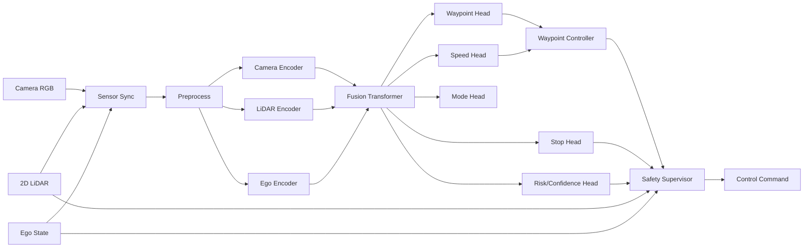

# 01. システムアーキテクチャ

## 1. 論理構成

## 2. 責任分界

| コンポーネント | 責任 | 責任外 |
|---|---|---|
| Sensor Sync | 同一時刻近傍の観測セットを作る | 欠損を推測で補完しない |
| Preprocess | resize、正規化、LiDAR sanitization | scenario判断 |
| E2E Model | 走行意図・軌道・速度・停止確率を予測 | ハード停止保証 |
| Controller | waypointを操舵・加速度へ変換 | 障害物認識 |
| Safety Supervisor | timeout、停止距離、異常値、危険軌道を上書き | 通常時の最適走行 |
| Command Mux | model/manual/emergencyの優先順位制御 | 判断ロジック本体 |
| Logger | 入力、出力、介入、遅延を記録 | データ品質の自動修正 |

## 3. 実行時データフロー

1. Camera/LiDAR/Egoの最新メッセージを受信する。
2. 基準時刻をCameraまたは推論timerに設定し、許容差内の観測を選ぶ。
3. 欠損・古い観測・timestamp逆転を検出する。
4. 前処理してtensor化する。
5. モデルでwaypoint、target speed、stop probability、modeを予測する。
6. waypoint controllerでnominal commandを生成する。
7. Safety Supervisorが独立条件でnominal commandを検査する。
8. 安全な最終commandをpublishする。
9. 推論時間、センサage、model出力、介入理由をログに残す。

## 4. レイテンシ予算の初期案

10Hz制御を仮定した初期予算：

| 区間 | 目標 |
|---|---:|
| センサ同期・変換 | 10ms以下 |
| Camera/LiDAR前処理 | 15ms以下 |
| モデル推論 | 50ms以下 |
| Controller + Safety | 5ms以下 |
| publish/余裕 | 20ms以下 |
| 合計 | 100ms以下 |

実際にはGPU、画像転送、ROS executor、Docker負荷で変わる。平均だけでなくp95/maxを計測する。

## 5. 代表的な失敗モード

| 失敗 | 症状 | 検知 | 対策 |
|---|---|---|---|
| Cameraと制御ラベルの遅れ | カーブで操作が遅い | label shift sweep | 100〜300ms候補比較 |
| LiDARのinf/0 | stop headが不安定 | range統計 | clip、valid mask |
| timestampずれ | 画像と障害物位置が不一致 | sync deltaログ | tolerance gate |
| 直進データ偏重 | カーブで中央回帰 | steering histogram | stratified sampling |
| 停止データ不足 | 閉塞でも突進 | stop recall | oversampling、追加収集 |
| 出力ジッタ | 蛇行 | steering rate/RMS | waypoint smoothing、rate limit |
| 推論遅延 | 障害物に間に合わない | p95 latency | 軽量化、timeout減速 |
| モデル過信 | OODで危険出力 | confidence/介入率 | safety override |
