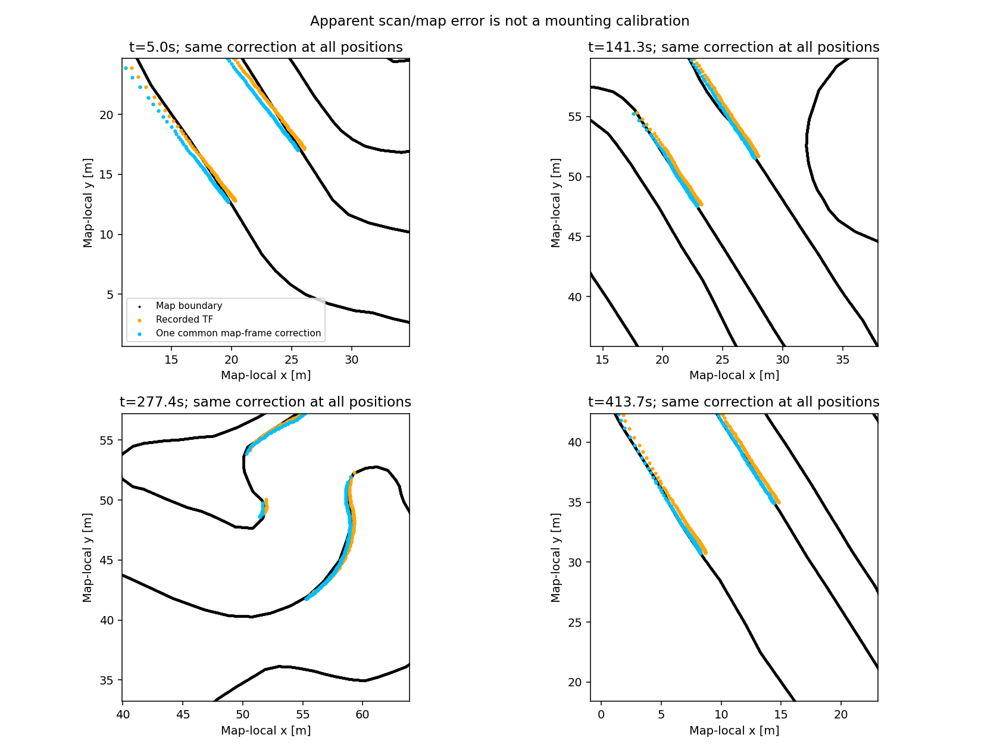

# RVizのコース境界とLiDARの位置合わせ診断（2026-09-18）

## 結論

取付TFを壁の見かけのズレだけで変更する根拠は得られなかった。
**地図と自己位置の座標合わせを補正する案の方が有力**。
取付TF、地図、RViz設定、走行制御は変更していない。
今回の結果は保存済み走行データの診断であり、壁位置合わせの実装完了ではない。

ユーザー指定の対象は「普段のRVizに表示されている壁・コース境界」。
占有格子地図の `official` や `final_ver3` と混同せず、実際のRViz用マーカーを使った。

## 実際に使われている座標・表示

- 対象ホスト: `graneple@192.168.3.10`。
- 通常RViz: `aichallenge/workspace/src/aichallenge_system/aichallenge_system_launch/config/autoware.rviz`。
  Fixed Frameは `map`。VectorMapの `/map/vector_map_marker` 内の
  `left_lane_bound` / `right_lane_bound` が有効。
- launchの地図は `aichallenge_submit_launch/map/lanelet2_map.osm`。
  地図内の道路境界は `type=line_thin, subtype=solid`。
  物理的な壁面の実測点群として定義されたデータではない。
- 公式Humbleイメージで実際のmap loader / visualizationを隔離起動した。
  取得したマーカー25件のうち左右境界2件を使用。表示は幅0.1 mの三角形列なので、
  各線分の中心を復元して測った。車両制御publisherは0、AWSIM本体は起動していない。
- LiDAR表示は `/sensing/lidar/scan`。通常RVizの位置合わせには依然として
  通常スタックの `map -> base_link` が使われる。
  TimePath制御に使う `time_wheel_odom` は別物で、先のGNSS/IMU除去で
  RVizのグローバル自己位置まで変更したわけではない。

取付位置は公式の説明ページではなく、
[公式 sensors_calibration.yaml](https://github.com/AutomotiveAIChallenge/aichallenge-racingkart/blob/dev/aichallenge/workspace/src/aichallenge_submit/racing_kart_sensor_kit_description/config/sensors_calibration.yaml)
に定義がある。`base_link` に対して前方1.65 m、左右0 m、回転0。
ホストの設定と保存bagの `base_link -> lidar_base_link` も同値だった。
`lidar_base_link -> lidar` はURDFの高さ0.0377 mのみで、平面の並進・回転は0。
この高さ差と平面の約35 cmのズレを同一視しない。

## オフライン比較

既存の `laps03/5kmh_run01` と `laps03/8kmh_run01` を使用。
名称は収集条件名であり、一定実速度で走ったとの主張ではない。
`/localization/pose` の同時刻補間を診断用の基準に使った。
**この基準はGNSS/IMU由来の誤差を含み得るため、独立した真値ではない**。
走行制御へのGNSS/IMU再導入はしていない。

条件: 最初の5秒を除き3秒間隔、0.3〜15 mの有効レンジから3ビームごとに採用。
AWSIMの同時観測としてheader時刻を使用。元の位置で境界から0.8 m未満の点を
候補として固定し、soft-L1で外れ値の影響を抑えた。
全LiDAR点を評価した精度ではなく、事前の距離条件を満たす境界候補点の距離である。
対応する物理的な壁のIDは人手で付与していない。

- 5kmh run: 136スキャン、有効抽出29402点のうち27871点を採用。
  15秒相当の連続ブロックを交互に推定用14610点・評価用13261点へ分離。
- 8kmh run: 77スキャン、有効抽出16665点のうち15763点を採用。
  5kmh runで決めた地図座標補正を固定したまま別runで評価した。
- 両runは車体方位が1周分以上変化する範囲を含む。

|評価対象・補正|補正前の平均距離|補正後の平均距離|補正前→後の95パーセンタイル|
|---|---:|---:|---:|
|5kmh runの未使用ブロック、固定の取付TF補正|0.353 m|0.328 m|0.716 → 0.744 m|
|同じブロック、地図座標側の剛体補正|0.353 m|0.151 m|0.716 → 0.390 m|
|別の8kmh run、5kmh runの地図補正を固定して適用|0.351 m|0.159 m|0.701 → 0.431 m|

取付TFだけの補正は改善が小さく、距離の大きい側では悪化した。
スキャンごとに取付位置を最適化すると探索端へ到達する例もあり、直線での
前後位置の識別不足や、地図・自己位置の誤差を取付誤差に吸収する問題がある。
一方、地図座標側の共通補正は別runでも改善したが、15 cm程度の平均差が残った。
これは地図形状、壁面と道路境界の差、自己位置、時刻、センサ誤差を含む合成誤差。
**地図そのものの誤差と確定したわけではなく、壁の完全一致でもない**。

地図側の診断補正は、地図ローカル座標の中心 `(33.49868, 40.68214) m` の周りに
点群を `-0.00685769 rad` 回転し、`(-0.377207, -0.177922) m` 平行移動するもの。
ローカル原点は `(89608.567828, 43115.161875) m`。
式は `p_corrected = R * (p - center) + center + translation`。
この並進をそのまま `base_link -> lidar` やmap原点回りのTFへ代入してはいけない。
補正値のruntimeへの自動適用はない。



## 次の実装で補正する場所

`base_link -> lidar` は実際の取付位置として維持する。
GNSS/IMUを使わずに地図とLiDARを合わせるには、車輪オドメトリを初期予測にして
LiDARを地図へ照合し、`map -> wheel_odom` 側で位置・向きを補正する。
ただし道路境界線を物理的な壁の真値として扱わず、照合に使う壁地図の整合性も確認する。
停止状態・複数方位での整合、対応点の信頼度、直線での退化、ロスト時の停止が必要。
今回の固定補正値を採用するだけでは、オドメトリの累積誤差には対応できない。

## 再現と保存物

[検証manifest](evidence/lidar_map_alignment_20260918/manifest.json) に入力hashと判定を保存。
診断スクリプト、推定・別run評価の全結果、実際のマーカー座標も同じフォルダへ保存。
共有WSLでは他タスクの実行lockを尊重し、その終了後に実行した。
幾何の合成入力で取付並進の復元を確認。ROSの隔離map出力も成功。
本体ソース変更・学習・追加の走行試験はない。

```bash
# 保存したdiagnose.pyをnative WSLのrunディレクトリへコピーして実行する。
# 既存outputは上書きしない。両runとも既存bagの読み取りのみ。
tools/with_wsl_training_lock.sh .venv/bin/python \
  /home/thistle/e2e_autonomous/runs/lidar_map_alignment_20260918/diagnose.py \
  --bag /home/thistle/e2e_autonomous/runs/time_teacher_si26_20260911/laps03/5kmh_run01/bag \
  --map /home/thistle/e2e_autonomous/runs/lidar_map_alignment_20260918/markers.json \
  --output /home/thistle/e2e_autonomous/runs/lidar_map_alignment_20260918/new_fit

# 同じ補正を別runで検証
tools/with_wsl_training_lock.sh .venv/bin/python \
  /home/thistle/e2e_autonomous/runs/lidar_map_alignment_20260918/diagnose.py \
  --bag /home/thistle/e2e_autonomous/runs/time_teacher_si26_20260911/laps03/8kmh_run01/bag \
  --map /home/thistle/e2e_autonomous/runs/lidar_map_alignment_20260918/markers.json \
  --reference-fit /home/thistle/e2e_autonomous/runs/lidar_map_alignment_20260918/new_fit/summary.json \
  --output /home/thistle/e2e_autonomous/runs/lidar_map_alignment_20260918/new_transfer
```
