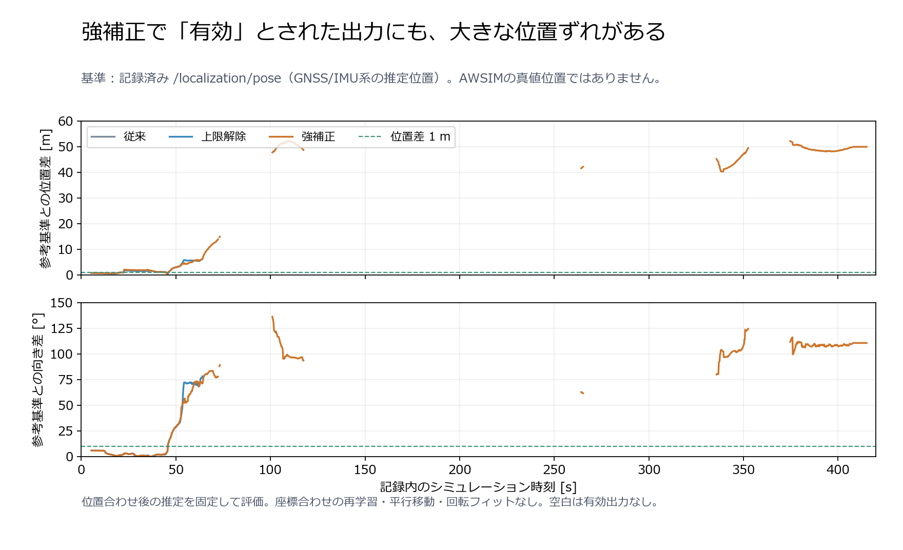

# 地図位置合わせの参考位置との一致率

## 結論と基準の制限

このbagには `/awsim/ground_truth/vehicle/pose` が記録されていない。
したがってAWSIMの独立した真値に対する正解一致率は未計測である。
記録済み `/localization/pose` （GNSS/IMU系の既存推定）との参考比較だけを実施した。
この基準も誤差を含み得るため、以下を真値への精度とは呼ばない。

強補正の「有効」706点の位置差中央値は41.55 m、向き差中央値95.30°。
位置0.5 mかつ向き5°以内は0点だった。地図照合の有効率が増えても位置精度は改善したとは言えない。
コーナー後の別の場所・別の向きへの対応付けを疑う結果で、全周自己位置として採用できる品質ではない。
真値なしで地図誤差・偽の壁・対応付け・基準位置誤差の寄与を断定しない。

## 同じ保存データでの比較

位置差はmap座標のXYユークリッド距離、向き差は±180°に折り返したyaw差の絶対値。
位置・向きの一致条件は両方を同時に満たすこと。
有効出力だけの母数と、無効出力も含む全2029照合時刻の母数を併記する。

|方式|有効出力|位置差中央値|位置差95 percentile|向き差中央値|0.5 m・5°以内 / 有効出力|1 m・10°以内 / 有効出力|1 m・10°以内 / 全2029回|
|---|---:|---:|---:|---:|---:|---:|---:|
|従来|198|1.12 m|1.69 m|1.86°|0 / 198（0%）|89 / 198（44.95%）|4.39%|
|上限だけ解除|292|1.56 m|5.64 m|2.86°|0 / 292（0%）|90 / 292（30.82%）|4.44%|
|強補正＋自動復帰|706|41.55 m|51.37 m|95.30°|0 / 706（0%）|92 / 706（13.03%）|4.53%|

強補正の位置差の平均26.98 m、最大52.14 m。0.25 m・5°以内も全方式で0点。
方式ごとに有効時間帯が違うため、有効出力だけの中央値の単純比較には選択の影響がある。
全時刻を母数にした参考一致率は上限解除でほとんど増えておらず、増えた有効出力の多くが参考位置から外れている。



## 評価手順

- 評価対象は既存 `5kmh_run01` の各モードで既に保存された `records.jsonl`。補正は再計算していない。
- `/localization/pose` のheader stampで線形補間し、yawは角度の折り返しを考慮。外挿せず、補間区間は0.1秒以内。
- map座標をそのまま比較。後付けの回転・並進フィットや初期位置への合わせ直しは実施していない。
- 参考topicは評価だけに使用し、GNSS/IMU-free localizerや制御へ入力していない。
- 同stampの重複21件を監査。1 mmまたは0.00001 radを超えて異なる12 stampを除外。
  残る20481 stampを使用。全2029照合時刻で補間可能だった。
- 推定出力の入力hashを評価前後に確認し、不変を確認。
- 自己検証は角度折り返し、正確なstamp、外挿禁止、補間gap、有効/全時刻の母数の5観点で成功。
- 補正・制御のruntimeコード変更なし。全体テストは直前の強補正実装の3046 passed / 4 skippedから変更なし。

```bash
# Native WSL, Windowsの同一commitを通常手順で同期後
tools/with_wsl_training_lock.sh .venv/bin/python \
  docs/evidence/lidar_map_reference_20260918/evaluate.py \
  --output /home/thistle/e2e_autonomous/runs/lidar_map_reference_20260918/new_evaluation
```

元の評価出力はnative WSLの `lidar_map_reference_20260918/evaluation01`。
[集計・入力hash・topic一覧](evidence/lidar_map_reference_20260918/summary.json)に証拠を保存。
Windowsで同directoryの `plot.py` を実行すると、
`tmp/lidar_map_reference_20260918/details.json` のコピーから図を再生成できる。

正解一致率を確定するには、次のAWSIM試験で真値位置を評価専用に記録する必要がある。
真値の対象車両・base座標・map座標変換・timestampを確認し、localizerの入力には接続しない。
