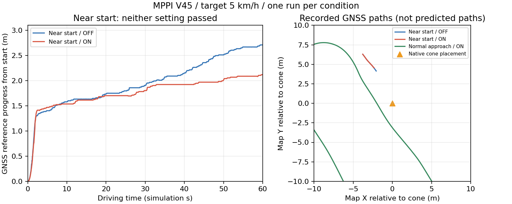

# MPPI V45 近接開始の教師調整

対象は `front-cone-close6-a02` の停止。ログでは5候補が `execution_sweep` で衝突棄却され、速度0のretimeが採用された。物理衝突は記録されていない。近接開始時に前進回避可能かは別途実走で判定する。

`--early-entry-search` は収集専用の比較スイッチ（既定off）。AVOID、前進0～10km/h、非MERGE・非prepared front mergeの場合だけ、固定されていたBezierの横移動タイミングを near=[0,0.45]、far=[0.55,1] で探索する。nominalは(0.45,1)。移動距離下限4m、操舵遅延、壁・物体の衝突判定、速度計画は既存のまま。一般の追越し・復帰・高速走行には適用しない。

```bash
python3 tools/build_mppi_v45_overlay.py --awsim-repo /home/graneple/git/autononous_ai/aichallenge-racingkart --runtime /home/graneple/e2e_autonomous/mppi_close_adjust_20260918/runtime
python3 tools/collect_mppi_v45.py --awsim-repo /home/graneple/git/autononous_ai/aichallenge-racingkart --runtime /home/graneple/e2e_autonomous/mppi_close_adjust_20260918/runtime --scenario /absolute/path/to/scenario.yaml --run-id lidar-v45-pc10-front-close-entry-a01 --speed-cap-kmh 5 --early-entry-search --wall-timeout-s 480 --run-budget-gib 0.75 --free-reserve-gib 2 --rviz --execute
bash tools/with_wsl_training_lock.sh .venv/bin/python -m pytest -q
```

ビルドは公式Docker内のC++/ROS回帰試験を含む。AWSIM本体・元runtimeは変更せず、別runtimeを使用する。停止だけでは成功教師として採用しない。

## 2026-09-18 実走比較結果

**近接開始の改善は確認できなかった。調整スイッチは既定OFFを維持し、本採用しない。**

PC10 (`graneple@192.168.3.10`)・目標5km/h・同じnative coneで比較。新しいビルドのON/OFFを各1回実施した。近接2試行の開始GNSS姿勢と配置は一致し、コーンは記録上の車体座標で前方7.279m・右0.974m。シナリオで指定したreference沿い6mと、実測の車体座標距離は異なる。

| 条件 | 最初の60秒の経路進捗 | 結果 |
|---|---:|---|
| 近接開始・OFF (`front-close-entry-control-a01`) | 2.710m | 停止・通過せず |
| 近接開始・ON (`front-close-entry-a02`) | 2.118m | 停止・通過せず |
| 通常の接近・ON (`front-entry-normal-a01`) | 73.731m | 障害物通過後約25mまで到達、scenario `passed` |

run IDの共通接頭辞は `lidar-v45-pc10-`。経路進捗はGNSSをreferenceへ投影した値で、走行距離や安全性の得点ではない。各条件1本のため、小さい差の統計的な改善・悪化は主張しない。通常接近は障害物通過区間の試験であり、全周完走試験ではない。

3試行とも公式のcrash/wall/over記録は0。近接試行は進捗不足を確認して収集プロセスをSIGINTで終了し、bagを正常に閉じた。従って公式総合結果は `not_judged`、走行目標は未達。`close-entry-a01` はwall timeout指定の事前検証で終了し、AWSIMを起動していないため走行数に含めない。



## 確認できたこと・未解決事項

- ONの実入力ログでnear=[0,0.45]、far=[0.55,1]を確認。設定が反映されなかった試験ではない。
- 近接ON/OFFとも、5候補の`execution_sweep`衝突棄却と、初速0・通過時刻infのretime採用を観測。通常接近では複数の候補が実行検証を通り、前進候補を採用した。
- 横移動の始め方の探索幅だけでは、この近接状態は解決しない。今回教師MPPIだけでも再現しているため、E2Eの学習データを増やすだけで解消するという根拠にはならない。
- 棄却が実際の車体の重なりなのか、操舵応答・物体の不確実性を含めた予測によるものかは未確定。ログでは静止観測にも加速度不確実性0.5m/s²が設定されているが、これが原因とはまだ断定しない。次の切り分けは、保存入力で棄却時刻・位置と重なりの内訳を再現すること。
- 物理的に回避不能と証明したわけではない。物体マージンを縮めたり、衝突判定を無効化したりして通過扱いにはしていない。

## 検証・保管

- ソース実装: `25c590a375b6695cc97a101285d41cd1606f4683`。バージョン固定テストの更新: `08da46e89448e80bd2bccb91f788572f223dcbe9`。
- WSL全体: **3,258 passed / 4 skipped**。初回の旧revision固定値による1件の失敗は固定値を更新して解消し、全体を再実行した。
- PC10公式Docker: **391 tests、0 errors、0 failures**。新規C++回帰試験は速度の単位・境界、負速度/NaN、既定OFF、MERGE/追越し除外を確認。
- 実ROSノードのsmokeで新規パラメータtrueと従来の物体マージン、LiDAR→V2X配線を確認。走行中は通常RVizを表示し、MPPI経路を可視化。
- 3試行の原本はWSL `/home/thistle/e2e_autonomous/runs/mppi_v45_pc10_20260918/collected/` に全ファイルSHA256一致で保管（合計858,385,971 bytes）。今回の原本は学習データに自動追加していない。近接2本は成功した移動回避教師から除外し、通常接近1本も教師品質の選別前。
- 事前に旧6試行のWSLコピーとPC10コピーを全ファイル照合してから、PC10側の重複コピーだけ削除した。WSL原本は保持。試験終了時PC10空き約2.75GiB、専用コンテナなし。
- AWSIM実行ファイル・Unity資産・既存compose/Makefile/run_autowareのハッシュ一致、vendor323ファイル・新runtime一致を確認。旧モデル・学習構成は保持し、Git pushは実施していない。
- 既存の無関係なstaged一覧のSHA256は前後とも `177892fcefe9bdd4d92a2ae4d73f0b5635e92d3ce8a8951140978ebeb22ae331`。

[集計JSON](evidence/mppi_close_entry_20260918/close_entry_comparison.json)、[WSLテスト](evidence/mppi_close_entry_20260918/close_adjust_pytest_final.log)、[C++テスト](evidence/mppi_close_entry_20260918/test-results.txt)、[終了時環境](evidence/mppi_close_entry_20260918/final-environment-check.json)。
