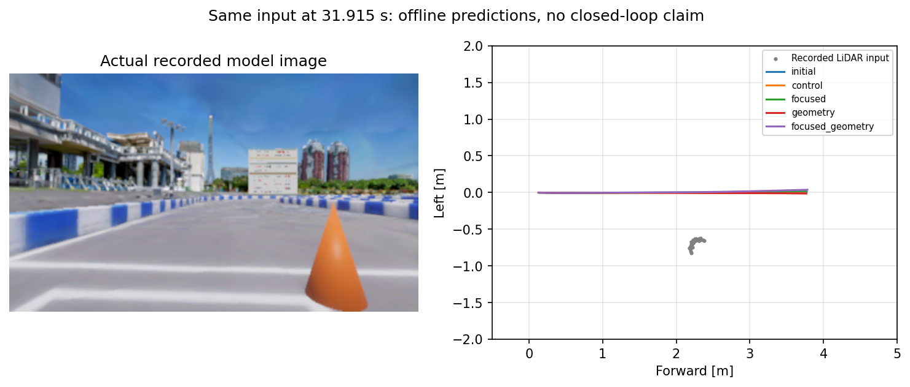

# 既存回避教師への適合比較と追加収集の結果

2026-09-18。学習・評価・教師再現は native WSL、収集は `graneple@192.168.3.10`。

## 結論

1. **既存教師を学習する余地はある。** 同じ初期重み・更新回数で前方接近の配分を増やすと、教師への軌道誤差が大きく低下した。補助損失にも操舵方向を合わせる効果が見られた。
2. **今回の設定は採用しない。** 通常走行・復帰・発進時の操舵余裕の保持基準を4条件とも満たさなかった。実際の失敗入力での予測もほぼ直進のまま。既存モデルと既存学習設定を保存している。
3. **追加収集から259窓を検証済み。** コーン近傍97窓、通常走行162窓。いずれも観測されたXY・速度教師であり、259件の独立した回避イベントではない。
4. **近接状態の不足は残る。** 採用窓には「障害物が前方0～6m、横±1m以内」の状態がない。追加した近接開始試行では教師自身が停止したため、前進回避の教師として採用しなかった。

## 同じ予算での4条件比較

初期重みは既存の native-obstacle replay epoch 3、SHA-256
`f4d989741a447ecbd3eb9bc08c70ff63a735c4a22cc1890276703dd081dd0fed`。
各条件384更新、batch 32、seed 42、FP32、AdamW、学習率1e-5。これは短い診断用比較であり、全データを巡回する1 epochではない。旧復帰補助損失は同じものを維持した。

| 条件 | 前方接近110窓のADE（cm） | 通常走行のADE（cm） | 復帰のADE（cm） | 採用基準 |
|---|---:|---:|---:|---|
| 初期重み | 26.73 | 1.782 | 1.798 | 比較の起点 |
| 従来配分 | 25.94 | 2.019 | 2.008 | 未達 |
| 前方接近を重点化 | 14.81 | 2.545 | 2.060 | 未達 |
| native教師へ補助損失 | 23.75 | 2.019 | 1.960 | 未達 |
| 重点化＋補助損失 | 14.01 | 3.148 | 2.349 | 未達 |

前方接近は**学習データ110窓のsample平均**。通常走行は検証11,505窓/4run、復帰は検証8,962窓/42runの**run平均を等重みにした平均**。ADEは30点のユークリッド距離誤差。前方接近と検証の母集団・平均方法は異なる。

従来配分は12,288提示中649 native / 221前方窓、重点化は3,072 native / 2,042前方窓。旧データの提示数は11,639対9,216で、総更新数をそろえた比較。重点化には旧データ比率低下との交換条件がある。

PPで教師操舵の絶対値が0.02radを超え、予測も受理された窓に限った逆符号は、初期15/93、従来11/92、重点3/89、補助4/89、両方0/83。両方の条件では全110窓中11窓の予測がPPで不受理なので、0/83を全窓成功と解釈しない。

発進210ケースは全モデルとも制御計算上受理されたが、操舵余裕の低下が保持基準に抵触した。**発進できないことを実走で確認したわけではない。** 通常・復帰の誤差とrun別復帰も検査し、初期重み基準・従来運用モデル基準の両方で `KEEP_EXISTING_MODEL`。sealed testは未使用、1 seedの短期比較でありモデル能力の上限を示すものではない。

## 実際の失敗入力への効果

前回のカメラ・LiDAR・ego履歴から復元済みの10入力に、重みだけを替えて推論した。31.915秒、実速度4.63km/hの入力では、最大横変位は初期0.00915m、重点化0.02112m、両方0.03724m。前方に約3.8mの軌道を出す一方、回避方向への変化は数cmにとどまる。

これは保存入力のオフライン比較。新モデルによるAWSIM走行成功や無衝突を示す結果ではない。

## 追加収集と選別

MPPI V45 `lidar-motion-intent-r2`、LiDAR→V2X、通常RVizで収集した。AWSIMのバイナリ・シーン・設定の保護対象はハッシュ一致。

| 試行（`lidar-v45-pc10-front-`以下） | 上限 | 収集結果 | 採用窓 | コーン近傍 / 通常 |
|---|---:|---|---:|---:|
| cone-a01：E2E失敗位置 | 5km/h | 通過＋25m先まで記録 | 51 | 51 / 0 |
| cone-a02：同位置 | 10km/h | 通過＋25m先まで記録 | 49 | 38 / 11 |
| cone-b01：別位置の中心配置 | 5km/h | 通過＋25m先まで記録 | 81 | 8 / 73 |
| box-a01：同別位置の箱 | 5km/h | 通過＋25m先まで記録 | 78 | 0 / 78 |
| cone-close6-a02：近接開始 | 5km/h | 教師が停止、通過未達 | 0 | 保留 |

最初の4試行は公式crash/wall/overすべて0。相対方位の継続的なずれは検出されず、2,119カメラ窓から、履歴1秒と未来3秒を満たす候補1,498窓、品質適合513窓を確認。0.2秒間隔で間引いて259窓を選んだ。全259窓の入力履歴・30点XY・30点速度を元rosbagから再現できた。

「コーン近傍」は履歴・将来窓で近くを通る観測教師という意味で、独立した回避成功ラベルではない。stop/modeの教師は無効のまま。初期位置だけでは動的な箱の全通過中の姿勢を証明できないため、箱近傍の窓は保留。箱試行から選んだ78窓は通常走行部分である。strict avoidance eligibilityも変更していない。

今回の比較で最適化したモデル出力は将来XYのみ。速度ラベルは監査・将来の利用向けに保存し、速度・停止・行動モードの学習は実施していない。

採用窓のうち前方0～6mに障害物があるものは33窓だが、全て横位置が±1mの外側。教師が早めに横へ移るため、失敗時に近い観測の不足は解消していない。

障害物なし・5km/hの対照走行も1本記録した。GNSSの同じ経路進捗で比較すると、コーン・箱の通過時の横位置は対照から約1.5～2.4m変化し、別位置のコーン/箱は通過後10～23m区間で対照付近へ戻る。速度10km/hの比較は速度差も含む。対照走行は終点到達・公式ペナルティ0だが、シナリオツールの`no_collision`が判定不能だったため、総合判定を合格へ変更していない。

### 近接開始の診断

教師reference上で6m手前へのスポーンを指定した。車両原点等の違いがあるため、記録上の初期コーン位置は自車前方7.279m・右0.974mだった。87.05秒の走行記録で進捗は2.464mにとどまり、最後は前方4.823m・右0.640m、車速0。保存されたログでは `execution_sweep` の衝突棄却と、初速0のretime採用を確認した。

これは**候補経路の衝突判定**であり、実際の衝突ではない。公式ペナルティは0。進展がないことを確認し、所有する収集プロセスへSIGINTを送り正常に記録を閉じた。原本をWSLへハッシュ照合して保管し、移動教師259窓には入れていない。1つの近接開始条件の結果で、教師全般が回避不能と断定しない。

## 保存先・実装・検証

WSL root: `/home/thistle/e2e_autonomous`

- 比較モデル・評価: `runs/native_fit_factorial_20260918/`
- 全原本: `runs/mppi_v45_pc10_20260918/collected/`
- 選別ラベル: `runs/mppi_v45_pc10_20260918/front_curated_v1/`
- 履歴を再現した4つのTimeSample shard: `runs/mppi_v45_pc10_20260918/front_validation_v1/`
- 近接開始の保留理由: `runs/mppi_v45_pc10_20260918/front_close6_summary.json`

新規259窓は2つのscenario groupをtrain用途として保持し、既存の4条件比較には混入させていない。箱・コーンの同じ位置は同じgroupで、frame splitは行っていない。PC10にも原本を残している。

実装は小規模比較、任意個数のnative配置の選別、明示したtrain scenario groupでの再現確認。既存のデータ・損失の既定値と旧シナリオの検査を保持し、検証/test groupや違うgroup、履歴・教師不一致を拒否する回帰テストを追加した。

- 学習ソース: `4925db0bc785e4a3a1d8900e440217fc8c9863ca`
- 選別ソース: `0a123f7abba1d9ffe6969fa7672224f8db384cf7`
- 最終再現・テストソース: `5a91ffd1fa4935f81eb1d213239f6d241d5a8218`
- native WSL: **3,258 passed / 4 skipped**。スキップは既存環境の任意依存等による。
- sourceはWindowsでcommitしてWSLへ同期。remote/WSLからのpushなし。
- 元からの無関係なstaged変更の一覧SHA-256は前後とも `177892fcefe9bdd4d92a2ae4d73f0b5635e92d3ce8a8951140978ebeb22ae331`。

[実行方法](native_fit_comparison.md)、[比較集計](evidence/native_fit_comparison/summary.json)、[追加教師の再現証拠](evidence/native_fit_comparison/front_verified_summary.json)、[近接試行](evidence/native_fit_comparison/front_close6_summary.json)。大きな重み・rosbag・TimeSample shardはGitに含めない。

## 次に詰めること

近接状態で教師が前進回避できる条件と、停止すべき条件を先に分ける。通過できた観測を十分に保ったscenario単位の検証データを用意し、通常・復帰の保持を条件に学習配分/補助損失を調整する。今回の25% native配分をそのまま採用したり、停止・不成立区間を移動回避教師として増量したりする根拠はない。
