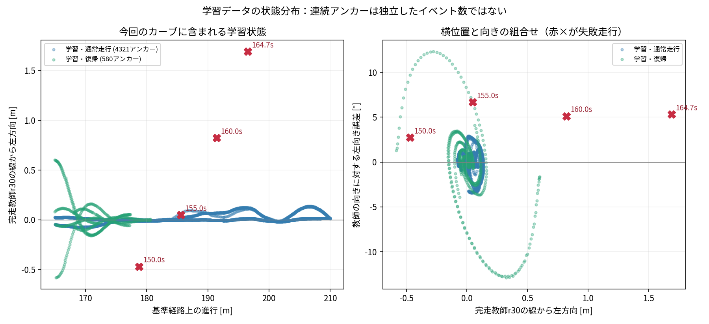
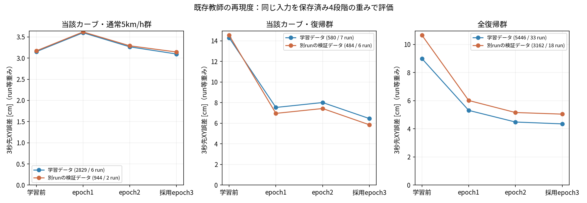

# 区間4のデータ分布と教師再現の切り分け

**今回の失敗に近い状態の教師不足と、既存の大ずれ教師の再現誤差が両方確認された。**
当該カーブの復帰trainは進行180.64mまでで、早期の膨らみを確認した185.61m付近には通常走行しかなかった。
この位置には横位置・速度が近い教師はあるが、外向き約6.7°まで合わせると0件になる。
既存復帰の学習自体は進んでいる一方、実測55〜65cm帯ではtrainにも3秒先平均16.9cmの誤差が残った。
追加容量だけを増やすより、当該位置・向きの状態を補い、大ずれ群の学習配分と再現度も改善する方針が妥当。

対象は12/20/40/60cm統合学習の採用epoch3。AWSIM走行で右カーブ外側へ膨らんだ理由を、
学習状態の不足と、既存教師への再現誤差に分ける。AWSIM・教師・学習設定・採用重みは変更しない。

比較条件は結果を見る前に固定する。

- 確定cacheのtrain 42,172、validation 15,399アンカーを監査し、元のsplitを維持する。封印testは開かない。
- 原bagのSHA256と、各アンカーのpose行ID・受信時刻から観測位置を再現する。
- 同一実行先で完走したr30の実測線を比較基準とし、基準経路の進行165〜210mを当該カーブとする。
- 発進後150/155/160秒と監視停止時の状態を比較する。狭い近傍は進行±3m・横位置±15cm・向き±5°・速度±0.25m/s、広い近傍は±5m・±25cm・±10°・±0.4m/s。これらは記述用の範囲であり、一般化可否の保証値ではない。
- フレーム数、run数、run内イベント数、同じデータの反復提示数を区別する。位置・向きはモデルへの追加入力にしない。
- 全復帰アンカーと当該カーブの通常走行アンカーのうち、入力と未来3秒30点が完全に支持されるものを評価する。採否理由を記録し、モデル誤差から対象を選ばない。
- 学習前・epoch1・epoch2・採用epoch3の同じ入力に対するXY誤差、横方向バイアス、教師PPとの操舵差を比較する。float32、batch32、workers4、optimizer更新なし。
- 教師PPが不成立の母数と、予測PPが拒否される母数を区別する。PP比較は観測時age0秒の幾何比較で、停止監視や実走成功を表さない。

「学習前」は通常走行を学習済みの共通初期重み（command-off epoch10）を指す。ランダム初期化のモデルではない。

Windowsでcommitし、公式同期後、native WSLで実行する。

```bash
tools/with_wsl_training_lock.sh env PYTHONPATH=src .venv/bin/python -m pytest -q
tools/with_wsl_training_lock.sh env PYTHONPATH=src OMP_NUM_THREADS=4 OPENBLAS_NUM_THREADS=4 \
  timeout --signal=TERM --kill-after=20s 2400s .venv/bin/python -u \
  tools/analyze_time_corner_learning.py --root .. \
  --output ../runs/time_corner4_learning_diagnosis_20260916
```

出力先は新規作成のみ。raw・入力配列・全予測はWSLに保持し、Gitへ追加しない。
状態の不足を確認できても、データ追加だけで完走が保証されるとは解釈しない。

初回の状態監査は完了したが、凍結重みの予測照合で解析側のcuDNN TF32設定漏れが判明した。
最大差0.092mmを許容値の緩和で通さず、元の学習時どおりTF32を無効、cuDNN deterministicを有効にした。
64件の事前照合では保存済み予測との差0。以下で監査済み状態の3ファイルをSHA256固定で再利用し、
全4重みを再評価する。raw poseの再読込を省略したことと元監査commitを記録する。

```bash
tools/with_wsl_training_lock.sh env PYTHONPATH=src OMP_NUM_THREADS=4 OPENBLAS_NUM_THREADS=4 \
  timeout --signal=TERM --kill-after=20s 2400s .venv/bin/python -u \
  tools/analyze_time_corner_learning.py --root .. \
  --output ../runs/time_corner4_learning_diagnosis_20260916_fp32 \
  --reuse-coverage ../runs/time_corner4_learning_diagnosis_20260916 \
  --reuse-sha256 42cb339e79c0adab02f2319caacd07caf9bebe605fa6250a0a09d57036b37df7 \
    e553c88d4753da7e124a82e08a4edc39dfe351e35605ce80b91e3b304d88405a \
    43da38207799fdb6b7f5814671786b6d3057030d612c22d4921821c3e8d82414

tools/with_wsl_training_lock.sh env PYTHONPATH=src .venv/bin/python \
  docs/evidence/time_corner4_learning_diagnosis_20260916/operators/report_native.py

# 結果を確認後、既存train/validation runに残る通常走行区間を候補調査:
tools/with_wsl_training_lock.sh env PYTHONPATH=src .venv/bin/python \
  docs/evidence/time_corner4_learning_diagnosis_20260916/operators/inspect_unused_nominal.py
```

## 状態分布の監査結果

確定cacheと採用された67runの元bagを照合し、入力・未来30点が支持されたアンカーの観測poseを再現した。
当該カーブ内の母数は以下のとおり。範囲外や入力・未来の不足は別集計に保持した。

|区間165〜210mの教師|train アンカー / run|validation アンカー / run|
|---|---:|---:|
|通常5km/h群|2,829 / 6|944 / 2|
|通常8km/h群|1,492 / 6|498 / 2|
|復帰|580 / 7（7イベント）|484 / 6（6イベント）|
|左へ20cm以上ずれた状態|42 / 2（2イベント）|42 / 2（2イベント）|
|左へ40cm以上ずれた状態|27 / 2（2イベント）|26 / 2（2イベント）|

左ずれは完走教師r30の実測線を基準にする。今回の右カーブでは外側に当たる。
最後の2行は上の復帰行に含まれ、別データではない。1イベント中の連続frameを独立した復帰経験と数えていない。
復帰580 unique anchorsは実際のsamplerでは864回/epoch提示されていた。反復しても独立イベント数は増えない。

|失敗走行の時刻|位置ずれ|向きずれ|狭い近傍のtrain|広い近傍のtrain|
|---|---:|---:|---:|---:|
|150.000秒|右47cm|左2.73°|0|0|
|155.005秒|左5cm|左6.66°|0|466（通常465、復帰1）|
|160.000秒|左82cm|左5.11°|0|0|
|164.740秒|左169cm|左5.31°|0|0|

狭い・広い近傍は上記の4条件をすべて満たすアンカー数。
155秒の小さな位置ずれでは範囲の取り方で母数が変わるので「近い通常走行さえ全く存在しない」とは解釈しない。
一方、82cm・169cmの状態は広い近傍でもtrain/validationとも0件だった。
モデルの未観測状態への一般化能力を、この件数だけで確定するものではない。

全cacheではtrain 42,172のうち入力・全未来支持不足1,368、当該カーブ外35,903、当該カーブ内4,901。
validation 15,399ではそれぞれ457、13,016、1,926。
推論比較には支持済みの全復帰と当該カーブ通常走行を使うため、train 9,767、validation 4,604を各保存重みで評価する。

## 収集条件の意味

大きな横ずれの収集器 `src/aic_transfuser_lite/data/time_large_recovery_v1.py` は、
準備経路で目標横位置±5cmかつ向き差±2°を250ms維持してから通常PPへの切替を要求する。
復帰の教師は切替後の実測軌道であり、準備経路をそのまま正解にする方式ではない。
したがって「60cmデータを収集した」ことは「60cm外側かつ外向き5〜7°の状態も学習した」ことを意味しない。
復帰中に向きが変わる場合もあるので、最終判断には実際の採用アンカーの横位置・向きの同時分布を使う。

既存の指標名 `corner_outward_heading_ge_5deg` は符号付き向き差だけで分類する。
車が線の右側にいる場合の左向きは線へ戻る方向なので、この指標だけを外向き復帰の件数と解釈しない。
また、82cm・169cmまで広がった状態の不足と、155秒付近の早期修正不足を分ける。
後半の大きなずれは失敗の結果でもあり、その不足だけで最初に膨らんだ原因を証明するものではない。

## 位置と向きの不足が重なっている

当該カーブ内の復帰アンカーの進行範囲は、trainが165.00〜180.64m、validationが165.03〜177.31m。
60cmのtrain復帰3イベントは165.00〜177.37mで終わっている。
対して失敗走行の155.005秒は185.61m、160秒は191.45m、監視停止時は196.50m。
「同じ区間4に復帰データがある」だけでは、カーブの後半まで覆えていない。

155.005秒の状態を基準に、条件を順に加えた件数を示す。範囲は最初に固定した狭い近傍と同じ。

|条件|train アンカー|validation アンカー|
|---|---:|---:|
|進行±3m|436|147|
|上記＋横位置±15cm|436|147|
|進行・横位置＋速度±0.25m/s（向きを問わない）|269|91|
|進行・横位置＋向き±5°（速度を問わない）|0|0|
|4条件すべて|0|0|

この近傍では、速度条件を外しても向きが合わない。速度差だけを原因にする説明は支持されない。
また、当該カーブ全体で「左へ20cm以上かつ左向き3°以上」のアンカーはtrain/validationとも0件。
横位置だけが似ていても、既に戻る方向を向いた状態と、さらに外へ進む向きの状態は同じではない。
横位置・向きだけを重ねた右図には近そうな点もあるが、位置を落とした投影であり、同じ地点に存在するとは限らない。



## 同じ既存教師はどれだけ学べているか

4段階の保存重みを、同じtrain 9,767・validation 4,604アンカーに入力した。
以下は3秒先1点のユークリッド位置誤差を各runで平均し、runを等重みにして平均した値（cm）。
全30点の平均誤差、閉ループの横ずれ、完走率ではない。

|対象|train アンカー / run|train 初期→採用epoch3|validation アンカー / run|validation 初期→採用epoch3|
|---|---:|---:|---:|---:|
|カーブの通常5km/h群|2,829 / 6|3.15 → 3.10|944 / 2|3.17 → 3.14|
|カーブの復帰群|580 / 7|14.30 → 6.46|484 / 6|14.54 → 5.85|
|全復帰群|5,446 / 33|9.00 → 4.35|3,162 / 18|10.66 → 5.05|
|実測55〜65cm帯・全収集地点|48 / 3|23.62 → 16.92|63 / 5|24.67 → 18.64|

初期重みは通常走行学習済みのcommand-off epoch10。過去の`balanced_geometry`モデルとの比較ではない。
epoch1/2も含む全値と、0.5/1/2/3秒誤差・PP指標・run別値は保存済み。
復帰学習は効いており、検証用だけで誤差が大幅増大する形ではない。一方、大ずれ群では学習用も十分に再現できていない。



60cm群全体には、ずれが小さくなった復帰後半も含まれる。実測55〜65cm帯は元の収集時に
固定した通常走行基準で抽出したもので、r30基準の「左60cm以上」と同じ分類ではない。
全train 749件中の48件は8イベント、validation 1,031件中の63件は11イベント。連続フレームである。

|実測55〜65cm帯|train 件 / run|採用train誤差 cm|validation 件 / run|採用validation誤差 cm|
|---|---:|---:|---:|---:|
|左ずれ|37 / 2|15.44|45 / 3|15.83|
|右ずれ|11 / 1|19.86|18 / 2|22.86|

左右合計の教師PP操舵との差もtrain 0.048103rad、validation 0.050664radが残る（この帯の予測PP拒否0件）。
右側はtrainの全11件で3秒先の横方向誤差が右寄りで、横方向バイアスは−18.91cm、validationは−22.10cm。
入力側の観測は既に線へ戻る向きであるものの、右側大ずれの再現は特に弱い。
少数の相関したイベントなので、差を統計的な優劣や未知地点の性能保証にはしない。

## 速度と未使用rawの候補

当該カーブ全体の通常5km/h群の実速度中央値はtrain 0.99560m/s（約3.58km/h）、
通常8km/h群は1.81765m/s（約6.54km/h）、復帰群は1.26448m/s（約4.55km/h）。
5km/hは元収集の上限設定名であり、全アンカーの実速度が5km/hだった意味ではない。
ただし前表のとおり155秒近傍には速度が近い通常教師が269件あるため、「速度が全く未観測」とも解釈しない。

現在のsplitを維持した60cm左r04（train）・左r05（validation）の原本を照合すると、
178〜193mのbaseline通常走行が各230制御tick残っていた。実速度中央値はそれぞれ1.32728、1.32720m/s
（約4.78km/h）、r30線からの横差中央値は2.23mm、0.27mm。この位置範囲の当該runのcacheアンカーは両方0件。
各runは完走・faultなしで、AWSIM資産hashも今回の評価と一致した。

これは再利用候補の原記録の確認であり、230個の教師アンカーが使えると検証した結果ではない。
Camera/LiDAR/egoの因果履歴と未来3秒を再生成し、入力支持・介入からの間隔などを検査してから追加する必要がある。
ここにあるのは通常走行なので、外向き角度から戻る教師の代わりにはならない。

## 判断と次の優先順位

1. **既存rawの通常区間を教師化する。** 現在と近い実速度でカーブ後半を通過した候補を、既存run分割のまま検証・追加する。
2. **178〜193m付近の位置・向きの組合せを補う。** 最初は小さな横ずれと外向き3〜7°、左右から線へ戻った後の切り戻しを重視する。教師PPが監視を維持して復帰できる状態を先に確認し、20/40/60cmへ段階的に広げる。AWSIM本体は変更しない。
3. **既存の大ずれ群の学習配分も比較する。** 実測55〜65cm帯、左右、地点、外向き角度で母数と誤差を分け、同じ更新予算で提示比率を比較する。少数固定アンカーの再現確認を行えば、配分・最適化・表現力のどこが残るかをさらに切り分けられる。
4. **同じ目標5km/hのAWSIM完走条件で比較する。** オフライン平均が改善したことだけで採用しない。現在の重み・PP・停止監視はこの診断では変更していない。

欠けた状態を補う前にモデル構造を大きく変更する根拠は弱い。一方、既存trainにも大ずれ誤差があるので、
データだけ増やせば解決するとも断定しない。今回は保存データによる事後診断で、追加学習・教師切替走行による因果比較は未実施。

## 検証・保存

native WSLで全pytest **2,718 passed / 4 skipped**、新しい精度設定・再利用hash/コンテキスト・アンカー順序検査を含む。
4 skipは既存の任意依存・fixture不足。推論解析sourceは`e226fedd37cf886b9cec24a88158aaf7814eb71c`。
同一ソースの解析は915.71秒、外側コマンド920.15秒。採用モデルのvalidation 4,604件は、
元の保存予測と最大差0.00000190735m（約0.00191mm）、元から固定したrtol=1e-5 / atol=2e-6m以内だった。
完全bit一致ではなく、許容値内での再現である。4つのcheckpointは終了時にもSHA256不変を確認した。

凍結cache・重み・splitは不変、optimizer更新0、封印test未参照、新規AWSIM試行0。
最初の精度設定漏れの失敗ログと64件の一致確認も保全した。
全状態・全予測はnative WSLの`runs/time_corner4_learning_diagnosis_20260916_fp32/`に保持。
小さい証拠は[集約結果](evidence/time_corner4_learning_diagnosis_20260916/compact_report.json)、
[全指標](evidence/time_corner4_learning_diagnosis_20260916/summary.json)、
[未使用通常区間候補](evidence/time_corner4_learning_diagnosis_20260916/unused_nominal_candidates.json)に保存した。
