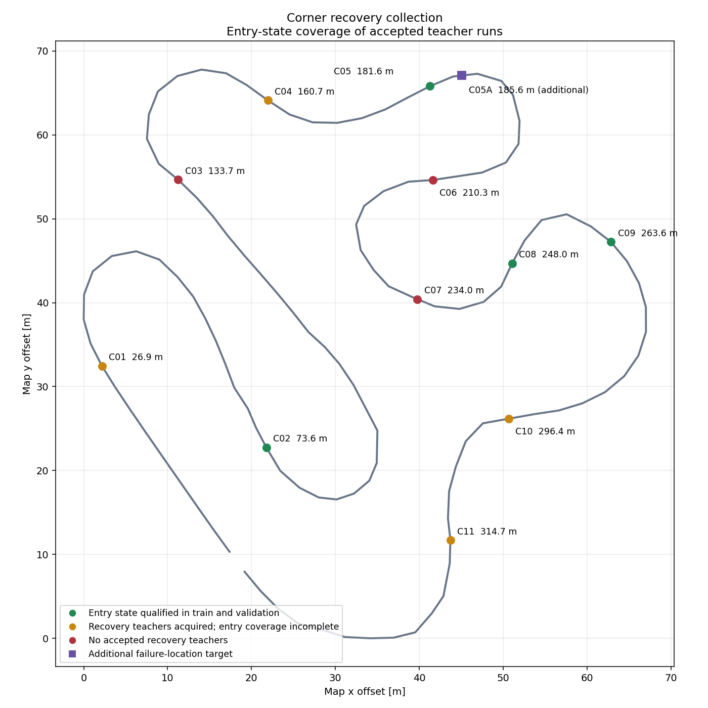

# 全コーナー進入の復帰収集モード

コーナーを必須対象として台帳管理し、近接地点を別の周に割り当てる。
各周のイベント数は初期3以下、40 mの準備開始間隔を維持する。
失敗・見送りは取得済みにせず、実測教師を検証してから未取得地点の次周計画を作る。
AWSIM本体、5 km/h速度目標、停止領域・センサ・操舵監視を変更しない。

既存の横ずれのみの指定は既定値のまま再現する。追加した `target_heading_rad` は
実測正常走行の向きに対する誤差で、準備経路をHermite曲線で作る。経路は教師ではない。
教師は正常経路のPPへ戻した後のセンサ観測と実測将来位置だけを用いる。
目標横ずれ±5 cm、指定角±許容角を0.25 s保持し、復帰後10 sまで安定確認する。
ラベルには因果的な入力と3 s全将来の検証を引き続き要求する。

初期カタログは基準コースの曲率と向きの変化を確認した11区間。
同方向の複合コーナーは入口を複数に分けるため、競技のセクション番号とは異なる。
初期条件は横20 cm・外向き4度、許容角1度。各地点の地図審査と実走確認が必要。
旧コードの25〜300 m制限を20〜325 mへ拡張したが、実測guideの全区間支持と
準備・復帰候補の地図審査を必須とする。周境界を跨ぐ外乱は対象外。

二つのAWSIMはROS_DOMAIN_ID=1/2と個別Dockerネットワークで分離し、
同じコーナーを別runでtrain/validationに割り当てる。未見コーナーへの汎化評価ではない。
最大12 run（初期8、再試行4）、各run最大30分。生データは2 runずつWSLへ転送・照合する。
カタログ完了は、各splitの独立runにおいて各コーナー60以上の有効復帰anchor、
かつ入口付近（予定release -0.5〜+3 m）の目標横ずれ・角度・速度に一致する
有効anchorが3以上あること。完走・外乱コマンド送信だけでは完了にしない。

Windowsで編集・コミットし、`tools/sync_to_wsl.ps1`で同じcommitへ同期する。
WSL native repositoryで実行するコマンド:

```bash
tools/with_wsl_training_lock.sh .venv/bin/python -m pytest -q
tools/with_wsl_training_lock.sh env PYTHONPATH=src .venv/bin/python tools/plan_time_corner_recovery.py \
  --catalog configs/collection/corner_recovery_20260916.json \
  --base /home/thistle/e2e_autonomous/runs/time_recovery_collection_20260913/inputs/base.csv \
  --output /home/thistle/e2e_autonomous/runs/time_corner_recovery_20260916/plans
```

各planに対して `tools/generate_time_large_recovery_reference.py` を実行する。
正常走行源は `codex-time-recovery-sites-normal-n03` と既存のハッシュ証明を使う。
ROS wiring smokeは `tools/smoke_time_large_recovery_ros.py` をnetwork noneの公式環境で実行する。
実走は `tools/run_time_recovery_awsim.py --parallel-plan ... --ros-domain-id 1|2`。
WSLで `tools/audit_time_recovery_collection.py`、causal replay、materializeを経て
`time_corner_recovery_v1.corner_coverage` で進捗を確定する。
未取得分の計画は上のplanコマンドに `--coverage coverage.json` を付けて別outputへ出す。
残りrun予算はキャンペーン台帳で別途消費・確認する。

## 実装と回帰確認

`time_corner_recovery_v1.py` が全地点の周分割、独立runでの取得判定、
未達地点の再計画を担う。1周の既存上限 `MAX_EVENTS=7` は維持し、
今回の各周は最大3イベントとした。従来も「全コースで5地点まで」という制限ではなく、
地点間隔、進入条件、復帰確認と将来教師の確保が次の外乱の条件になる。
一つの外乱で準備・復帰に失敗した周では、その後の地点も未取得に残る。

横ずれと向きの指定は `LargeRecoverySite.at_goal` を介して実行時と独立auditで共用する。
準備経路に使う `approach_distance_m` は4/6/8 m、整定区間は2/4 m。
C07は実測速度が高くなる区間を避ける目的で準備開始を228 mへ移したが、
取得成功は実走後に判定する。目標releaseの234 mは変えていない。

2環境起動では公式start helperの終了待ちを60 sにした。
車両側のセンサ鮮度、停止距離、操舵、速度の監視期限は従来値で検証した。
ROS_DOMAIN_ID=1/2に加え、管理通信が使うdomain 0もDockerネットワークごとに分離する。
通常のRVizに正常・準備・実測経路と地点ID付き外乱マーカーを表示する。

最終実装commit `8cf58f10d797d95ba542328948be75edb5dc9a92` のnative WSL全pytestは
**2,724 passed / 4 skipped**。新規6テストは11地点の分割、近接・終盤地点、
向きの目標、準備曲線、従来動作、実測anchorによる取得判定、短い準備区間を確認した。
公式ROS環境の合成配線smokeは `SYNTHETIC_ROS_WIRING_PASS`。
合成結果は実走教師に含めず、実走bagから生成する教師を `[N,30,2]` と全点有効maskで確認する。

## 収集・検証の実行手順

Windowsのoperator配置は `tmp/time_corner_recovery_20260916`。
実行時ソースと依存ファイルは本タスクの `docs/evidence` に保存する。
以下は実行した有限キャンペーンの再現用記録であり、同じrun ID・保存先を再使用しない。

```powershell
python tmp/time_corner_recovery_20260916/collect_pair.py --pair 3 --left train_lap01_eligible --right validation_lap01_eligible
python tmp/time_corner_recovery_20260916/audit_pair.py --pair 3
python tmp/time_corner_recovery_20260916/brief_status.py
```

各pairは片方の起動・走行許可を確認してから他方を起動し、走行・bag記録は同時に行う。
両方のrunが停止・記録終了してから、archive/個別ファイルhash、ディレクトリ構成、
SQLite quick_checkをnative WSLで検証する。その証明後に当該2 runの実行側rawを整理する。
次のpairのAWSIM走行と、前pairのWSL教師生成は別環境で並行して進める。

WSLでの最終集計コマンドは以下。すべてnative checkoutのworktree lockを通す。

```bash
tools/with_wsl_training_lock.sh env PYTHONPATH=src .venv/bin/python /home/thistle/e2e_autonomous/runs/time_corner_recovery_20260916/finalize_native.py
tools/with_wsl_training_lock.sh env PYTHONPATH=src .venv/bin/python /home/thistle/e2e_autonomous/runs/time_corner_recovery_20260916/diagnose_windows.py
tools/with_wsl_training_lock.sh env PYTHONPATH=src .venv/bin/python /home/thistle/e2e_autonomous/runs/time_corner_recovery_20260916/diagnose_stop_imu.py
tools/with_wsl_training_lock.sh env PYTHONPATH=src .venv/bin/python /home/thistle/e2e_autonomous/runs/time_corner_recovery_20260916/diagnose_aborts.py
tools/with_wsl_training_lock.sh env PYTHONPATH=src .venv/bin/python /home/thistle/e2e_autonomous/runs/time_corner_recovery_20260916/compare_critical_state.py --suffix final
tools/with_wsl_training_lock.sh env PYTHONPATH=src .venv/bin/python /home/thistle/e2e_autonomous/runs/time_corner_recovery_20260916/plot_coverage.py
```

この収集は教師PPの走行であり、再学習モデルの完走性能を示すものではない。
同地点の別runをtrain/validationに分けるため、未見コーナーへの汎化性能も別評価が必要。

## 実走収集結果

有限予算12 runのうち12 runを実行した。競技judgeの完走確認は11 run、最終 `COMPLETE_LAP` は10 run。教師採用は完走・停止・bag終了・無fault・センサ健全性と各anchorの因果入力/全未来を要求した。

| pair | domain 1 / train | domain 2 / validation |
|---|---|---|
| 01 | `COMPLETE_LAP`、採用188（C05:94, C10:94） | `FAILED`、採用0（イベントなし） |
| 02 | `COMPLETE_LAP`、採用173（C05:85, C10:88） | `COMPLETE_LAP`、採用175（C05:81, C10:94） |
| 03 | `STOPPED_FAILED`、採用0（C01:0, C02:0） | `COMPLETE_LAP`、採用172（C01:92, C02:80） |
| 04 | `COMPLETE_LAP`、採用168（C04:87, C09:81） | `COMPLETE_LAP`、採用160（C04:83, C09:77） |
| 05 | `COMPLETE_LAP`、採用87（C08:87） | `COMPLETE_LAP`、採用180（C08:86, C11:94） |
| 06 | `COMPLETE_LAP`、採用172（C01:92, C02:80, C05_LATE:0） | `COMPLETE_LAP`、採用0（C05_LATE:0） |

| split | 独立採用run | 採用復帰イベント | camera anchor | 目標横ずれ±5 cmのanchor |
|---|---:|---:|---:|---:|
| train | 5 | 9 | 788 | 167 |
| validation | 4 | 8 | 687 | 148 |

anchorは同一復帰内の連続カメラ観測であり、独立シナリオ数ではない。横ずれ帯の件数と、横ずれ・向き・進入位置・速度が同時に条件を満たす件数を分けて扱う。

raw合計は15.310 GB（14.258 GiB）。各pairのarchiveとrawはnative WSLへ移管し、全ファイル・構造・SQLiteを照合済み。

保存先:

- raw: `/home/thistle/e2e_autonomous/raw/time_corner_recovery_20260916`
- 教師・入力cache・集計: `/home/thistle/e2e_autonomous/runs/time_corner_recovery_20260916`
- `collection_index.json` にmaterialized/preparedパス、run split、教師hashを記録。
- 既存コーパスへの統合・再学習はこの収集タスクでは未実施。

## コーナーごとの取得状態

| 地点 | release [m] | train採用anchor | validation採用anchor | 入口状態の完了判定 train / validation |
|---|---:|---:|---:|---|
| C01 | 26.85 | 92 | 92 | 未達 / 取得条件達成 |
| C02 | 73.60 | 80 | 80 | 取得条件達成 / 取得条件達成 |
| C03 | 133.69 | 0 | 0 | 未達 / 未達 |
| C04 | 160.68 | 87 | 83 | 取得条件達成 / 未達 |
| C05 | 181.57 | 179 | 81 | 取得条件達成 / 取得条件達成 |
| C06 | 210.28 | 0 | 0 | 未達 / 未達 |
| C07 | 234.00 | 0 | 0 | 未達 / 未達 |
| C08 | 248.01 | 87 | 86 | 取得条件達成 / 取得条件達成 |
| C09 | 263.62 | 81 | 77 | 取得条件達成 / 取得条件達成 |
| C10 | 296.44 | 182 | 94 | 未達 / 取得条件達成 |
| C11 | 314.67 | 0 | 94 | 未達 / 取得条件達成 |



必須11地点の全条件達成: **未達**。

- C03・C06: 現在の準備/復帰候補は1.4 m円による地図審査を通らず、実走外乱を未実施。準備長、整定区間、符号、周辺release位置も調べたが、同じ入口目標の安全な候補を確定できていない。
- C07: 短い準備区間に変更した再試行でも、速度が1.4 m/sを超えるため開始条件の1秒安定を満たせず見送り。地図審査合格だけで動的取得成功とは扱わない。
- C01/trainとC04/validation: 有効な復帰教師は得られたが、横ずれ・向き・位置・速度が同時に目標に一致する入口anchorは各2件で、3件/runの条件には未達。
- C10: 復帰教師の採用数と入口状態3件/runの判定は別。初期のtrain 2 runは該当状態が各2件で、合計4件を1 runの3件として足し合わせていない。
- C11: pair05/trainは開始窓の安定時間が約0.9秒で見送り、validationは取得。同じ実測ログで開始を302.67 mから304.67 mへ移した場合の安定を確認し、最後のvalidationには準備長6 m＋整定4 mを設定した。release 314.67 mと目標状態は同一。ただし先行するC05_LATEが中断し、C11の短い準備経路は実走未検証。
- pair01/domain2: 公式startは受付されたがhelper終了が20秒待ちを超過し、走行許可前に失敗。parallel時60秒待ちへ修正後は、2台同時走行を確認した。
- pair03/domain1: 完走後、停止確認中のIMU Z角速度1メッセージが非有限値。停止開始2.05秒後、最後の復帰＋将来3秒の区間から225.73秒離れていた。最終faultを理由にrun全体を採用0とした。

## 過去の失敗状態との照合

C05の入口181.57 mに加え、失敗前の185.61 mへ外向き状態を置く `C05_LATE / C05A` を追加候補にした。両runとも準備中に速度1.4 m/sの条件を超えて中断し、追加目標の教師は未取得。これはC05入口の取得判定を置き換える地点ではない。下表は新規採用anchorだけを、元の診断と同じr30実測基準・同じ許容幅へ変換して照合した結果。

| 失敗走行の時刻 [s] | base進行 [m] | narrow train / validation | wide train / validation |
|---|---:|---|---|
| 150.00 | 178.78 | 0 / 0 | 0 / 0 |
| 155.00 | 185.61 | 0 / 0 | 77 / 35 |
| 160.00 | 191.45 | 0 / 0 | 0 / 0 |
| 164.74 | 196.50 | 0 / 0 | 0 / 0 |

narrow: 進行±3 m、横±0.15 m、向き±5度、速度±0.25 m/s。wide: ±5 m、±0.25 m、±10度、±0.4 m/s。同じ許容幅で比較したデータ分布の件数であり、新モデルの復帰成功率ではない。

## 終了時の確認と残作業

AWSIM 1089ファイルの内容と元repoのHEAD/statusは収集前と一致。所有container/supervisorは終了し、実行側の空きは14.69 GiB。12 runの台帳をsealし、確認済み転送対象だけを実行側から整理した。

採用イベントの最大制御sim間隔は95.000 ms。pair02の同時走行25秒区間では、両方のsim/wall比が約0.999、全観測時点で両台が走行中だった。

次の優先順位は、固定5 km/hの目標と収集用速度条件の整合性確認・速度追従の対処、C05_LATE/C07の単独確認とC11短縮経路の確認、C03/C06の地図を通せる準備経路、不足runの追加、採用済み教師と既存コーパスの統合、その後の再学習・E2E完走比較。今回の有限収集結果だけで、全11地点取得・復帰能力改善・E2E完走を達成したとはしない。

詳細証拠: [実行証拠](evidence/time_corner_recovery_20260916/README.md)。

native WSLでの[最終照合](evidence/time_corner_recovery_20260916/final_verification.json)は
`FINAL_VERIFICATION_PASS`。証拠206ファイル、全1,475教師の `[N,30,2]` と有効mask、
run splitの非重複、経路生成元のhash、テスト済み実装からのsource不変を確認した。
