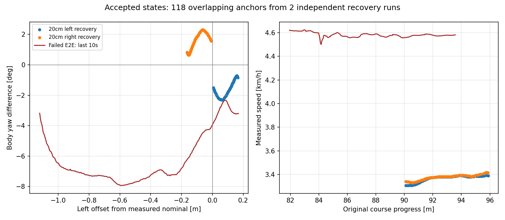

# コーナー復帰教師の状態範囲と追加収集方法の確認

2026-09-14。対象は左右20cm pilotから採用した118アンカーと、既存E2E走行
`codex-time-segment01`。解析・地図検査はnative WSLで実施した。
実行先`graneple@192.168.3.10`は読取確認のみ。今回、新規AWSIM走行・再学習はしていない。

**小さなずれから戻る途中の教師は得られたが、失敗時の横ずれ・向き・速度の組合せを
まだカバーしていない。** 左右40cmをそのまま増やす方法にも地図上の制約がある。
次の収集では、ずれが小さいうちに「外側を向いた状態から、教師制御で戻り始める過程」を
採ることと、収集時とE2E評価時の実測速度をそろえることを優先する。
これは状態範囲の不足の確認であり、モデル失敗の原因をデータだけに確定した結果ではない。

## 元データで確認した範囲

比較基準は同一AWSIMホストの通常実走r23。固定CSVからの誤差とは分ける。
採用アンカーの`observation_pose_row_ids`からOdometryを読み、capture時刻へ補間した。
速度も採用済みの現在slotの元メッセージIDから補間し、両方ともfreeze以前のreceiptを確認した。
対象bag・control・result・referenceのSHA/サイズを原本manifestと再照合した。
通常実走r22でも横ずれ・向き・分類の結果は整合している。

| 項目 | 新規復帰教師118件 | 失敗直前5秒の制御記録101件 |
|---|---|---|
| 通常実走に対する横ずれ | 右16.35cm〜左16.50cm | 右34.71〜111.99cm |
| 通常実走の車体向きとの差 | −2.31〜+2.30度 | 右3.18〜7.93度 |
| 実測速度 | 3.31〜3.42km/h、中央値3.38 | 4.56〜4.59km/h、中央値4.58 |
| 元コースの進捗 | 90.10〜95.88m | 88.02〜93.57m |
| 独立した走行 | 左1本・右1本 | 失敗1本 |

前回の「保持区間で約21cm」は正しいが、学習候補の開始時点では既に約16.5cmまで
戻っていた。前回の「実測中央値約3.52km/h」は周回全体の移動速度で、今回の3.38km/hは
**採用された復帰アンカーに限定した中央値**。どちらも目標値5km/hと区別する。

横ずれ5cm以上かつ向きの差1度以上に限ると、教師の60件は全て元の経路へ向いた側の
組合せで、外側を向いた組合せは0件。残る58件はずれか角度が小さく、この分類から除外した。
失敗直前5秒の101件は全て外側を向いた組合せだった。
ここでの向きは基準実走の車体yawとの差であり、横誤差の時間微分そのものではない。

両方が記録された元コース進捗90.10〜93.57mだけに絞っても、失敗側62件は
横ずれ・向き・速度の各範囲から全て外れた。異なるコーナー位置だけが比較差の理由ではない。
範囲内に入ることも状態の組合せやセンサ像の十分な被覆を保証しない。



118件は重複する時間窓であり、118種類の独立した復帰ではない。左右各1runの現状では、
左右両方をtrainと独立したvalidationに持たせられない。同条件の別runが必要になる。
必要本数の十分性は、条件別の未使用runとAWSIMでの復帰成功率で判定する。
既存の正常走行教師や、このpilotのデータを無効とする結果ではない。

## 横ずれ量を拡大できるか

元コースのapproach開始範囲76〜82m、長さ4/6/6m、地図center clearance 1.4m、
最大基準曲率0.25/mを維持し、20/30/40cmを左右それぞれ検査した。
候補開始は76.8428mと79.8899mの2か所。接続区間を含め0.1m以下の間隔で検査した。

| 指定横ずれ | 左 | 右 |
|---|---|---|
| 20cm | 地図検査通過、前回実走済み | 地図検査通過、前回実走済み |
| 30cm | 地図検査通過、実走未確認 | 地図検査通過、実走未確認 |
| 40cm | 2候補とも地図余裕不足 | 地図検査通過、実走未確認 |

左40cmは曲率・区間長・左右判定を通過しており、失敗理由はcenter clearance。
元の採用開始79.8899mでは9個の補間点が1.4m条件を満たさなかった。
これは車体接触の実測ではない。30cmが限界だと確定したものでもない。
右40cmの地図通過も、旋回・停止監視・完走や必要な向きずれを保証しない。

既存CLIで左右40cmを生成すると左から検査するため、
`no safe, non-overlapping interval satisfies segment 'left_040'`で停止する。
左右を個別に検査して上表へ切り分けた。失敗した出力ディレクトリ
`runs/time_corner_recovery_coverage_20260914/references_corner040`は未完成で、実行先へ配置していない。

## 向きずれを収集する実装上の条件

現在の生成器は横offsetから経路と向きを作るので、独立したyaw指定はない。
また、復帰部分まで先に与えた経路をPPが追うため、採用区間開始前に向き直れる。
approach/holdをそのまま教師へ含めると、意図的に外へ寄せる未来まで正解にする可能性がある。
採用マスクだけを広げる解決にはしない。

`.10`の専用ソースで、PPが新しいTrajectoryを受信して差し替えることと、
generatorの`csv_path`変更でCSVを再読込できることを確認した。
ただし配信timerは1秒周期で、パラメータ設定の成功はPPへ反映された時刻の証明にならない。
切替要求から旧参照の指令が続いた区間を、復帰教師として採用しない設計が必要。

次の実装案は次の順序とする。数値は初回の候補であり、走行成立済みの範囲ではない。

1. 目標5km/hのまま収集側と評価側の速度制御を整合させ、実測速度を再確認する。
2. 地図余裕を満たす範囲で小さく外へ寄せ、実測横ずれ10〜20cmかつ外向き約3度などで
   通常教師参照へ切り替える。必要な状態に入らなければ、その条件は未成立として記録する。
3. 教師参照を事前に読み込み、切替要求・経路配信・PP受信/出力を対応づける。
   操舵と操舵速度の制限、単一指令発行元、センサ/停止監視を維持する。
4. **教師制御の反映以後**の実測camera/LiDAR/egoと未来0.1〜3.0秒を採る。
   切替以前の入力履歴は保持し、意図的にずらす操作の未来を正解に混ぜない。
5. 左右それぞれ同条件の独立runを作り、run単位でtrain/validationを分離する。
   約3度で成立してから約6度などへ広げ、未使用runとAWSIMで効果を確認する。

速度の差についても設定の不一致が見つかった。収集PPの速度比例ゲインは1.0、
E2Eの固定5km/h制御は`speed_kp=4.0`。収集PPは比例項で加速度を出し、collectorが
制限して転送する。この差は速度不足の原因候補だが、同条件比較による寄与の確定は未実施。
目標速度を上げて見かけ上合わせる方法ではなく、制御式・入力速度・制限・実測の順に合わせる。

AWSIMのvehicle.yamlには物理的な開始位置/yawの設定があるが、今回の途中コーナーで
独立したyawを与える実行確認はしていない。停止状態の開始yaw変更は、走行中の外向きyawから
の復帰とは別条件になる。まず通常走行中の小さな介入と教師への切替で進める。

## 再現と検証

Windowsで変更をcommitし、`tools/sync_to_wsl.ps1 -CheckOnly`の後に同スクリプトで同期。
WSL checkout `/home/thistle/e2e_autonomous/e2e_lite_transfuser`で以下を実行した。
出力先は新規作成専用。同じ保存先へ上書きしない。

```bash
tools/with_wsl_training_lock.sh env PYTHONPATH=src .venv/bin/python \
  docs/evidence/time_corner_recovery_coverage_20260914/check_coverage.py \
  --root /home/thistle/e2e_autonomous \
  --output /home/thistle/e2e_autonomous/runs/time_corner_recovery_coverage_20260914

tools/with_wsl_training_lock.sh env PYTHONPATH=src .venv/bin/python \
  docs/evidence/time_corner_recovery_coverage_20260914/check_geometry.py \
  --inputs /home/thistle/e2e_autonomous/runs/time_recovery_collection_20260913/inputs \
  --output /home/thistle/e2e_autonomous/runs/time_corner_recovery_coverage_20260914/geometry.json

tools/with_wsl_training_lock.sh .venv/bin/python -m pytest -q
```

集計のsource commitは`82d1361`、地図検査のsource commitは`b098b3f`。
速度補間・receipt期限・capture範囲・単位・区間境界・向きの分類のsmokeは通過。
左右20cmの地図検査再現も通過。グラフは目視確認した。
同じWSL source `b098b3f`で全pytestは**2286 passed, 4 skipped, 64 warnings (97.35s)**。
`pytest_full.log`と`pytest_full.exit`を保存した。任意依存等による4件のスキップは既存環境のもの。

`.10`の専用runtime 400ファイル、入力/C++ソース49ファイルは以前のhashと全件一致。
リモートGitのHEADと既存変更digestも維持し、稼働containerは0、空き約20.75GiB。
元のbagやモデルは変更していない。

機械可読の結果と元IDは
[summary.json](evidence/time_corner_recovery_coverage_20260914/summary.json)、
[accepted_anchor_states.json](evidence/time_corner_recovery_coverage_20260914/accepted_anchor_states.json)、
[geometry.json](evidence/time_corner_recovery_coverage_20260914/geometry.json)に保存。
未確認事項は、新しい切替収集の実走成立、実測速度の整合、独立runへの汎化、再学習後のAWSIM性能。
