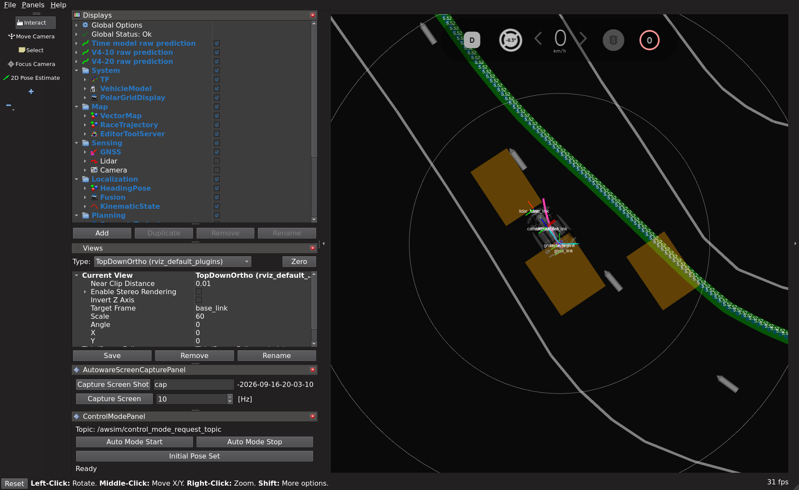
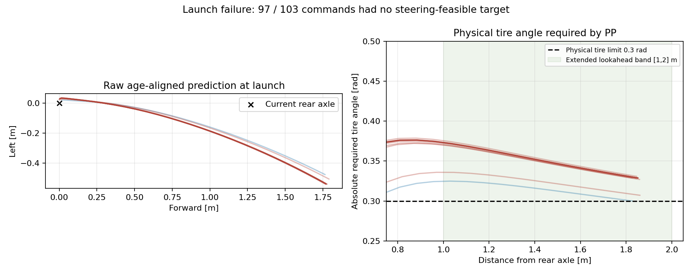

# コーナー復帰データの統合・追加学習とAWSIM完走試験

**結果: 再学習・比較評価・AWSIM通常走行1回を完了。復帰教師への誤差は改善したが、発進できず未完走。新モデルの採用は保留する。**

追加復帰の検証5,800サンプル・24走行では、全点ADEが4.10cmから2.14cm、3秒先の横方向MAEが7.30cmから2.87cmへ改善した。
一方、通常走行の全点ADEは1.76cmから1.99cmへ悪化した。
AWSIMでは発進後5.15秒の制御103回中97回で`STEERING_FEASIBLE_LOOKAHEAD_MISSING`となり、`PROGRESS_STALLED`で停止した。
従来モデルが到達した区間4や今回のコーナー復帰性能を実走で比較できる段階には達していない。

残る16条件の追加収集を区切り、採用済みの教師を既存の12/20/40/60cm統合cacheへ追加する。
Windowsを編集正本とし、source commitを公式同期して、native WSLのworktree lock内で監査・学習・評価する。
旧cache、モデル、収集証跡は保持する。未充足条件を充足済みに変更しない。

## 固定する条件

- 7収集の採用分を追加する。train 6,495、validation 5,800サンプル。既存runのsplitは変更しない。
- 完走・無fault・停止確認・bag閉鎖を確認し、元rawのhashと実入力履歴を再照合する。
- 1教師は実観測入力と実測将来3秒、30点のxy座標（m）。準備用経路や失敗走行は教師に追加しない。
- 最新の多段階復帰epoch3を初期重みとして3epoch追加学習する。バッチ32、float32、learning rate 3e-5。
- 通常走行36,726サンプルは毎epoch1回。復帰11,941サンプルに23,882提示枠を確保し、全件を含める。
  復帰枠の25%を既存の重点状態と追加イベントの最初の1秒に配分し、残りの教師も省略しない。
- 合計60,608提示/epoch、最大5,682 optimizer updates。既存の8,920復帰枠を維持すると全件を含められないため拡大する。
  今回は追加学習であり、前回と同じ更新回数によるデータ追加だけの因果比較ではない。
- モデル構造、入力、教師、損失の定義を維持する。旧6 validation runだけでepoch選択する。
  追加validationは選択後の比較専用。封印testは開かない。
- AWSIMはgraneple@192.168.3.10。固定目標5km/h・既存PP・操舵応答補償・停止監視を維持する。
  通常RVizへE2Eの生予測経路を表示する。AWSIM本体を変更しない。
- 有限予算は追加学習1回と通常走行試験1回。走行はsim/wall各600秒以内、監視停止で終了。
  合格は公式Judgeの順序付き区間通過・1周完了・停止確認。未完走もそのまま報告する。

## 再現コマンド

同期後、native WSL repoで実行する。出力は新規ディレクトリのみ。

```bash
tools/with_wsl_training_lock.sh env PYTHONPATH=src .venv/bin/python -m pytest -q
tools/with_wsl_training_lock.sh env PYTHONPATH=src .venv/bin/python tools/train_time_corner_recovery.py audit \
  --plan configs/time_path_p1/recovery_corner_20260916.json
tools/with_wsl_training_lock.sh env PYTHONPATH=src .venv/bin/python tools/train_time_corner_recovery.py prepare \
  --plan ../runs/time_corner_retraining_20260916/resolved_plan.json
tools/with_wsl_training_lock.sh env PYTHONPATH=src OMP_NUM_THREADS=4 OPENBLAS_NUM_THREADS=4 \
  timeout --signal=TERM --kill-after=30s 10800s .venv/bin/python -u tools/train_time_corner_recovery.py train \
  --plan ../runs/time_corner_retraining_20260916/resolved_plan.json
tools/with_wsl_training_lock.sh env PYTHONPATH=src .venv/bin/python tools/train_time_corner_recovery.py compare \
  --plan ../runs/time_corner_retraining_20260916/resolved_plan.json
```

監査、再学習、オフライン比較、AWSIM完走は別々に判定する。

## 読込ワーカーの中断と再実行

初回は1epoch目の1,050更新を記録後、4つの読込ワーカーにbus errorが発生し、WSL自体が停止した。
ログは共有メモリ不足の可能性を示すが、VM停止の直接原因は確定していない。
再起動後のWSLはRAM上限16GiB、swap4GiB、`/dev/shm`約7.9GiB。元データと中断checkpointは保全する。

入力読込だけをworkers=0へ変更し、ワーカー間の共有メモリ転送を使わずに再実行する。
数学的な学習設定とデータは維持し、同じ前回モデルから新しい出力先へ3epochを実行する。
中断した初回と再実行の更新数・時間は別記する。途中checkpointからの厳密resumeとは扱わない。
教師manifestと学習planには実際のworkers=0を記録する。追加収集・モデル構造・PPの変更はない。

```bash
tools/with_wsl_training_lock.sh env PYTHONPATH=src OMP_NUM_THREADS=4 OPENBLAS_NUM_THREADS=4 \
  timeout --signal=TERM --kill-after=30s 10800s .venv/bin/python -u tools/train_time_corner_recovery.py train \
  --plan ../runs/time_corner_retraining_20260916/resolved_plan.json --loader-workers 0 \
  --training-output ../runs/time_corner_retraining_20260916/training_serial
tools/with_wsl_training_lock.sh env PYTHONPATH=src .venv/bin/python tools/train_time_corner_recovery.py compare \
  --plan ../runs/time_corner_retraining_20260916/resolved_plan.json --loader-workers 0 \
  --training-output ../runs/time_corner_retraining_20260916/training_serial
```

## データ監査・学習完了

追加した採用分は52走行・119復帰イベント。trainは28走行・62イベント・6,495サンプル、validationは24走行・57イベント・5,800サンプル。
raw hashと前処理後の入力配列を再照合した。既存runのsplitは維持し、失敗走行や未採用イベントは追加していない。
重複提示は独立したイベント数として数えない。

統合cacheのtrainは48,667ユニークサンプル、validationは21,199サンプル。
追加validationは学習・epoch選択に使用せず、封印testも開いていない。
cacheはnative WSLの`datasets/cache/time_corner_retraining_20260916`に保存した。

- 学習source: `5bd177cd6192b00465be1d902da8999fe7668453`。
- 初期モデル: `runs/time_recovery_multiscale_20260916/training/best.pt`、SHA256 `685f8b8f9936ab7e272be12616982374fd8a8d61fbe4a304b25475dc2a206ba8`。
- 完了: 3epoch、5,682更新、181,824提示。workers=0で約71.2分（4,271.89秒）。監査・比較・中断した初回の時間は含めない。
- 初回中断までの共通ログ21点（50〜1,050更新）で、epoch内位置・学習L1・学習率が再実行と完全一致。重みやoptimizer状態全体の一致を主張するものではない。
- 旧6 validation runで選択したepochは2。選択指標の3秒先run平均誤差は旧0.052371m → 新0.054786m。3つの追加epoch内の最小値であり、旧モデルより良いという意味ではない。
- 新モデル: `runs/time_corner_retraining_20260916/training_serial/best.pt`。
- SHA256: `c7e52d6beebe0852bf89a5d64e55782a00bf11ede3fd97c6a68cff7e6751e326`。
- 保存・再読込後の予測は完全一致。旧モデルの初期validationも前回記録と完全一致した。

中断した初回の記録は`interrupted_attempt`に保存した。その`pipeline_status.json`はVM停止時点の`RUNNING`が残った記録であり、現在の実行中状態ではない。
完了判定は`checks/pipeline_status.json`を参照する。

## 同じvalidation入力での比較

以下は同一コースの別runによるオフライン評価であり、走行の成功率ではない。旧は初期モデル、新は選択したepoch2。
ADEは教師の有効な全時刻・全点を重み付き平均したユークリッド誤差。
3秒先位置誤差と横方向MAEはrunごとに平均してからrunを等重みで集計する。横方向は観測時車体座標の左方向成分。

| 検証集合 | サンプル / run | 全点ADE 旧→新 [cm] | 3秒先位置誤差 旧→新 [cm] | 3秒先横MAE 旧→新 [cm] |
|---|---:|---:|---:|---:|
| 通常走行 | 12,237 / 4 | 1.761 → 1.993 | 5.771 → 6.125 | 3.348 → 3.639 |
| 既存の復帰 | 3,162 / 18 | 2.199 → 1.724 | 5.047 → 3.654 | 3.450 → 2.524 |
| 今回追加した復帰 | 5,800 / 24 | 4.096 → 2.138 | 10.644 → 5.084 | 7.303 → 2.866 |

通常走行は入力無効45件を除外し、3秒先の教師を持つ11,780件をその時刻の評価に使用した。復帰集合は全件に有効な入力と3秒先教師がある。
追加復帰の全点ADEは約47.8%、横MAEは約60.8%減った。

同じ観測状態で、教師経路と予測経路を同じPPへ渡した物理タイヤ角の差（run等重み平均）は次のとおり。

| 検証集合 | 旧 [rad] | 新 [rad] | 教師PPが成立する件数 / 新旧の予測拒否件数 |
|---|---:|---:|---:|
| 通常走行 | 0.017355 | 0.017979 | 8,226 / 各53 |
| 既存の復帰 | 0.005275 | 0.003954 | 3,162 / 各0 |
| 追加した復帰 | 0.011387 | 0.004700 | 5,800 / 各0 |

予測拒否は誤差0.6radを与えて分母から落とさない。これは記録状態におけるPPの幾何計算であり、操舵応答、LiDAR余裕、発進の継続、完走の保証ではない。
今回の補助損失は従来どおり復帰サンプルに適用され、通常走行の発進可否を直接最適化していない。データ増加だけでなく提示回数・追加更新も変わるため、改善をデータ追加だけの因果効果とは解釈しない。

## 配置確認とAWSIM実走

全pytestはnative WSLで**2,767 passed / 4 skipped / 84 warnings**、136.37秒。
配置sourceは`d412cdfe43f9c25c3dbd552a5332ad99f3655bf5`。テスト対象の実装は同じで、実行configのcheckpoint SHAとepochを更新した。
native WSLで入力12件の学習モデルと実行モデルのCUDA・float32出力が完全一致した。
実行先では602 sourceファイルと238 installed Pythonファイルを照合し、公式イメージ内のROS smokeに合格した。

実行先は`graneple@192.168.3.10`、deploymentは`/home/graneple/e2e_autonomous/time_corner_model_lap_20260916`。
runは`codex-time-corner-lap01`。制御設定の変更はcheckpoint SHAとepochのみ。

| 項目 | 結果 |
|---|---:|
| 公式Judge区間 / 周回 | 0件 / 0周 |
| 発進許可から進捗停止要求まで | 5.150秒 |
| 記録pose移動距離 | 0.01716m |
| 最大実測速度 | 0.2273km/h |
| 正の加速指令 | 6回 |
| 先読み点が成立せず制動 | 97回 |
| 停止領域監視の拒否 | 0回 |
| 終了理由 | `PROGRESS_STALLED` |
| 終了前の停止確認 | 成立 |
| 普通のRVizの経路購読 | `rviz2`を確認 |
| 制御の再生一致 | 103 / 103回、最大差2.22e-16 |

固定5km/hは走行可能と判定したときの目標速度。拒否時は目標0と制動に切り替わり、実測5km/hへ達していない。
前回の同じ制御条件の旧モデルは208.605m、区間4で停止していた（[前回結果](time_multiscale_model_lap_20260916.md)）。
今回との比較は各1試行で、同一センサ列の対比較や成功率の推定ではない。発進性能が退行した試行として記録する。

通常RVizで保存した発進後2秒の画面。マゼンタがTime modelの生予測経路。画像は保存済みXWDの形式変換のみ。



## 発進失敗の切り分け

97回すべてで、現在の後車軸座標に遅延補正した予測経路が先読み距離1〜2mに存在した。
しかし、既存の操舵上限±0.3rad内に収まる点・線分区間は0件だった。
既存waypointの中で最も小さい要求タイヤ角の絶対値は中央値0.328761rad、範囲0.300124〜0.335021rad。
この数値はwaypoint上の最小値であり、連続線分全体の厳密な最小値ではない。線分全体の成立区間がないことは別に既存幾何関数で確認した。

最初の拒否は発進許可後0.100秒。plan ageは拒否全体で0.105〜0.375秒で、0.5秒の期限内だった。
制御再生は103回すべて一致し、最後の停止はセンサ接続断・停止領域監視によるものではない。
ログ終端の`CLOCK_STALE`は終了時にシミュレータを止めた後の記録であり、最初の停止原因に取り違えない。



直接確認できたのは「今回の発進状態に対して、実行PPで追従できない予測経路が続いたこと」。
復帰データ不足が原因とは結論しない。通常走行・発進サンプルの提示比率、補助損失、epoch選択のどれが退行を生んだかは未確定。
また、この試行だけでは正しい教師経路を与えたときの発進成立性や、epoch1/3の実走性能は未確認。

次は既存の停止〜発進教師を固定した検証集合として抽出し、旧モデルと各epochについて、0〜0.5秒の遅延を含めたPP成立率・操舵余裕・加速継続を比較する。
教師自体の成立性も同じ条件で確認し、発進・通常走行の維持を学習設定とcheckpoint選択に反映する方針。
今回の復帰改善だけで新モデルを採用せず、AWSIMの再試行や監視閾値の緩和は行っていない。

## 実行証跡・環境

学習と評価はnative WSL、AWSIM実行と公式ROS確認は指定の`.10`。raw50ファイル・36,677,054bytesをhash照合してWSLへ転送した。
重み、統合cache、rawはWSLに保管し、小さなレポート・画像・実行スクリプトだけを[証跡](evidence/time_corner_retraining_20260916/manifest.json)へ格納した。
既存モデルと中断時checkpointは保持している。

AWSIM本体は変更していない。開始時にscene・vehicle.yaml・Assembly-CSharp.dllを照合した。
全ファイルの開始直前snapshotは配置スクリプトのテンプレート転記漏れで取得されていなかったため、終了時の1,089ファイルを前回検証済みsnapshotと照合し、全件一致した。
これは今回開始直前と終了直後の全ファイル対照合としては扱わず、`awsim_preserved.json`に範囲と欠落を明記した。
通常RVizの今回変更分を復元し、実行先repoの既存変更・過去のcontainer114件・compose39件の保全を確認した。実行中containerは0。

以下のoperatorはWindowsの`tmp/time_corner_model_lap_20260916`で使用した実行証跡。
`prepare_native.py`と`diagnose_launch_native.py`はnative WSLのworktree lock内で実行する。
配置後の再走行をこれらの既存run IDで上書き実行しない。

```powershell
# 学習・比較完了後の同期と配置確認
python tmp/time_ten_site_recovery_plan_20260915/sync_native_transport.py sync
Get-Content tmp/time_corner_model_lap_20260916/prepare_native.py -Raw |
  wsl -d Ubuntu-22.04-Recovered -u thistle --exec bash -c 'cd /home/thistle/e2e_autonomous/e2e_lite_transfuser && tools/with_wsl_training_lock.sh env PYTHONPATH=src .venv/bin/python -'
python tmp/time_corner_model_lap_20260916/manage.py package
python tmp/time_corner_model_lap_20260916/manage.py prepare
python tmp/time_corner_model_lap_20260916/manage.py start
python tmp/time_corner_model_lap_20260916/manage.py status
# 終了後のhash検証付き転送とnative WSLでの評価
python tmp/time_corner_model_lap_20260916/finish_and_evaluate.py
Get-Content tmp/time_corner_model_lap_20260916/diagnose_launch_native.py -Raw |
  wsl -d Ubuntu-22.04-Recovered -u thistle --exec bash -c 'cd /home/thistle/e2e_autonomous/e2e_lite_transfuser && tools/with_wsl_training_lock.sh env PYTHONPATH=src .venv/bin/python -'
python tmp/time_corner_retraining_20260916/pack_evidence.py
```
