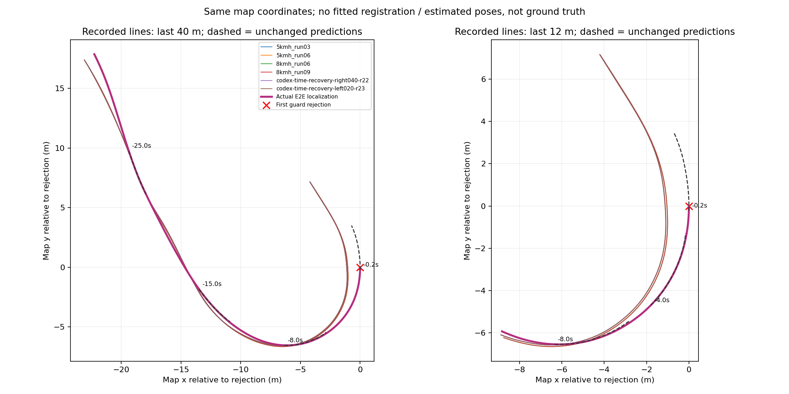
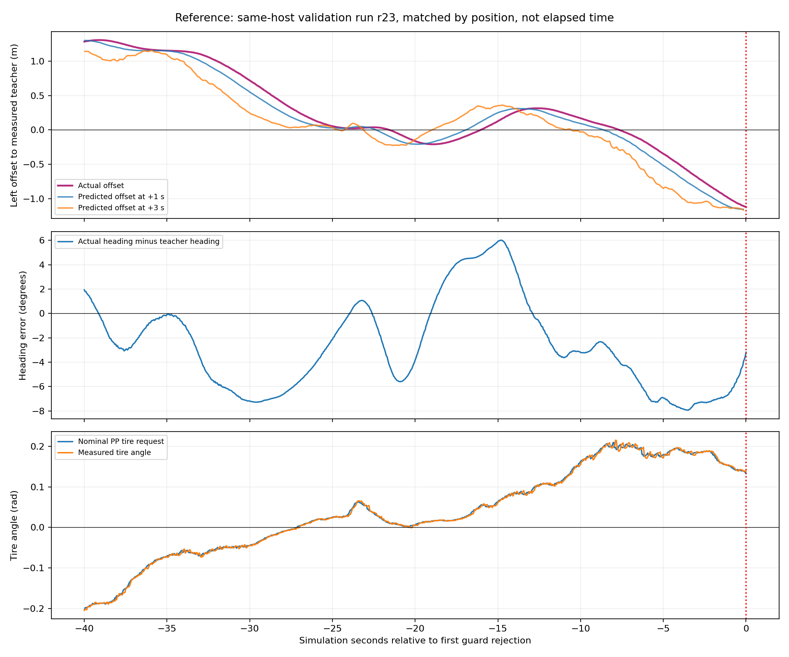

# コーナー進入・予測経路・教師走行の比較

対象は固定目標5km/hの `codex-time-segment01`。最初の `STOPPING_SWEEP_OCCUPIED` より前を解析する。
再学習・制御設定変更・追加AWSIM走行は今回の比較に含めない。

## 評価前に固定する方法

- native WSLの共有worktree lock内で評価する。Windowsを編集・Git正本とする。
- `.13`で収集した通常教師のvalidation 4周（5kmh 03/06、8kmh 06/09）と、
  `.10`で収集した復帰走行validation 2周（r22/r23）の実測位置を使う。
  比較の主参照は同じ実行先のr23。対応地点の収集phaseを確認する。
- 同じmap座標の同方向の位置を対応づけ、位置合わせの最適化を行わない。
  走行速度が異なるためrun間の経過時間は合わせない。横ずれは左正、角度はradで保存する。
- 位置のcapture stampを使用し、両端まで50msを超える補間や曖昧なstampをまたがない。
  教師の観測原点は保存済み `observation_pose_row_ids` のOdometryとfreeze以前の受信条件で再現する。
  表示用PoseStampedの同時刻メッセージで教師原点を置き換えない。
  予測の原点は各planの観測時刻のbase_link。現在のposeへ付け替えない。
- 実走行の横ずれ・向き、元の予測の1/2/3秒点と教師ラインのずれ、
  予測時刻の1/2/3秒後の実測位置を別々に評価する。
  時間点の誤差とポリラインへの距離を分け、速度差を横追従誤差と混同しない。
- 最初の監視拒否後の未来は評価しない。継続的な再計画が入るため、予測を固定した因果実験ではない。
- 現モデルepoch3の保存済みvalidation予測と同一観測の正解を、停止対応地点の手前40m〜先8mで比較する。
  checkpoint、cache、順序を確認する。予測npyは現在のhashを記録し、過去のbyte封印とは扱わない。
- 新旧runの対応scanを同じmapへ投影し、座標差の参考として6m以内の最近傍検出距離を示す。
  この値は真値・壁からの距離・車体衝突の測定ではない。AWSIMのビルド差は残る。
- 学習に採用した復帰6runの全アンカーの位置も確認し、このコーナーの復帰状態を含むかを数える。
  復帰位置は各runのcapture時刻で通過順を限定し、そのrun内の停止対応地点からの走行距離で比較する。
  test splitのデータ本体は読まない。隣接フレームを独立標本と解釈しない。

## 比較結果

**今回の記録では、車両は予測線を局所的には追えているが、予測線が教師ラインの外側へ広がっている。**
最終コーナーの右側へのずれは6本の参照で1.034〜1.120m。同じ実行先 `.10` の2本でも
1.11977/1.11988mだった。PPの現在の距離・操舵角条件は前回確認のとおり成立している。
この結果は「操舵を出しても車両が大きく追従できなかった」という説明だけでは合わない。
ずれた状態から適切なラインへ戻す予測が不足している兆候が強い。
ただし、ずれを生んだ最初の原因や、小さな制御・予測バイアスの累積を単独の原因として確定した実験ではない。

解析は最初の監視拒否までの位置付き1,608指令と、それらが使用した723個の予測を対象とした。
6参照すべてで位置と予測の投影が成立した。試験開始から拒否までは80.400秒。
追加の実走・制御設定変更・学習は実施していない。

### ずれが増えた時点

同じ実行先のr23を基準とした値。横位置は左正、向きは教師の車体yawとの差。
run間の経過時間を合わせず、同方向の最寄りの走行位置で比較している。

| 監視拒否まで | 横位置のずれ | 向きのずれ |
|---|---:|---:|
| 約30秒前 | 左0.719m | −7.18° |
| 約15秒前 | 左0.129m | +5.93° |
| 約10秒前 | 左0.169m | −3.20° |
| 約5秒前 | 右0.347m | −6.94° |
| 最初の拒否 | 右1.120m | −3.18° |

さらに40秒前には左1.282mのずれがあり、一度ラインへ近づいた後に最終コーナーで右側へ広がった。
最後の瞬間だけを見ると、この進入までの横位置・向きの変動を見落とす。

拒否前5秒の44予測では、**44/44で3秒点が観測時点よりさらに右側**にあった。
観測時の右ずれは中央値0.725m、3秒点の右ずれは中央値1.058m、
各予測内の追加右ずれは中央値0.333mだった。
拒否5〜10秒前の44予測でも3秒点はすべて教師の右側にあり、右へ広がる形が停止前から出ていた。
これは通常の教師ラインとの位置関係であり、その外れた姿勢からの実走正解との教師誤差ではない。



### 予測に対する追従と、通常教師上での予測誤差

最後の30秒の269予測について、観測時刻から1秒後の実測位置を評価できたのは260件。
3件は曖昧なpose stamp、6件は未来が最初の監視拒否後となるため除外した。
元の予測ポリラインへの距離は中央値 **0.004576m**、95%点 **0.013598m**、最大0.018656m。
同じ未来時刻の予測点との距離は中央値0.010370mで、前後ずれと横ずれを分けて保存している。
ここでの数mmという値は、同じ推定位置系での局所的な追従指標であり、位置真値の精度ではない。

2秒後は250件でポリライン距離中央値0.014059m。
3秒後は242件で時間点の距離中央値0.049797mだが、ポリライン投影の158件が終端に達する。
そのため、3秒のポリライン距離を1秒の横追従指標と同じ意味で扱わない。
また、途中で再計画する閉ループなので、予測を固定した制御性能の試験ではない。

同じコーナー手前40m〜先8mの通常教師上では、現モデルepoch3と同一観測の正解の誤差は小さい。
検証予測1,448候補中、入力または全教師の不成立4件を除いた1,444件を評価した。

| 通常教師のvalidation | 評価数 | 30点平均位置誤差の平均 | 3秒点誤差の平均 | この区間の実測速度中央値 |
|---|---:|---:|---:|---:|
| 5kmh_run03 | 465 | 0.007518m | 0.014542m | 0.9874m/s |
| 5kmh_run06 | 467 | 0.007521m | 0.013898m | 0.9872m/s |
| 8kmh_run06 | 255 | 0.015735m | 0.048175m | 1.7958m/s |
| 8kmh_run09 | 257 | 0.015720m | 0.048667m | 1.7954m/s |

拒否時の実測1.272362m/sを共通のPP計算速度にした比較では、教師・予測とも1,444/1,444でPP成立。
名目舵角の「予測−教師」は5kmh群の各run平均が約+0.0010rad、8kmh群は約−0.0013〜−0.00094rad。
これは新鮮な計画に対する計算であり、同じ速度で実走した結果、scan監視の通過、完走の証明ではない。
通常走行の検証誤差が小さくても、外れた状態で戻る経路を出せることまでは示さない。



### 復帰教師の場所と環境差

追加学習に採用した復帰教師はtrain 223件、validation 109件、計332アンカー。
今回の停止対応地点の手前40m〜先8mには、**train/validationとも0件**だった。
復帰教師の位置は約72〜78m手前の直線区間、または約195〜201m先の別コーナーだった。
各runのcapture時刻で通過順を限定し、同じrun内の停止対応地点からの走行距離で確認した。
周回の重なりを別の場所として数えないようにしている。
これは当該コーナーに通常教師がないという意味ではなく、ずれた状態からの復帰教師の場所が違うという結果。
学習で同じアンカーを反復しても、この場所の復帰状態の種類は増えない。

`.10`の比較参照r22/r23は対応地点で収集phase=`baseline`だった。
この通常区間の実測位置は比較に使えるが、追加学習の復帰限定cacheでは対象外なので、
今回のコーナーでの同一観測・予測誤差の評価数は0件となる。

拒否時の6m以内のLiDAR検出461点を各教師の対応地点±1秒のscanと同じmap座標で比較した。
最近傍距離の中央値は約2.62〜3.46mm、95%点は約7.29〜13.32mmで、全461点が全参照で10cm以内。
1m程度の一様な座標ずれだけでライン差を説明する根拠は弱い。
最近傍対応は最適化・真値ではなく、ビルドや描画・物理応答の完全な同一性も示さない。

## 次の修正対象

優先するのは、**このコーナーで小さな横ずれ・向きずれの段階から適切なラインへ戻す予測**。
今回のコーナー進入〜旋回中で、左右のずれ・向き・速度を含む実測復帰教師を用意し、
通常教師に対する誤差に加え、ずれた状態からの戻り方と閉ループでの横位置を評価する。
すでにある通常教師を増やすだけで今回の失敗が解消する、という結果ではない。

初期のずれについては、小さな予測バイアス、速度差、制御応答との相互作用を引き続き区別する必要がある。
監視作動時点から急に戻す要求ではなく、今回の進入時点からの比較を基準にする。
本比較では、モデル単独の因果関係、物理的な衝突、停止完了、完走性能は新たに検証していない。

## 実行記録と検証

- 全体テスト: source `5a3914a6eb92fcc382497dac929651bbf63de6c7`、2,276 passed / 4 skipped / 64 warnings。
- 最終の通過順照合: source `97f613294366d5ec7e7f77f10e058e5bf99e6e94`。
  座標・符号・yaw wrap・shape・欠損・future境界・教師原点ID・受信時刻・周回の重なりを含む関連21テスト成功。
  比較CLIはexit 0、96.51秒。r2/r3間で6参照・追従・予測位置の集計が完全一致することも確認した。
  実走の主参照への進行量の最大1ステップ変化は0.157mで、大きな場所の飛び移りは見られなかった。
- 最初のr1解析は復帰位置を表示用poseから引いた際に曖昧なstampを検出して中断。
  教師生成が保存したOdometryのメッセージIDとfreeze条件へ戻してr2で再現した。
  学習済み教師・checkpoint・制御実装を変更したものではない。
- r2で見つかった復帰位置の周回対応の曖昧さを、各runのcapture時刻で限定するr3へ修正。
  以前の出力・失敗ログはWSLに保存した。
- 生bagは既存split manifest、使用cacheはidentityのSHA-256と照合。
  raw bag、全指令・全予測の比較結果、checkpointはnative WSLに保持する。

## 再現

```bash
bash tools/with_wsl_training_lock.sh env PYTHONPATH=src OMP_NUM_THREADS=4 OPENBLAS_NUM_THREADS=4 \
  .venv/bin/python -m pytest -q
bash tools/with_wsl_training_lock.sh env PYTHONPATH=src OMP_NUM_THREADS=4 OPENBLAS_NUM_THREADS=4 \
  .venv/bin/python tools/compare_time_corner_tracking.py \
  --root /home/thistle/e2e_autonomous \
  --output /home/thistle/e2e_autonomous/runs/time_corner_teacher_comparison_20260914_r3
```

出力先は未使用のディレクトリを指定する。
全フレーム結果と原本はWSLに保持し、小さな集計・図・実行ログをWindowsへ戻す。

小規模証跡12ファイルをSHA-256で照合して保存した。
[全比較の集計](evidence/time_corner_teacher_comparison_20260914/summary.json)、
[集計の整合性確認](evidence/time_corner_teacher_comparison_20260914/consistency_checks.json)、
[実行結果](evidence/time_corner_teacher_comparison_20260914/comparison_exit.json)、
[全体テスト](evidence/time_corner_teacher_comparison_20260914/pytest.log)、
[追加の回帰確認](evidence/time_corner_teacher_comparison_20260914/regression.log)。
