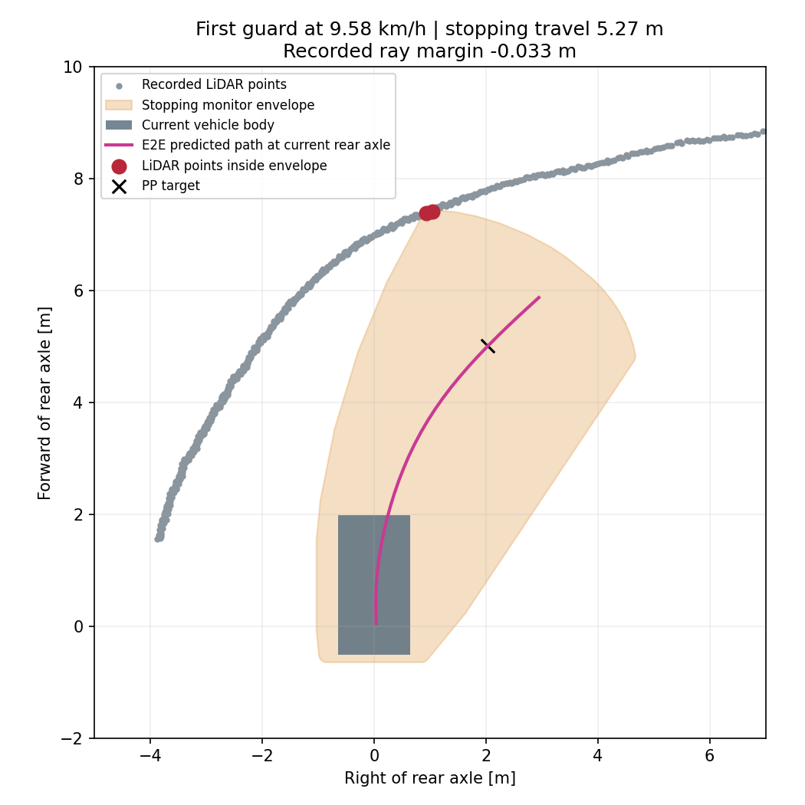

# 目標10km/hのAWSIM試走

目標10km/hでは、最初の右コーナー・発進許可から約44.95mで停止領域監視が発動し、完走しなかった。発動時の実測速度は9.58km/h。監視によりシミュレーションを凍結して終了したため、実際に速度ゼロまで制動した試験ではない。物理接触も確定していない。

ユーザーの「次は目標速度10km/hでやってみようか」に基づく探索試験。前回5km/hで完走した`launch_balanced/epoch_03.pt`を使い、`graneple@192.168.3.10`で実施し、評価はnative WSLで完了した。

- checkpoint SHA256: `1fe12ca066791d3eb8907c6921120e2cfbb38925c422d5be54940f4acbdd120a`。
- 設定: `configs/control/time_path_launch_10kmh_20260917.json`。目標10/3.6 m/s、超過監視11/3.6 m/s。
- 前回設定から変更する4項目はspeed policy・目標速度上限・超過監視値・明示的な10km/h用車両モデルpolicy。
- `awsim_understeer_10kmh_trial_v1`は既存の低速車両応答式を速度方向に外挿する試験用設定。10km/hで再校正済みとは扱わない。従来の`awsim_understeer_v1`とideal policyの6km/h制限を維持する。
- PP・操舵応答補償・操舵角／速度制限・制動1m/s²・遅延0.5秒・固定停止余裕0.4m・横速度許容0.03m/s・車体幅余裕を維持する。10km/hの停止距離に応じた最低先読みは約5.647m。予測が短ければ制動する。
- 停止領域の積分は同じ式を使い、10km/h用policyだけ移動長と横移動幅の計算範囲を広げる。積分が仮定する旋回角域`max(abs(k))*travel < pi`を明示的に検証し、域外は拒否する。
- 既存の1周／監視停止／sim・wall各600秒／外側720秒で終了。通常RVizに生予測経路を表示する。
- `--record-video`でAWSIMと通常RVizのアプリwindowだけを各10fps、H.264で録画する。録画の開始を確認してから発進する。録画用Docker imageは別に用意し、AWSIMのファイルを変更しない。
- 正式採用や前回のオフライン不合格判定の書換えは行わない。

## 実行手順

Windowsでcommit後、公式同期scriptを通してWSLへ同期する。各operatorは出力の新規作成を要求するため、再実行する試走には別のrun ID・出力先を使う。

```powershell
python tmp/time_ten_site_recovery_plan_20260915/sync_native_transport.py sync
Get-Content -Raw tmp/time_launch_10kmh_20260917/prepare_native.py | wsl -d Ubuntu-22.04-Recovered -u thistle --exec bash -c 'cd /home/thistle/e2e_autonomous/e2e_lite_transfuser && tools/with_wsl_training_lock.sh env PYTHONPATH=src OMP_NUM_THREADS=4 OPENBLAS_NUM_THREADS=4 .venv/bin/python -'
python tmp/time_launch_10kmh_20260917/manage.py package
python tmp/time_launch_10kmh_20260917/manage.py prepare
python tmp/time_launch_10kmh_20260917/manage.py start
python tmp/time_launch_10kmh_20260917/monitor.py
python tmp/time_launch_10kmh_20260917/finish_and_evaluate.py
Get-Content -Raw tmp/time_launch_10kmh_20260917/inspect_native.py | wsl -d Ubuntu-22.04-Recovered -u thistle --exec bash -c 'cd /home/thistle/e2e_autonomous/e2e_lite_transfuser && tools/with_wsl_training_lock.sh env PYTHONPATH=src .venv/bin/python -'
Get-Content -Raw tmp/time_launch_10kmh_20260917/route_native.py | wsl -d Ubuntu-22.04-Recovered -u thistle --exec bash -c 'cd /home/thistle/e2e_autonomous/e2e_lite_transfuser && tools/with_wsl_training_lock.sh env PYTHONPATH=src .venv/bin/python -'
python tmp/time_launch_10kmh_20260917/pack_evidence.py
```

## 検証・結果

| 条件 | 目標5km/h（前回） | 目標10km/h（今回） |
|---|---:|---:|
| 完走 | 1周、Judge 285.82秒 | 未完走、section 0・1 |
| 発進許可からの走行距離 | 382.69m | 44.95m |
| 走行中の実測速度中央値 | 4.63km/h | 9.49km/h |
| 最大実測速度 | — | 9.63km/h |
| 停止領域監視の発動 | なし | 発進許可から19.61秒 |

距離は周回線までの助走を含む。今回の制御記録の再生は388件一致、最大誤差8.88e-16。178件の有効予測は全て幾何条件を満たした。`STOPPING_SWEEP_OCCUPIED`の78件は、最初の監視発動後のラッチされた指令を含み、78回の独立した障害物検出ではない。

発動時は停止監視の移動距離5.2716m、PPの選択先読み5.4023m、予測終端まで6.5713mだった。必要な先読み点は存在し、PP要求操舵角−0.1932rad・実測−0.2018radは±0.3rad以内だった。監視領域に記録LiDARの2点が入り、同じ入力から停止判定を再現した。最小ray marginは−0.0331mであり、車体と壁の実距離を表す値ではない。

直接の終了理由は、速度上昇で広がった停止監視領域とLiDAR点の重なりである。これだけでは「物理的に曲がれない」「学習データ不足」とは断定できない。10km/hの車両応答式は低速で得た式の外挿であり、監視領域の保守性と実際の旋回応答は別途比較が必要。



AWSIMと通常RVizを、発進前から凍結まで連続録画した。動画は大きいためGit対象外とし、ローカルに保存した。

- [AWSIM動画・37.0秒](../tmp/time_launch_10kmh_20260917/videos/awsim.mp4)
- [通常RViz動画・37.5秒](../tmp/time_launch_10kmh_20260917/videos/rviz.mp4)
- [検証証跡](evidence/time_launch_10kmh_20260917/manifest.json)
- [判定再現](evidence/time_launch_10kmh_20260917/stop_location/diagnosis.json)

実走sourceは`eb625325f887708bc6222674e6b92046b3bacf90`、remote deploymentは`/home/graneple/e2e_autonomous/time_launch_10kmh_r3_20260917`、run IDは`codex-time-launch10-lap02`。生ログ・動画は`/home/thistle/e2e_autonomous/runs/time_launch_10kmh_20260917/raw/codex-time-launch10-lap02`へ転送し、全ファイルのハッシュを検証した。動画はWSLで全フレームのデコードも確認した。AWSIM本体1089ファイルは前後で一致し、既存のGit差分・RViz設定・既存コンテナを保全した。

検証は全pytest **2817 passed / 4 skipped**（source `03d4bccd2bbd8508995362eee15970977679a1e4`）、ROS smokeのimport経路修正後18件、録画中断の分離修正後19件が通過した。後続修正が制御・モデルの計算コードを変えていないことも確認した。前回5km/h完走ログの制御再生5997件は一致、学習側とruntime側の47入力の予測は完全一致。最終sourceで隔離ROSの10km/h先読み・停止領域・速度超過監視を確認した。

事前のimport不具合は発進前に修正した。その後の録画試行`codex-time-launch10-lap01`はRVizのX11キャプチャエラーにより約1mmで終了しており、走行性能比較には含めない。記録は別保存した。録画中断を走行停止理由から分離した最終試験では、両動画とも中断はなかった。

追加の評価コマンドは、上記と同じWSL lock内で`verify_video_native.py`と`diagnose_stop_native.py`を実行した。operatorの実体は[保存コピー](evidence/time_launch_10kmh_20260917/operators/)を参照。今回の結果によるモデルの正式採用や、既存オフライン選択結果の変更は行っていない。
