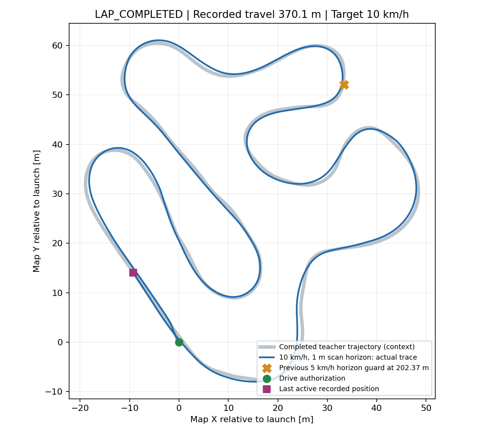

# 目標10km/h・停止監視1mのAWSIM比較

**停止監視の移動距離最大1m・目標10km/hで1周完走した。Judge周回時間134.74秒、走行中の実測速度中央値9.57km/h。停止領域監視の発動は0回で、周回後の停止も確認できた。**

ユーザーの「停止監視を1mにしましょう」に基づく1回のAWSIM試験。直前の5km/h相当監視（移動距離最大2.05895m）は202.37m・section 4で終了したが、今回はその地点も通過した。

## 条件

- 実行先`graneple@192.168.3.10`、評価はnative WSL。
- 同一checkpoint `launch_balanced/epoch_03.pt`、SHA256 `1fe12ca066791d3eb8907c6921120e2cfbb38925c422d5be54940f4acbdd120a`。
- 目標10km/h、速度超過監視11km/h、PP先読み、操舵応答、車体寸法・左右余裕は直前試験と同じ。
- config差分は`stopping_distance_policy=awsim_cap_1m_diagnostic_v1`だけ。直前の距離式に`min(距離, 1.0)`を適用する。停止状態では既存の0.4mを維持。
- 1mは車体を掃引する後軸の移動距離の上限であり、後軸から1mだけの点群を見る意味ではない。車体前端・幅・旋回時の掃引も判定に含む。
- 横移動余裕は直前の5km/h相当設定を維持する（最大0.0567m）。曲率区間・速度・yaw・横速度は実測値で検証する。
- PP先読みは実速度依存のまま（10km/hなら最低約5.647m）。学習済み生経路を変更しない。
- 1m領域は10km/hでの制動完了を保証しない。指定ホスト・1周・有限時間の診断設定で、通常設定は保持する。AWSIMのファイルは変更しない。
- 通常RVizの予測経路表示、AWSIM／RViz録画を実施する。

## コマンド

Windowsでcommit後、公式同期を実施する。各operatorは同名出力を上書きしない。

```powershell
python tmp/time_ten_site_recovery_plan_20260915/sync_native_transport.py sync
Get-Content -Raw tmp/time_launch_10kmh_stop1m_20260917/prepare_native.py | wsl -d Ubuntu-22.04-Recovered -u thistle --exec bash -c 'cd /home/thistle/e2e_autonomous/e2e_lite_transfuser && tools/with_wsl_training_lock.sh env PYTHONPATH=src OMP_NUM_THREADS=4 OPENBLAS_NUM_THREADS=4 .venv/bin/python -'
Get-Content -Raw tmp/time_launch_10kmh_stop1m_20260917/compare_previous_guard_native.py | wsl -d Ubuntu-22.04-Recovered -u thistle --exec bash -c 'cd /home/thistle/e2e_autonomous/e2e_lite_transfuser && tools/with_wsl_training_lock.sh env PYTHONPATH=src .venv/bin/python -'
python tmp/time_launch_10kmh_stop1m_20260917/manage.py package
python tmp/time_launch_10kmh_stop1m_20260917/manage.py prepare
python tmp/time_launch_10kmh_stop1m_20260917/manage.py start
python tmp/time_launch_10kmh_stop1m_20260917/monitor.py
python tmp/time_launch_10kmh_stop1m_20260917/finish_and_evaluate.py
```

## 結果と比較

| 目標速度・停止監視条件 | 結果 | 発進許可からの記録距離 | Judge周回時間 |
|---|---|---:|---:|
| 5km/h・通常領域 | 1周完走 | 382.69m | 285.82秒 |
| 10km/h・実速度の領域 | section 1で監視発動 | 44.95m | — |
| 10km/h・5km/h相当の領域 | section 4で監視発動 | 202.37m | — |
| **10km/h・最大1mの領域** | **1周完走** | **370.11m** | **134.74秒** |

各設定1回の観測結果であり、反復成功率ではない。距離は周回線までの助走を含む制御ログの軌跡長で、コースの測量距離ではない。全試験で同じcheckpointを使った。

今回のJudge順序は`0→1→2→3→4→5→6→7→0`、host結果`COMPLETE_LAP`、runner終了コード0。周回後は`JUDGE_FIRST_LAP`で制動要求し、停止確認後にシミュレータを凍結・終了した。実測速度中央値9.5749km/h、最大10.0744km/h（11km/hの超過監視未満）。追従指令2801件、制御計算の再生2874件が一致し、最大誤差8.88e-16。停止監視距離はログ上も最大1.0mで、生予測軌道は変更していない。

前回停止した同一LiDAR入力は、2.05895m設定では拒否、1m設定では通過を再現した。そのうえで今回の実走もその場所を通過したため、監視領域の広がりが早期終了の一因だったことを支持する。通常10km/hの停止・車体包絡を1mに縮めた診断であり、実速度での制動距離検証や通常監視設定での完走を意味しない。

一時的な車両運動条件の拒否は横速度52件・yaw 2件、経路初期方向の拒否19件が残った。その際は既存処理の制動を経て追従を再開しており、完走を根拠にこれらが解消したとは扱わない。車両応答式の10km/h校正や複数周での再現性確認は未実施。



## 動画と記録

- [AWSIM走行動画・166.7秒](../tmp/time_launch_10kmh_stop1m_20260917/videos/awsim.mp4)：発進前から周回・停止まで、1667フレーム。全フレームのデコードと転送ハッシュを検証済み。
- RViz動画は発進前の19.7秒でキャプチャが中断したため、走行動画としては扱わない。通常RVizへの生予測経路表示は継続し、[走行中の静止画](evidence/time_launch_10kmh_stop1m_20260917/evaluation/rviz_drive_140.png)と[停止後](evidence/time_launch_10kmh_stop1m_20260917/evaluation/rviz_after_freeze.png)を保存した。
- [実走評価](evidence/time_launch_10kmh_stop1m_20260917/evaluation/summary.json)、[4条件比較](evidence/time_launch_10kmh_stop1m_20260917/evaluation/comparison.json)、[証跡manifest](evidence/time_launch_10kmh_stop1m_20260917/manifest.json)。

sourceは`34b87f86177e9fdbbe699deea38e3f106e22787f`。WSLで全pytest **2841 passed / 4 skipped**、前回5km/hログの再生5997件、47入力の学習／runtime予測一致を確認。最終sourceをROSへbuildし、240ファイルの一致と1m領域・10km/h先読みの隔離ROS検証を完了してから実走した。

remote deploymentは`/home/graneple/e2e_autonomous/time_launch_10kmh_stop1m_20260917`、run IDは`codex-time-launch10-stop1m-lap01`。生ログは`/home/thistle/e2e_autonomous/runs/time_launch_10kmh_stop1m_20260917/raw/codex-time-launch10-stop1m-lap01`へ転送・検証済み。AWSIM本体1089ファイルの前後ハッシュが一致し、既存Git差分・RViz設定・過去コンテナを保全した。モデルの正式採用や既存オフライン判定の書換えは行っていない。

追加解析は同じWSL lock内で`inspect_native.py`、`route_native.py`、`verify_video_native.py`、`diagnose_stop_native.py`、`compare_runs_native.py`を実行し、Windowsで`pack_evidence.py`を実行した。operator実体は[証跡内](evidence/time_launch_10kmh_stop1m_20260917/operators/)に保存している。
