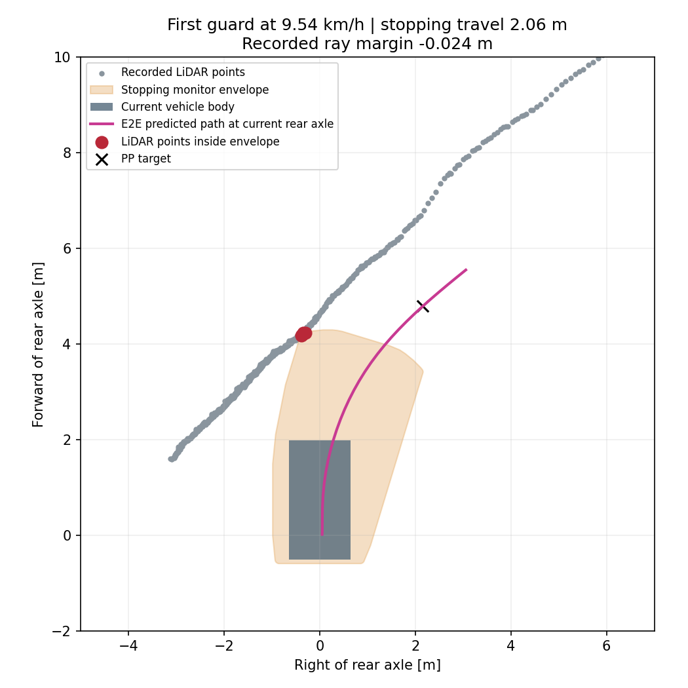

# 10km/h・停止監視を5km/h相当に固定した比較試験

ユーザーの「停止範囲は5km/hのときと変えずにもう一度AWSIMテスト」に基づく、`graneple@192.168.3.10`での1回のシミュレータ比較試験。先行する10km/h試験は約44.95m、最初の右コーナーで停止領域監視が発動した。

## 比較条件

- 同一checkpoint `launch_balanced/epoch_03.pt`、SHA256 `1fe12ca066791d3eb8907c6921120e2cfbb38925c422d5be54940f4acbdd120a`。
- 目標10km/h、超過監視11km/h、PP先読み・操舵応答・経路・車両モデルを先行試験から維持。
- `stopping_distance_policy=awsim_cap_5kmh_diagnostic_v1`だけを比較用に追加。停止領域の距離・横移動余裕の計算速度を`min(実速度, 5/3.6)`m/sにする。
- 距離式`0.4 + 0.5v + v²/2`mは同じ。5km/h以上では最大2.0590m、横移動余裕0.0567m。車体寸法・左右20cmの余裕・操舵区間・LiDARの時刻合わせは同じ。
- 曲率区間・yaw・横速度の妥当性確認には実速度を使う。元の5km/h走行と車体姿勢が異なるので、地図上で同一形状になるという意味ではない。
- PP最低先読みは実速度で計算するため、10km/hでは約5.647mのまま。
- この領域は10km/hでの停止範囲を保証しない。通常設定は変更せず、明示的なdiagnostic設定・指定ホスト・1周の有限試験に限定する。
- 監視発動、完走、sim/wall各600秒のいずれかで終了。AWSIMファイルは変更せず、通常RVizの生予測経路とAWSIM画面を録画する。

## 実行

編集・commitはWindows、pytest・評価はnative WSLの共有lock内で行う。operatorは同名出力を上書きしないため、新しい試走には新しい出力先とrun IDが必要。

```powershell
python tmp/time_ten_site_recovery_plan_20260915/sync_native_transport.py sync
Get-Content -Raw tmp/time_launch_10kmh_stop5_20260917/prepare_native.py | wsl -d Ubuntu-22.04-Recovered -u thistle --exec bash -c 'cd /home/thistle/e2e_autonomous/e2e_lite_transfuser && tools/with_wsl_training_lock.sh env PYTHONPATH=src OMP_NUM_THREADS=4 OPENBLAS_NUM_THREADS=4 .venv/bin/python -'
Get-Content -Raw tmp/time_launch_10kmh_stop5_20260917/compare_previous_guard_native.py | wsl -d Ubuntu-22.04-Recovered -u thistle --exec bash -c 'cd /home/thistle/e2e_autonomous/e2e_lite_transfuser && tools/with_wsl_training_lock.sh env PYTHONPATH=src .venv/bin/python -'
python tmp/time_launch_10kmh_stop5_20260917/manage.py package
python tmp/time_launch_10kmh_stop5_20260917/manage.py prepare
python tmp/time_launch_10kmh_stop5_20260917/manage.py start
python tmp/time_launch_10kmh_stop5_20260917/monitor.py
python tmp/time_launch_10kmh_stop5_20260917/finish_and_evaluate.py
```

## 結果

**未完走。202.37m、section 4で停止領域監視が発動した。** 前回の44.95mの停止地点と最初の右コーナーは通過できた。発動は発進許可から78.94秒、実測9.537km/h。停止監視の距離は記録上も2.05895mで、通常10km/hの停止領域へ戻っていないことを確認した。

発動時のPP先読みは5.249m、最低先読み5.234m、予測終端6.334m。PP要求操舵−0.2158rad、実測−0.2078radで、±0.3rad以内。停止領域にはLiDARの5点が入り、同じ入力で判定を再現した。ray margin−0.02445mは車体と壁の実距離ではない。シミュレーション凍結による終了で、速度ゼロへの制動完了・物理接触は確認していない。



- [AWSIM録画・99.0秒](../tmp/time_launch_10kmh_stop5_20260917/videos/awsim.mp4)：発進前から凍結まで。
- [RViz録画・41.9秒](../tmp/time_launch_10kmh_stop5_20260917/videos/rviz.mp4)：キャプチャが途中で終了した部分動画。RViz表示と走行は継続し、停止時の静止画も保存した。
- [評価](evidence/time_launch_10kmh_stop5_20260917/evaluation/summary.json)、[停止判定の再現](evidence/time_launch_10kmh_stop5_20260917/stop_location/diagnosis.json)、[証跡manifest](evidence/time_launch_10kmh_stop5_20260917/manifest.json)。

実走sourceは`2fe108b53c6507d9fbbc190f9af3bd0a622295b0`。全pytest **2833 passed / 4 skipped**、前回5km/hログの制御再生5997件一致、47入力の学習／runtime予測一致、隔離ROSの10km/h＋5km/h監視領域を確認してから試験した。試験中の制御・停止領域メタデータも再生検証を通過した。AWSIM本体1089ファイルの前後ハッシュは一致し、既存環境を復元した。

remote deploymentは`/home/graneple/e2e_autonomous/time_launch_10kmh_stop5_20260917`、run IDは`codex-time-launch10-stop5-lap01`。生ログは`/home/thistle/e2e_autonomous/runs/time_launch_10kmh_stop5_20260917/raw/codex-time-launch10-stop5-lap01`へ転送・検証済み。追加解析は同じWSL lock内で`inspect_native.py`、`route_native.py`、`verify_video_native.py`、`diagnose_stop_native.py`を実行し、Windowsで`pack_evidence.py`を実行した。

この結果は通常停止領域での10km/h完走を意味しない。次の「停止監視1m」はユーザーが別途指定した比較条件として、別config・run IDで記録する。
