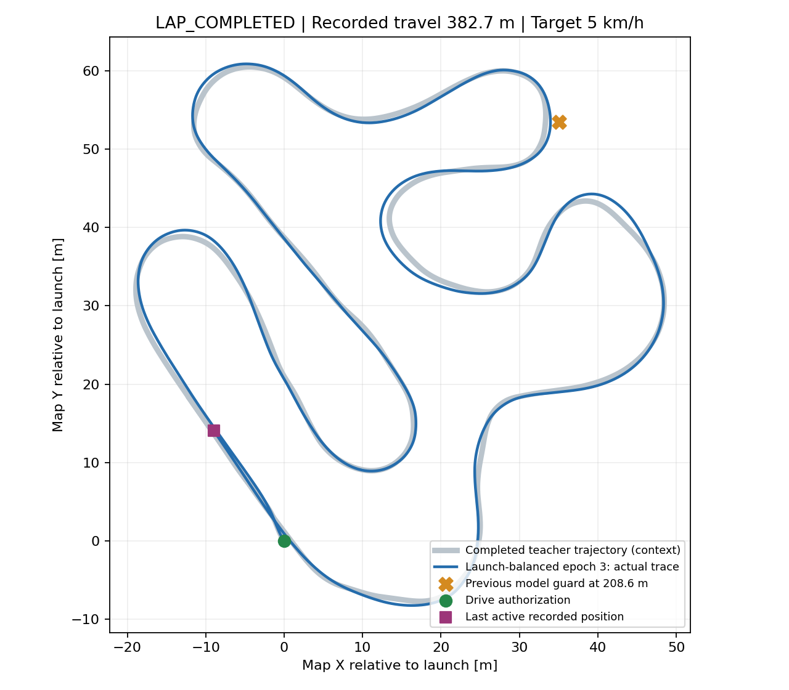
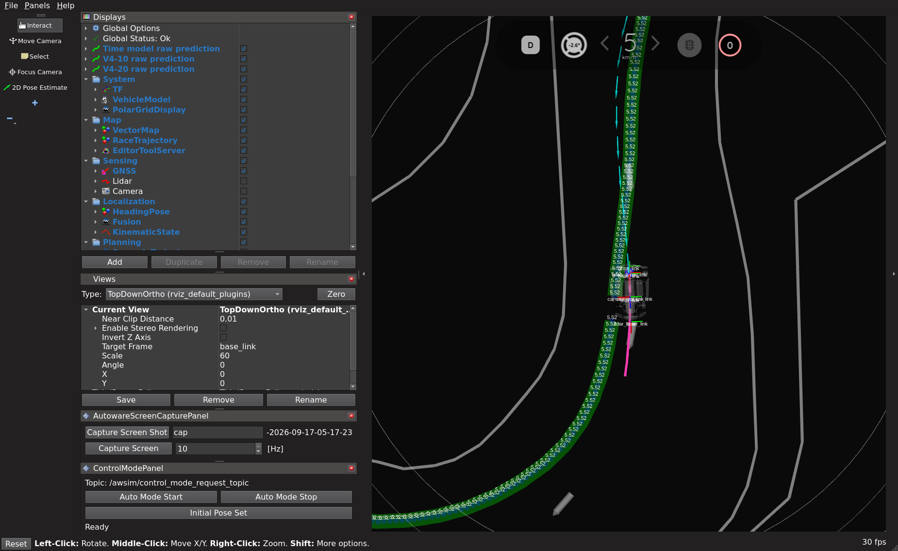

# 発進5%配分モデルのAWSIM到達範囲試験：1周完走

**2026-09-17、`launch_balanced/epoch_03.pt`で1回の通常走行を実施し、Judgeの1周完了を確認した。** 発進許可から周回終了要求まで約382.688m、Judgeのラップタイム285.82秒。以前の約209m地点を通過し、停止領域監視の発動は0件だった。

ユーザーの「一回、AWSIMでどこまで走れるかためしてみましょう」に基づく1回の探索試験。前回の[オフライン判定](time_launch_protection_20260916.md)は不合格のまま保全し、正式採用・自動昇格とは扱わない。

- 実行先: `graneple@192.168.3.10`。
- モデル: `time_launch_protection_v2_20260916/launch_balanced/epoch_03.pt`。SHA256 `1fe12ca066791d3eb8907c6921120e2cfbb38925c422d5be54940f4acbdd120a`。
- 設定: `configs/control/time_path_launch_probe_20260917.json`。前回corner試験からcheckpointのSHAとepochだけを変更する。
- 固定目標5km/h、既存PP・先読み・操舵応答補償・速度上限・センサ監視・停止領域監視を維持する。拒否時の制動も保持する。
- 通常RVizにE2Eの生予測経路を表示する。AWSIMの全ファイルを試験前後でハッシュ照合し、AWSIM本体は編集しない。
- 1走行。1周、監視停止または既存の有限上限で終了する。走行上限はsim/wall各600秒、外側720秒。停止確認後、今回のプロセスだけを終了する。
- 到達距離、Judge区間／周回、停止理由、停止付近の予測／制御を確認する。ログのオフライン解析はnative WSLで行う。

## 実行手順

Windowsで設定をcommitし、`tools/sync_to_wsl.ps1`の公式手順で同期する。学習・実行モデルの出力一致と設定をnative WSLのworktree lock内で確認する。既存全pytestの成功記録と今回の実装が同一であることを照合し、新しいcheckpoint/configについて実行側のsmokeを行う。

実行source commitは`f5f8ec2c74a4615af7fac87e4d919ed31560cf9d`。実行operatorはWindowsの`tmp/time_launch_model_lap_20260917`に配置した。[記録用コピー](evidence/time_launch_model_lap_20260917/operators)も保存している。既存出力を上書きしない単発operatorなので、再試験時は別の出力先・run IDを使う。

```powershell
python tmp/time_ten_site_recovery_plan_20260915/sync_native_transport.py sync
Get-Content -Raw tmp/time_launch_model_lap_20260917/prepare_native.py | wsl -d Ubuntu-22.04-Recovered -u thistle --exec bash -c 'cd /home/thistle/e2e_autonomous/e2e_lite_transfuser && tools/with_wsl_training_lock.sh env PYTHONPATH=src OMP_NUM_THREADS=4 OPENBLAS_NUM_THREADS=4 .venv/bin/python -'
python tmp/time_launch_model_lap_20260917/manage.py package
python tmp/time_launch_model_lap_20260917/manage.py prepare
python tmp/time_launch_model_lap_20260917/manage.py start
python tmp/time_launch_model_lap_20260917/monitor.py
python tmp/time_launch_model_lap_20260917/finish_and_evaluate.py
Get-Content -Raw tmp/time_launch_model_lap_20260917/inspect_native.py | wsl -d Ubuntu-22.04-Recovered -u thistle --exec bash -c 'cd /home/thistle/e2e_autonomous/e2e_lite_transfuser && tools/with_wsl_training_lock.sh env PYTHONPATH=src .venv/bin/python -'
Get-Content -Raw tmp/time_launch_model_lap_20260917/route_native.py | wsl -d Ubuntu-22.04-Recovered -u thistle --exec bash -c 'cd /home/thistle/e2e_autonomous/e2e_lite_transfuser && tools/with_wsl_training_lock.sh env PYTHONPATH=src .venv/bin/python -'
python tmp/time_launch_model_lap_20260917/pack_evidence.py
```

## 結果

| 項目 | 実測結果 |
| --- | --- |
| Run ID | `codex-time-launch-lap01` |
| 完走判定 | `COMPLETE_LAP` / `LAP_COMPLETED` |
| Judge区間 | 0 → 1 → 2 → 3 → 4 → 5 → 6 → 7 → 0、順序正常 |
| Judgeラップタイム | **285.82秒（4分45.82秒）** |
| 発進許可から終了要求まで | 299.995 sim秒、記録位置の累積移動**382.688m** |
| 目標速度 | 5km/h固定。監視拒否時は既存仕様で制動 |
| 走行中の実速度 | 中央値4.626km/h、最大5.179km/h（追従指令かつ速度0.1m/s超の標本） |
| 停止理由 | `JUDGE_FIRST_LAP`。周回完了後の要求制動で停止確認 |
| 停止領域監視の拒否 | **0件** |
| PP先読みを延長した追従指令 | 0件。通常の先読み選択で走行 |
| 制御指令 | 6,000件中5,993件が`TIME_PATH_TRACKING` |
| 一時的な制御拒否 | `PLAN_STALE` 3件、`MOTION_YAW_RATE_INVALID` 1件、`TIME_PATH_INITIAL_DIRECTION` 3件 |
| 推論時間 | 全2,906予測で中央値85.50ms、p95 122.71ms、最大195.46ms |
| 実行／後処理 | runner終了0、cleanup errorなし、今回の実行containerは全停止 |

距離382.688mは発進位置からJudge計測線までの接近区間を含むため、コース1周の長さとは区別する。Judge時間も発進許可からの時間とは計測開始が異なる。拒否7件では既存の制動が働いたが、走行停止には至らなかった。cleanupでシミュレータを凍結した後の`CLOCK_STALE`等は走行中の6,000指令に含めていない。

[解析結果JSON](evidence/time_launch_model_lap_20260917/evaluation/summary.json)・[補足診断](evidence/time_launch_model_lap_20260917/evaluation/diagnostics.json)・[Judgeを含む実行結果](evidence/time_launch_model_lap_20260917/recorded/host_result.json)。



青が今回の記録位置、橙×が以前のmultiscaleモデルの停止監視位置。灰色は完走した教師の実測線で、道路中心の真値ではない。教師線はオフライン図の比較用で、今回の実行に教師操舵への切替は入れていない。

## 前回との比較と判断

| モデル／試行 | 到達 | 終了理由 |
| --- | --- | --- |
| 以前のmultiscaleモデル | 約208.6m、区間4 | `STOPPING_SWEEP_OCCUPIED`後に走行進捗停止 |
| 前回corner再学習epoch2 | 約0.017m | 発進時の`STEERING_FEASIBLE_LOOKAHEAD_MISSING`、進捗停止 |
| 今回launch-balanced epoch3 | **約382.7m、1周完走** | 周回完了による正常停止 |

今回の1回については、ユーザー指定の「普通に完走」の判定を満たした。発進失敗と以前の右コーナーでの停止は再発しなかった。直近のcorner試行から制御設定はcheckpoint SHA・epoch以外同一で、モデル予測の変化により既存PPと監視の条件で走行できた結果である。

ただし、各モデル1回の比較であり、成功率や大きな横ずれからの復帰性能までは測定していない。前回のオフライン評価で残った通常走行誤差・操舵余裕の悪化も今回の完走だけで解消とはしない。`NO_NEW_CANDIDATE` / `runtime_test_allowed=false`の前回選択記録は変更していない。今回の明示依頼による探索試験の成功として保持し、正式採用判定とは区別する。

## RViz・検証・保存先

通常RVizの`Time model raw prediction`表示と実際の`rviz2`購読を確認した。走行260秒時点と停止後の画面をXWDから無加工でPNGへ変換し、[変換元と出力のハッシュ](evidence/time_launch_model_lap_20260917/evaluation/image_conversion.json)を保存した。



- WSLのfocused pytestは**49 passed**。既存全pytestの**2,800 passed / 4 skipped**の実行sourceと`src/tools/tests/ros2_ws/schemas`が同一であることを確認し、その記録を再利用した。
- 新しいcheckpointについて、学習側とruntime側の予測**47件がbit単位で一致**。実行先へのsource 607ファイル・installed Python 240ファイル・checkpointのハッシュを照合した。
- 隔離ROS接続smokeはPASS、学習経路の6件一致と各監視の合成入力テストを確認した。
- WSLでPP・操舵写像・応答補償の記録再生はPASS。5,997指令一致、最大絶対誤差`1.305e-11`、許容`1e-9`。残り3指令は`PLAN_STALE`で再生対象の計画なし。LiDAR監視全判定の独立再生とは扱わない。
- AWSIM **1,089ファイル／664,111,503 bytes**は今回の試験前後の全ハッシュ一致。リモートの既存作業差分・過去container・compose・RViz設定も保存状態と一致した。
- 生ログ57ファイル／161,132,537 bytesを封印し、約19.7MBのarchiveとして転送。WSL側でarchiveと全ファイルのサイズ・SHA256を照合した。今回の試験は`ROSBAG=false`で、保存物は予測・制御・観測ログと画面等である。

実行先: `/home/graneple/e2e_autonomous/time_launch_model_lap_20260917`。WSL解析先: `/home/thistle/e2e_autonomous/runs/time_launch_model_lap_20260917`。軽量証跡は[こちら](evidence/time_launch_model_lap_20260917/manifest.json)。重みと生ログはGitへ追加していない。

記録の`drive_authorized.json`には既存runtimeの固定文字列`USER_REQUEST_20260913`が残る。今回の依頼の記録は`deployment_gate.json`と`source_manifest.json`の2026-09-17探索試験指定を正本とし、旧文字列を新しい許可日時とは解釈しない。
