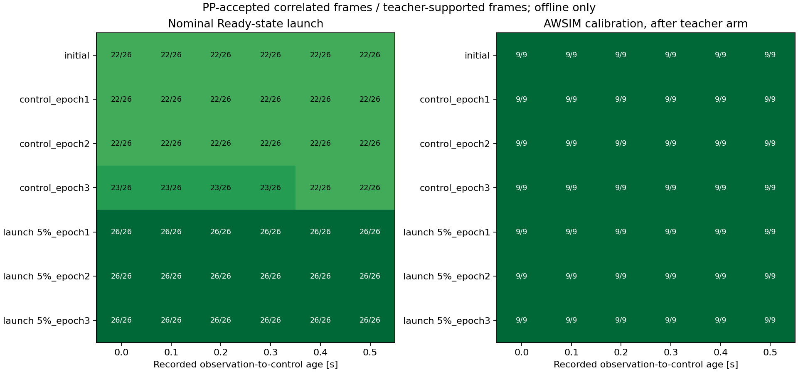
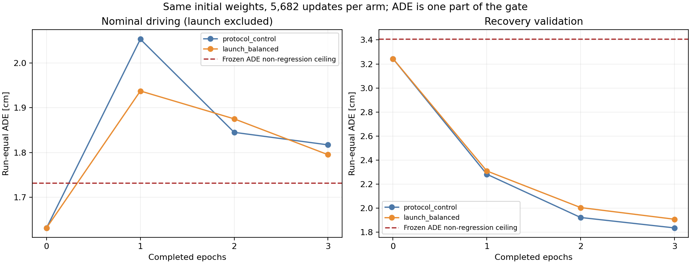

# 発進教師の整理・発進配分の比較・段階別の採用判定

前回の[発進停止の切り分け](time_launch_regression_20260916.md)に基づき、モデル選択と学習配分を修正する。Windowsを編集正本とし、本学習・評価はnative WSL、AWSIM本体とPP／監視設定は変更しない。

## 実施する変更

1. 通常教師の`/awsim/state`で`Start → Ready`を確認する。Readyメッセージの受信時刻と次の`/clock`で保守的に開始を確定し、観測時点／入力確定時点でまだReadyでないフレームを今回の学習対象から外す。人が要求した終了時ブレーキを将来3秒＋補間50msの教師がまたぐ場合も対象外とする。元bag・cache・教師座標は保持する。
2. 通常走行の発進対象はReady後2秒以内、現在速度−0.03〜0.5m/s、入力と30点教師が完全なもの。予備監査ではtrain 78フレーム／12走行、validation 26フレーム／4走行。元の「静止中だが将来3秒に発進する152フレーム」とは対象の定義が異なる。
3. 両学習条件で同じ教師対象を使う。対象外になった通常枠は有効な通常走行の再提示で補充し、60,608提示/epochを維持する。発進重点条件だけは、復帰データの重複提示枠から発進枠へ配分し、全体の5%（3,030提示）を確保する。全ての採用済み復帰教師、対象内の通常教師を最低1回提示する。画像・LiDAR・教師を人工変形しない。
4. 初期モデルを比較候補に残し、発進のPP成立・操舵余裕、通常／復帰それぞれのrun均等ADE・3秒先誤差で採用判定する。学習内部の`best.pt`を、そのまま実走に昇格させない。

発進許可の追加モデル入力は作らない。今回の条件は、外部の開始待ちを含めず、走行可能になった後の経路を学習させるという教師対象の整理である。未知の待機／再発進一般を解決したことにはならない。

## 固定する実験条件

- 初期checkpoint: `time_recovery_multiscale_20260916/training/best.pt`、SHA256 `685f8b8f9936ab7e272be12616982374fd8a8d61fbe4a304b25475dc2a206ba8`。
- `protocol_control`と`launch_balanced`の2条件。両方3epoch、batch32、FP32、workers0、seed42、learning rate3e−5、最大5,682更新／181,824提示。1条件の外側上限は10,800秒。過去に失敗したworkers4は使用しない。
- モデル、損失、optimizer、scheduler、制御を固定する。復帰の幾何補助損失も既存の定義を保持する。2条件間の差は発進への提示枠の配分である。
- 通常教師の開始待ち／外部停止区間の除外は両条件に共通。以前の学習との比較では、この対象整理と追加学習の効果を分離した因果推定とは呼ばない。
- 全epochの重みを保存し、学習前の重みを含めて採用判定する。初期モデルも絶対条件を満たさなければ、新しい実走候補なしと明記する。

## 評価集合と採用条件

今回から既存validation全体を**開発用の採用判定**に使用する。以前の実験でcomparison-onlyだった追加validationも、この実験では開発用として明示的に位置付ける。過去の記録の役割を書き換えず、今回の設定に残す。run単位のtrain/validation割当は変更しない。封印testは開かない。

通常評価はReady後の有効な完全教師から発進対象を除いたもの、復帰評価は既存validationの復帰run。モデルごとに教師支持数を変えず、非有限の予測は失敗とし、分母から落とさない。

発進評価は上記のvalidation発進対象と、既存AWSIM校正baseline r30/r31の教師制御開始後0〜0.5秒を使う。校正baselineは学習へ入れない。観測から制御まで0〜0.5秒の各0.1秒について、同じ実測姿勢・速度でPPを計算する。将来の姿勢・教師は評価だけに使用する。曖昧な将来poseは全候補共通で欠測として記録する。

採用条件は学習結果を見る前に固定する。

- 発進: 教師PPが成立する全ケースで予測PPも成立。物理操舵限界±0.3radは維持する。選択操舵余裕の比較基準は、同じケースの教師と成立した初期モデルの余裕の小さい方とし、0.001radを超えて悪化させない。初期モデルが不成立なら教師を基準にする。初期モデルの旋回不足で見かけ上の余裕が増えた場合にも、教師の必要旋回を許容する。
- 通常・復帰: 各run均等ADEは初期値＋max(5%,1mm)、3秒先誤差は初期値＋max(5%,2mm)以内。
- 合格候補と初期モデルの中で、通常／復帰のADE・3秒先誤差を初期値で正規化した4指標の平均が最小のものを選ぶ。同点なら初期モデルを維持する。
- 全ての判断は`selection.json`に残す。`runtime_test_allowed=true`は次の有限AWSIM試験に進めることだけを意味し、完走・無衝突の証明ではない。

以前のepoch2を新しい判定へ通し、既知の発進不良を拒否できることも確認する。今回見た校正・validation記録を、未使用の最終評価として扱わない。

## 実行

Windowsでcommitし、`tools/sync_to_wsl.ps1`の公式手順で同一sourceを同期する。以下はnative WSL repo内。出力先は`/home/thistle/e2e_autonomous/runs/time_launch_protection_v2_20260916`。

```bash
tools/with_wsl_training_lock.sh env PYTHONPATH=src .venv/bin/python -m pytest -q
tools/with_wsl_training_lock.sh env PYTHONPATH=src .venv/bin/python -u tools/train_time_launch_protection.py prepare
tools/with_wsl_training_lock.sh env PYTHONPATH=src .venv/bin/python -u tools/train_time_launch_protection.py evaluate --existing-only
tools/with_wsl_training_lock.sh env PYTHONPATH=src OMP_NUM_THREADS=4 OPENBLAS_NUM_THREADS=4 \
  timeout --signal=TERM --kill-after=30s 10800s .venv/bin/python -u tools/train_time_launch_protection.py train --arm protocol_control
tools/with_wsl_training_lock.sh env PYTHONPATH=src OMP_NUM_THREADS=4 OPENBLAS_NUM_THREADS=4 \
  timeout --signal=TERM --kill-after=30s 10800s .venv/bin/python -u tools/train_time_launch_protection.py train --arm launch_balanced
tools/with_wsl_training_lock.sh env PYTHONPATH=src .venv/bin/python -u tools/train_time_launch_protection.py evaluate
```

同じsource／計画で中断した学習だけは`train --arm <同じ条件> --resume`で再開できる。同期中と学習中は同じworktree lockで排他する。

## 実行結果

実験sourceは`7b19a1bab61bb7d30bc1cb0f8fc44b9d1c506136`。native WSLで全pytest **2,800 passed / 4 skipped / 84 warnings、120.01秒**。既存のskipはOSQP、JSON Schema validator、optional公式packageなどの環境依存である。新たなデータ選択・提示配分・採用判定・Ready遷移のテストを含む。

最初の判定実装は初期モデルの操舵余裕だけを基準にしたため、正しい教師そのものが210ケース中166ケースで余裕条件に違反した。教師PPは全210ケース成立する。この矛盾を教師のoracle監査で確認し、初回の比較学習をepoch1途中・学習後validationを見る前に中断した。修正は学習結果への閾値合わせではなく、教師の必要旋回を許容する判定の整合性修正である。最初の出力`time_launch_protection_20260916`は保全し、v2で両条件を同じ初期重みからやり直す。

### 確定した教師対象

通常走行16件の元bagと校正2件の元bag、cache、初期checkpointのハッシュを再照合した。復帰bagの実測教師の再現確認は既存のcorner再学習監査を引き継ぎ、今回も同じcacheを使う。

| 対象 | train | validation |
|---|---:|---:|
| Ready前の観測を対象外 | 756 | 249 |
| 外部の終了ブレーキを未来教師がまたぐため対象外 | 1,251 | 417 |
| 対象内のユニーク観測 | 46,660 | 20,533 |
| 発進対象 | 78 / 12走行 | 26 / 4走行 |

validationでは対象内40件が完全な入力／30点教師を満たさず、全モデル共通で座標評価の対象外。通常11,505件／4走行、復帰8,962件／42走行、発進26件／4走行を使用する。これとは別に、既存AWSIM校正r30/r31の開始後9フレームを発進評価に加える。発進の35フレーム×6遅延条件は210判定であり、独立した210回の発進試験ではない。曖昧な将来poseによる欠測は0件。

固定した評価集合のSHA256は`27af11159ab41e2b3ee873ddb2bfc04106be426e4a7e7f488dd6145b6d20f581`。

両条件とも60,608提示/epochで、対象内のユニーク観測を全て残す。対照条件の発進78提示に対し、重点条件は3,030提示。発進12走行へ252または253提示ずつ配分し、復帰の重複提示2,952枠を置換する。重点条件の78枚は再提示であり、新しい観測場面が増えたことにはならない。

### 既存モデルに対する判定の再現

以下は同じ固定評価集合で再計算した値。誤差はrun均等平均、発進は教師PPが成立した条件に対する予測PP成立数。

| モデル | 通常ADE | 通常3秒先誤差 | 復帰ADE | 復帰3秒先誤差 | 発進PP |
|---|---:|---:|---:|---:|---:|
| 初期モデル | 1.632cm | 4.567cm | 3.244cm | 8.246cm | 186/210 |
| 前回corner epoch2 | 1.886cm | 4.925cm | 1.936cm | 4.471cm | 180/210 |

初期モデルも、通常データ側の発進4フレーム×6条件でPPが不成立。前回epoch2はさらに校正1フレーム×6条件で不成立となる。前回epoch2は通常ADE・3秒先誤差の非劣化条件と操舵余裕条件にも違反し、新しい採用判定で拒否された。復帰の平均誤差改善だけでは昇格しないことを確認した。

### 新しい比較学習

2条件とも3epoch、5,682更新で完了した。初期重みの内容digestと学習前validationは完全一致。各条件181,824提示のうち、入力不成立354提示を損失計算から除き、実際に学習へ使った提示は181,470。両条件でこの数も一致した。各epochの重みを保存し、選択用`best.pt`の再読み込み予測一致も確認した。

学習runner内の所要時間は対照条件3,612.34秒（60.2分）、発進重点条件3,888.16秒（64.8分）。テスト・教師監査・前後比較を含むv2 driver全体は8,680.56秒（144.7分）。

下表の誤差はcm、発進PPは210条件中の成立数。初期モデルも含めて全候補を判定した。

| モデル | 通常ADE | 通常3秒先 | 復帰ADE | 復帰3秒先 | 発進PP | 操舵余裕の非劣化違反 |
|---|---:|---:|---:|---:|---:|---:|
| 初期 | 1.632 | 4.567 | 3.244 | 8.246 | 186/210 | 0 |
| 対照 epoch1 | 2.053 | 5.136 | 2.283 | 5.356 | 186/210 | 14 |
| 対照 epoch2 | 1.845 | 4.927 | 1.923 | 4.652 | 186/210 | 2 |
| 対照 epoch3 | 1.817 | 4.987 | 1.837 | 4.417 | 190/210 | 6 |
| 発進5% epoch1 | 1.937 | 5.187 | 2.310 | 5.566 | 210/210 | 13 |
| 発進5% epoch2 | 1.875 | 4.907 | 2.006 | 4.795 | 210/210 | 6 |
| 発進5% epoch3 | 1.795 | 4.905 | 1.909 | 4.597 | 210/210 | 9 |



**発進5%条件では、追加収集なしで全3epochのPP成立が210/210へ改善した。** 対照条件は最終epochでも190/210。この固定seed・同一更新数の比較では、発進を十分に提示する配分変更が改善に効いたと判断できる。増やしたのは提示回数であり、新しい発進場面ではない。

ただし、**採用条件を全て満たす候補は0件**。全ての再学習epochで通常ADEと通常3秒先誤差が初期モデルの許容範囲を超えた。発進5%の最終epochは、初期比で通常ADEが約10.0%悪化（+1.63mm）、復帰ADEが約41.2%改善。発進重視によって通常／復帰全てが改善したわけではない。



操舵余裕の違反は物理上限超過とは別の判定である。発進5% epoch3はPPが全件成立する一方、通常発進側9条件で相対的な操舵余裕が不足した。最大差の例は`8kmh_run06:epoch0000:11859999734@0.5`。教師の選択操舵角−0.236347radに対し予測は−0.270941radで、限界0.3radに対する余裕が0.063653radから0.029059radへ減った。許容差0.001radを除いた余裕不足は0.033594rad。実車体の衝突余裕や実走失敗を測った値ではない。

### 通常走行の低下箇所と判断

採用条件を変更せず、通常走行を収集速度別に事後集計した。各速度2 validation runの均等平均、発進対象は除外。以下は初期モデルと発進5% epoch3の比較。

| 収集速度 | 通常ADE 初期→発進5% | 通常3秒先 初期→発進5% |
|---|---:|---:|
| 5km/h | 0.987→1.125cm | 2.387→2.770cm |
| 8km/h | 2.277→2.466cm | 6.748→7.040cm |

5km/h側でも通常走行が悪化しており、8km/h評価だけを外して解決する結果ではない。この速度別集計は事後の原因調査であり、新しい選択基準には使っていない。

今回確認できたのは、発進不良の一部には既存データの学習配分が効くこと、追加学習で通常走行の精度を保つ仕組みがなお不足していること。学習データ総量だけが原因とも、データが十分とも断定しない。通常走行の退行について、補助損失の影響、共有パラメータの変化、過学習などをこの2条件だけで分離したわけではない。

判定は`NO_NEW_CANDIDATE`、`selected_meets_gate=false`、`runtime_test_allowed=false`。`selected_candidate_id=initial`は比較元のポインタを保持したもので、初期モデルの合格を意味しない。**新しいAWSIM走行・実走モデルの切替は実施していない。AWSIM本体、PP、監視設定も変更していない。** 完走と閉ループ復帰性能は未確認のまま。

次の比較は、発進5%の配分を対照に残し、通常trainサンプルで初期モデルの良好な出力を保つ項と、Ready後発進へ制御に対応する補助損失を加える変更を別々に検証する方針が適切。通常出力の保持を発進・復帰へ一律にかけて今回の改善を抑えないようにする。これは次の実装候補であり、今回の学習には適用していない。固定した開発用判定を通過してから、`graneple@192.168.3.10`で固定5km/hのAWSIM試験へ進む。

### 証跡と再現範囲

- [最終判定](evidence/time_launch_protection_20260916/evaluation_final/selection.json)
- [条件別比較と同一予算の確認](evidence/time_launch_protection_20260916/summary/comparison.json)
- [教師対象・提示回数・元ファイルのhash](evidence/time_launch_protection_20260916/summary/preparation_summary.json)
- [操舵余裕の違反ケース](evidence/time_launch_protection_20260916/summary/margin_regressions.json)
- [速度・走行別の通常誤差](evidence/time_launch_protection_20260916/summary/nominal_run_diagnosis.json)
- [実行operator](evidence/time_launch_protection_20260916/operators/)
- [証跡ファイルのSHA256一覧](evidence/time_launch_protection_20260916/manifest.json)

上記の実行コマンドは当該sourceで実行した記録。再実験では同じsourceと新規出力先を揃え、計画・preparationの整合性を取り直す。既存結果への上書きは拒否される。追加集計は、native WSLの同じworktree lock内で次を実行した。

```bash
tools/with_wsl_training_lock.sh env PYTHONPATH=src OMP_NUM_THREADS=4 OPENBLAS_NUM_THREADS=4 \
  .venv/bin/python -u ../runs/time_launch_protection_v2_20260916/summarize_native.py
tools/with_wsl_training_lock.sh env PYTHONPATH=src \
  .venv/bin/python -u ../runs/time_launch_protection_v2_20260916/diagnose_normal_native.py
```

封印testは評価していない。validationと校正は開発に使用済みであり、独立した最終評価ではない。比較は1seedで、PP成立は記録姿勢に対するオフライン計算である。全重み・予測配列・cache・元bagはnative WSLに保全し、Gitには小さな集計・図・実行記録だけを追加する。
