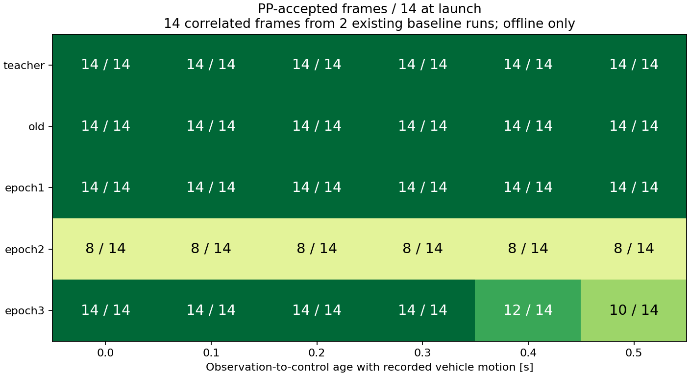
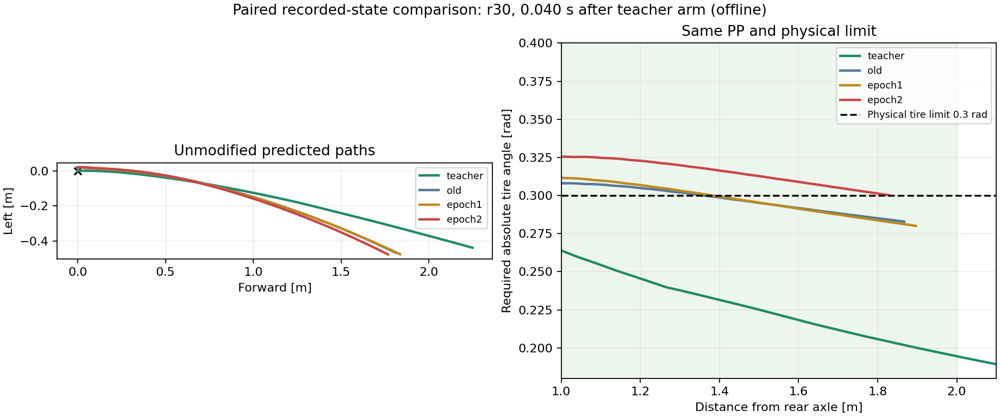

# 再学習後の発進停止: 旧モデル・epoch別の比較と原因切り分け

**今回の直接原因は、採用したepoch2が発進時に出す経路の操舵不成立。遅延だけでは説明できない。さらに、発進の成立を確認せずに平均軌道誤差でepochを選ぶ構成が、この悪化を見逃していた。**

既存の同一AWSIM環境のセンサ入力に旧モデルとepoch1〜3を適用した。発進前後14フレームでは、旧モデル・epoch1・実測教師は全件PP成立、epoch2は8件だけ成立した。現在の物理操舵限界を維持して、正しい教師なら制御計算は成立する。

学習データの総量不足だけを主因とする根拠はない。一方、既存教師の発進状態の少なさと、待機・発進の意味を区別する入力／教師の設計には追加の課題がある。追加データ量、提示比率、補助損失それぞれの寄与は、まだ学習条件を固定した比較で確定していない。

## 比較条件と証跡

- 分析元source: `1903cb955671ac05e68259acb9f313010de1e279`。モデル・PP・操舵限界・Safety Supervisorの実装は変更していない。
- Windowsを編集正本とし、推論・PP計算・図の生成・pytestはnative WSLのworktree lock内で実施した。
- 追加のoptimizer更新、AWSIM実走、ROS書き込みは0回。封印testは未使用。
- 旧モデル: `time_recovery_multiscale_20260916/training/best.pt`、SHA256 `685f8b8f9936ab7e272be12616982374fd8a8d61fbe4a304b25475dc2a206ba8`。
- 新モデル: `time_corner_retraining_20260916/training_serial/epoch_01.pt`〜`epoch_03.pt`。実走に使用した`best.pt`はepoch2、SHA256 `c7e52d6beebe0852bf89a5d64e55782a00bf11ede3fd97c6a68cff7e6751e326`。
- 4 checkpointのモデル設定は完全一致を確認。同じ入力・同じ実装で重みだけを替えた比較である。
- センサ・教師・履歴は既存のcanonical処理で構成。時刻・単位・行ID・元bagのhashを保存。将来の姿勢と教師は評価専用で、モデル入力に含めない。
- PP成立は、記録状態での目標点選択・操舵計算の成立を指す。LiDAR停止監視、実車両の追従、衝突回避、完走の保証ではない。

小さい集計・再現operator・代表経路・図は[証跡フォルダ](evidence/time_launch_regression_20260916/)に保存した。元bag、重み、全予測配列はWSLに保持する。

## 1. 同じAWSIM録画入力ではepoch2が悪化する

実行先`graneple@192.168.3.10`で収集済みの`codex-time-recovery-speedbase-r30`、`r31`を使った。いずれも固定目標5km/hの完走した教師baselineで、scene・vehicle・DLLのhashは今回の実走設定と一致する。

これらは既存の校正／基準走行に使用した記録であり、未使用testではない。今回失敗した試験はCamera/LiDAR本体を保存していないため、その試験の全く同じ入力を別モデルへ再投入した比較ではない。

教師追従開始の−2〜+3秒から92フレーム（r30:47、r31:45）を抽出し、同一の入力へ4モデルをCUDA FP32・batch1で適用した。特に開始−0.25〜+0.5秒の14フレームを発進付近の集計とした。**14回の独立した発進試験ではなく、2走行に含まれる連続フレーム**である。

| モデル | 発進付近、遅延0秒 | 遅延0.3秒 | 遅延0.4秒 | 遅延0.5秒 |
|---|---:|---:|---:|---:|
| 実測教師 | 14/14 | 14/14 | 14/14 | 14/14 |
| 旧モデル | 14/14 | 14/14 | 14/14 | 14/14 |
| epoch1 | 14/14 | 14/14 | 14/14 | 14/14 |
| **epoch2（今回採用）** | **8/14** | **8/14** | **8/14** | **8/14** |
| epoch3 | 14/14 | 14/14 | 12/14 | 10/14 |

遅延0.1、0.2秒は0秒の欄と同じ。各遅延時点の姿勢・速度には、その後の実測状態を使う。予測した経路で車両を進めた閉ループシミュレーションではない。対応する教師の世界座標と将来実測姿勢の一致も検証した。

epoch2の6件の拒否は、両runで3件ずつ発生し、すべて`TIRE_LIMIT`だった。必要距離内に経路はあるが、物理前輪角±0.3radを満たす点／線分区間が存在しない。

開始前後全体の92フレーム・遅延0秒でも、旧モデル／epoch1／epoch3は92/92、epoch2は67/92。教師は75/92で、残る17件は発進前の短い実測将来軌道である。したがって、待機中の予測まで全部「動けるほど良い」と評価しない。



## 2. 短い前方成分と強い横方向成分が重なって操舵限界を超える

代表例は、発進付近でepoch2が拒否されたうち教師開始後の最初のフレーム、r30の+0.040秒を選んだ。

| 経路 | 3秒先の前方x [m] | 左方向y [m] | 探索距離内の最小必要前輪角の絶対値 [rad] | PP成立 |
|---|---:|---:|---:|---|
| 実測教師 | 2.24948 | −0.43874 | 約0.19452 | 成立 |
| 旧モデル | 1.80918 | −0.46616 | 約0.28285 | 成立 |
| epoch1 | 1.83662 | −0.47578 | 約0.28008 | 成立 |
| **epoch2** | **1.76763** | **−0.47664** | **約0.30014** | **不成立** |
| epoch3 | 1.81353 | −0.48969 | 約0.29329 | 成立 |

x/yは観測時車体座標、y<0は右方向。角度はrear axleへ変換した連続折れ線上の幾何条件を既存の区間判定と二分探索で求めた近似値であり、float32での実際のPP成立判定も別に実行している。点列の頂点だけを調べた値ではない。

epoch2は旧モデルより前方終点が約4.15cm短く、右方向終点が約1.05cm増えている。PPの必要操舵は横方向だけでなく、前方距離を含む距離の二乗にも依存するため、この差が境界を超えさせる。

保存予測の前後／左右成分だけを入れ替える**評価限定の反実仮想**を実施した。epoch2が失敗した25フレームで、`旧x + epoch2 y`は25/25成立、`epoch2 x + 旧y`も25/25成立した。一方、epoch2の元のx/yでは0/25だった。片方だけを原因とするより、両成分を合わせた曲がり方が問題と判断できる。

混合経路は実在の教師でも、採用する制御経路でもない。学習やROSへの投入は行っていない。



## 3. 実際に停止したログでも、遅延の除去だけでは救済できない

今回の実走ログ`codex-time-corner-lap01`の稼働中103指令、48個の予測planを再確認した。

| 条件 | PP成立 | 操舵不成立 |
|---|---:|---:|
| 記録された姿勢・速度・経路年齢 | 6/103 | 97/103 |
| 経路年齢と姿勢移動を0にし、記録された現在速度を維持 | 4/103 | 99/103 |

元の97拒否のうち、後者で成立に変わったものは0件。これは「推論遅延0の実走」を再現したものではなく、同じ予測経路に対する時刻・座標変換の感度計算である。

前回の全103指令の再計算も、記録値との差最大2.22e−16で一致済み。今回も成立／拒否が全件一致した。実走の経路年齢は0.105〜0.375秒で、0.5秒の上限内だった。停止領域監視の拒否は0件だった。

したがって、今回の停止を「遅延だけ」「PPの計算再現不良」「停止領域監視の過剰反応」で説明する証拠はない。epoch3は別の録画比較で遅延に伴い悪化したため、遅延の検証自体は引き続き必要である。

## 4. 学習・選択側で確認できた問題

### 発進を個別に評価していない

epoch選択は、固定した旧6 validation runのrun均等平均3秒先位置誤差だけで行っていた。

| 重み | 選択用の3秒先誤差 [m] |
|---|---:|
| 学習開始時の旧モデル | 0.052371 |
| epoch1 | 0.057809 |
| epoch2 | 0.054786 |
| epoch3 | 0.055817 |

**epoch2は追加学習した3候補の中では最良だが、開始時の旧モデルより良くない。** `time_corpus_runner_v1.py`は開始時評価を保存するものの、`best_score_m=None`から追加epochを選び、開始時重みをbest候補に含めない。これは追加学習内のbestという意味であり、そのまま実走モデルを昇格させる条件としては不足する。

また、全体の3秒先誤差は発進のPP成立を直接表さない。epoch1とepoch2の発進順位が、この平均誤差の順位と逆になっている。

### 発進の提示割合は小さく、通常発進には幾何補助損失がない

`|現在速度|≤0.03m/s`かつ`3秒先教師終点距離≥1m`、入力・30点教師が有効なものを発進前状態として監査した。

- trainには152フレーム／12通常走行、validationには51フレーム／4通常走行がある。追加の復帰runにはこの状態がない。
- 通常走行36,726フレームは毎epoch1回で維持された。発進152件も消えてはいない。
- 全提示数が45,646→60,608/epochへ増え、通常走行比率は80.46%→60.60%、発進152件の比率は0.333%→0.251%になった。
- 補助のPP幾何損失・遠方横方向損失は復帰run限定で、通常発進は通常の座標損失だけを受ける。
- 前回4,281更新、今回5,682更新。追加データだけを等更新数で比較した実験ではない。

提示割合と損失の対象は確認できた事実だが、それぞれがepoch2悪化をどれだけ生んだかは未確定。「復帰データを追加したから忘れた」と単一原因に断定しない。

### 元の通常教師でも発進は十分に学べていない

4 validation runの発進前51フレームでは、実測教師は51/51でPP成立したが、旧モデルを含む4モデルはすべて1/51だった。残る50件は遅延0秒では経路が短く、1〜2mの探索距離に届かなかった。0〜0.5秒の感度計算でも成立は1/51のまま。

epoch2の3秒先予測終点距離の中央値は約0.100m、教師は約1.741m。全点ADEはこの51件で約0.558mだった。通常走行全体の約0.020mというADEでは、この局所的な弱さが見えにくい。

この問題は今回の再学習で初めて発生したものではない。また、この51件を実際の発進許可済み状態における成功率とは解釈しない。記録には人の開始操作前の静止期間が含まれ、静止中でも将来3秒に開始が入るかで教師が変わる。

モデルには明示的な発進許可状態がなく、`use_command_history=False`。待機時と発進直前の比較では速度・実操舵はほぼ0のままだが、Camera/LiDAR/IMU/センサ時刻などの入力tensorは完全一致しなかった。したがって「全く同じ入力に矛盾した正解」という数学的証明はしていない。**開始操作と教師の意味を監査し、予測可能な条件で教師を定義し直す必要がある疑い**として扱う。

同じ開始位置に近い元通常データと今回のAWSIM baselineで予測距離が大きく異なる点も残る。描画・観測・収集手順などのどの違いが効いているかまでは、この比較で確定していない。

## 対応の優先順位

1. **実走候補の選択を修正する。** 旧モデルを比較対象に残し、全体誤差に加えて発進・通常・復帰ごとの非劣化条件を置く。発進は実測姿勢を使った遅延範囲でPP成立と操舵余裕を検証する。今回確認した記録は今後は開発用に固定し、最終確認用の別走行と混同しない。
2. **発進教師と学習配分を修正する。** 発進許可・待機理由の保存と教師対象期間を確認し、必要なら推論でも入手可能な状態として入力契約を定める。通常発進の提示枠と制御に関係する評価／損失を保護する。教師経路だけを人工的に変形する対応は採らない。
3. **固定予算で学習要因を比較する。** 同じ初期重み・seed・更新数・検証集合で、提示比率の保護と補助損失の対象変更を分けて検証する。必要な追加収集は、監査後に不足が確定した発進条件へ絞る。
4. **候補をAWSIMで確認する。** epoch1は今回の録画による発進診断ではepoch2より良いが、復帰・通常走行・完走を含めた昇格は未承認。今回の14件だけで自動採用しない。固定5km/h・操舵限界・監視を維持した有限試験で評価する。

今回実施したのは比較と原因切り分けであり、上記の学習変更、新しい再学習、候補の実走切替はまだ実施していない。

## 再現・検証

以下は元データと重みが配置されたnative WSL repo、分析元source `1903cb9`での実行方法。実行済みoperatorはrepo外の分析保存先に置き、その内容を証跡フォルダにも保存した。補助operatorは元source SHAを確認するため、この報告書を追加した後の別SHAでは意図的に停止する。

再現時は公式のWindows→WSL同期手順で分析元sourceを揃え、operatorを新しい分析保存先の`operators`へ複製する。既存の証跡を上書きせず、3 operator内の出力先と補助operatorのimport先を同じ新規保存先へ変更する。

```bash
cd /home/thistle/e2e_autonomous/e2e_lite_transfuser
tools/with_wsl_training_lock.sh env PYTHONPATH=src .venv/bin/python -u \
  ../runs/time_launch_regression_20260916/operators/compare_native.py nominal
tools/with_wsl_training_lock.sh env PYTHONPATH=src .venv/bin/python -u \
  ../runs/time_launch_regression_20260916/operators/compare_native.py baseline
tools/with_wsl_training_lock.sh env PYTHONPATH=src .venv/bin/python -u \
  ../runs/time_launch_regression_20260916/operators/supplement_native.py
tools/with_wsl_training_lock.sh env PYTHONPATH=src .venv/bin/python \
  ../runs/time_launch_regression_20260916/operators/render_acceptance_native.py
tools/with_wsl_training_lock.sh env PYTHONPATH=src OMP_NUM_THREADS=4 OPENBLAS_NUM_THREADS=4 \
  .venv/bin/python -m pytest -q
```

nominalではcache hash、旧予測配列、各epochの既存評価値を再照合し、同一値を確認。baselineでは元bagとcheckpointのhash、因果的履歴、teacherとの未来姿勢照合を実施。補助計算は保存した全92件の遅延0秒PP結果、実走全103指令の成立／拒否を再現した。直線・探索距離不足のsmoke checkも通過した。

既存pytestは**2,767 passed、4 skipped、84 warnings、141.94秒**。skipは既存環境のOSQP、JSON Schema validator、optional公式packageの不足による。結果と実行済みoperatorのhashは同じ証跡フォルダに保存した。学習データ、重み、rosbagはGitに含めない。
