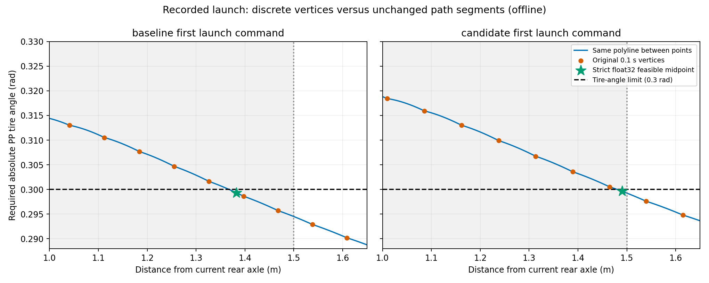

# 時間予測経路とPure Pursuit先読み条件の整合性調査

ユーザー依頼: 修正を適用する前に、予測経路とPP先読み条件の整合性を調査・解析する。
Windows正本で診断処理とテストを追加し、同期したnative WSLで既存記録を解析する。
制御・ROS・モデル・速度目標・AWSIM設定は変更しない。

追記: 方針承認後の[実装・AWSIM試験結果](time_segment_following_20260914.md)を別文書に記録した。
本書は修正前の調査結果を保持する。

## 結論

発進できなかった直接の原因は、**予測した折れ線には条件を満たす位置があるのに、
PPが元の離散点だけを候補として調べていること**だった。
候補モデルの発進時103指令（49個の異なる予測）について、元の点の選択は0件成立、
同じ折れ線内の位置を調べる診断では103件成立した。
経路の平滑化を必要とする結果ではなく、点選択の取りこぼしを確認した結果である。

ただし、成立位置の操舵余裕は非常に小さい。保存した発進時の予測を固定し、
計算速度だけ1/3/5km/hへ変更すると、線分内まで調べても103件すべて不成立だった。
**離散点選択の修正だけで固定5km/hの走行が成立する、とは判断できない。**
予測と実行速度の関係、操舵応答を含めた検証が次に必要になる。

今回追加したのはoffline診断・テスト・証跡だけ。走行実装への修正適用やAWSIM再試験は行っていない。

## 調査方法

- 対象は既存baseline/candidate試験。元の制御replayとsource/config hashを確認する。
- 実装上の距離帯は `Dmin=max(1, 0.4+0.5v+v²/2)`、`Dmax=Dmin+0.5`（m）。
  PP要求角は `atan((1.087+0.045v²)*2y/(x²+y²))`（rad、vはm/s）。
- 現行のfloat32離散点選択と、同じ折れ線上の連続位置を比較する。
  各線分の半径条件・前方条件・操舵条件の二次方程式境界を求め、狭い区間を間引きで見逃さない。
  補間した中点をfloat32に変換し、同じ距離上限・操舵上限で再確認して既存PP計算へ通す。
  経路の端点、時刻順、形状、探索距離上限を変更しない。外挿・平滑化・操舵上限の緩和は含まない。
- float64離散点、時刻による点の除去を省いた場合、後輪offsetを0にした場合を感度比較する。
  最後の2条件は原因切り分けであり、正しいframe/time契約の変更案ではない。
- 発進時に保存された予測/姿勢を固定し、計算速度のみ0/1/3/5km/hとした感度も比較する。
  この感度計算は車両状態を進めるシミュレーションではない。
- geometry検査、実タイヤ角、ROS入力角、応答補償、学習目的の各制約が何を保証するかを整理する。

## 現行の条件

| 項目 | 実装と単位 | 調査結果 |
|---|---|---|
| 予測出力 | 観測時のbody frameで0.1〜3.0秒先の30点、単位m | 時間等間隔であり、空間の等間隔ではない |
| 現在への変換 | 観測時刻からの経過分を補間・除去し、現在の後輪座標系へ変換 | 古い予測を現在の座標としてそのまま使ってはいない |
| 先読み距離 | `Dmin=max(1, 0.4+0.5v+v²/2)`、`Dmax=Dmin+0.5` m | vは現在の実測速度（m/s）。目標5km/hを常に代入する式ではない |
| 先読み点選択 | 時刻順の元の前方点から、距離帯かつ操舵条件を満たす最初の点 | 点と点の間は検索しない |
| PPの要求角 | `atan(L_eff*2y/(x²+y²))` rad、`L_eff=1.087+0.045v²` m | 選択判定と実際のPP計算で同じ車両モデルを使用 |
| PP採用上限 | タイヤ角の絶対値0.3rad | ROS入力上限0.5rad×応答ゲイン0.6と整合 |
| geometry検査 | `TimeGeometryConfig.max_steer_rad=0.5` rad等による形状検査 | 0.3radでの操舵成立や衝突回避を保証する検査ではない |
| 速度目標 | `fixed_5kmh`によって常に5/3.6m/sへ置換 | 予測点列が示す到達時刻・速度を追従しているわけではない |
| 操舵出力 | 要求タイヤ角を0.6で割り、ROS入力を0.8rad/s以内に制限 | 定常の角度成立と、直ちにその角度に到達できることは別 |

参照実装:
[時間参照変換](../src/aic_transfuser_lite/control/time_reference_v1.py)、
[PP候補選択](../src/aic_transfuser_lite/control/time_trial_v1.py)、
[PP計算](../src/aic_transfuser_lite/control/waypoint_controller.py)、
[操舵マッピング](../src/aic_transfuser_lite/control/awsim_steering.py)、
[速度依存車両モデル](../src/aic_transfuser_lite/control/vehicle_motion_v1.py)、
[形状検査](../src/aic_transfuser_lite/control/time_geometry_v2.py)。

0.3radは現在の入力制限と校正ゲインによる採用上限であり、AWSIM資産自体の絶対的な物理上限を
新たに測定した値ではない。0.5radのgeometry検査を通っても0.3radのPP選択で落ちることはあり得る。
これは検査の役割が異なるためで、0.3を0.5に緩めればよいという意味ではない。

## 実記録の再計算

元のAWSIM試験は別試行。各行の「元の点のみ」と「同じ線分内も調べる」は、同じ記録姿勢・速度・予測の対応比較。
後者はgeometry検査、参照の停止距離、float32の距離・操舵条件を満たす中点を、既存のPP計算へ通した結果。
元の点列、経路の形、時刻順、探索距離上限、操舵上限を保持している。

| 記録 | 評価できる指令数 | 元の点のみでPP成立 | 同じ線分内も調べてPP成立 | 新たに不成立になった指令 |
|---|---:|---:|---:|---:|
| 旧モデル・発進後の最初の5.2秒 | 104 | 104 | 104 | 0 |
| 新モデル・発進試行全体（約5.15秒） | 103 | 0 | 103 | 0 |
| 旧モデル・記録全区間 | 1,958 | 1,956 | 1,956 | 0 |

旧モデルには別途58件の姿勢等が不足した指令があり、上表の分母に含めていない。
旧モデルの残る2件は`TIME_PATH_INITIAL_DIRECTION`であり、候補点を変えても形状検査の不成立を維持した。
元の指令replayは旧1,958件・新103件とも一致し、最大絶対誤差は旧8.89e-16以下、新0。
scan判定はこの比較の対象外。成立件数が同じことは、選ばれる位置や操舵指令が同一という意味ではない。

### 新モデルの最初の指令で起きていたこと

実測速度0m/s、予測経過時間0.225秒、先読み距離帯1.0〜1.5m。

| 候補 | 後輪からの距離 | PP要求角の絶対値 | 判定 |
|---|---:|---:|---|
| 距離帯の最後の元の点（観測から2.4秒先） | 1.464539m | 0.300534rad | 角度が上限0.3radを超える |
| 次の元の点（観測から2.5秒先） | 1.539742m | 0.297601rad | 距離が上限1.5mを超える |
| 両点間の折れ線上の位置 | 1.490059m | 0.299638rad | 距離・角度とも成立 |

この線分では、距離約1.480120〜1.500000mに成立区間がある。
区間長は経路に沿って約20.179mm。採用例は現在から約2.209秒先に対応する中点であり、
新たな経路形状や外挿点ではない。PPはこの位置を幾何学的な先読み目標として使用し、
約2.209秒という到達時刻を制御目標には使用しない。



図の灰色部分が先読み距離帯、破線以下が要求角の採用範囲。
右の新モデルでは、両条件を同時に満たす元の点がなく、青い線分の一部分だけが条件を満たす。
これは車両の走行軌跡図ではなく、最初の保存予測に対するPP要求角の図である。

新モデル103指令を通して、距離帯内の最良の元の点でも要求角は0.300530〜0.301672rad。
同じ線分上で最初に見つかる成立区間の長さは1.161〜20.285mm、中央値19.063mm。
float32中点での操舵余裕は0.0000236〜0.0003641radしかない（最小約0.00135度）。
したがって、単なる丸め誤差ではない一方、実走の変動に対して十分な余裕がある状態でもない。

## 速度・時刻・座標系の切り分け

発進時の各保存予測と姿勢を固定し、計算へ渡す速度だけを変えた結果:

| 仮定する速度 | 先読み距離帯 | 新モデル: 元の点 / 線分内の成立 | 最初の予測に対する原因 |
|---|---|---:|---|
| 0km/h | 1.000〜1.500m | 0/103 / 103/103 | 離散点が成立区間をまたいでいる |
| 1km/h | 1.000〜1.500m | 0/103 / 0/103 | 速度依存の要求角が増加。距離帯内の最小要求角は約0.300159rad |
| 3km/h | 1.164〜1.664m | 0/103 / 0/103 | 距離帯内の最小要求角は約0.301075rad |
| 5km/h | 2.059〜2.559m | 0/103 / 0/103 | この予測の最遠点1.913mは先読み距離の下限にも届かない |

最小要求角の概数は細かいサンプリングによる値。線分内の成立有無は二次方程式の区間判定による。
これは**同じ発進予測の感度解析**であり、速度を変えてモデルを再推論した結果や走行シミュレーションではない。
実際に動いた後の予測が長くなり条件を満たす可能性は残る。
また、`awsim_understeer_v1`の係数は過去の限られた速度帯での校正値であり、
今回そのモデルの物理精度を再検証したわけではない。

新モデルの発進記録で、予測の直近0.3秒分から算出する速度は平均0.274857m/s（約0.99km/h）。
現在の実行設定はこれを固定5km/hの目標へ置換する。発進時に遅い予測が出ること自体は異常の証明ではないが、
**時間軌道を予測し、その空間形状を別の速度目標で追う構成**になっていることは確認できた。
固定5km/hを維持する場合、実行速度に対する予測距離と操舵余裕を確認する必要がある。

| 診断条件 | 新モデルの離散点で成立した数 | 解釈 |
|---|---:|---|
| 現行float32 | 0/103 | 基準 |
| float64で点を判定 | 0/103 | 精度を上げても解消しない |
| 約1mmの後輪offsetを0へ変更して比較 | 0/103 | このoffsetが拒否の主因ではない |
| 現在座標への変換を保ち、経過時刻による点除去だけ省いて比較 | 0/103 | 点除去を省いても解消しない |

これらの感度条件は診断用途であり、座標変換や時刻処理を削除する提案ではない。
float32/64による要求角差の最大値は6.92e-8radで、元の点の最小超過量0.000530radより約7,600倍小さい。
予測から指令までの姿勢差は新モデルで最大並進0.0149mm、yaw差0.0000666rad。
今回の発進記録では、座標系・時刻・丸めの不整合が停止を説明するという証拠は得られなかった。

## 制御側と学習側の責務

制御側では、元の点がないことと、元の点を結んだ経路上に位置がないことを区別できていない。
今回の103件の直接原因はここで再現できる。応答補償は点選択後の処理なので、
現在の`STEERING_FEASIBLE_LOOKAHEAD_MISSING`を解決できない。

一方、線分上の採用例は最初の指令で要求タイヤ角-0.299638rad、定常ROS入力約-0.499396radとなる。
前回入力0、dt=0.05秒で既存の操舵マッピングへ渡すと、出力はROS入力-0.04rad、
対応するタイヤ角の目標-0.024radに制限される。
これは単独ステップの計算であり、応答補償を含む指令列・実タイヤの過渡応答は再現していない。
PPの定常角が成立しても、発進・旋回時にその角度が間に合うことは別途確認が必要。

学習側の[モデル](../src/aic_transfuser_lite/models/time_path_v1.py)は0.1秒ごとにXYの差分を積算し、
[目的関数](../src/aic_transfuser_lite/training/time_objective_v1.py)はmask付きの位置L1誤差を評価する。
現行のPP距離帯に採用点が存在すること、0.3radでの操舵余裕、操舵速度制限下の追従性は保証していない。
位置誤差が改善した新モデルでも、発進可否は悪化し得る。
この調査だけで教師データの不足や再学習だけが原因だと断定することはできない。

## 次に修正する場合の方針（未適用）

1. 既存の離散点が成立する場合は現在の選択を維持する。不成立の場合に限り、
   元の隣接点を結ぶ線分内で、同じ前方・距離・操舵条件を満たす位置を調べる。
   これにより、既存の成立指令を不用意に変えず、今回の取りこぼしを対象にできる。
2. raw予測と時刻列は保持し、先読み位置に補間元の点番号・残り時刻・距離・操舵余裕を記録する。
   外挿や距離・操舵上限の緩和は、この原因に対する修正として必要ない。
3. `tests/test_time_trial_v1.py`の「必ず元の点そのものを使う」という現行契約を、
   既存成立時は同じ点、補間時は元の線分上かつraw不変という契約へ更新する。
   境界・接線・左右対称・非前方・時刻のテストを用意する。
4. 操舵応答補償・入力速度制限・停止領域判定まで通して、固定5km/h目標での発進を評価する。
   この段階で初めて、点選択の修正で実走の停止が解消するか判断できる。
5. 走行速度帯でも予測長や操舵余裕が不足する場合は、予測と実行速度の関係を学習評価項目に追加する。
   教師を変更・再学習する前に、速度別の先読み成立率・操舵余裕・必要距離の不足を測る。

既存の距離・操舵・安全監視条件を維持する。固定5km/hというユーザー指定は変更していない。

## 実行コマンド

Windowsでcommit後、`tools/sync_to_wsl.ps1 -CheckOnly`、`tools/sync_to_wsl.ps1`。
native WSL `/home/thistle/e2e_autonomous/e2e_lite_transfuser` で以下を実行する。

```bash
bash tools/with_wsl_training_lock.sh env PYTHONPATH=src OMP_NUM_THREADS=4 OPENBLAS_NUM_THREADS=4 \
  .venv/bin/python -m pytest -q
bash tools/with_wsl_training_lock.sh env PYTHONPATH=src OMP_NUM_THREADS=4 OPENBLAS_NUM_THREADS=4 \
  .venv/bin/python tools/audit_time_lookahead.py \
  --records ../runs/time_recovery_finetune_evidence_20260914 \
  --output ../runs/time_lookahead_alignment_audit_20260914
```

出力は新規directoryに限定し、原本と旧評価は保全する。
診断でnominal PPが成立しても、操舵応答・停止領域・動いた後の新しいモデル予測は別の検証が必要。

## 検証と証跡

- WSL実行source: `42143fe7357804fc2bf60b7a6abe329d8ec99238`。
- native WSL・worktree lock下で`pytest -q`: **2,249 passed / 4 skipped / 64 warnings**、exit 0。
  新規10件には線分内の成立、到達不能な円弧、接線、左右対称、元データ保持、不正時刻・範囲を含む。
- 既存記録と設定のSHA-256、checkpoint ID、元の制御replay一致を確認後、診断はexit 0で完了。
- 独立した数値確認として各成立線分を4,096分割し、103件すべてで同じ厳密なfloat32条件を満たす位置を確認した。
  刻みは最大0.0187mm、最も狭いケースでも62点が成立。結果は`crosscheck.json`。
- [集計](evidence/time_lookahead_alignment_20260914/summary.json)、
  [補助診断](evidence/time_lookahead_alignment_20260914/crosscheck.json)、
  [最初の新モデル指令](evidence/time_lookahead_alignment_20260914/codex-time-recovery-model-candidate01_first_command.json)、
  [実行記録](evidence/time_lookahead_alignment_20260914/execution.json)、
  [テストログ](evidence/time_lookahead_alignment_20260914/pytest.log)、
  [転送ハッシュ](evidence/time_lookahead_alignment_20260914/transfer_manifest.json)。
- 全指令の詳細JSONL（旧約24.4MB、新約1.1MB）はnative WSLの
  `/home/thistle/e2e_autonomous/runs/time_lookahead_alignment_audit_20260914`に保持。
  Windowsへ戻した小規模な証跡9ファイルはすべてSHA-256一致。データ・重みはGitへ追加していない。

前回の[平滑化評価](time_path_smoothing_evaluation_20260914.md)が0/103だったことと矛盾しない。
前回は点列の形状を変えて同じ離散点選択を使用し、今回は形状を保持して線分内の成立位置を調べている。
