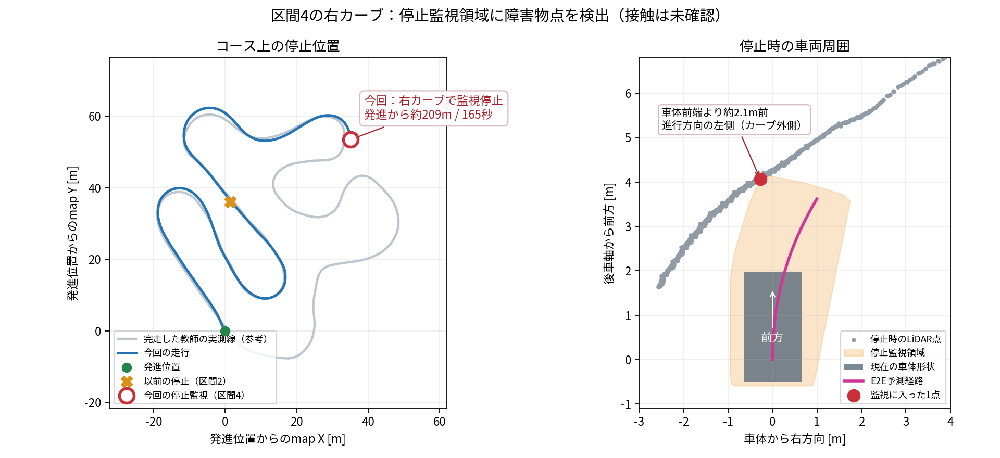
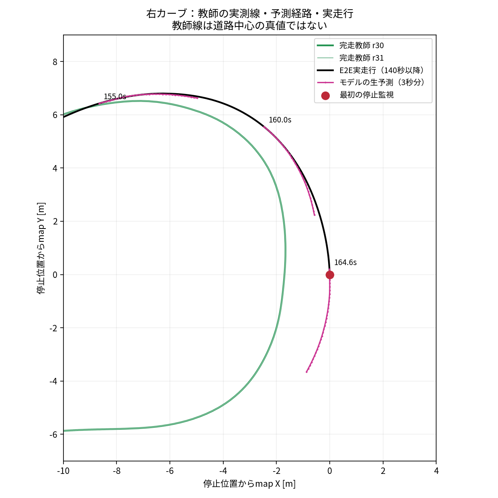
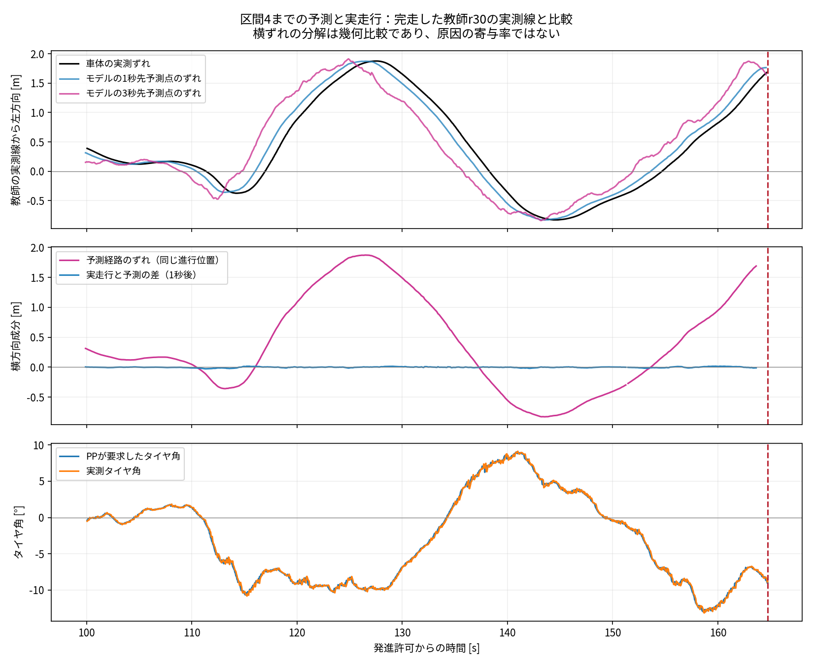
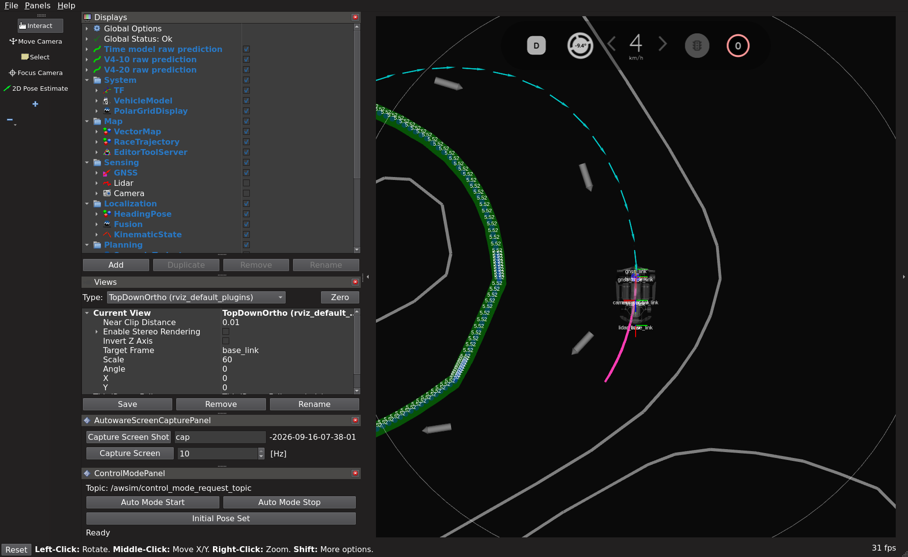

# 多段階の復帰データで再学習したモデルのAWSIM試験

2026-09-16。実行先は `graneple@192.168.3.10`、解析・評価はnative WSL。
AWSIM本体、シーン、車両・センサファイルは変更せず、全ファイルを開始前後にhash照合する。
通常RVizにE2Eの生予測 `/visualization/time_path/raw_path` を表示する。

**結果: 通常走行1回とWSL再生評価を完了。区間4まで進行したが、停止領域監視により未完走。**
記録poseの移動距離は208.605m、最初の停止領域監視は発進許可から164.740秒。
従来の通常モデルが停止していた区間2を越えたが、1周完走という合格条件は満たしていない。

## 試験条件

- 12・20・40・60cmの復帰データで再学習したepoch3モデルを使用する。
- 元checkpointはWSL `runs/time_recovery_multiscale_20260916/training/best.pt`、SHA256は
  `685f8b8f9936ab7e272be12616982374fd8a8d61fbe4a304b25475dc2a206ba8`。
- 停止状態からE2Eだけで発進する通常走行1回。教師運転や外乱は追加しない。
- 固定目標5km/h、Pure Pursuit、`stopping_preview_extended_v1`、操舵応答補償、標準の停止領域監視を維持する。
- 合格は公式Judgeによる順序付き区間通過と1周完了、その後の停止確認。
- 上限は走行600秒（sim/wall各々）、外側710秒＋終了猶予10秒。既存監視・進捗停止でも終了する。
- 失敗を隠す無条件の再試行や、この走行記録の学習への自動追加は行わない。

## 実行前に見つかったメタデータ不具合

元checkpointは `TEACHER_RUNTIME_CONTRACT_MISMATCH` で実行側に拒否された。
多段階復帰の学習ツールが、元cacheにある `teacher_manifest.contract` を保存していなかった。
保存処理にcontract転記を追加し、今後のcheckpointがそのまま実行側へ読み込める回帰テストを追加した。
既存exportツールをこの既知形式にも対応させ、元cacheの全hash・split・入力設定を照合して別ファイルへexportする。
元checkpointは保持し、全モデルstateと既存検証入力の予測が変わらないことを確認する。
モデル重み・学習条件・runtimeの拒否条件は変更せず、再学習は不要。

## 実行コマンド

Windowsでcommitして公式同期を行い、native WSL repoで共有worktree lockを取得して実行する。

```bash
tools/with_wsl_training_lock.sh env PYTHONPATH=src .venv/bin/python -m pytest -q
tools/with_wsl_training_lock.sh env PYTHONPATH=src .venv/bin/python \
  tools/export_time_recovery_runtime_checkpoint.py \
  --checkpoint ../runs/time_recovery_multiscale_20260916/training/best.pt \
  --checkpoint-sha256 685f8b8f9936ab7e272be12616982374fd8a8d61fbe4a304b25475dc2a206ba8 \
  --cache ../datasets/cache/time_recovery_multiscale_20260916 \
  --output ../runs/time_multiscale_model_lap_20260916/multiscale_runtime.pt

# .10: source、installed Python、checkpointを照合し、公式イメージ内ROS smoke成功後:
timeout --signal=TERM --kill-after=10s 710s python3 \
  <deployment>/<source>/tools/run_time_path_awsim_trial.py \
  --deployment <deployment> --run-id codex-time-multiscale-lap01 --display :0 \
  --config configs/control/time_path_multiscale_lap_20260916.json

# rawの転送後、native WSLで全hashを照合して評価:
tools/with_wsl_training_lock.sh env PYTHONPATH=src .venv/bin/python \
  tools/evaluate_time_awsim_trial.py --run <verified_raw_run> --output <evaluation>
```

## 配置前の確認結果

source `def95a93cb406688b2af737aa75f38c4701c6bb1` のnative WSL全pytestは **2,706 passed / 4 skipped**、102.39秒。
元cacheの全hashを照合し、215個のモデルstateは完全一致。既存validationから選んだ12入力についてCUDA・float32予測も完全一致した。
実行用checkpointは `runs/time_multiscale_model_lap_20260916/multiscale_runtime.pt`、SHA256 `1d36d36d02116a332489dab72e8d2c655b1daf24e34bb1ec5cd33347bb3b61a0`。
設定の差分は従来通常走行設定に対してこのcheckpoint SHAのみ。元の学習済み重みは変更していない。

## AWSIM走行結果

source `371430c64b6afcb7cd4a91d59855bc053c796983`、run `codex-time-multiscale-lap01`。
専用deploymentは `/home/graneple/e2e_autonomous/time_multiscale_model_lap_20260916`。
公式イメージ内のROS smokeはPASS、594 sourceファイルと236 installed Pythonファイルを照合して開始した。
ROS smokeでは実モデルのPath一致6件と異常時の制動を確認した。

|項目|結果|
|---|---:|
|公式Judgeの区間通過|0 → 1 → 2 → 3 → 4|
|公式周回完了|0回・未完走|
|最初の停止領域監視|発進許可後164.740秒|
|最後の制御記録|発進許可後165.005秒|
|記録poseの移動距離|208.605m|
|走行中の実測速度中央値|4.608km/h|
|追従中の実測最高速度|5.115km/h|
|PP追従指令|3,292件|
|最終終了理由|`CONTROL_STOPPING_SWEEP_OCCUPIED`|

固定5km/hは目標値であり、実測が常に5km/hだった意味ではない。
監視作動時は既存runnerが所有シミュレータをfreezeして終了する。自然に制動し切った停止確認や、物理的接触の証明ではない。

過去の通常モデル `uniform_l1` の1回試験は126.223m・区間2で未完走だった
（[前回の通常走行](time_random_model_lap_20260915.md)）。
今回の学習比較元 `balanced_geometry` は以前の2走行では発進できず、進捗監視で終了していた
（[学習方法別の走行比較](time_objective_driving_comparison_20260915.md)）。
今回はE2Eだけで発進して区間4まで進んだ。一方、各条件の少数試行であり、成功率やデータ追加だけの因果効果の推定はしない。
今回の走行途中にモデル・速度・PP・監視閾値を調整していない。

## 停止時の再生確認

WSLで保存済みの予測・pose・車速からPP、操舵応答補償、車両運動を再生した。
3,296指令が一致し、最大計算差は `8.881784197001252e-16`、許容差 `1e-9`。
再生に必要なpose/planがない56指令は対象外として明記した。
走行中には `MOTION_YAW_RATE_INVALID` による3指令の一時制動もあったが、最終終了理由は停止領域監視だった。

最初の停止監視時、PPは観測から1.6秒先、現在rear axleから1.925mの点を選択して成立していた。
plan ageは0.150秒で、先読み延長は不要だった。走行全体の追従指令でも延長は0件。
要求タイヤ角は−0.157463rad、実測−0.154446radで、この時点の差は0.003016rad。
これだけで、それ以前の制御誤差の蓄積や学習側の原因を確定しない。

別途、保存LiDARと同じ車両状態で監視も再計算し、`STOPPING_SWEEP_OCCUPIED` を再現した。
最小ray余裕は−0.007147m。これは観測rayに沿う停止監視領域との余裕であり、車体の接触量ではない。
新しい停止地点での予測と追従の切り分けは、後述の保存記録比較で実施した。
正常教師の同地点における停止監視余裕の再評価は未実施。

## 停止位置の特定

区間4を通過した後の右カーブ、進行方向から見て左側（カーブ外側）の壁付近。
下図の赤丸が今回、橙色の×が以前の停止位置。灰色は同じAWSIM資産で完走した教師r30の実測線で、道路中心の真値ではない。
今回の車体位置はmap座標 `(89666.435, 43181.274) m`。

停止領域内に入ったLiDAR点は1点で、後車軸から前方4.070m・左0.279m、車体前端から前方2.086mだった。
この点が現在の車体に接触していたことを示す値ではない。Unityログには車体と壁の接触を示す記録は確認できず、物理的衝突は未確認。
保存済みのraw・過去の停止記録・教師線のhashを照合し、native WSLで作図した。AWSIMの再実行はしていない。



## 曲がりきれなかった理由の切り分け

保存記録からは、**モデルがカーブ外側へ膨らむ経路を出し、そこから十分に復帰する予測を出せなかったことが主因と考えられる**。
PPの要求と実測操舵、および予測経路と1秒後の実走行の差は小さい。
これは1回の走行における幾何比較であり、原因の寄与率や、制御器を交換した場合の因果効果ではない。

native WSLでrawのhashを再照合し、発進後100.0〜164.740秒の1,295指令・577予測を、
同じAWSIM資産・目標5km/hで完走した教師r30/r31のOdometryに比較した。
教師は外乱なしのbaseline、比較範囲は教師の基準経路進行100〜235m。
教師の制御記録とOdometryは各215点で座標一致し、比較した教師同士260点の線の差は中央値0.86mm・最大4.11mm。
同一timestampで不一致のある教師pose（r30:9、r31:5）は隣接区間ごと除外し、補間・比較失敗は結果に記録した。
教師線は道路中心や唯一の正解走行線の真値ではない。

|発進後の時刻|教師r30の実測線からの左方向ずれ|
|---|---:|
|155.005秒|0.049m|
|160.000秒|0.823m|
|164.740秒・最初の停止監視|1.692m|

最後の右カーブでは左が外側。r31基準でも停止時は1.690mで、比較教師による結論の変化はなかった。
155.025秒の予測は観測時の左ずれ0.055mから、1秒先0.209m・3秒先0.464mへ増えていた。
159.960秒でも観測時0.819m、1秒先0.943m・3秒先1.169m。
155秒以降、観測時のずれが20cm以上ある75予測のうち、1秒先・2秒先で絶対ずれを減らした予測は0件、3秒先でも1件だった。
停止直前の予測も、3秒先まで教師線に戻り切る形にはなっていない。

一方、160秒以降の予測のうち停止前の1秒後実測が存在する32件では、
**同じ進行位置での実走行と予測の横差は絶対値中央値1.05cm・95パーセンタイル1.61cm**。
同期間の実走行の教師線からの横ずれ中央値は1.32m、予測経路の横ずれ中央値は1.31mだった。
将来が最初の監視作動より後になる8予測は、この1秒後比較から除外した。
この差には後続の再予測・制御が含まれ、固定予測を与え続けた単独PP追従試験ではない。

160秒以降95指令の操舵誤差絶対値は中央値0.00251rad（0.144°）、95パーセンタイル0.00912rad（0.523°）。
155秒以降の操舵レート制限は0件。最終時点の要求−0.15746radに実測−0.15445radで追従していた。
3件の一時的なyaw-rate異常は発進後39.15、71.20、126.94秒で、最後の右カーブ中には発生していない。
単にPPの見る点を遠くするだけでは解決を期待しにくく、3秒分の生予測自体にも外側へのずれがある。

現時点で分かったのは「出力経路と追従のどちらに問題が表れているか」。
なぜモデルがその出力を学習したかは、データの状態分布、教師軌道、損失・学習の比較が別途必要であり、データ量不足だけとは断定しない。
今回、60cmを超える大きなずれだけでなく、位置ずれ約5cm・教師との向き差約6.7°の段階から外側へ膨らむ予測が出ていた。
次の確認対象は、このカーブ進入の向き・曲率に対応する教師とモデル出力の一致、および既存データでその状態を学べているかである。
保存教師線を同じPP幾何へ入れた感度計算も記録したが、ずれた位置から始まる有効な復帰TimePlanではないため、実走行の可否判定には使わない。





再現コマンド（出力先は新規作成のみ、既存結果は上書きしない）:

```bash
tools/with_wsl_training_lock.sh env PYTHONPATH=src .venv/bin/python \
  docs/evidence/time_multiscale_model_lap_20260916/operators/diagnose_corner4_native.py
```

全指令・予測ごとの結果はnative WSLの `runs/time_multiscale_model_lap_20260916/corner4_diagnosis/`、
集約値・入力hashは [summary.json](evidence/time_multiscale_model_lap_20260916/corner4_diagnosis/summary.json) に保存した。
新しい推論、再学習、AWSIM再走行、制御・監視の変更は行っていない。既存の比較関数を用い、入力shape/hashと横成分の加算誤差をassertで確認した。

## RViz・保全・記録

通常の `rviz2` が `/visualization/time_path/raw_path` を購読し、実画面も保存・目視確認した。
ピンクの短い線がTime modelの生予測。緑の長いRaceTrajectory表示とは別の経路である。



AWSIM全1,089ファイル・664,111,503 bytesは開始前後でSHA256完全一致。
元repoのHEAD・Git差分・RViz設定、既存114コンテナ・39 compose projectを保全し、試験後の稼働コンテナは0。

raw 52ファイル・105,934,936 bytesをnative WSLへ転送し、全サイズ・hashを照合した。
archive SHA256は `cb006b2425d7e6019d64dbc613e8dcbdecd675f114b875374ad8d8a3bded1f8b`。
`latest/d1/autoware.log` は同じrun内の実体を指す便宜リンクだった。元を維持し、archiveでは実体を収録、対応を `archive_aliases.json` に記録した。

raw・重み・全評価は `/home/thistle/e2e_autonomous/runs/time_multiscale_model_lap_20260916` に保持。
小さい検証結果・画像・実行スクリプトは [evidence](evidence/time_multiscale_model_lap_20260916/) に保存する。
重み、raw、ROS build出力はGitに追加していない。今回の評価走行は学習に使用していない。
