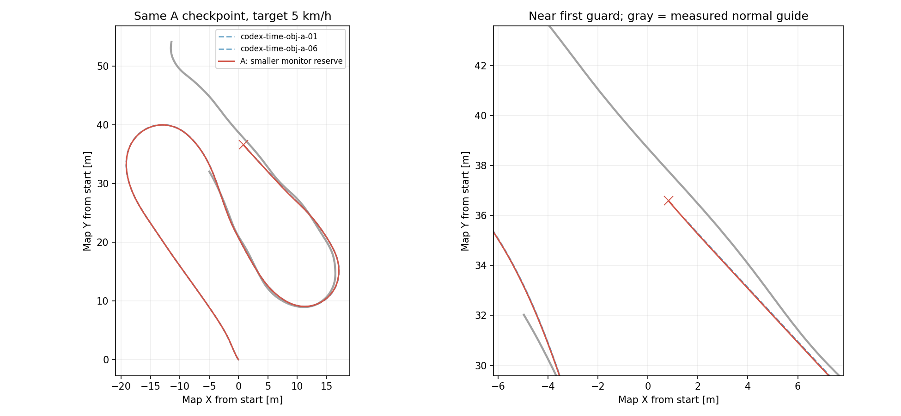

# AWSIM停止領域の余裕を小さくする限定診断（2026-09-15）

ユーザーの「一度ギリギリまで走らせてもよい」という追加指示に対し、通常条件の6走行を完了した後、現行Aで1走行だけ行う。
実行先は `graneple@192.168.3.10`、通常RVizにE2E生経路を表示し、目標5km/h、PP・操舵・推論重みは通常比較Aと同じ。

監視領域の側方余裕を片側20cmから5cmへ、停止距離への固定加算を40cmから10cmへ変更する。
車体幅1.30mに対する半幅は0.85mから0.70mになる。前後端、遅延0.5秒、制動1m/s²、実操舵・ヨーレートからの曲率範囲、横運動と離散化の余裕は維持する。
先読み点の選択・予測軌道の点列を変更しない。NaN/欠損scan、センサtimeout、overspeed、実操舵上限、単一発行元とAWSIM専用の起動条件も維持する。

`diagnostic_clearance_profile=awsim_near_limit_v1` は `diagnostic_only=true`、最大1試行、指定AWSIMホスト、既存車両応答モデル・support監視・one_lap設定がそろう場合だけ使用できる。
通常設定の既定値と計算結果は維持する。比較6本は変更前のsourceと標準余裕で実施し、診断結果を通常条件の合格数へ混ぜない。

1周または既存停止条件まで、走行最大600秒、外側最大720秒。前方LiDARに基づく領域判定であり、全車体の非接触を証明するものではない。
監視作動時は既存runnerが所有するシミュレータをfreezeするため、制動して実際に停止し切る挙動とは区別する。

## 検証と実行

```bash
cd /home/thistle/e2e_autonomous/e2e_lite_transfuser
tools/with_wsl_training_lock.sh env PYTHONPATH=src .venv/bin/python -m pytest -q
```

source archive・checkpoint・installed Pythonの全hash照合、公式イメージ内ROS smokeを通した専用deploymentで実行する。

```bash
python3 <deployment>/source_<sha>/tools/run_time_path_awsim_trial.py \
  --deployment <deployment> --run-id codex-time-near-limit-01 --display :0 \
  --config configs/control/time_path_near_limit_lap_20260915.json

tools/with_wsl_training_lock.sh env PYTHONPATH=src .venv/bin/python \
  tools/evaluate_time_awsim_trial.py --run <verified_raw> --output <evaluation>
```

保存scanの再評価では `scan_margin(..., clearance_profile='awsim_near_limit_v1')` を明示し、通常profileでも同じ保存状態を照合する。
教師が攻めた経路を通るという仮説は、正常教師の実走位置とE2E位置・予測経路を同じ地点で比較して判断する。

## 結果

**127.113m、ARMED後100.805秒で `STOPPING_SWEEP_OCCUPIED`。未完走。**
runは `codex-time-near-limit-01`、checkpointは通常Aと同じSHA `53e1962b97cfaa47acae3e2ad4687fac96c80672905406fdbe1514abd9563da2`。
source `6af50d3c982e28a3c86c3578041c3f11ff4f17ad` の専用deploymentで1本だけ実行した。
通常Aの126.080/126.157mに対して、増えた記録距離は0.956〜1.032m。公式Judgeの周回完了はなく、自然制動で停止し切った確認もない。



同じ保存scan・速度・操舵・ヨーレートを使い、WSLで両profileの監視計算を再生した。

|保存状態|通常profileの最小ray余裕|限定profileの最小ray余裕|
|---|---:|---:|
|通常A-01の初回拒否|−2.91cm|+30.40cm / 通過|
|通常B-03の初回拒否|−1.52cm|+33.39cm / 通過|
|通常B-04の初回拒否|−0.63cm|+34.06cm / 通過|
|通常A-06の初回拒否|−4.65cm|+27.73cm / 通過|
|限定Aの初回拒否|−41.81cm|−6.23cm / 拒否|

ray余裕はLiDAR方向に沿う観測距離と監視領域までの距離の差。物理的接触量ではなく、−6.23cmを「車体が6cm衝突した」と解釈しない。
監視余裕の変更は実際に前の拒否状態を許すが、その先で再び監視領域が観測物に達した。
横余裕と固定停止加算の2項目を一緒に変えたため、それぞれ単独の寄与はこの1本からは分離しない。

同じAWSIM資産・速度で完走した正常教師r30/r31の実測線から、末尾車体は左79.86〜79.94cm。
末尾の生予測は3秒先も左63.62〜63.72cmに残る。末尾10秒の1秒先・共通進捗での追従残差中央値は0.31〜0.33cm、予測線ずれは49.80〜49.89cm（各85点）。
参照はコース進捗55〜142mの実測線であり、道路中心・物理真値ではない。
今回の観測では、監視余裕を縮めても正常線への復帰量の不足を解消できなかった。標準監視の既定値は変更しない。

## 検証と後片付け

native WSLで全pytest **2535 passed / 4 skipped / 74 warnings、99.28秒**。
追加10テストで限定profileの起動条件、標準計算の一致、可変曲率でも物理車体を含む領域、障害物/NaN/車両モデルの拒否を確認した。
公式ROS smokeはPASS、source/checkpoint/installed Python 228ファイルのhash照合後に実走した。
通常RVizの生軌道購読者 `rviz2` を確認した。PP/操舵/車両運動の保存ログ再生もPASS。

raw 51ファイル、80,821,560 bytesを6,823,137 bytesのarchiveへ保存し、WSLへ転送後に全hash照合した。
archive SHA-256は `3021e538ccabcf835e535e232f8e37c14ec0ad4e00fc8c9ef30c4e0dec20b496`。
原本と評価は `/home/thistle/e2e_autonomous/runs/time_near_limit_diagnostic_20260915`、小さい証拠は [evidence](evidence/time_near_limit_diagnostic_20260915/) に保存。
リモートの既存114コンテナ・39 compose project、repo HEAD/差分/RVizの保全、実行中コンテナ0を確認した。

証拠転送中、WSLの新規接続が `Wsl/Service/0x80072747` で失敗した。UNCからプロセスを確認するとinit/sshd/終了済みRelayのみで、学習・評価・ユーザープロセスはなかった。
失敗した接続の既知の残存wslhost 1件の終了だけでは復旧しなかったため、保存済みarchiveとidle状態を確認して `Ubuntu-22.04-Recovered` だけをterminateし、再起動した。
新たな解析は同じcommit・native Python・worktree lockで完了した。以降の小さい証拠コピーはUNCでhash照合し、新規SSH中継の大量生成を避けた。
WindowsやAWSIMホストの再起動、データ削除、学習の再実行は行っていない。
