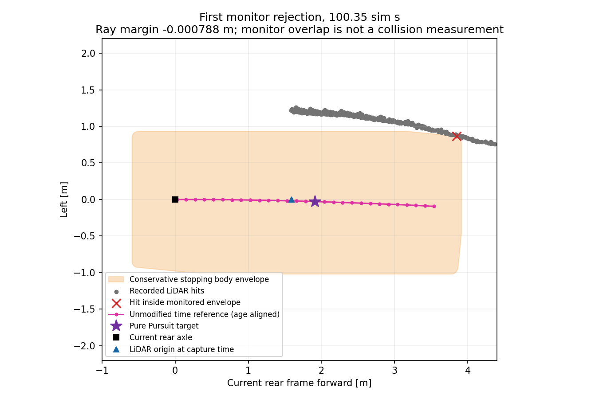
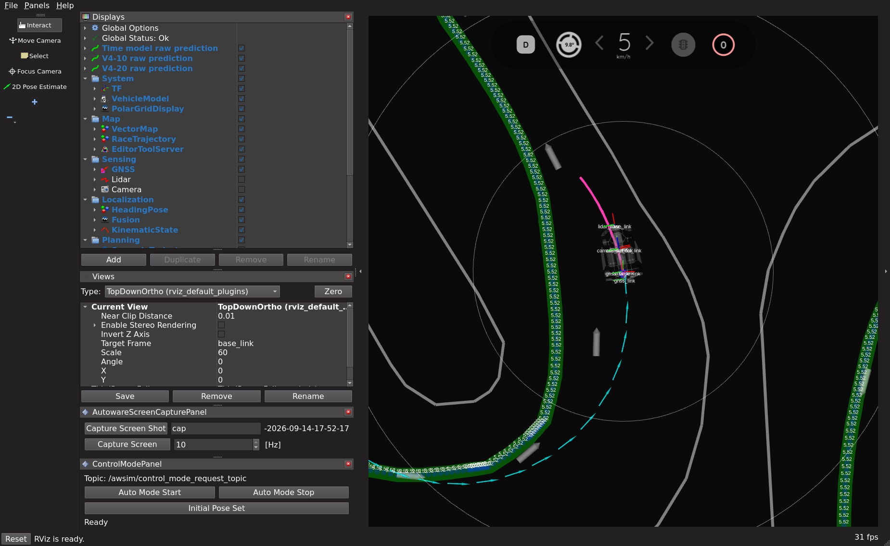

# 通常 E2E 完走試験（2026-09-14）

## 主な合格条件

ユーザーの最新指定に従い、通常の初期状態から E2E 予測軌道を Pure Pursuit で追従し、AWSIM の周回判定で 1 周を完了することを主な合格条件とする。目標速度は固定 5 km/h。通常の Autoware RViz に未加工の E2E 予測経路を表示する。教師制御による発進・走行介入は行わない。

横ずれ 5 cm・向き 2 度以内への復帰は補助評価であり、通常完走の必須条件ではない。先の復帰試験結果は `time_recovery_expanded_awsim_20260914.md` に保全する。周回完了後の停止確認、センサ・操舵・停止領域監視は従来のまま記録する。

## 発進停止の修正

`stopping_preview_extended_v1` はまず従来と同じ距離範囲 `[d, d+0.5] m` の原予測折れ線を探索する。`d=max(1, 0.4+0.5v+v²/2)`、`v` は実測 m/s。操舵可能点が見つからなかった場合のみ `[d, d+1.0] m` を再探索する。最低停止余裕・物理タイヤ角上限 0.3 rad・元の時刻対応・経路の終端を維持する。範囲外への経路外挿や平滑化は行わない。通常発進に限らず、同じ条件を満たす走行中の参照にも適用する。

保存された通常発進失敗記録の WSL 調査では、再学習モデルの候補点欠損 103 件すべてで、最大探索距離を 1.5 m から 2 m へ広げると候補点が見つかった。これは候補点探索の診断であり、実際の発進や完走を証明するものではない。最初の失敗入力を `tests/fixtures/time_path/expanded_startup_band.json` に原値と出典 SHA256 付きで保持した。

既存の `time_path_expanded_5kmh_20260914.json` から探索方針だけ変更した `configs/control/time_path_lap_candidate_20260914.json` を使う。再学習済み checkpoint SHA256 は `7ec445b6ab955e76d0d71efbd8f2f1dd3066ebe365516df38df8cf18adb56f44`。

## 検証・実行

Windows でコミット後、`tools/sync_to_wsl.ps1` で同期する。WSL ネイティブ checkout で:

```bash
tools/with_wsl_training_lock.sh env PYTHONPATH=src OMP_NUM_THREADS=4 OPENBLAS_NUM_THREADS=4 .venv/bin/python -m pytest -q
```

実行先は `graneple@192.168.3.10` の新しい専用 deployment `~/e2e_autonomous/time_normal_lap_20260914`。ソースと重みのハッシュを検証し、隔離した ROS スモークで予測経路 → PP → 操舵応答補償 → 操舵変換 → 停止領域監視まで確認してから実車両のない AWSIM を起動する。

```bash
timeout --signal=TERM --kill-after=10s 710s python3 \
  <deployment>/source_<commit>/tools/run_time_path_awsim_trial.py \
  --deployment <deployment> --run-id codex-time-lap-candidate01 --display :1 \
  --config configs/control/time_path_lap_candidate_20260914.json
```

予算は通常初期状態からの 1 試行、走行 600 sim s / 600 wall s、外側 720 wall s。外乱付与なし。結果と停止原因を確認せずに反復しない。生ログを WSL へハッシュ検証付きで転送し、次で評価する:

```bash
tools/with_wsl_training_lock.sh env PYTHONPATH=src .venv/bin/python \
  tools/evaluate_time_awsim_trial.py --run <WSL raw run> --output <WSL evaluation>
```

## 結果

通常初期状態から 1 回実行した。**発進は成功したが、通常完走は未達**。復帰精度の補助条件で不合格にした結果ではなく、AWSIM の周回完了判定が出る前に停止領域監視が作動した結果である。

| 項目 | 実測・記録 |
| --- | --- |
| 実行ソース | `edb00cf682641c28d7fd7b5766d64fe47ee8d2d2` |
| 実行 ID | `codex-time-lap-candidate01` |
| 初期状態・制御所有者 | 通常初期状態、発進から E2E、外乱付与・教師介入なし |
| AWSIM 判定 | `FAILED / CONTROL_STOPPING_SWEEP_OCCUPIED`、周回未完了 |
| 区間判定 | `0 → 1 → 2`、lap event なし |
| 記録位置の積算移動距離 | 126.564 m |
| 最初の停止領域監視作動 | 発進許可から 100.350 sim s |
| 指令記録の評価区間 | 100.640 sim s、終了処理の短い末尾を含む |
| 速度 | 目標 5 km/h、走行時中央値 4.616 km/h、最大 4.693 km/h |
| 正常追従指令 | 2,007 回 |
| 拡張探索を使用した指令 | 8 回、発進から 0.000–0.405 sim s のみ |
| 先読み候補点不足 | 今回の走行では 0 回 |
| 正常追従指令の最大間隔 | 75 ms |
| 予測経過時間 | 中央値 230 ms、p95 315 ms、最大 470 ms |
| 終了処理 | 所有 container は終了、cleanup error なし |

今回は監視 fault 後にシミュレータを凍結して終了する既存処理が働いた。`stop_confirmed_before_cleanup=false` であり、物理速度 0 の 1 秒持続を確認した停止としては扱わない。

## 停止直前の照合

要求タイヤ角 −0.018327 rad に対し実測 −0.016482 rad、出力タイヤ角 −0.019020 rad。先読み点は原予測の 1.7 秒地点、現在の後輪軸から `[1.9103, -0.0289] m`、距離 1.9105 m だった。この時点では通常の探索帯 `[1.8240, 2.3240] m` で候補が見つかっており、拡張探索は使っていない。

既存の停止領域監視を元の LiDAR・時刻整合済みセンサ位置・実測運動で再計算し、`STOPPING_SWEEP_OCCUPIED` を再現した。停止領域内に入った LiDAR 点は 1 点、現在後輪座標で前方 3.845 m・左 0.864 m。最小 ray 余裕は **−0.000788 m**。これは保守的な停止領域境界との ray 距離差であり、実車体の衝突量・壁との実測余裕ではない。領域には車体、停止移動距離 1.824 m、操舵範囲、横移動、離散化等の余裕が含まれる。

したがって今回残った停止を「先読み点がない」「操舵上限に張り付く」「大きな制御欠落」とは説明できない。予測経路・走行位置と保守的な停止領域の組合せを次の確認対象とする。今回 1 回の実行だけからモデル単独の原因や実衝突を断定せず、監視余裕も変更していない。



通常の Autoware RViz に `/visualization/time_path/raw_path` の未加工 30 点を表示した。購読・ウィンドウを実行前に確認し、走行中の保存画面でも magenta の予測線を確認した。下図は発進から 80 sim s 時点。XWD の元画像を、stride・DirectColor 成分を検証して PNG に変換したものである。



## 検証と保存先

- Native WSL の全体テスト: **2,370 passed / 4 skipped**、110.94 s。skip は既存環境の OSQP、jsonschema 関連 2 件、任意の公式パッケージ。
- 回帰テスト: 記録発進入力の PP 計算、旧探索で成功していた直線・左右旋回の指令一致、物理操舵限界と短経路の拒否、設定差分。
- 隔離 ROS: 実モデル Path 一致 6 件、拡張探索からの発進 shadow 指令 24 件、既存 segment 指令 24 件。PP・応答補償・操舵変換・停止領域監視まで通過。異常経路・運動値・古い予測・停止時計・速度超過の制動を確認し、車両向け publisher は 0。
- Source archive 542 ファイル、install 221 Python ファイル、checkpoint を検証。
- WSL 転送: **51 ファイル・80,366,165 bytes** をサイズと SHA256 で照合。
- WSL 制御再生: **2,008 指令一致**、最大誤差 `4.44e-16`。終了後の凍結末尾 60 指令は pose/plan 不足で再生対象外と明示。最初の停止領域拒否は別途再計算して一致。
- 実行先の既存 Git HEAD・dirty status・diff SHA256・RViz 設定 SHA256 を前後照合して保持。試験後の動作中 container は 0。

生ログは WSL の `/home/thistle/e2e_autonomous/runs/time_normal_lap_20260914/raw/codex-time-lap-candidate01`、評価は同階層の `evaluation`。実行先は `/home/graneple/e2e_autonomous/time_normal_lap_20260914`。小さい結果・ハッシュ・図は [evidence](evidence/time_normal_lap_20260914) に保存した。重み・生ログは Git へ追加していない。

既存 evaluator の `scope` は旧来の汎用文字列 `BOUNDED_SAME_SCENE_TEST_NOT_LAP_OR_AVOIDANCE_ACCEPTANCE` を保持している。今回の具体的な判定は `status=LAP_NOT_COMPLETED` と AWSIM の区間・lap log に基づく。同一モデルの発進失敗から通常走行へ進んだことは確認できたが、制御設定を変更した 1 回の試験であり、学習変更だけによる性能向上や通常完走成功率は示さない。
