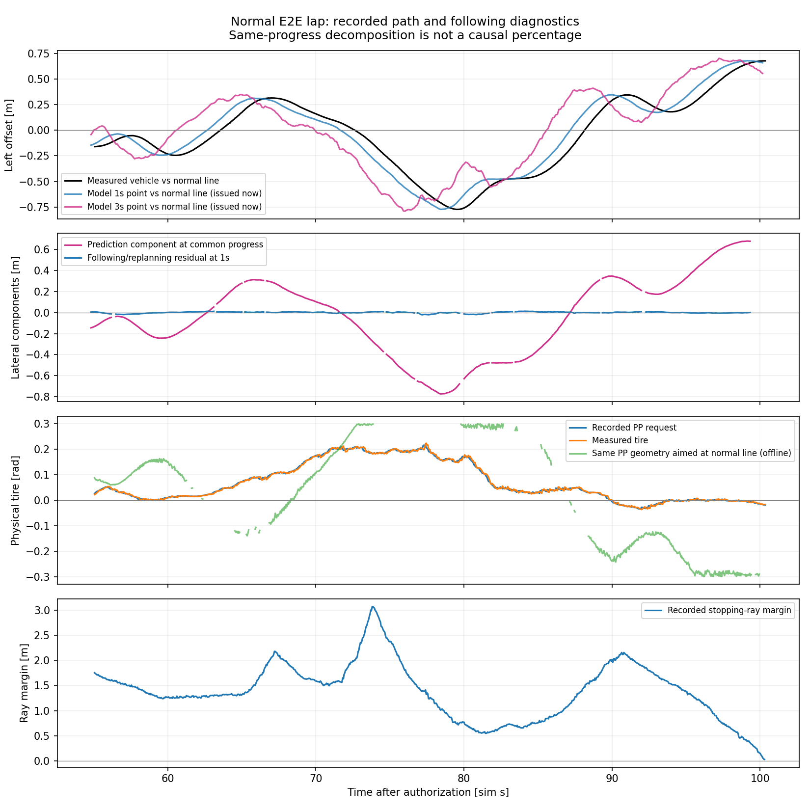
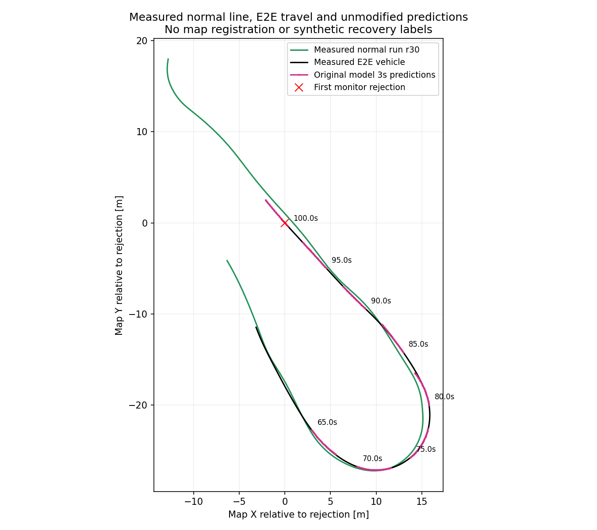

# 通常走行の予測経路・PP追従・操舵応答の切り分け

対象は `codex-time-lap-candidate01` の通常走行、最初の停止領域拒否まで。目標は引き続き通常 E2E の完走であり、通常ラインへの横位置差を新しい合格条件にはしない。

## 結論

**優先して改善すべきなのは、モデルが出すコーナー進入・出口の復帰経路。** 記録された車体は短い先では予測経路に近く、予測経路そのものが通常走行ラインから数十 cm ずれていた。実際の操舵指令は上限に達しておらず、指令と実測タイヤ角の差も小さい。

ただし、これは同じ走行記録の幾何比較である。小さな追従誤差の蓄積、再計画、遅延の影響を因果的に除去した試験ではなく、「PP に原因がない」「モデル原因が何 %」とは結論しない。通常ラインも唯一の正解ではなく、完走した実測走行との比較基準である。

## 観測結果

対象走行は目標 5 km/h、実測速度中央値 4.616 km/h。[前回の AWSIM 試験](time_normal_lap_20260914.md)の記録を WSL で解析した。今回、新たな AWSIM 走行・学習・推論は実施していない。

### 予測経路と車体の横位置

通常ライン r30 に対する比較。観測から 1 s 後の実測位置を取り、その**同じコース進行位置**にある予測経路点と比較する。値は絶対横位置差。追従側には後続予測への切り替えも含まれる。

| 観測区間 | 比較可能 / 対象予測 | 予測−通常ラインの中央値 | 実測−予測の中央値 | 実測−予測の p95 |
|---|---:|---:|---:|---:|
| 進入 55–65 s | 87 / 90 | 13.39 cm | 0.63 cm | 1.70 cm |
| 旋回 65–80 s | 130 / 135 | **29.60 cm** | **0.37 cm** | 1.67 cm |
| 戻り 80–90 s | 88 / 91 | **35.76 cm** | **0.65 cm** | 1.69 cm |
| 末尾 90 s–最初の拒否 | 84 / 93 | **33.88 cm** | **0.32 cm** | 0.69 cm |

2 s 後でも、旋回 / 戻り / 末尾の予測−通常ライン中央値は 30.37 / 35.94 / 35.23 cm、実測−予測中央値は 2.24 / 2.61 / 1.12 cm。比較可能件数はそれぞれ 130 / 86 / 75。

3 s 後は末端の先へ実測進捗が出る例が多いため、全体へ一般化しない。r30 の比較可能な 107 件では以下の結果になる。

| 観測区間 | 3 s 後に比較可能 / 対象予測 | 実測−予測の中央値 / p95 |
|---|---:|---:|
| 進入 | 0 / 90 | 算出不可 |
| 旋回 | 45 / 135 | 3.11 / 10.64 cm |
| 戻り | 28 / 91 | 10.97 / 14.44 cm |
| 末尾 | 34 / 93 | 2.25 / 5.61 cm |

したがって、1 s の小さい差を「3 s の予測全体に対して追従が完全」と読み替えてはいけない。固定 5 km/h と予測の距離・時間の不整合も、引き続き確認対象となる。

現在位置で通常ラインから 20 cm 以上ずれた予測について、3 s 点の絶対横ずれが現在より小さくなるものは、旋回 49 / 90、戻り 55 / 70、末尾 36 / 80。復帰方向が全く出ないわけではなく、**戻す予測が一貫して続かない**。

### PP と実測操舵

| 時刻 | 車体の通常ラインからの横位置 | 元の経路による PP 指令 | 実測タイヤ角 | 同じ状態から通常ラインを狙う PP 幾何計算 |
|---|---:|---:|---:|---:|
| 70.005 s | 左 16.1 cm | +0.1755 rad | +0.1727 rad | +0.1069 rad |
| 75.005 s | 右 28.9 cm | +0.1965 rad | +0.1919 rad | 有効な目標点なし |
| 80.000 s | 右 76.0 cm | +0.1700 rad | +0.1712 rad | +0.2861 rad |
| 85.005 s | 右 44.0 cm | +0.0304 rad | +0.0324 rad | +0.2350 rad |
| 89.990 s | 左 29.1 cm | −0.0045 rad | +0.0003 rad | −0.2387 rad |
| 95.010 s | 左 22.2 cm | **−0.0019 rad** | **−0.0007 rad** | **−0.2426 rad** |

タイヤ角は左が正。通常ライン r30 の同じ測定車体位置・速度・残り時間と、現行の探索帯・応答モデルによる計算値である。95 s では、通常ラインを狙う幾何計算は右へ約 0.24 rad を要求できるが、実際の予測経路からの指令はほぼ直進だった。

解析した 907 指令で rate limit は 0 件。旋回中の最大要求タイヤ角は 0.2163 rad で上限 0.3 rad 未満、実測との差の p95 は 0.00880 rad。戻り区間の p95 は 0.01066 rad。**この記録は、ハンドルを要求限界まで切っているのに応答しない状態を示していない。**

一方、通常ラインへ直接向けた PP では、旋回中の 300 状態中 r30 は 66、r31 は 71 状態で `STEERING_FEASIBLE_LOOKAHEAD_MISSING` となる。姿勢・横位置が既に崩れると、距離探索帯とタイヤ角上限の範囲では通常ラインを直接狙えない場面がある。上表の通常ライン計算は復帰用 TimePlan でも閉ループ試験でもなく、その値へ置き換えれば復帰できるとは保証しない。

### 停止までのつながり

通常ライン r30 比で、車体は旋回中に最大約 77.4 cm 右へ膨らみ、出口で左側へ横切った。最初の監視拒否時は左約 67.8 cm。記録 scan を再計算すると `STOPPING_SWEEP_OCCUPIED` と最小 ray margin **−0.0007876 m** が再現した。

この margin は保守的な停止領域監視のレイ距離差で、衝突の深さや実車体の壁との距離ではない。停止理由と、その前の予測・追従の推移を結び付ける結果であり、新たな完走成功や衝突確認を意味しない。

### 二つの基準と欠損の扱い

- r30/r31 と対象走行の scene・車両 DLL・設定 hash は一致。教師制御ログと元 Odometry の位置照合は各 138 点で差 0 m。
- 通常ライン同士の差は比較 164 点で中央値 0.85 mm、p95 2.26 mm、最大 3.01 mm。これはシミュレータ内の記録の再現性であり、絶対的な位置精度の主張ではない。
- r31 に替えても、1 s 比較の旋回は予測 29.58 cm / 実測−予測 0.37 cm、戻りは 35.87 / 0.64 cm、末尾は 33.86 / 0.32 cm。同じ判断となる。
- 55 s 以降の 907 指令に使われた一意の予測は 411。うち 2 件は観測時刻が 55 s より前で、区間別表の対象は **409 予測**。全 411 件の位置投影は両基準で成功した。
- 区間別表の 1 s 比較は両基準とも **389 件**。除外は未来姿勢の曖昧時刻 12 件、最初の拒否後 8 件。2 s 比較は 377 件、除外は曖昧時刻 14 件・拒否後 18 件。
- 3 s 比較は r30 107 件 / r31 112 件。除外は予測進捗範囲外 270 / 265 件、曖昧時刻は各 6 件、拒否後は各 26 件。比較不能な末端を外挿しない。
- 基準姿勢の値が食い違う重複時刻は r30 7 / r31 5、除外線分は 14 / 10。対象車両の姿勢列全体に曖昧時刻が 56 ある。図でも比較不能な箇所を空白として描画する。

連続するフレームは相互に独立な試行ではない。ここで示す件数・分位点はこの一走行の診断値であり、成功率や一般化性能ではない。

## 図と証跡



上段の予測曲線は**各観測から予測した将来点**をその観測時刻で表示する。推論完了・publish 時刻そのものではない。2 段目が同一進捗位置での分解。3 段目の通常ライン PP は幾何計算のみで、欠損区間を接続しない。



緑が完走した教師の測定ライン、黒が E2E 車体、桃がその時点からの元の 3 s 予測。座標原点を最初の拒否位置へ平行移動しただけで、位置合わせの最適化はしていない。

- [全指標・原本 hash](evidence/time_normal_lap_attribution_20260914/summary.json)
- [区間別比較の小さい集計](evidence/time_normal_lap_attribution_20260914/comparison_metrics.json)
- [比較対象と除外件数](evidence/time_normal_lap_attribution_20260914/population_audit.json)
- [実行・テスト・保存ファイル manifest](evidence/time_normal_lap_attribution_20260914/evidence_manifest.json)
- [描画専用の再実行記録](evidence/time_normal_lap_attribution_20260914/plot_receipt.json)

解析・全テストの source commit は `d0284b896e3920d9621d0f2059e06aa1d0ed0686`。native WSL の追加テストは **14 passed**、全体は **2384 passed, 4 skipped, 64 warnings**、exit 0。skip は既存の OSQP、JSON schema 検証器、任意の公式パッケージ不足によるもので、[ログ](evidence/time_normal_lap_attribution_20260914/pytest.log)に理由を残した。

描画は欠損点を空白表示する修正と凡例の整理を追加し、保存済み比較結果から WSL で再生成した。描画時 commit と入力・図の hash は `plot_receipt.json` に記録した。実データを使った描画 smoke は exit 0。集計値の再計算や runtime の変更はない。

## 次の修正判断

1. コーナー進入から出口で、横ずれ・向きずれが増える前に戻す予測を優先して改善する。特に現在位置から 3 s 先への横ずれ縮小が続かない区間を学習・評価に反映する。
2. 計算可能な復帰経路を与える比較では、ずれた自車原点から連続し、現行の時間軌道検証・PP・操舵応答・scan 監視まで通ることを別途確認する。今回の通常ライン幾何比較を、その試験の代用にしない。
3. 改善前後の本判定は、同じ `.10` 環境・固定目標 5 km/h・RViz に元の予測経路を出した通常 E2E 完走試験で行う。今回の横位置差を新しい厳格な合否条件へ変えない。

モデル重み・運転制御・安全監視・実行環境は今回変更していない。上記は診断から得た次の修正方針で、実装済み・再学習済みの主張ではない。

## 比較方法

- 実行先 `.10` で同じ車両・コース・目標 5 km/h により完走した教師 PP の r30/r31 を測定ラインとして使用する。教師 PP と E2E PP の実装が同一だったとは扱わない。
- 原本の転送 manifest と、使用する control / result / bag の SHA256・サイズを確認する。車両 DLL・設定・scene の hash を今回の走行と照合する。
- 教師の元 Odometry `/localization/kinematic_state` を使用する。55–142 m の初回通過に対応する capture 時間で切り出し、重複・曖昧な時刻・50 ms 超の区間を既存 RecordedLine / PoseIndex 契約で扱う。表示用 PoseStamped で置き換えず、コース位置合わせの最適化もしない。
- 今回の発進許可から 55 s 以降を、進入 55–65 s、旋回 65–80 s、戻り 80–90 s、末尾 90 s–最初の拒否に分ける。区間は先行する位置推移の観察に基づく診断用であり、独立標本や一般的成功率の区分ではない。
- 各予測を元の観測時刻の base_link から map へ変換し、1/2/3 s の予測点と通常ラインの横位置差を測る。
- 1/2/3 s 後の実測位置と予測を、通常ライン上の**同じ進行位置**で比較する。同じ接線の法線方向で `実測−通常ライン = 予測−通常ライン + 実測−予測` を計算し、前後方向の速度差を横追従誤差に含めない。予測進捗の逆行・範囲外・曖昧な未来・最初の停止後は除外理由を残し、外挿しない。
- この分解は幾何学的な恒等式であり、原因の寄与率ではない。実走では後続予測に切り替わるため、実測−予測には PP だけでなく再計画の影響も含まれる。
- 同じ現在位置・速度・残り時間・距離探索帯・物理タイヤ角上限で、通常ラインを PP の目標にした場合の角度を診断する。通常ライン上の先頭点と、横にずれた自車原点は一致しないため、**これは完全な TimePlan や正しい復帰教師を生成する処理ではない**。geometry の感度比較であり、制御・scan まで通った走行許可を意味しない。
- 元の要求タイヤ角と実測角、rate limit、停止監視余裕を合わせて確認する。実走・推論・学習・監視条件の変更は行わない。評価予約 r48/r49 は読まない。

## 再現

Windows でコミットし `tools/sync_to_wsl.ps1` で同一 commit を同期してから native WSL で実施する。

```bash
tools/with_wsl_training_lock.sh env PYTHONPATH=src OMP_NUM_THREADS=4 OPENBLAS_NUM_THREADS=4 \
  .venv/bin/python -m pytest -q

tools/with_wsl_training_lock.sh env PYTHONPATH=src OMP_NUM_THREADS=4 OPENBLAS_NUM_THREADS=4 \
  .venv/bin/python tools/analyze_time_normal_lap_attribution.py \
  --trial /home/thistle/e2e_autonomous/runs/time_normal_lap_20260914/raw/codex-time-lap-candidate01 \
  --reference-runs \
    /home/thistle/e2e_autonomous/raw/time_recovery_speed_20260914/codex-time-recovery-speedbase-r30 \
    /home/thistle/e2e_autonomous/raw/time_recovery_speed_20260914/codex-time-recovery-speedbase-r31 \
  --output /home/thistle/e2e_autonomous/runs/time_normal_lap_attribution_20260914
```

出力ディレクトリは新規のものを使用する。全予測・全指令の比較表は WSL に置き、小さい集計と図だけを Windows へ戻す。ネイティブ保存先は `/home/thistle/e2e_autonomous/runs/time_normal_lap_attribution_20260914`。大きいデータ・重み・bag は Git に含めない。
