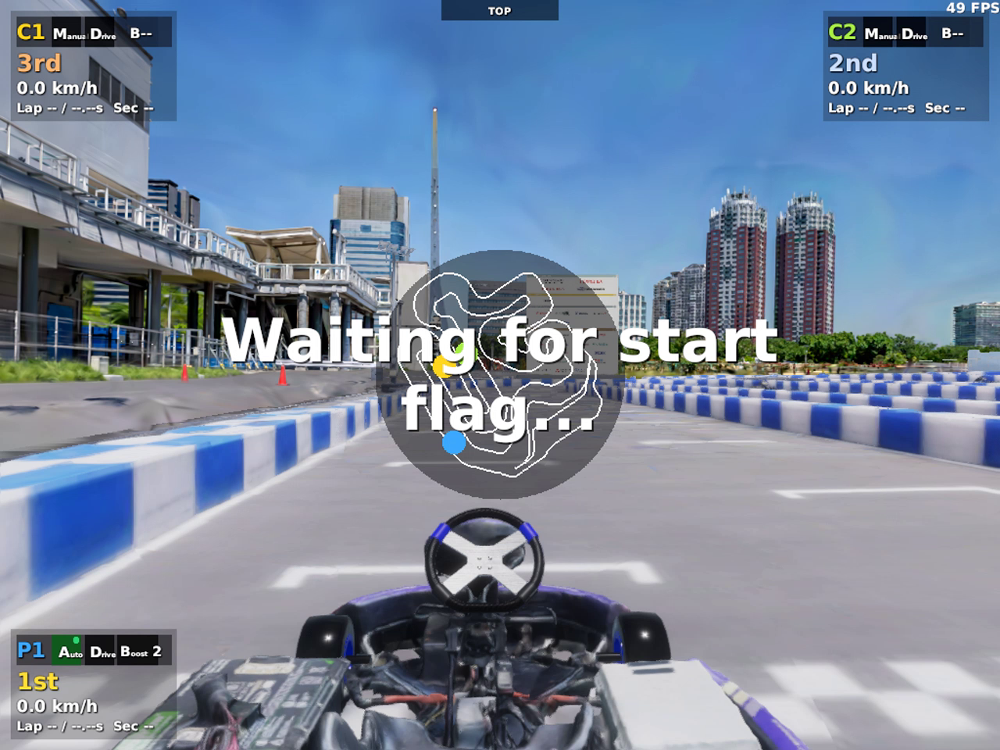
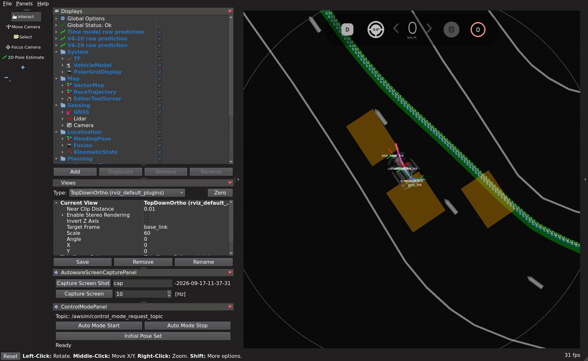

# NPC 2台を追加したTimePath試験（2026-09-17）

**結果: NPC 2台は生成されたが、自車発進前に公式Startの待機が時間切れになった。**
E2Eの走行許可と追従指令はいずれも0件であり、複数車両下の完走・回避性能は未評価。
実行先は `graneple@192.168.3.10`、run IDは `codex-time-npc2-lap01`。

## 条件と実行

実行source: `568633d94213b9fb3971dac2327adb86d5914e74`。
TimePath `launch_balanced` epoch 3、checkpoint SHA-256は
`1fe12ca066791d3eb8907c6921120e2cfbb38925c422d5be54940f4acbdd120a`。
全体上限20 km/h・コーナー上限10 km/h、近接領域の監視は従来の記録のみ設定。
センサ・経路の鮮度、指令競合、公式Start、停止確認の検査は維持した。

実行したコマンド:

```bash
ssh graneple@192.168.3.10
cd ~/e2e_autonomous/time_npc2_20260917
make dev MAX_SPEED_KMH=20 CORNER_MAX_SPEED_KMH=10 \
  TIME_NPCS=2 TIME_RECORD_VIDEO=1 TIME_RUN_ID=codex-time-npc2-lap01 DISPLAY=:0
```

既存run IDは再利用できない。再試行は原因解消後に新しいIDで行う。
追加した `TIME_NPCS` は0〜3を受け付け、AWSIMの既存 `--npcs` へ渡す。
NPCありでは車両同士の衝突判定を有効にし、生成数と `racing-line` モードを
実際のUnityログで確認してから公式Startへ進む。自車のE2Eは1台だけ。

## 観測事実

|確認項目|結果|
|---|---|
|NPC生成|C1、C2の2台、`racing-line`|
|車両同士の衝突設定|`collisions=True`|
|`/awsim/state` publisher生成ログ|domain 1で3件|
|`/awsim/status` publisher生成ログ|domain 1で3件|
|Autoware初期化完了|false → true → 約0.52秒後にfalse|
|公式Start helper|初期化完了falseを観測し、20秒待機で終了|
|カメラ例外|`ArgumentNullException: texture`、426件|
|自車のARMEDイベント・追従指令|ともに0件|
|通常RViz|予測経路のsubscriberと画面表示を確認|
|所有コンテナ|全て終了、cleanup errorなし|

`host_result.json` の旧フィールド `official_start_requested=false` は、
公式Start helperの成功が未確認だったことを表す。この試行でもhelperコマンド自体は起動したが、
待機から先へ進まず、自車の `drive_authorized.json` は生成されていない。

例外のスタックは `CameraSensorHolder.RenderCamera` → `CameraSensor.DoRenderReal` →
`ComputeShader.SetTexture`。E2Eの予測は出ていたため、この例外だけを理由に
自車カメラ全体が停止したとは断定しない。

## 原因の切り分け

使用中の `Assembly-CSharp.dll` は既存検証時と同じSHA-256
`859e5560dbffd7d0833cd1fe5eb1f36b87fa8d22f6e45eb0e1203d04a1ea6d13`。
対応する既存の逆コンパイル資料を読み取り、次を確認した。

- `NpcRuntimeManager` は自車テンプレートを複製してNPCを作る。
- `PrepareNpcRoot` はセンサや入力の一部を停止するが、`JudgeSystem` と
  `CameraSensorHolder` を除外していない。
- `JudgeSystem` は `Awake` からROS状態publisherを作り、車両名の番号を解決できない場合も
  domain 1に対応する番号1へ戻る。
- `CameraSensorHolder` は描画対象のGameObjectがactiveなら描画する。
  センサBehaviourの `enabled` を確認しない。

したがって、**NPCに複製された判定・カメラ処理が残り、自車の状態トピックへの混在と
描画例外を起こした可能性が高い。** 各DDS publisherのGIDとUnityオブジェクトを直接対応付けた
計測は未実施なので、publisherごとの帰属まで確定したとは扱わない。
初期化完了の解除を無視したり、Startの検査を緩めたりして走行は開始していない。

## AWSIMを変更しない代替案

ユーザーの「AWSIM自体は変更しない」という指定を維持する場合は、
内蔵NPCとは別の構成として、通常車両3台のうち自車1台をE2E、残り2台を既存Pure Pursuitで動かす。
ROS_DOMAIN_IDは自車1、背景車2・3で分ける。
これは代替構成の検討であり、まだ実装・走行済みではない。

次の検証が必要:

1. 各ドメインのセンサ、状態、指令の発行元と公式Startの初期化を確認する。
2. 背景車の速度上限、既存PPの設定、GPU・CPU負荷を停止状態で確認する。
3. 現行のUnity周回ログは車両名を含まないため、3台分を現在の単車用parserへ混ぜない。
   自車domainの公式状態・周回情報から判定できるようにする。
4. 全車両の終了を同じ有限試験runnerが管理し、自車1周まで評価する。

## 検証と保存

- native WSL、共有worktree lock下の全pytest: **2952 passed / 4 skipped**、145.06秒。
- 公式ROS環境でcolcon build成功、source/installの246ファイルを照合。
- 隔離ROS smokeとROS launch smokeは成功。これらは実走成功を意味しない。
- rawの52ファイル、30,241,764 bytesをWSLへ転送・SHA-256照合済み。
- AWSIM/RViz動画は20.5秒・21.0秒。全フレームdecode確認済みの**発進待機映像**。
- AWSIM全1089ファイルの前後SHA一致。既存Git差分、RViz設定、過去114コンテナ、39 composeを保全。

raw保存先:

```text
/home/thistle/e2e_autonomous/runs/time_npc2_20260917/raw/codex-time-npc2-lap01
```

小さな検証結果は [evidence manifest](evidence/time_npc2_20260917/manifest.json)、
[起動解析](evidence/time_npc2_20260917/startup_analysis.json) に保存。




