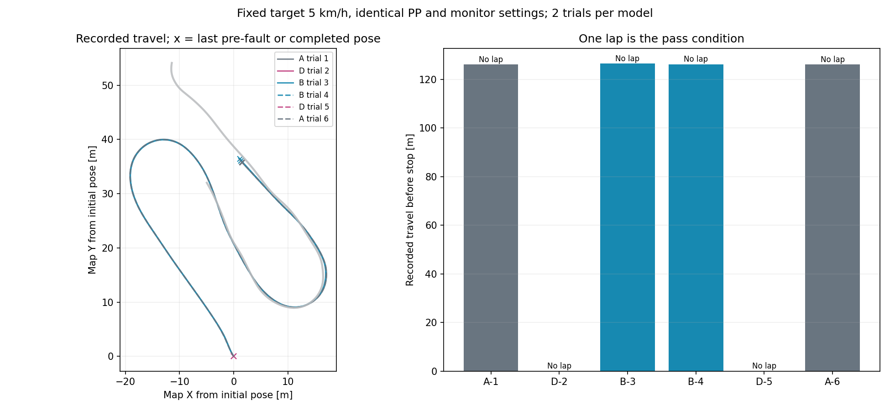

# 学習方法を変更したモデルのAWSIM走行比較（2026-09-15）

## 固定した比較計画

実行先は `graneple@192.168.3.10`、解析・評価はnative WSLとする。
目標速度5 km/h、Pure Pursuit、操舵応答補償、停止領域監視、シーン、通常RVizへのE2E生経路表示を共通にする。
合格条件は公式JudgeLogによる1周完走と、その後の停止確認。オフライン誤差の改善だけでは合格にしない。

比較対象は同じ初期重み・更新数で学習した次の3モデル。制御設定の差分はcheckpoint SHA-256だけとする。

|記号|モデル|変更点|
|---|---|---|
|A|uniform_l1|現行モデル|
|B|balanced_l1|外向き復帰状態の提示配分を増加|
|D|balanced_geometry|提示配分と復帰軌道の損失を変更|

実行順は **A, D, B, B, D, A**。各2回で順序を反転し、各試行を初期状態から開始する。
各試行は1周、既存の停止条件、走行600秒、外側720秒のいずれかまで。
これは6試行の限定比較であり、再現性や一般化を十分に推定する母数ではない。
モデルの監視停止は結果として記録し、インフラ不具合・後片付け失敗があれば原因確認まで次の試行を開始しない。
失敗後の制御調整、追加学習、旧評価データの訓練への混入はこの比較に含めない。

機械可読計画: `configs/control/time_objective_driving_comparison_20260915.json`。
各モデルのオフライン比較は `docs/time_recovery_objective_comparison_20260915.md` を参照。

## データ収集案を決める観点

既存の厳密な外向き状態は学習35点/11 run、検証12点/3 run。
ランダム外乱の成功収集は2 run/6イベントで、復帰教師516点のうち厳密な外向き状態は13点。
データ容量や連続フレーム数よりも、独立したイベント・runと、左右・コーナー位相・ずれ状態の広がりが課題となる。

走行比較後、通常走行のどの位置・向きから復帰予測が不足したかを確認し、採取範囲を具体化する。
ずれた位置でのCamera/LiDAR/ego履歴と、その状態から教師が戻す連続3秒の実測軌道を組にする。
左右対称の外乱、コーナー入口/中間/出口、直線を分け、run・seed単位でtrain/validationを事前固定する。
今回の走行比較ログは評価用として保持する。収集の実施は次の作業として扱う。

## 実行・評価コマンド

各専用deploymentで既存ランナーを使用する。

```bash
python3 <deployment>/source_<sha>/tools/run_time_path_awsim_trial.py \
  --deployment <deployment> --run-id <run_id> --display :0 --config <model_config>

cd /home/thistle/e2e_autonomous/e2e_lite_transfuser
tools/with_wsl_training_lock.sh env PYTHONPATH=src .venv/bin/python -m pytest -q
tools/with_wsl_training_lock.sh env PYTHONPATH=src .venv/bin/python \
  tools/evaluate_time_awsim_trial.py --run <verified_raw_run> --output <evaluation>
```

## 結果

**通常条件6本はいずれも未完走。A/Bは同じ区間の停止領域監視、Dは発進時のPP不成立だった。**
source `49740ea029dac744b3895a60eadb43e29d42cf06` を3専用deploymentに配置し、各2本を実施した。

|順序/run末尾|モデル|初回監視または終了までの秒数|記録位置の移動距離|結果|
|---|---|---:|---:|---|
|a-01|A|99.950|126.080m|停止領域監視、未完走|
|d-02|D|5.205|0.00026m|発進できず進捗停止、停止確認あり|
|b-03|B|100.650|126.515m|停止領域監視、未完走|
|b-04|B|100.095|126.262m|停止領域監視、未完走|
|d-05|D|5.250|0.00024m|発進できず進捗停止、停止確認あり|
|a-06|A|100.060|126.157m|停止領域監視、未完走|

run IDの共通接頭辞は `codex-time-obj-`。時刻はARMED後、距離は初回監視までの保存poseの折線長でありコース進捗率ではない。
Dの微小距離は停止中の数値変動。A/Bの実測速度中央値は4.616〜4.618km/h、目標は5km/hで共通。
6本の初期位置の最大差は0.0000216m。plan age中央値は0.205〜0.210秒で、上限違反を除外して隠してはいない。
B-03には単発の `PLAN_STALE` とPP不成立、A-06には単発の `PLAN_STALE` と `STALE_scan` も記録されたが、最終停止理由はいずれも `STOPPING_SWEEP_OCCUPIED`。

Dは全発行104/105件で `STEERING_FEASIBLE_LOOKAHEAD_MISSING`。現在の1〜2mの先読み範囲で、タイヤ角上限0.3radを満たす点を選べなかった。
障害物監視による停止ではない。生軌道の旧fold判定と現行の解決処理を混同しない。
全6本で保存したPP/操舵応答/車両運動の再生評価はPASS。監視停止したA/Bはrunnerがシミュレータをfreezeするため、自然に制動して停止し切ったという確認にはならない。



## 正常教師線・予測・追従の切り分け

同じAWSIM資産・速度条件で完走した正常教師r30/r31の実測Odometryを参照した。元bag/制御/結果をhash照合し、制御poseとの一致も確認した。
参照範囲はコース進捗55〜142mであり、道路中心の真値でも全教師データの代表性の保証でもない。重複stamp、未来が初回監視以降となる点、予測進捗範囲外は理由を残して除外した。

|試行|末尾車体の正常線からの左ずれ（r30）|末尾予測3秒点の左ずれ|末尾10秒・1秒後の追従残差中央値|同じ点の予測線ずれ中央値|
|---|---:|---:|---:|---:|
|A-01|80.73cm|68.68cm|0.381cm|40.03cm|
|B-03|69.66cm|49.93cm|0.342cm|38.93cm|
|B-04|74.24cm|56.73cm|0.319cm|40.68cm|
|A-06|79.05cm|65.33cm|0.342cm|39.91cm|

追従残差と予測線ずれは、1秒後の実位置と同じコース進捗で幾何的に分解した値。物理真値の精度や、固定した軌道を1秒間開ループで追従した実験を意味しない。
r31でも末尾左ずれは69.57〜80.66cm、追従残差中央値0.330〜0.356cm、予測線ずれ38.96〜40.70cmで同じ傾向だった。
Bの3秒先はAより正常線に近いが、2試行ずつでは改善の確証とせず、完走の改善も認められなかった。
この局所分解では、車体が予測から大きく外れるより、予測自体が正常線から離れた場所に残る寄与が大きい。初期の小さな制御誤差や閉ループ累積が無関係だという因果証明ではない。

## 発進データの学習状況

同じ学習cacheの入力・教師・anchorをhash照合し、入力有効、未来30点有効、現在速度絶対値0.1m/s未満、教師3秒点の変位1m超を抽出した。
trainは **162点/12 run**、validationは **53点/4 run**。発進場面が存在しないという説明は成り立たない。

この215点にFP32・batch16で各モデルを推論し、plan age=0の同一PP計算へ通した。

|対象|train PP成立|validation PP成立|validationの3秒先前進成分MAE|
|---|---:|---:|---:|
|実測教師|162/162|53/53|—|
|A|10/162|2/53|1.670m|
|B|10/162|2/53|1.672m|
|D|10/162|2/53|1.669m|

残る152/51点は各モデルとも `STEERING_FEASIBLE_LOOKAHEAD_MISSING`。trainの3秒先前進MAEも1.631〜1.635mだった。
この抽出条件は停止中から間もなく発進する場面を含む。観測にない未来の発進時刻を一意に推定できるか、発進・停止例が同じ入力状態に混在していないかも点検が必要。
少数場面の提示不足だけを原因と断定しない。このoffline母集団では3モデル共通の弱さであり、AWSIM初期場面でDだけが発進できなかった差の説明を、この集計だけで確定しない。
回復用損失を変更したモデルを採用する前に、通常走行・発進のPP成立率を独立した回帰評価に入れる。

## 教師が攻めた経路を走るという仮説

この仮説を新しい教師線の余裕確認に含める。ただし今回A/Bは、同条件で完走した正常教師線より約70〜81cm左へ離れて止まっており、教師線を忠実に再現した結果だけでは説明できない。
以前の実学習教師6周＋検証2周の局所監査では、共通速度へ正規化した教師→PP→監視が2,110/2,110点で成立、最小ray余裕は17.78cmだった。
これは別の旧停止事例・限定区間・当時のPP設定による既存結果で、今回の全周や現行設定の再評価ではない。
詳細と環境差は [教師余裕比較](time_teacher_clearance_comparison_20260913.md) に残す。
「全教師の路端余裕は十分」とも「教師を中央寄りにするだけで直る」とも結論しない。

ユーザーの追加指示による監視余裕を縮めたAの1走行は、**127.113mで未完走**。通常Aより約1m進んで同じ監視となった。
これは通常6本と区別した [限定診断](time_near_limit_diagnostic_20260915.md) であり、標準設定は維持する。
不足状態と採取方法は [次のデータ収集案](time_recovery_collection_plan_after_comparison_20260915.md) に具体化した。

## 実装検証・保存・環境復元

source `49740ea` の全pytestは **2525 passed / 4 skipped / 74 warnings、97.69秒**。metadata exportの重点16テストも成功。
3 deploymentの公式ROS smokeがPASS、checkpoint/source/installed Pythonのhashを照合した。通常RVizの `Time model raw prediction` に `/visualization/time_path/raw_path` を表示した。
[実画面](evidence/time_objective_driving_comparison_20260915/live_visual/rviz.png) は保存XWDからWSLで形式変換し、目視確認した。画面のRaceTrajectoryの長い緑線はE2Eの3秒生軌道とは別表示。

全6本の原本・転送archive・manifestと評価はnative WSLの `runs/time_objective_driving_comparison_20260915_r2/` に保持。
Windowsには小さいJSON/ログ/図だけを [evidence](evidence/time_objective_driving_comparison_20260915/) へhash照合して保存した。
二度目の起動でできたrun内部の `latest` 便宜リンクは元を保全し、転送時だけリンクを省いて実体ファイルを収録、対応を `archive_aliases.json` に記録した。
全試行後に既存114コンテナ・39 compose project、リモートrepoのHEAD/作業差分/RViz設定の保全と、実行中コンテナ0を確認した。
大きなraw、bag、重みはGitへ追加していない。sealed test本体、新規学習、新規教師収集は実施していない。

実行した分析・抽出スクリプトの写しはevidence内 `reproduce/`。既存出力を上書きしないため、再実行では新規出力先を指定した写しを使い、次のwrapperを通す。

```bash
tools/with_wsl_training_lock.sh env PYTHONPATH=src .venv/bin/python <analysis_script_with_fresh_output.py>
```

## 走行前に検出・修正した保存メタデータ不具合

初回source `fa426a3` のROS smokeでDが `TEACHER_RUNTIME_CONTRACT_MISMATCH` を報告し、AWSIM開始前に停止した。
比較学習の保存処理で `teacher_manifest.contract` の転記が欠けていた。元キャッシュには正しい30点・0.1秒・観測時base_link・50ms確定の契約があり、保存処理へ転記を追加した。
runtime側の拒否条件、モデル構造、推論処理、PP・安全監視は変更していない。

既存B/Dは元ファイルを保全し、`tools/export_time_recovery_runtime_checkpoint.py` で元キャッシュhash・split・入力設定と結び付けた別ファイルへexportした。
学習キャッシュ13,637,154,115 bytesを全hash照合し、全215 model state entryの一致と、各モデル12個の既存検証入力（正常11・復帰1）でCUDA推論の完全一致（最大差0m）を確認した。再学習は行っていない。
元の学習checkpoint SHAとexport SHAは比較計画内に両方残す。新規export回帰テストを含む重点テスト16件が成功した。
初回のROS失敗記録とテストのimport修正履歴は保全し、初回deploymentを上書きせず `_r2` の専用環境へ配置する。走行の順序・回数は変更しない。

```bash
tools/with_wsl_training_lock.sh env PYTHONPATH=src .venv/bin/python \
  tools/export_time_recovery_runtime_checkpoint.py \
  --checkpoint <original_best.pt> --checkpoint-sha256 <original_sha256> \
  --cache /home/thistle/e2e_autonomous/datasets/cache/time_recovery_random_update_20260915 \
  --output <fresh_runtime.pt>
```
