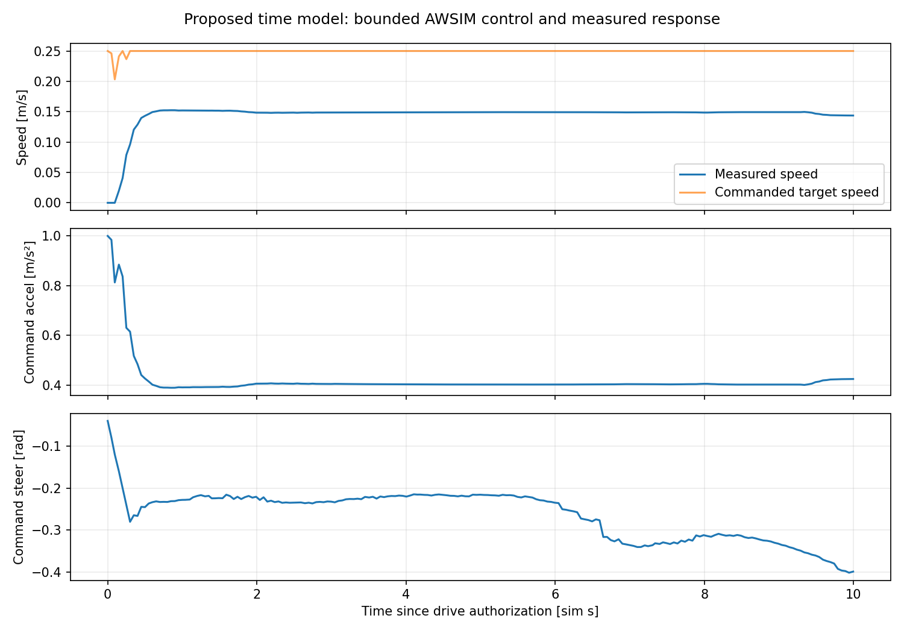
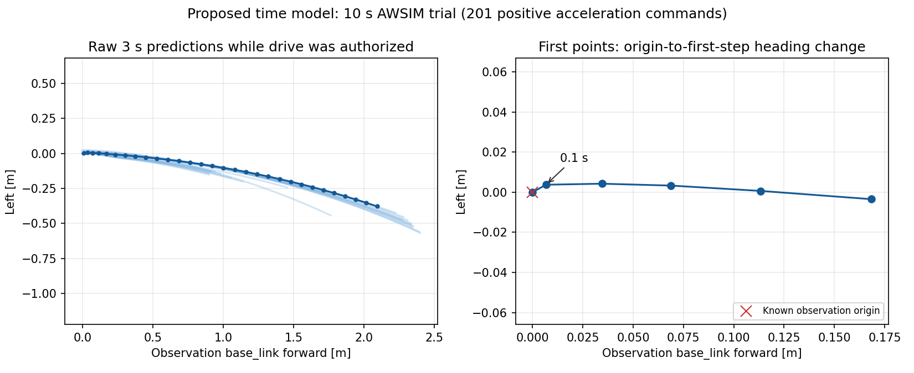

# 原点付近の時間経路の判定修正

形状判定を修正し、同じcheckpointでAWSIM再試験を実施した。
**10秒間の全201指令で経路追従を継続し、実測poseに基づき1.460 m移動した。終了時の実測停止も確認済み。**
これは発進と短距離のモデル経路追従の確認であり、周回・コーナー・回避の合格ではない。

## 作業範囲と開始状態

ユーザーは、先頭点の予測精度と短区間の折り返し判定の切り分け、修正、AWSIM再試験を指示した。
Windows正本で編集・コミットし、native WSLで教師・予測の解析とテストを行う。
AWSIM実行先は `graneple@192.168.3.10`。既存資産・試行は保持し、専用配布先と未使用run IDを使う。

開始commitは `250a02b9053835bb0a90b3c87111223cdfae85a7`。
前回の [trial03](time_path_ros_awsim_20260913.md) は公式Start後、201指令すべて
`TIME_PATH_FOLDBACK` で制動。認可中90経路すべてで、原点から0.1秒先への短い区間が方向差判定に掛かった。
今回の最初の確認対象は、教師にも同じ現象があるか、モデル誤差か、方向差の数値的な不安定性か。

## 変更の必要性と検証境界

- 目的は、停止・微速の位置誤差と意味のある後退・折り返しを区別して経路採否を判断すること。
- 所有箇所は純粋数学の時間経路検証と、その判断を記録するROS接続。モデル重みは最初に固定して原因を分ける。
- frameは観測時のbase_link、単位m/rad/s、30点・0.1秒刻み。生予測を変更・切捨てしない。
- センサ期限、時計、publisher同一性、停止距離、操舵・加速度上限、10秒試行と実測停止確認を維持。
- 修正前にtrain/validation教師と既存float32予測を監査する。test splitは使わない。
- 実数値、微速直線・旋回・停止、逆行・折り返し・大きな横跳び・NaNを回帰テストする。
- 受理率だけを合格指標にせず、不正形状拒否と有限AWSIMでの実測動作を確認する。
- 専用installで配布し、プロセス停止と旧install選択で戻せる。remote push、既存データ削除、実機操作は対象外。

## 現在の状態

監査 `a0cf1b5` で、使用した48小ファイルのhashを確認した。
full教師と有効入力を持つtrain 35,358件・validation 11,780件の教師には旧判定の折り返し0件。
validationの停止中251件は、予測が全件旧判定に掛かり、先頭誤差中央値0.02267 m。
微速0.03～0.25 m/sはtrain 26件・validation 8件と少なく、推論環境だけの問題ではない。
初回監査はWSL `runs/time_origin_guard_20260913/audit_initial.json` に保存。

## 判定修正の方針

時間出力30点と0.1秒刻みは維持する。形状検査に限り、0.25 m以上の位置差で方向を求める。
全raw点（原点含む31点）の弦からのずれと後退量を確認する。
位置budget 0.03 m、既存wheelbase 1.087 m・最大操舵0.5 radから求める曲率を用い、
初期方向と弦間の旋回角も確認する。短い末尾・0.25 mに達しない経路も確認し、
移動方向を判別できない予測は発進を許可しない。

0.03 mは今回の有限低速試験の明示的な幾何許容値であり、校正済みのセンサ誤差や安全性の保証ではない。
独立validationで停止中の先頭誤差最大0.02577 m、全件のp99 0.02278 mを観測したため、
従来の1 cm角度判定に対する原因修正として検証する。形状が基準内でも停止距離・操舵可否などを通らなければ制動する。
生点は表示にも制御にもそのまま使い、検査用の弦を実行経路として使用しない。

ROSログは、採否にかかわらず確認できたplan ID・観測pose・現在poseを残すようにし、
旧試行で欠けていた拒否判断の再現情報を保存する。重み・速度制御・センサ安全監視は変更しない。

## 再試験の準備結果

- 検証対象code `1962e8f4f96dc2ba1b459edfe34c0902987a2309`。
- WSL対象テスト50 passed、全体2,051 passed / 4 skipped / 63 warnings（127.35秒）。
- 新判定で旧trial03の認可期間90経路を全件RESOLVEDと判定。これは過去ログの再評価で、走行成功の証拠ではない。
- 全35,358 train / 11,780 validation教師を再評価し、移動中の教師を拒否する新しい幾何理由は0件。
  3秒の移動量が判別閾値未満の静止・発進前の教師は停止扱いになる。
- Humble: 実checkpoint Path一致6件、合成shadow正指令110件、plan失効brake11件、時計停止brake7件、vehicle publisher 0、両child exit 0。
- 専用host root `/home/graneple/e2e_autonomous/time_origin_guard_20260913` にcolcon build済み。
  変更moduleと推論node計4ファイルのsource/install hash一致、GPU CUDA確認済み。
- source archive SHA-256 `fac3b7b2b84d5ed17f5acdc4fea8e11c917f22543b6870e288b141c3a8237d41`。
  checkpointは前回と同じSHA `e857db4b67d3d9f6a77c2865cfc1fa53e9903e7a1d2d8a371407fbe009a1a44f`。

## AWSIM trial04の結果

実行ID `codex-time-trial-04`、10 sim秒・上限0.25 m/s・外側120 wall秒。
公式Start受理から終了時停止まで完了し、所有コンテナを終了した。

| 項目 | trial03（修正前） | trial04（修正後） |
|---|---:|---:|
| checkpoint | command OFF epoch10 | 同一SHA |
| 認可中の制御指令 | 201 | 201 |
| 正の加速指令 | 0 | 201 |
| 制御理由 | FOLDBACK 201件 | TRACKING 201件 |
| 最大実測速度[m/s] | 0.000180 | 0.152521 |
| 認可期間のpose移動距離[m] | pose記録なし | 1.460173 |
| 最初と最後のpose間距離[m] | pose記録なし | 1.457524 |
| 全予測件数 | 244 | 247 |
| 認可期間を観測時刻に含む予測 | 90 | 89 |
| 実測停止確認 | 完了 | 完了 |

trial04の89経路は全件新形状判定でRESOLVED。実指令にも `distance_resolved_time_geometry_v2` を記録した。
旧角度判定を後から適用すると2件で折り返し判定になる。動き出して入力状態が変わったため、
この2/89と前回90/90の差をモデル精度の改善とは扱わない。重み・学習は変更していない。

試行時間54.565 wall秒、入力欠損による推論拒否3件、推論故障なし、cleanup errorなし。
推論時間は中央値51.40 ms、p95 102.33 ms。50 ms入力確定待ちや制御までの総遅延は含まない。





元の30点・時刻・frameは維持し、検査用の弦を実行経路へ置き換えていない。
通常RViz設定のSHAは前回と同じ `8fb4dcf17ff1278ff4aa58a48728ba9f86b978400ebab5a234b02be65aba9a01`。

## 残る課題

- 先頭点の誤差そのものは未改善。今回修正したのは小さな位置誤差に対する形状判定であり、再学習はしていない。
- 微速0.03～0.25 m/sの支持教師はtrain 26件・validation 8件。継続微速走行や発進条件の多様性が不足している可能性が高い。
- 目標速度0.25 m/sに対し実測は約0.15 m/sに留まる。速度制御側の定常的な差の原因は今回未切分け。
- 独立した停止意図の学習・stop probabilityはB0の対象外。形状の受理は発進意図の正しさを証明しない。
- 1回・10秒の初期区間。車線横偏差、接触なしの全車体証明、周回、コーナー、回避は未評価。

## 証跡と再実行

[初回監査](evidence/time_origin_guard_20260913/audit_initial.json)、
[修正後の教師・固定予測監査](evidence/time_origin_guard_20260913/audit_resolved_f1fa361.json)、
[全体テスト](evidence/time_origin_guard_20260913/full_1962e8f.log)、
[Humble接続](evidence/time_origin_guard_20260913/humble_smoke_summary.json)、
[実行install同一性](evidence/time_origin_guard_20260913/installed_identity.json)、
[AWSIMホスト結果](evidence/time_origin_guard_20260913/host_result.json)、
[WSL評価](evidence/time_origin_guard_20260913/summary.json)を保存した。
生の20記録ファイルは[転送照合](evidence/time_origin_guard_20260913/trial04_transfer_verification.json)済み。

host rootは `/home/graneple/e2e_autonomous/time_origin_guard_20260913`。
WSL rootは `/home/thistle/e2e_autonomous/runs/time_origin_guard_20260913`。
元記録は各rootの `codex-time-trial-04/`。大きいcheckpointや生ログarchiveはGitに追加していない。
Git push、既存データ削除、ホストdriver変更は実施していない。

```powershell
# Windowsで変更をコミットしてから実行
.\tools\sync_to_wsl.ps1 -CheckOnly
.\tools\sync_to_wsl.ps1
```

```bash
# native WSL。outputは未使用名にする
cd /home/thistle/e2e_autonomous/e2e_lite_transfuser
bash tools/with_wsl_training_lock.sh env PYTHONPATH=src .venv/bin/python -m pytest -q
bash tools/with_wsl_training_lock.sh env PYTHONPATH=src .venv/bin/python tools/audit_time_origin.py \
  --cache /home/thistle/e2e_autonomous/datasets/cache/time_training_20260913_v2 \
  --predictions /home/thistle/e2e_autonomous/runs/time_p1_training_evidence_20260913/float32/command_off_predictions.npy \
  --output /home/thistle/e2e_autonomous/runs/time_origin_guard_20260913/audit_repeat.json
bash tools/with_wsl_training_lock.sh env PYTHONPATH=src .venv/bin/python tools/evaluate_time_awsim_trial.py \
  --run /home/thistle/e2e_autonomous/runs/time_origin_guard_20260913/codex-time-trial-04 \
  --output /home/thistle/e2e_autonomous/runs/time_origin_guard_20260913/evaluation04_replay
```

```bash
# 指定hostで使用したコマンド。既存run IDは再利用不可
deploy=/home/graneple/e2e_autonomous/time_origin_guard_20260913
timeout --signal=TERM --kill-after=10s 110s python3 \
  "$deploy/source_1962e8f/tools/run_time_path_awsim_trial.py" \
  --deployment "$deploy" --run-id codex-time-trial-04 --display :1
```
