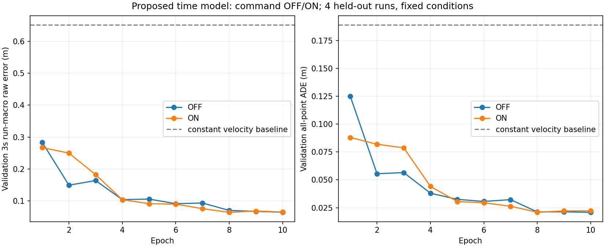

# 時間基準モデルの初回実データ学習

2026-09-13のユーザー指示により、検証・分割済み20周コーパスでcommand OFF/ONを各10epoch学習し、完了した。
重みはscratch、seed42、同じ初期tensor・epochごとの提示順。
train12周36,726アンカー（支持35,360件）、validation4周12,237アンカーを使い、test4周は学習/モデル選定から隔離する。

## 結果

以下はBF16でのモデル選定結果。各horizonは4周を等重みで平均した位置誤差[m]、ADEは全有効点をまとめたEuclidean平均[m]。
同一コース・同条件の別周回であり、未知コースへの汎化やAWSIMの追従性能を示す値ではない。

| 入力 | 選択epoch | 0.5秒 | 1秒 | 2秒 | 3秒 | 全点ADE |
|---|---:|---:|---:|---:|---:|---:|
| 過去指令OFF | 10 | 0.008856 | 0.012142 | 0.026062 | 0.064843 | 0.020854 |
| 過去指令ON | 8 | 0.011378 | 0.012836 | 0.026691 | 0.064459 | 0.020981 |
| 現在実測速度を保つ直線予測 | — | 0.014597 | 0.063372 | 0.282187 | 0.650788 | 0.188899 |

3秒誤差の数値上の最良はONだが、OFFとの差は約0.000384m（0.384mm）。1 seed・4周の比較で優位性を断定しない。
最終epochを自動採用せず、事前指定したvalidation run-macro 3秒誤差の最小epochを選択した。

### 選択済み重みのfloat32再評価

BF16で選んだOFF epoch10 / ON epoch8の重みを固定し、同じvalidation全件をfloat32で再評価した。
追加学習、epochの選び直し、test split評価はしていない。TF32は無効。

| 入力 | 3秒先run-macro誤差[m] | 全点ADE[m] |
|---|---:|---:|
| 過去指令OFF | 0.063942 | 0.019848 |
| 過去指令ON | 0.074370 | 0.025027 |

float32ではOFFが小さい。**最初のruntime/shadow接続候補はOFF**とする。
根拠は、この設定での誤差と、過去送出指令への入力依存が少ないこと。実走行での優位性は未検証。
ONはBF16からfloat32への変更で3秒誤差が約0.00991m増えたため、精度設定を省略して両者を同一結果として扱わない。
当初のBF16選定結果`comparison.json`は保全し、再評価は別の[float32結果](evidence/time_path_p1_training_20260913/float32/summary.json)へ保存した。

### 母数・検証

- 各armの更新11,480回、提示367,260件、支持教師353,600件。各epochの入力欠損158件と、入力有効だが教師支持なし1,208件も提示母数に残した。
- 初期tensor SHA、全10epochの提示順SHA、学習設定・更新数・支持数がOFF/ONで一致。config差は`use_command_history`だけ。
- validation母数12,237件、各horizonの教師支持11,822件、誤差計算可能11,780件（96.2654%）。4/4周に支持あり。
- validation入力欠損45件、入力有効時の不正予測0件、不正な有効教師0件。定速baselineとの誤差計算対象も同じ11,780件。
- `accepted_*`はoffline選択flagに基づく値で、Safety Supervisorの採用率や実走行安全性を表さない。
- 両方のbest checkpointをCUDAで再ロードし、全validation予測が保存epochと完全一致した。
- 学習・各epoch検証・best再読込検証を含む時間はOFF 5,882.51秒、ON 5,833.27秒、合計約195.3分。
- report CLIが完了epoch数、有限予算、teacher identity、選択epoch、保存/再読込metricsを再照合。最終コード`de164a5`のWSL `pytest -q`は **2,001 passed / 4 skipped / 63 warnings**（79.28秒）。



小さい証跡は[比較結果](evidence/time_path_p1_training_20260913/comparison.json)、
[hashと母数の照合結果](evidence/time_path_p1_training_20260913/bf16_summary.json)、
[全体テストログ](evidence/time_path_p1_training_20260913/full_de164a5.log)に保存した。
WSLから複製した22ファイル・567,634 bytesは、[転送元一覧](evidence/time_path_p1_training_20260913/source_files.json)のSHA-256とサイズに全件一致した（[検証結果](evidence/time_path_p1_training_20260913/transfer_verification.json)）。
モデル重み・cache・raw bagをGitへ追加していない。

## 保存した重み

保存先はnative WSLの`/home/thistle/e2e_autonomous/runs/time_p1_20laps_20260913/`。
各armに`best.pt`、再開用`last.pt`、初期`initial.pt`、全epochのmetrics/予測、identity/plan/historyがある。

| ファイル（上記保存先から相対） | SHA-256 |
|---|---|
| `command_off/best.pt` | `e857db4b67d3d9f6a77c2865cfc1fa53e9903e7a1d2d8a371407fbe009a1a44f` |
| `command_on/best.pt` | `e1ab142e7dbbf5593cb01778e2da94f1fe5ba80539d40a62ad38cb2dfd0ca8a4` |

teacher manifestのcanonical JSONによるidentity SHAは`09d0073d1e8216aae7824efefb9094147d658ff746ae89911b5ace531244e021`。転送元一覧のファイルバイト列のSHAとは区別する。
両armの初期tensor SHAは`9ee60335ab543451143c6a3005d026753713724e189c4df5058b0a1d9cdf6d9a`。

## 学習条件

- TimePathV1 B0、未来3秒・0.1秒刻み30XY点、`base_link_at_observation`。
- Camera4時刻、LiDAR4時刻、ego10時刻、過去送出指令10時刻（OFF/ONで有無のみ切替）。
- 画像受信後50msの入力確定条件、run/epoch・到着cut・教師maskを固定する。
- batch32、AdamW lr=0.0003 / weight_decay=0.0001、勾配norm上限1.0。
- 有効点平均→支持アンカー平均のL1[m]。入力欠損も提示数に含める。支持0ではoptimizer/schedulerを進めない。
- cosine LR（最小lrは初期の0.1倍）、最大11,480 optimizer更新/arm、最大367,260提示/arm。
- CUDA BF16 forward、重み・損失はfloat32。GradScalerなし。TF32無効、cuDNN benchmark無効・deterministic有効。
- 250更新ごと・epoch境界に再開checkpoint。optimizer/scheduler/RNG、epochの提示順hash/cursor、入力契約・教師/source identityを保存する。
- validationのrun-macro 3秒位置誤差でbestを選び、全点ADE・0.5/1/2/3秒誤差・worst run・支持数・欠損分母を併記。
- ゼロ移動/実測定速baselineを同じ条件で評価する。最終bestを再ロードし、保存時のvalidation予測と全件一致を検証する。

epoch内の順序はseedとepochから固定する。train内の順序変更であり、frameランダムsplitではない。
同コース・同条件のrun holdoutで、未知コースの汎化やAWSIM追従を証明する評価ではない。
B0は停止意図/stop probabilityを学習しない。実推論側への50ms契約接続とcontroller座標変換は後続。

## キャッシュ

原本bagと教師/参照ファイルのhashを再確認してから、train/validationだけをキャッシュする。
画像はPillowの同じBILINEAR処理で一度だけresizeしたRGB uint8、LiDARは共通range/validity前処理のfloat32。
同じ画像を履歴ごとに複製せずmemory mapで読む。欠損履歴は正規化後のゼロで保持する。
小さいego/command/timing配列は共通入力関数で組み立て、各runの実センサ再構成と全tensor一致を確認する。
予期しない入力除外や既存監査との採否不一致は失敗として停止し、`.partial`を保全する。

## Windows / WSL

編集・コミットはWindows、実行はnative WSL checkoutと共有lock経由。大きなcache/重みはWSLのF:側に保存する。

```powershell
.\tools\sync_to_wsl.ps1 -CheckOnly
.\tools\sync_to_wsl.ps1
```

```bash
cd /home/thistle/e2e_autonomous/e2e_lite_transfuser
bash tools/with_wsl_training_lock.sh env PYTHONPATH=src .venv/bin/python -m pytest -q \
  tests/test_time_training_cache_v1.py tests/test_time_batched_evaluation_v1.py \
  tests/test_time_corpus_runner_v1.py tests/test_time_checkpoint_p1.py tests/test_time_pipeline_p1.py
bash tools/with_wsl_training_lock.sh env PYTHONPATH=src .venv/bin/python -m pytest -q
bash tools/with_wsl_training_lock.sh env PYTHONPATH=src OMP_NUM_THREADS=4 MKL_NUM_THREADS=4 \
  .venv/bin/python -u tools/train_time_corpus.py prepare-cache \
  --corpus ../datasets/processed/time_teacher_20laps_20260913 \
  --cache ../datasets/cache/time_training_20260913_v2
bash tools/with_wsl_training_lock.sh env PYTHONPATH=src OMP_NUM_THREADS=4 MKL_NUM_THREADS=4 \
  .venv/bin/python -u tools/train_time_corpus.py train \
  --corpus ../datasets/processed/time_teacher_20laps_20260913 \
  --cache ../datasets/cache/time_training_20260913_v2 \
  --output ../runs/time_p1_20laps_20260913 --epochs 10 --batch-size 32 --workers 4 --precision bf16
```

中断時は同じコマンドに`--resume`を付ける。既存の予算・config・source identityが違えば拒否する。
各armの`status.json`、`history.json`、`last.pt`、`best.pt`、`best_validation.json`と、両arm終了後の`comparison.json`を確認する。

完了したrunの集計と、選択済みbest重みだけのprecision再評価は次のコマンドで再現できる。
出力名は未使用のものを指定する。モデル再学習・epoch再選択・test split評価は行わない。

```bash
bash tools/with_wsl_training_lock.sh env PYTHONPATH=src .venv/bin/python \
  tools/report_time_training_run.py --run ../runs/time_p1_20laps_20260913 \
  --output ../runs/time_p1_training_evidence_20260913/report
bash tools/with_wsl_training_lock.sh env PYTHONPATH=src OMP_NUM_THREADS=4 MKL_NUM_THREADS=4 \
  .venv/bin/python -u tools/evaluate_time_corpus_precision.py \
  --run ../runs/time_p1_20laps_20260913 --cache ../datasets/cache/time_training_20260913_v2 \
  --output ../runs/time_p1_training_evidence_20260913/float32 \
  --precision float32 --batch-size 32 --workers 4
```

## 事前GPU確認

WSLのPyTorch2.7.1+cu128、RTX4080 16GB。モデル12,251,426パラメータ。
合成入力のforward/backwardでは、FP32 batch32はwarm後約0.25秒・peak5.8GB、BF16 batch32は約0.16秒・peak3.0GB。
これはデータ読込・optimizer・検証を含まない事前計測であり、本学習速度ではない。

## 実行確認

- 学習コード: `2137dab87037636441587add6cfa36508db93696`。
- 学習開始前のコード`2137dab`でのWSL全体pytest: **1,987 passed / 4 skipped / 63 warnings**（75.19秒）。これは前段の実行結果であり、report/precision CLI追加後の最終再検証は上記`de164a5`の2,001 passed。
- CPU合成データの有限2epochを途中で中断し、optimizer/scheduler/RNG/cursor復元後の検証予測が連続実行と全件完全一致する回帰テストを実施済み。CUDA学習の中断再開完全一致を検証したという意味ではない。
- cache identity: `f8ac104391d7a7c483d53aa06fcf058bc06cc6a5a540c6b940d1b4db821f75f5`。
- train/validationの16周全件の採否照合と、各周2アンカーの実センサ再構成で全input tensorの完全一致を確認。
- 初回cacheは収録開始境界の除外理由不一致で停止した。`audit_anchor`の判定順を共通入力処理と揃えて回帰テストを追加した。
- 既存の固定corpusは保存し、cacheでは`5kmh_run09` / `8kmh_run10`の最初の各1アンカーに限り、旧`CURRENT_SENSOR_MISSING`と再生時`ANCHOR_OUTSIDE_EPOCH`を両方記録した。元のepoch bounds外・全履歴参照空・採用/usable falseを条件にした明示的な移行であり、教師・mask・採否・母数は不変。他の不一致は引き続きエラーにする。
- 初回の不完全cacheは`../datasets/cache/time_training_20260913.partial`に保全し、学習には完了済みの`time_training_20260913_v2`を使用する。

実行ログは`/home/thistle/e2e_autonomous/runs/time_p1_training_evidence_20260913/`、
学習結果は`/home/thistle/e2e_autonomous/runs/time_p1_20laps_20260913/`。
小さい結果証跡はWindows正本の`docs/evidence/time_path_p1_training_20260913/`にも保存した。

## 学習中に確認した旧V4データ

ユーザーは「今回の20周パックとは別の、V4-10/V4-20で使った旧データ」の再利用可否を質問した。
今回の固定OFF/ON比較は20周コーパスのtrain/validationだけで継続し、途中でデータを追加しない。

- `../datasets/d1log_0902_all_v3`: 11 run、旧形式48,946サンプル。
- `../datasets/recovery_20260904_v3`: 15 run、旧形式23,751サンプル。
- `../datasets/d1log_recovery_mixed_20260904_v3`: 上記の統合26 run、72,697サンプル。3セットを足して重複計上しない。
- `../datasets/raw/d1log_0902_all_v3/`にraw MCAP、`bag_inventory.json`、`bag_validation.json`、各runの`metadata.yaml`が残る。
- metadata上、Camera/LiDAR、`/localization/kinematic_state`のOdometry、velocity、`/clock`、control command/TFを確認。再教師化の材料は存在する。
- 旧`trajectory_path`だけから時間教師を作らず、rawの観測poseとclockから未来3秒を再構成する必要がある。receipt availability、50ms freeze、epoch、欠損・介入区間、split重複の監査は未実施。
- 旧形式のサンプル件数は、TimePathの採用可能件数を示さない。recovery全rawと公開データ`aic_real_dataset_v2`の時間教師への適合性も未確定。

## 実行テスト先

実データ学習・offline評価はnative WSLで実施した。ユーザー指定によりruntime/AWSIM実行テスト先は、`graneple@192.168.3.10` とする。今回のTimePath checkpointは既存V3 loaderと互換ではないため、専用の30点XY loader、因果4/4/10履歴、receipt＋50ms freeze契約が必要になる。

runtime/shadowへ進む前に、`base_link`からrear axleへの校正済み変換も確認する。これらの条件が揃った実行テストはまだ実施していない。

初回SSHはConnectTimeout 8秒でタイムアウトしたが、学習完了後の再確認では接続成功し、hostname=`graneple-local`、Ubuntu 22.04系/kernel `6.8.0-138-generic`を確認した。
実際のcheckoutは`/home/graneple/git/autononous_ai`（綴りに注意）、branch=`agent/gate2-v30-current-state`。
既存のAGENTS/docs/submodule変更があるdirty worktreeを保全し、コピー・変更・起動・pushはしていない。
読み取り確認時点ではAWSIM/ROS/RViz/学習・推論プロセスは見つからなかった。接続確認をruntime試験の完了とは扱わない。
