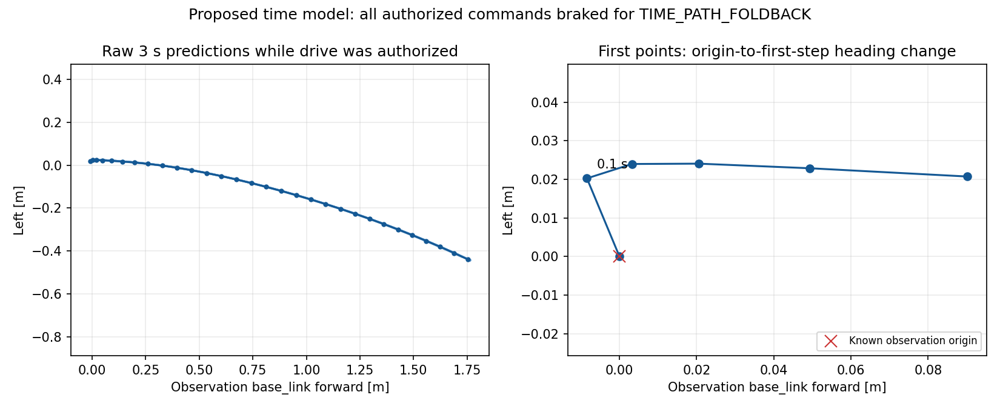

# 時間基準モデルのROS接続とAWSIM試験（2026-09-13）

指定先 `graneple@192.168.3.10` で、学習済み時間モデルのROS接続、公式Start、10 sim秒の走行認可、停止確認まで実施した。
**追従走行は未達。認可中201回すべてが `TIME_PATH_FOLDBACK` で制動し、正の加速指令は0回だった。**
手順完了を表す `COMPLETE_BOUNDED_TRIAL` は、追従性能の合格を意味しない。

Windows正本で編集・コミットし、native WSLでテスト・ログ評価した。AWSIM/ROS実行はユーザー指定ホスト。
既存のdirtyな `/home/graneple/git/autononous_ai` checkoutと過去試行を保全した。Git pushは実施していない。

## AWSIM結果

実行IDは `codex-time-trial-03`。提案モデルはTimePathV1 B0、過去送出指令OFF、epoch10の固定checkpoint。
float32・TF32無効で、未来3秒・0.1秒刻みの30 XY点を予測した。再学習や重みの選び直しはしていない。

| 確認項目 | 実測結果 |
|---|---:|
| 公式Start | 全vehicle domainの受理を確認 |
| 走行認可 | 最大10 sim秒、速度上限0.25 m/s |
| 生の予測経路 | 244件 |
| 認可期間に観測時刻を含む経路 | 90件 |
| 認可中の制御指令 | 201件、すべて `TIME_PATH_FOLDBACK` |
| 正の加速指令 | 0件 |
| 全試行の最大実測速度絶対値 | 0.000179831 m/s |
| 推論処理時間（244件） | 中央値50.84 ms、p95 95.00 ms、最大125.30 ms |
| 入力拒否 | 起動時 `CURRENT_SENSOR_MISSING` 2件 |
| 推論故障 | なし |
| 終了時停止 | 実測速度0.03 m/s未満が1 sim秒継続 |
| ホスト試行時間 | 54.29 wall秒 |
| 所有プロセス・コンテナの終了 | 完了、cleanup errorなし |

推論時間に50 ms入力確定待ち・配送・制御までの総遅延は含まない。
停止したままの単一初期場面であり、周回、コーナー追従、回避、停止意図の評価にはならない。
教師位置誤差や横偏差RMSEは算出していない。
[WSL評価](evidence/time_path_ros_awsim_20260913/summary.json)、[ホスト結果](evidence/time_path_ros_awsim_20260913/host_result.json)、[公式Startログ](evidence/time_path_ros_awsim_20260913/official_start.log)を保存した。
ホスト結果の `last_inference` は開始前snapshot（5件）。最終244件は `inference.jsonl` の集計値。

## 停止原因

原点を加えた予測列について、長さ0.01 m超の区間の隣接方向差が1.2 radを超えるとcontrollerは `TIME_PATH_FOLDBACK` を返す。
認可期間の90経路は全件、原点から最初の予測点へ向かう区間でこの条件に該当した。

- 0.1秒先の予測位置の中央値: 前後 **-0.007096 m**、左 **+0.021093 m**。
- 最初の方向差: 最小1.546 rad、中央値1.578 rad、最大1.762 rad（閾値1.2 rad）。
- 生の0～0.3秒の折れ線長から求めた平均速度: 中央値0.1765 m/s。
- 3秒先の原点からの距離: 中央値1.8195 m。

直接の停止理由は、先頭の数cmの予測形状と方向差判定の組合せ。
ゼロ移動だけの出力やROS接続失敗による停止ではない。
短い区間は数mm～cmの位置誤差でも方向が大きく変わるため、先頭点の安定性と判定の適用条件を分けて評価する必要がある。
今回だけで学習データ不足を断定したり、遠方の経路が全面的に乱れたと結論したりはできない。



右図は原点からの区間を診断用に追加した。モデルの生出力30点は変更していない。
各観測のbase_link座標で重ねた図であり、地図上の走行軌跡ではない。
制御拒否行には採用plan IDが残らないため、201指令と90経路の厳密な一対一対応は未再現。
実指令の停止理由と全90経路の形状集計が一致することを確認した。
実数値1経路を[回帰fixture](../tests/fixtures/time_path/near_origin_foldback.json)として保存し、同じ停止理由と予測列の非改変をテストする。これは予測であり、正解教師ではない。

## ROS実装

既存V3 loaderは時間モデルcheckpointに非対応で、ROS履歴にも学習時の50 ms入力確定がなかった。
専用loaderと共通 `assemble_time_inputs` を使う入力バッファを追加した。

- Camera/LiDAR/実測速度/実測操舵のみをモデル入力とし、教師・map pose・将来情報を除外。
- camera受信時刻+50 msまでに到着した履歴を固定。推論は別workerで行う。
- captureはsim clock、到着はcallback入口のmonotonic clock。学習時のbag receipt proxyとの対応を明記し、前処理完了時刻と同一視しない。
- run/epoch、時計巻戻り、古いplan、センサ欠損、NaN、publisher同一性を確認。
- checkpoint SHA-256をload前に照合し、入力契約・shape・出力30点を検証。
- 生30点を `/visualization/time_path/raw_path` の標準 `nav_msgs/Path` で配信。headerは `base_link` と元の観測stamp。
- `/time_path/plan` にSHA・時刻・run/epoch・入力由来を添付。通常launchは推論のみ、controllerの既定出力はshadow。

通常Autoware RVizへ `Time model raw prediction` を追加し、既存表示・設定と変更前backupを保全した。
[通常RViz画面](evidence/time_path_ros_awsim_20260913/normal_rviz.png)で項目追加とGlobal Status OKを確認。
全コース表示なので数cmの先頭形状は上のWSL図で確認する。隔離Humble試験ではPath 6件と生XYが完全一致した。

制御は独立プロセスの50 ms wall watchdog。実commandにはAWSIM専用の明示的認可、唯一のpublisher、AWSIM consumer、実機device不在を確認する。
停止距離、sensor/plan期限、操舵角0.5 rad・角速度0.8 rad/s、加速度±1 m/s²、過速度0.45 m/sを監視。
走行は10 sim秒または30 wall秒で終了し、外側予算は120 wall秒。
制動・実測停止を確認後、所有AWSIMをfreezeしてからcontrollerとコンテナを終了する。
経路の切捨て・出力補正・停止判定の緩和・固定速度での強制発進はしていない。

## 接続障害の解消

NVIDIAの読込済みdriver `595.84` とlibrary `595.91` が不一致だった。
ユーザー許可後もSSHはsudo/対話認証で再起動できず、**ユーザーが画面側で再起動した**。
新boot IDは `89fc0b1b-6809-42c0-9a88-7ca1ebe23858`。
以降はdriver `595.91.07`、RTX 4060 Laptop GPU、Docker CUDA=Trueを確認した。

| 試行 | 結果と対応 |
|---|---|
| trial01 | desktop変更で `DISPLAY_AUTH_UNKNOWN`。AWSIM起動・駆動なし。Xorg `:1` と `/run/user/1000/gdm/Xauthority` を確認し、displayを明示する方式に修正。 |
| trial02 | 実入力から121経路生成。公式Start helperが `startup race-arm evidence did not become exact false` で停止し駆動認可なし。helperだけ別DDS設定だった。 |
| trial03 | simulator/autoware/autoware-command/sidecarのDDSを統一。公式Start・10秒試験・停止確認まで完了。予測形状拒否で走行未達。 |

試験専用Cyclone DDSはloopback、unicast peer、ParticipantIndex autoを明示した。
[Cyclone DDS公式設定資料](https://cyclonedds.io/docs/cyclonedds/latest/config/config_file_reference.html)に従い、socket要求最小値を試験内で10 MBから128 kBへ変更した。
ホストsysctlと公式Start helperの確認条件は変更していない。全試行を別ディレクトリで保全した。

## 座標・重み・検証証跡

現AWSIM `AWSIM_Data/level1` のSHA-256は `9ab2e1e8865c02885594e0bbdde372302530f047b5a2e89c455be6a18f3e090b`。
[既存座標監査](spatial_path_v4_sim_continuation_gate.md)と一致する。GoKart1 base_linkはroot前後方向-0.485 m、後輪中心は-0.484 m。
rear axle offsetは前方 `0.0010000169277191162 m`・横0、wheelbase 1.087 m。静的設計値であり、動的校正精度の証明ではない。
controllerはoffset明示を要求し、2 mm超は将来body heading契約が必要として拒否する。教師の点はbase_link軌跡のまま扱う。

checkpoint: `/home/thistle/e2e_autonomous/runs/time_p1_20laps_20260913/command_off/best.pt`。
SHA-256: `e857db4b67d3d9f6a77c2865cfc1fa53e9903e7a1d2d8a371407fbe009a1a44f`。配布先と実行時に照合した。

- WSLの入力一致・時刻・座標・制御テスト: 20 passed。
- `fc381a2` のWSL全体テスト: 2,015 passed / 4 skipped / 63 warnings、128.44秒。
- 通常RViz helperのWSLテスト: 2 passed。ROS node・実行helperのcompile確認完了。
- 既存Humble imageで `aic_e2e_runtime` のcolcon build完了。
- 隔離Humble: Path完全一致6件、合成oracleの正のshadow指令111件、plan失効brake 11件、clock停止brake 7件、vehicle publisher 0、両子process終了code 0。
  [結果](evidence/time_path_ros_awsim_20260913/humble_smoke_summary.json)は合成ROS接続試験で、モデルの走行性能ではない。
- AWSIM直下20記録ファイルのSHA-256とサイズをホスト・Windows・native WSLで全件照合。[integrity.json](evidence/time_path_ros_awsim_20260913/integrity.json)。ネストしたAutoware出力はこの20件に含まない。

host root: `/home/graneple/e2e_autonomous/time_path_ros_20260913/`、生ログはその `codex-time-trial-03/`。
WSL生ログ: `/home/thistle/e2e_autonomous/runs/time_path_ros_20260913/codex-time-trial-03/`。
Windows参照コピー: `tmp/time_path_ros_20260913/codex-time-trial-03/`。
Gitには小さい結果・図・fixtureを保存し、checkpoint・学習データ・rosbag・buildは追加していない。

実行ROSソースは `1fe6043`（中核node/runtimeは `fc381a2` と同一）、trial03のhost helperは `d21e3ece`、WSL初回集計は `a713a15d`。
配布archiveはWindows→ホストでSHA-256照合済み。

| archive | SHA-256 |
|---|---|
| source_1fe6043.tar | `1b2d027f4acb5a906f3254d372fb289f3eb6947b9c19f692ef06e4f277b78792` |
| trial_host_tools_start.tar | `77bbb07f75bdfa51a78d08220aaaf79561ce88982daae104cfc66adb38487093` |

## 実行コマンド

Windowsでコミットしてから同期する。

```powershell
.\tools\sync_to_wsl.ps1 -CheckOnly
.\tools\sync_to_wsl.ps1
```

native WSLでテストと記録評価を行う。再評価のoutputには未使用の名前を指定する。

```bash
cd /home/thistle/e2e_autonomous/e2e_lite_transfuser
bash tools/with_wsl_training_lock.sh env PYTHONPATH=src .venv/bin/python -m pytest -q
bash tools/with_wsl_training_lock.sh env PYTHONPATH=src .venv/bin/python \
  tools/evaluate_time_awsim_trial.py \
  --run /home/thistle/e2e_autonomous/runs/time_path_ros_20260913/codex-time-trial-03 \
  --output /home/thistle/e2e_autonomous/runs/time_path_ros_20260913/evaluation03
```

指定ホストの準備済みdeploymentでHumble接続を再確認する例。outputは未使用名とする。

```bash
deploy=/home/graneple/e2e_autonomous/time_path_ros_20260913
aichallenge=/home/graneple/git/autononous_ai/aichallenge-racingkart/aichallenge
docker run --rm --network none \
  -e ROS_DOMAIN_ID=93 -e CYCLONEDDS_URI=file:///time/smoke_cyclonedds_unicast.xml \
  -v "$deploy:/time" -v "$aichallenge:/aichallenge:ro" \
  --entrypoint bash codex-cartographer-v4-build:20260910 -lc \
  'source /aichallenge/workspace/install/setup.bash && source /time/install/setup.bash &&
   timeout --signal=TERM --kill-after=10s 60s python3 /time/source_1fe6043/tools/check_time_ros_connection.py \
     --checkpoint /time/command_off_best.pt \
     --checkpoint-sha256 e857db4b67d3d9f6a77c2865cfc1fa53e9903e7a1d2d8a371407fbe009a1a44f \
     --output /time/smoke_repeat_01'
```

trial03で使用したAWSIMコマンド（既存IDは再利用不可）。displayは有効性を確認した値。
`CONTROL_METHOD=v4_20_external` は既存の外部controller接続モード名で、実checkpointは上記時間モデル。

```bash
timeout --signal=TERM --kill-after=10s 110s python3 \
  /home/graneple/e2e_autonomous/time_path_ros_20260913/host_tools_d21e3ec/tools/run_time_path_awsim_trial.py \
  --deployment /home/graneple/e2e_autonomous/time_path_ros_20260913 \
  --run-id codex-time-trial-03 --display :1
```

次は停止・微速・発進時の先頭点の安定性と、原点付近の短い区間に対する形状判定の妥当性を切り分ける。
既存教師と今回の記録で確認し、物理的な折り返しを拒否する試験を保った上で修正を検討する。
追従・周回・障害物回避の達成は引き続き未確認。
