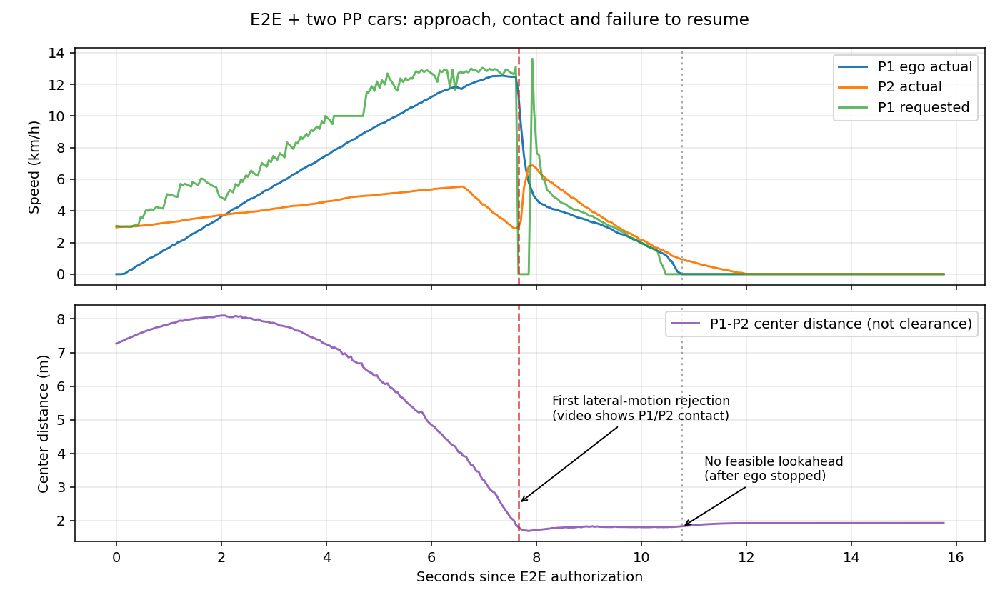
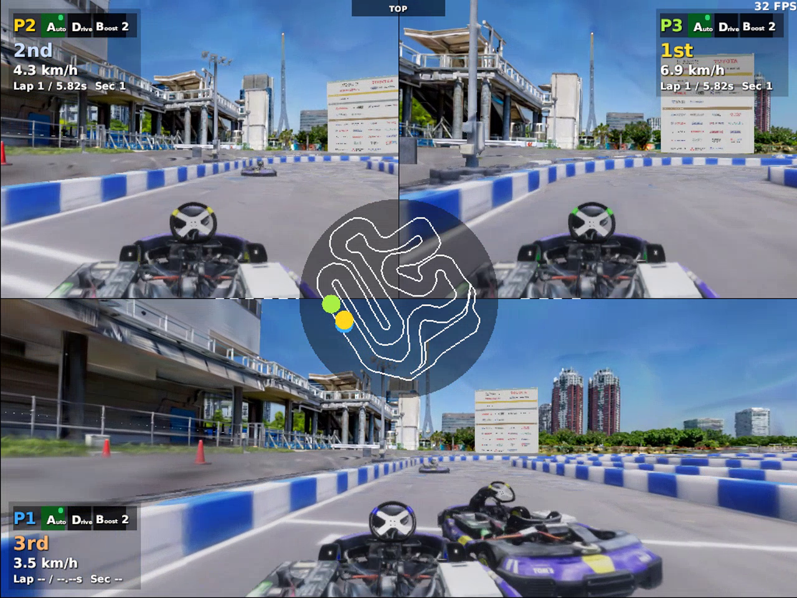

# E2E自車 + Pure Pursuit 2台のAWSIM混走試験

2026-09-17、`graneple@192.168.3.10` で実施。
**3台の正式Start・混走は成立したが、自車が先行P2に接触し、17.6 mで停止。未完走。**

The built-in NPC startup failed before driving. The approved alternative uses
three normal AWSIM vehicles in the same scene, with independent ROS domains:
ego E2E on 1 and existing Pure Pursuit on 2 and 3. AWSIM files are unchanged.

On a source-verified graneple deployment:

```bash
make dev MAX_SPEED_KMH=20 CORNER_MAX_SPEED_KMH=10 TIME_NPCS=0 TIME_PP_VEHICLES=2 TIME_RECORD_VIDEO=1
```

The background reference speed is capped at 10 km/h by a task-local ROS launch
copy. Existing PP initialization, race-arm, stale-input and planner guards remain
enabled. All three domains must be ready for the official Start service.
The normal RViz displays the raw E2E predicted path. Occupancy remains log-only
under the previously authorized trial configuration.

Shared Unity lap messages contain no vehicle identity. This trial therefore
uses the ego domain's 7-element `/awsim/status` array and ordered section/lap
transitions. No observer information is sent to the model. Lap times from this
10 Hz stream are intervals, not the exact Unity lap time. AWSIM's lap limit is
600 so a background car does not finish and lose its collision interactions
during the ego lap; the outer trial remains bounded to 720 wall seconds and
stops when ego completes its first lap.

Validation: run `tools/with_wsl_training_lock.sh env PYTHONPATH=src .venv/bin/python -m pytest -q`
in the native WSL checkout after syncing the committed Windows source.

## 実走条件

実行先は `~/e2e_autonomous/time_traffic2_20260917_r2`。
source: `557375ab985b8b70d793f1990fa48097fb466af8`。
run ID: `codex-time-traffic2-lap02`。
checkpointは `time_launch_protection_v2_20260916/launch_balanced/epoch_03.pt`、SHA-256:
`1fe12ca066791d3eb8907c6921120e2cfbb38925c422d5be54940f4acbdd120a`。
単車で133.67秒の1周を確認した `codex-time-dev-lap01` と、自車の実効JSON・checkpointは同一。
追加学習、予測経路の平滑化、AWSIMの変更は行っていない。

|車両|ROS_DOMAIN_ID|制御|設定上限|
|---|---:|---|---|
|P1、自車|1|TimePathモデル + Pure Pursuit|全体20 / コーナー10 km/h|
|P2、背景車|2|既存Pure Pursuit baseline|基準軌道10 km/h|
|P3、背景車|3|既存Pure Pursuit baseline|基準軌道10 km/h|

背景車の実parameter serviceで基準速度上限とPP設定を照合。
3ドメインすべての初期化完了と正式Start受理を確認し、走行中も各domainの
`/awsim/status` と実制御指令のpublisherは1系統だった。カメラ例外は観測されなかった。
上限10 km/hは10 km/hを維持する保証ではない。

## 実走結果と原因の順序

|指標|結果|
|---|---:|
|自車走行距離（制御記録の位置差分）|17.625 m|
|試験停止要求までの自車制御時間|15.820 sim s|
|自車の最大実速度|12.54 km/h|
|P2 / P3の最大実速度（自車走行権限後）|6.90 / 6.87 km/h|
|P2 / P3の走行距離（同区間、停止処理まで）|12.28 / 31.24 m|
|P1-P2の最小中心間距離|1.673 m。車体間のクリアランスではない|
|自車周回|未完走、最初の開始線通過のみ|
|最終停止理由|`PROGRESS_STALLED`、低速継続5 sim s|
|通常RViz|自車の未平滑化予測経路を表示|

時刻は自車E2Eへの走行権限付与からのsim秒。背景車は正式Startに従い先に動き始めている。

1. **7.42秒:** 自車12.52 km/h、P2 3.33 km/h、中心間2.30 m。
   自車の目標速度12.95 km/h、加速度指令 **+0.48 m/s²**。
   3秒先の予測終点は約8.96 mに伸びたままで、接近に見合う減速が出ていない。
2. **7.66秒前後:** 動画では自車前部がP2の左後部へ接触する様子が見られ、
   自車速度が急減。`MOTION_REAR_LATERAL_INVALID` が5指令発生した。
   映像・速度・横運動の変化は接触と整合する。公式車両別ペナルティ集計は未取得。
3. **10.77秒:** 自車は既に停止。予測経路が短くなり、
   `STEERING_FEASIBLE_LOOKAHEAD_MISSING` が継続する。
4. **15.82秒:** 低速継続で試験停止を要求。実速度停止を確認して終了した。

**先読み点不足は接触・減速後の事象。主な改善対象は接近中の減速・回避。**
先読み検査だけを緩和すれば混走できるという結果ではない。
学習データ量と学習方法のどちらが原因かは、この1走行だけでは分離できない。





近接監視は以前の指定を継承し `log_only_awsim_v1` のまま。
停止相当の占有判定は75指令で記録されたが、近接判定による制動は実施していない。
上記7.42秒でも停止相当の記録がある。過剰な近接停止で未完走になったとは扱わない。
終了処理後の `CLOCK_STALE` 等はシミュレータ停止後のログであり、接触の原因ではない。

## 検証・保存

- native WSL、worktree lock下: **2972 passed / 4 skipped**、106.91秒。
- 公式ROS環境: colcon build、247 source/install照合、隔離ROS接続・launch smoke成功。
- 316件の制御replayが一致、最大差 `4.6363e-13`。LiDAR占有判定そのものの再認証ではない。
- domain 1の生状態をWSLで再読込し、区間・未完走結果がhost記録と一致。
  今回、完走検出分岐には未到達。完走・不正系列は合成unit testで検証した。
- AWSIM動画39.5秒、RViz動画40.0秒。全フレームdecodeと転送SHAを確認。
- AWSIM全1089ファイル、既存Git差分・RViz設定、過去114コンテナ・39 composeを保全。
  試験用コンテナはすべて終了・削除済み。

公式レース全体の終了まで走らせていないため、車両別ペナルティJSONでの
「衝突0件」認証は実施していない。動画による接触確認と区別する。

制御replayを再実行する場合（新規outputを指定）:

```bash
tools/with_wsl_training_lock.sh env PYTHONPATH=src .venv/bin/python tools/evaluate_time_awsim_trial.py \
  --run /home/thistle/e2e_autonomous/runs/time_traffic2_20260917_r2/raw/codex-time-traffic2-lap02 \
  --output /home/thistle/e2e_autonomous/runs/time_traffic2_20260917_r2/replay_new
```

最初の準備試行 `codex-time-traffic2-lap01` は、ログ用ディレクトリを先に作成してしまい、
既存のrun再利用防止検査で発進前に停止。作成順序を修正後、別deployment・runで上記を実施。
初回の資料も `runs/time_traffic2_20260917` に保全した。
Windowsにあった別件のstage済み資料整理はコミット・上書きせず、今回の変更だけをコミット。
そのコミットのcleanなWindowsコピーから、既定syncスクリプトを変更せずnative WSLへ同期した。

raw・動画・WSL解析:
`/home/thistle/e2e_autonomous/runs/time_traffic2_20260917_r2/`。
112ファイル、65,268,806 bytesを転送検証済み。archive SHA-256:
`a69e5ed8f910e5b1a70f7b1afcc085fb456f9570ef14cef5e9205166775308c2`。

Windows再生用の動画（Git対象外）:
`E:\workspace\e2e_lite_transfuser\tmp\time_traffic2_20260917\media\awsim.mp4`、`rviz.mp4`。
AWSIM動画の約29〜33秒で接近・接触・停止が分かる。

[証跡一覧](evidence/time_pp_traffic/manifest.json)、
[制御解析](evidence/time_pp_traffic/summary.json)、
[3台の実測値](evidence/time_pp_traffic/traffic_analysis.json)、
[接近時系列](evidence/time_pp_traffic/approach_timeline.json)。
