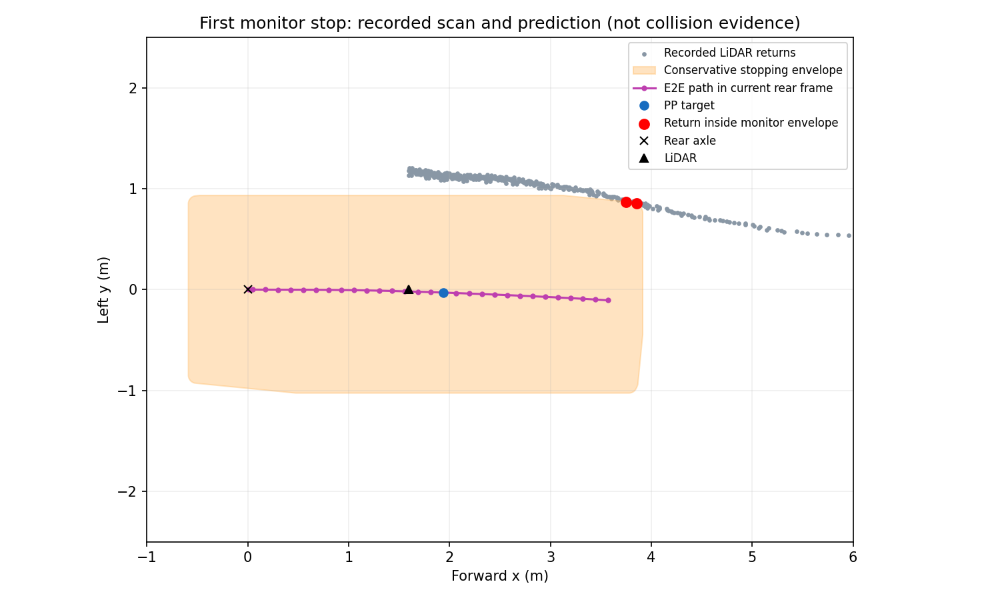

# 再学習モデルの通常AWSIM完走試験（2026-09-15）

状態: **AWSIM通常走行1回・WSL評価まで完了。1周完走は未達で不合格**。
新モデルは走行開始から99.990 sで停止領域監視が作動した。走行記録の移動距離は126.223 mで、前回とほぼ同じ場所の課題が残った。
ユーザーが再学習後のAWSIM走行試験を依頼し、合格ラインを通常完走と指定した。
今回の実行は新しい依頼に基づく。前タスクの学習・offline比較限定という範囲とは別の試験である。

## 条件と変更の必要性

- 実行先 `graneple@192.168.3.10`。新しい専用ディレクトリ `/home/graneple/e2e_autonomous/time_random_model_lap_20260915` を使用する。
- 通常走行1回 `codex-time-random-lap01`。停止状態からE2E単独で発進し、外乱や教師運転を使用しない。
- 合格はAWSIMの順序付き区間通過と `Lap completed` による1周完了。走行距離・offline誤差だけでは合格にしない。
- 1周、既存監視停止、進捗停止、走行600 s（sim/wall各々）のいずれかまで。外側は710 s + KILL猶予10 s。無条件の再試行をしない。
- 新設定 `configs/control/time_path_random_lap_20260915.json` は前回通常走行設定に対してcheckpoint SHAだけを変更する。新モデルを実際にロードするために必要な変更である。
- epoch3、SHA256 `53e1962b97cfaa47acae3e2ad4687fac96c80672905406fdbe1514abd9563da2`。元ファイルはnative WSL `runs/time_recovery_random_update_20260915/best.pt`。
- 固定目標5 km/h、生の時間軌道30点、`stopping_preview_extended_v1`、`awsim_understeer_v1`、既存操舵応答補償を維持する。実測速度は別に報告する。
- 通常Autoware RVizの `/visualization/time_path/raw_path` にE2E出力を表示。観測時base_linkから現在rear axleへ変換する既存座標処理、SI単位、sim/monotonic時刻、ROS topic/QoSを維持する。
- 既存の単一command publisher、停止領域監視、入力鮮度、操舵制限、watchdogを維持。故障時は今回のsimulatorをfreezeしてowned環境を終了する。元のcheckout・過去container・RViz設定を前後照合し保全する。

新設定以外のモデル・制御・監視ロジックは変更しない。通常完走という同じ指標で新モデルを検証し、失敗時には実測の停止理由を残す。旧設定・重みを上書きしないので切り戻し可能。
nominal test4、r48/r49は未使用のまま保全し、本試験を学習データへ自動追加しない。

## 実行コマンド

Windowsで設定・本書をcommitし、`tools/sync_to_wsl.ps1 -CheckOnly`、同スクリプトの通常同期を完了後:

```bash
# native WSL
tools/with_wsl_training_lock.sh env PYTHONPATH=src .venv/bin/python -m pytest -q

# .10: source/install/checkpoint/scene照合と隔離ROS smoke後に1回だけ実行
timeout --signal=TERM --kill-after=10s 710s python3 \
  "$deployment/$source/tools/run_time_path_awsim_trial.py" \
  --deployment "$deployment" --run-id codex-time-random-lap01 --display :0 \
  --config configs/control/time_path_random_lap_20260915.json

# rawをnative WSLへ転送し、全ファイルのSHA256とサイズ照合後
tools/with_wsl_training_lock.sh env PYTHONPATH=src .venv/bin/python \
  tools/evaluate_time_awsim_trial.py \
  --run ../runs/time_random_model_lap_20260915/raw/codex-time-random-lap01 \
  --output ../runs/time_random_model_lap_20260915/evaluation
```

## 準備時の確認

- 設定・試験計画source `69acd5340278ff8e484c118b88b3077534aa22ec` をWindowsでcommitし、WSLへ同一SHAを同期済み。
- native WSLの共有lock下で全pytestを実施: **2,488 passed / 4 skipped / 65 warnings、84.76 s**。新設定を既存validatorへ通し、旧設定からの差分がcheckpoint SHAのみであることも確認した。
- 新checkpointのSHA256をWSLで再照合。現在のcontrol/runtime、推論node、制御node、AWSIM runnerは前回通常走行source `edb00cf682641c28d7fd7b5766d64fe47ee8d2d2` と同一。
- commit由来の569ファイル、4,587,520 bytesのsource archiveとGit blob manifestを準備済み。
- 最初の`.10`確認はGPU正常（RTX 4060 Laptop / driver 595.91.07）、動作中containerなし、空き約18 GiB、通常desktop `:1`、新deploymentなし。
- 一度SSH・pingが応答しなくなったため、配置前に停止して準備を保全した。その後ユーザーの復旧連絡を受け、接続・実行環境を再確認して継続した。接続断の原因自体は未確定。

小さい証跡は [evidence](evidence/time_random_model_lap_20260915) に保存。native WSLの検証出力は `/home/thistle/e2e_autonomous/runs/time_random_model_lap_20260915`。重み・raw・ROS build出力はGitへ追加しない。

復旧後の再確認: 2026-09-15 07:41 JST、GPU正常、稼働containerなし、過去114 container / 39 composeを保持、既存dirty155件のhashは前回と一致、空き19,397,812,224 bytes。
desktopはWayland/Xwayland `:0` に切り替わっていたため、既存runnerへの `--display` 引数を実際の `:0` に合わせる。認証ファイルの内容は読み出さず、通常sessionのパスと接続だけを検証する。
新deploymentで569 source files、226 installed Python files、新checkpointのhashを照合し、既存ROS packageのbuild成功（3.98 s）。隔離ROS smokeはPASS（28.40 s）、実モデルPath一致6件、拡張先読みshadow指令24件、各異常制動を確認。実車command publisherは0。WSL tests・packageの再実行や旧データ削除は行っていない。

## 実走結果

新しい試行 `codex-time-random-lap01` を停止状態からE2Eのみで1回実施した。通常の `rviz2` がraw Pathを購読し、実際の表示画面も保存・目視確認した。
AWSIMの区間通過は **0 → 1 → 2**、`Lap completed` は0件。`CONTROL_STOPPING_SWEEP_OCCUPIED`で試験を終了した。

| 指標 | 前回 expandedモデル | 今回の再学習モデル |
|---|---:|---:|
| 通常1周完走 | 未達 | **未達** |
| 最初の停止領域監視まで（発進許可後sim） | 100.350 s | 99.990 s |
| 保存poseの走行距離 | 126.564 m | 126.223 m |
| 走行中の実測速度中央値 | 約4.62 km/h | 約4.62 km/h |
| PP追従指令数 | 2,007 | 2,000 |
| 停止理由 | STOPPING_SWEEP_OCCUPIED | STOPPING_SWEEP_OCCUPIED |

最初に監視が作動した2回のmap上の位置は **0.185 m** 離れている。条件ごと1回の結果で、成功率や純粋な学習変更の因果効果は推定しない。
固定5 km/hは目標値で、実測一定5 km/hではない。今回の実測最高速度は約4.693 km/h。

## 停止記録の再現

- 最新の予測はage 0.165 sで、PPは観測から1.7 s先の点（現在rear axleから1.940 m）を通常の先読み範囲で採用していた。発進後に先読み不成立による停止はなく、先読み延長は発進時の1指令だけ。
- 停止時の要求タイヤ角は−0.018599 rad、実測は−0.019160 rad、発行タイヤ目標は−0.018753 rad。この瞬間の実測と要求の差は約0.000561 radで、大きな操舵遅れだけが直接原因とは読み取れない。ただしそれ以前の累積追従誤差はこの1時点では切り分けられない。
- 保存LiDAR・自己位置・実測運動・操舵を既存監視へ再入力し、同じ停止理由を再現した。監視領域内に2点あり、現在rear座標で前方3.75〜3.85 m・左0.855〜0.867 m。
- 最小ray余裕は−0.01119 m。これは保守的な停止領域に対するLiDAR ray距離差で、実車体との接触量や衝突の証拠ではない。
- PP・操舵応答補償・操舵マッピング・車両運動計算は **2,001指令一致**、最大数値差 `8.88e-16`。終了時のラッチ・凍結末尾58指令は必要なpose/planがなく再生対象外として明示した。
- 監視の制動要求後にowned simulatorをfreezeして終了している。freeze前の実測静止確認はなく、自然制動で静止したとの主張はしない。



今回の新重みでも、前回と同じ通常走行の停止箇所は解消しなかった。モデルの復帰軌道・そこまでの累積追従・監視領域のどれが支配的かは追加の切り分けが必要。
完走基準は維持し、監視の緩和や速度低下による再試行は行っていない。

## 証跡と終了状態

- [実走評価](evidence/time_random_model_lap_20260915/summary.json)、[前回との停止位置・監視再現比較](evidence/time_random_model_lap_20260915/normal_lap_diagnostics.json)。既存evaluatorのscope文字列は汎用の旧表記を保持しており、今回の具体的な合否は `LAP_NOT_COMPLETED` とjudgeの区間・lap記録で判断する。
- [通常RVizの走行中画面](evidence/time_random_model_lap_20260915/rviz_drive_080.png)、[凍結後の保存画面](evidence/time_random_model_lap_20260915/rviz_after_freeze.png)。紫色が今回の時間モデルの生予測経路。旧V4のdisplay名が設定に残っていることと、旧V4モデルを動かしたことは別である。
- XWDは今回のXwaylandで24-bit packed pixels＋行paddingだった。初回の32-bit固定decoderはassertで停止したため、header・RGB色表・行paddingに従う形式変換でPNG化した。raw画面は変更せず保持し、画像合成・補正はしていない。
- [転送照合](evidence/time_random_model_lap_20260915/transfer_verification.json): **50 files / 80,004,223 bytes**、全ファイルSHA256とサイズ一致。raw・評価はnative WSLの `/home/thistle/e2e_autonomous/runs/time_random_model_lap_20260915`、配布元とraw原本は`.10`の同名deploymentに保管。
- [source/install/ROS smoke・実行終了状態](evidence/time_random_model_lap_20260915/runtime)を保存。試験用containerは全て終了、過去114 container・39 compose、元のGit HEAD・dirty差分・RViz設定のhashは前後一致。
- Windows task driverの `test/package/prepare/start`、WSLの転送検証・評価は完了済み。同じrun ID・出力先で再実行しない。既存データ・旧重み・過去走行・封印testを保全し、新しい学習は開始していない。
