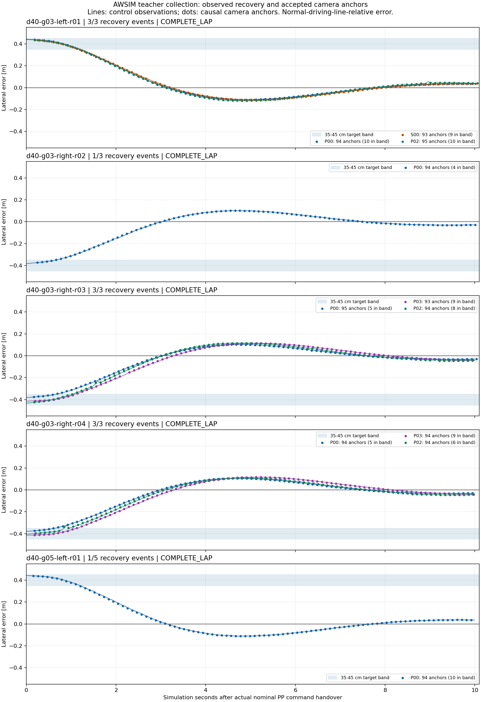

# 経路受信の遅延対策と40cm復帰データ収集

遅延対策を適用し、AWSIMで40cm復帰データを収集・native WSLで教師生成と検証まで完了した。
**40cmは11復帰イベント・1,034 Cameraアンカー、実測35～45cm帯は85件**。
1件の教師は未来3秒・30点であり、近接アンカー同士は時間的に重なる。

| 40cmデータ | run数 | 復帰イベント | 有効教師 | 35～45cm帯 |
|---|---:|---:|---:|---:|
| 学習用 | 2 | 6 | 564 | 49 |
| 検証用 | 3 | 5 | 470 | 36 |
| 合計 | 5 | 11 | 1,034 | 85 |

左右それぞれを学習・検証に含め、runの重複なし。実測帯域は道路中心ではなく、
照合した通常走行ラインに対する横ずれで集計している。学習ジョブや既存データとの統合は未実施。
40cmで全地点まで成立した回数は**1周3回**。5回への増量は準備の安定性不足で保留した。
S00右側40cmは停止領域監視で未成立となり、教師から除外した。S00左側40cmは採用済み。

遅延検証用20cmデータは別groupに753件・8イベントを保存。
全8試行中7周完走・1試行停止、raw合計10,320,383,400 bytesをWSLへ保存し、
全ファイルSHA・構造・SQLite検証を完了した。実行先の転送済みrawだけを除去し、
元の実行先Git状態とコピー元94ファイルは維持、収集containerは全停止、空き約14.3GiB。

集計と各runの証拠は [collection_index.json](evidence/time_recovery_40cm_20260915/collection_index.json)、
コンパクトな証拠一式は [manifest.json](evidence/time_recovery_40cm_20260915/manifest.json)。
収集・検証の実装sourceは `adfc444818a26bae021d463cca5312b5d37a9f9a`。



通常RVizの表示証拠: [rviz_d40_g03_left_event3.png](evidence/time_recovery_40cm_20260915/rviz_d40_g03_left_event3.png)。
PREPマーカーは準備を開始した位置を表し、実測横ずれの成立は上記のアンカー検証で確認している。

2026-09-15のユーザー指示により、時計更新の遅延対策後に40cmの復帰データを収集する。
実行先は `graneple@192.168.3.10`、教師生成・検証はnative WSL。
前回のsealed収集を保持し、新しい専用campaign `time_recovery_40cm_20260915` を使う。

前回5回条件のwire messageは通常1521点・133876 bytes、準備2866点・252236 bytes。
公式環境で保存済みCDRを50回展開・速度検査・破棄した中央値は30.565ms / 57.431ms。
同じPython受信スレッドが経路とclockを処理するため、両経路の処理負荷を減らす。
この測定だけで前回の時計更新の遅延元をすべて説明したとは扱わない。

20cmの比較試験では、復帰区間と未来3秒の制御publicationのsim時刻間隔が最大190msから70msへ減少。
今回採用した40cmの全11イベントでは最大75ms、150ms超0件だった。

大きな横ずれ収集に限り、ROS raw subscriptionと固定IDLのCDR1検証を使う。
全点の速度をNumPyのstride viewで読み、従来と同じ速度条件を確認する。
header時刻、frame、点数、全点速度、受信・計算期限、送信元、停止監視を維持する。
未知のencoding、破損・過不足のあるpayloadは拒否する。通常PPとrosbagは全経路を受信する。
旧pulse収集のtyped subscriptionは変更しない。

Windowsでcommitし、既定の同期を行った後、native WSLで実行する:

```sh
tools/with_wsl_training_lock.sh env PYTHONPATH=src .venv/bin/python -m pytest -q
```

左右エンディアン、ヘッダーalignment、時刻・サイズ・点数例外、任意位置の異常速度を
unit testで確認し、公式ROS環境でも実CDRとの一致と接続を確認してから実走へ進む。

今回は最大8試行・各1周を有限範囲とする。最初に前回未成立だった20cm・5回条件で
修正後の受信と教師の連続性を確認する。その後40cmを左右各3回から始め、
全地点の実測復帰と有効な35～45cm帯の教師を確認できれば回数を2増やす。
失敗・スキップ時は増量せず、原因・元データを保全して残りの試行内で切り分ける。
回数と横ずれ量を同時に上げない。7回の実走と60cmへの増幅は今回行わない。

地図検査、目標5km/h、30分上限、bag上限2GiB、空き10GiB以上、通常RVizの経路・マーカー、
復帰中と未来3秒の再外乱禁止、2run以内でのWSL転送・全hash/構造/SQLite検証後の
転送済み新規rawだけの限定cleanupを継続する。学習ジョブは今回開始しない。

教師の目標値とCameraアンカーで実測した横ずれ量を分けて集計する。
画像・LiDAR・ego履歴は実際に横へずれた状態から保存し、教師は通常PPへ切り替えた後の
実測未来3秒・30点を使う。run単位でtrain/validationを分け、既存データを保持する。
実装・実走sourceは `adfc444818a26bae021d463cca5312b5d37a9f9a`。
native WSLの全体テストは **2673 passed / 4 skipped**、対象テストは72 passed。
公式ROSでの独立した合成接続試験も通過した。合成試験は教師件数に含めない。

公式ROSの保存CDR比較では、通常1521点の受信検査中央値は30.565msから0.013ms、
準備2866点は57.431msから0.016msに減った。各50回、同一CPU割当・GC条件で測定し、
公式deserialize/serializeのbyte一致と、時刻・座標系・点数・全点速度判定の一致を確認した。
これは受信検査の測定であり、AWSIM全体の高速化倍率ではない。

最初の実走 `d20-g05-left-r01` は1周完走、P00/S00/P03の3復帰が成立。
各復帰と未来3秒の制御publicationのsim時刻間隔は最大70ms、150ms超0件だった。
前回のP00/S00では最大170/190ms、150ms超2/3件。
両runとも記録された `/clock` 自体は5ms間隔であり、主に受信側で観測する時刻の遅れを
切り分けた結果である。実際のアクチュエータへの配送遅延と同一視しない。
成立した3イベントから283件の有効教師、15～25cm帯のCameraアンカー39件を生成した。

4地点目のP02は遅延以外の理由で未成立。10秒終了直前まで横ずれ約2cm・安定継続だったが、
base投影s=257.376m付近で向きの誤差が-0.04215radとなり、2°条件を外れた。
P02の教師は0件として除外し、P04は実施していない。
準備開始地点の実測速度を確認した上で、P02のreleaseを245mから243mへ2m前倒しする。
修正版は20cm・5回と40cm・3/5回の左右すべてが既存の地図検査を通過した。
速度、向き、連続安定時間、時計間隔の条件は緩和していない。

保存先は `/home/thistle/e2e_autonomous/runs/time_recovery_40cm_20260915`、
rawは `/home/thistle/e2e_autonomous/raw/time_recovery_40cm_20260915`。
WSLでの全hash・構造・SQLite検証後に、このcampaignの転送済みrawだけを実行先から除去する。
修正版 `d20-g05-left-r02` は全5イベント成立・1周完走、470件の有効教師と
15～25cm帯62件を得た。全5イベントと未来3秒のsim時刻間隔は最大70ms、150ms超0件。
この結果と転送検証のSHAを `latency_live_gate.json` に固定して、40cm・3回の実走を開始した。

40cmのsplitはrun単位とし、3回左と最後の3回右 `r04` をtrain、
先に取得した3回右 `r03` と完走した校正runの有効区間をvalidationとする。
20cmの遅延検証データは別groupとして保存する。同じコース・同じ教師走行器の別run検証であり、
この収集結果をE2Eモデルの完走や未見コースでの復帰性能の証明には使わない。

`d40-g03-left-r01` は3イベント成立・1周完走、282件の有効教師と35～45cm帯29件。
全イベントと未来3秒で150ms超のsim時刻間隔は0件、最大70msだった。

`d40-g03-right-r01` はP00の復帰後、S00で `STOPPING_SWEEP_OCCUPIED` により停止した。
最初の拒否はbase投影s=119.929m、通常走行に対する横ずれ-0.4034m、向き差0.08393rad、
速度1.26475m/s。直前の停止範囲のLiDAR余裕は0.03363mだった。
受信遅延とは別の、当該状態の停止範囲による拒否であり、停止runの教師はすべて除外する。
rawと有効性診断は保全した。S00のreleaseを114/116/120mへ移す案はすべて地図検査で拒否。
今回はS00の左側40cmを保持し、右側3回をP00/P03/P02へ変更する。
左右3回の実測教師が成立した後の5回右側では、P05=201mとP04=285mを追加する。
この右側3回/5回の代替経路は地図検査を通過済みで、停止監視や速度条件は変更しない。

`d40-g03-right-r02` は完走したが、P03の準備で `TARGET_NOT_REACHED`。
release=160m付近で横ずれが約-0.459mとなり、160.929mで-0.44989mに入った後も
必要な0.25秒を満たす前にrelease+1mを越えた。向き差はこの区間で条件内だった。
P00の94件・35～45cm帯4件を採用し、未成立のP03は除外した。
P03のrelease=160mを維持し、settlingを2mから4mへ延ばして準備開始を150mから148mへ変更。
右側3回/5回とも再度地図検査を通過した。40cm±5cm、2°、0.25秒、12秒制限は維持する。

`d40-g03-right-r03` は全3イベント成立・1周完走、282件・35～45cm帯22件。
全イベントで150ms超のsim時刻間隔は0件。正式な完走・停止結果の後に
`NOMINAL_FIXED_SPEED_MISMATCH` がheartbeatへ記録されたが、その時点は停止済みで、
最後の教師未来区間から90秒以上後だった。`shutdown_diagnostic_scope.json` で時刻関係を保存し、
元の正式結果や監視条件は変更していない。

左右3回の転送・実測教師・時刻検証のSHAを `d40_expansion_gate.json` に固定して5回へ増量する。
5回で追加する地点には4mの安定区間を適用した。左はP03/P04、右はP05/P04が対象で、
既に成立したP00/S00/P02、および右P03の設定は維持する。左右とも再度地図検査を通過した。

5回左 `d40-g05-left-r01` は完走したが、S00で `TARGET_NOT_REACHED`。
s=118.743mで横ずれが0.44962mとなり、0.25秒を満たす前にrelease+1mを越えた。
この準備区間でもsim時刻間隔は最大70ms、150ms超0件。
S00周辺s=100～136mの準備CSV全7列・332点は、成立した3回左と完全に一致する。
したがって回数だけを原因とは断定せず、開始状態・実行位相なども含む準備安定性の余裕不足として残す。
P00の94件・35～45cm帯10件だけを採用し、未成立のS00は除外した。

`d40_expansion_suspension.json` で5回への増量を保留し、未実行の5回右はdeferredとして保存した。
最後の8試行目は、成立済みの右側3回と同一reference SHAを使った別run `r04` を学習用に収集する。
今回の有限範囲を追加で拡張せず、40cmの最大検証済み回数は3回として扱う。

最後の `d40-g03-right-r04` は全3イベント成立・1周完走し、学習用282件・35～45cm帯20件を追加した。
最終集計、shape `[N,30,2]`、全点mask有効・有限値、入力再現、run分割、転送SHAを照合済み。
本学習と既存コーパスへの統合は開始していない。

実行した収集コマンドの例を示す。`DISPLAY` / `XAUTHORITY` は実行先の
`display.json` から適用し、開始前に対象referenceのCSV/JSONを選択・SHA検証した。
各runの実コマンド・reference SHA・未実行計画は [campaign_final.json](evidence/time_recovery_40cm_20260915/campaign_final.json) に残す。

```sh
cd /home/graneple/e2e_autonomous/time_recovery_40cm_20260915
PYTHONPATH="$PWD/source/src" timeout --signal=TERM --kill-after=20s 1980s \
  python3 source/tools/run_time_recovery_awsim.py \
  --campaign-root "$PWD" --run-id codex-time-recovery-40cm-d40-g03-right-r04 \
  --side right --speed-policy aligned_gain4_v1 --separate-cpus
```

WSLの実行例。監査・集計・描画スクリプトの同じ内容を証拠ディレクトリにも保存した。
スクリプトは既存出力を上書きせず拒否するため、再実行時は別の出力先を使用する。

```sh
cd /home/thistle/e2e_autonomous/e2e_lite_transfuser
tools/with_wsl_training_lock.sh env PYTHONPATH=src .venv/bin/python \
  /home/thistle/e2e_autonomous/runs/time_recovery_40cm_20260915/audit40.py \
  --run codex-time-recovery-40cm-d40-g03-right-r04 --split train
tools/with_wsl_training_lock.sh env PYTHONPATH=src .venv/bin/python \
  /home/thistle/e2e_autonomous/runs/time_recovery_40cm_20260915/finalize40.py
tools/with_wsl_training_lock.sh env PYTHONPATH=src .venv/bin/python \
  /home/thistle/e2e_autonomous/runs/time_recovery_40cm_20260915/plot40.py
```
