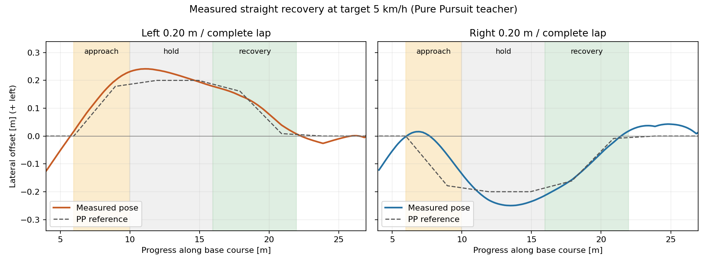

# AWSIMで実測した復帰教師の初回収集

2026-09-14更新: 診断分を含む今回の20記録をWSLへ移動済み。
全項目の一致確認後、AWSIM側の原データを整理し、空きを約21.02GiBへ回復した。
現在の保管先と証跡は [WSL移動記録](time_recovery_wsl_relocation_20260914.md) を参照する。

## 結果

実行先は `graneple@192.168.3.10`。直線で左右それぞれ20cmずらした参照経路を
公式Pure Pursuitに追わせ、実際にずれた車体のcamera・LiDAR・姿勢・速度を記録した。
教師候補はそこからの**未来3秒の実測位置30点**であり、参照CSVを教師値へ流用していない。
通常のRVizに基準・収集用参照・実測軌跡の3つの `nav_msgs/Path` を表示した。
[右r19終了時の通常RViz](evidence/time_recovery_collection_20260913/right_r19_normal_rviz.png) で
表示を確認した。画面の既存RaceTrajectoryの数値は今回の速度命令ではなく、
旧モデルの表示設定が残っていても、その推論nodeは今回起動していない。

**左右各1周と正常停止が成立し、WSLで原本と教師の再現確認まで完了した。**
右側 `right020-r19` は373.82秒、左側 `left020-r20` は373.77秒で1周を記録した。
同じ最終制御実装を使用し、原bagの正常終了と全childの終了コード0を確認した。

| 記録 | 周回結果 | ずれ保持中の中央値 | 復帰後5mの最大絶対誤差 | 入力履歴＋未来30点が有効な候補 |
|---|---|---:|---:|---:|
| 左 r20 | 1周・正常停止 | +22.25cm | 2.63cm | 57 / 57 |
| 右 r19 | 1周・正常停止 | −23.07cm | 4.30cm | 57 / 57 |
| 左 r17 | 復帰後に時刻監視で中断 | +22.34cm | 2.62cm | 56 / 56 |
| 左 r18 | 復帰後に時刻監視で中断 | +22.43cm | 2.61cm | 57 / 57 |



図は各完走runの最初の通過だけを表示した。実線は実測、破線はPPの参照CSV頂点。
完走2本のbagは合計2,984,270,818 bytes（約2.78GiB）、復帰の再現確認済み候補は114窓。
部分run2本を合わせると4,584,708,633 bytes（約4.27GiB）、復帰4回・227窓。
完走2本だけでもcamera 8,105件・LiDAR 17,065件を含むが、
この全フレームを復帰教師として採用したわけではない。

符号は左が正。統計は走行中の元poseを基準コースへ射影した値で、制動中・異常・
時刻未被覆区間を除く。候補は重複する時間窓であり、57件を57回の独立した復帰試験とは数えない。
左右の同じ直線条件を繰り返した小規模pilotで、コーナーや約85cmの逸脱からの復帰は未確認。
学習用データの生成、train/validation割当、追加学習、E2Eモデルの閉ループ評価は行っていない。

## 走行条件と採用判定

- 自車1台、NPCなし。固定**目標**5km/h。左右とも実測移動速度中央値は3.52km/h、最大約5.39km/h。
  目標値と実速度を分けて保存している。
- 基準コース上 s=5.97～9.97mで寄せ、9.97～15.97mで保持、15.97～21.97mで復帰。
  基準の最大絶対曲率を0.01/m以下に限定し、左右の変更経路で従来のcenter clearance 1.4mを確認した。
- 正常終了はJudgeLogの順序付きsectionと1周完了を確認後、追加4秒を記録して制動。
  実速度の絶対値0.03m/s未満が3秒続いてから終了し、bagを閉じる。
- 1run 2GiB、30分sim / 31分wall / 33分outer、最低空き10GiB。
  診断分を含む累積上限は最終左r20の1本を追加する際に12GiBへ変更。今回の収集はそこで終了する。
- 採用条件は、指定側のhold中央値が10cm以上、復帰後5mの誤差が10cm以内、
  holdから5cm以上の誤差低減、正常1周・停止・close・転送一致・入力と実測未来の再現。
  最終集計は復帰後の**最大絶対誤差**でも10cm以内を要求し、中央値の符号相殺による誤判定を防ぐ。

前方LiDAR監視と既存の車両モデル・閾値を維持した。
全周囲の車体接触を独立センサで証明したものではない。

## 収集経路で直した点

実走行の途中で時刻監視が作動したため、原因を保存ログで分離して修正した。
センサ受信を制御から分離し、元stampを保った履歴から入力を選ぶ。
RViz用の長いPath生成は別processへ移し、表示だけを10cm間引きする。
collector内のPython切替間隔と数値計算threadを明示し、cyclic GCは制御判断中ではなく
command・phase・heartbeat発行後に5秒周期で実行する。
センサ鮮度、skew、scanの元pose補間、100ms判断期限、監視計算式は緩めていない。
右r19では明示GC 89回、最大21.61ms、peak RSS約77.1MiBを記録した。
同runの7,916走行判断で最大85.97ms、中央値17.00ms、判断中のGCは0回だった。
左r20も7,919走行判断で最大82.42ms、中央値16.42ms、判断中のGCは0回。
明示GCの最大20.46ms、peak RSS76.25MiBで1周を終了した。これらは今回の2本での測定値である。

従来のsigned mean curvatureによる候補選択はS字で左右を相殺していた。
任意の最大絶対曲率条件を追加し、今回の直線選択だけに適用した。
先行左r16は1周したが、意図した左ずれ保持が成立せず、復帰教師の採用例から外して保管している。

AWSIMのraw VelocityReportにはyawの角度wrap由来の異常値が残る。
収集時の旋回監視には軸・時刻を検証した実IMUを使い、元VelocityReportも保存した。
教師の再現監査では異常raw yawを含む入力履歴を除外する。
**既存の汎用学習converterへそのまま投入せず、この除外と復帰phaseの適用を
materialize側にも実装する必要がある。** 意図的に寄せるapproach/holdを復帰の正解として学習させない。

各修正の根拠と失敗試行は [収集計画・現地記録](time_recovery_collection_plan_20260913.md) に残した。

## WSLでの検証と保存先

Windowsが編集・Git正本。検証は `Ubuntu-22.04-Recovered` の
`/home/thistle/e2e_autonomous/e2e_lite_transfuser` でworktree lockを通して実施した。
制御・教師ロジックの最終変更 `80931c7` は **pytest 2,222 passed / 4 skipped / 63 warnings**。
最終左r20の実行source `0484dc3` は、その後の集計artifact・記録・容量上限変更を含む。

閉じたbagと全manifest対象ファイルをSHA-256で照合し、SQLite quick_checkを実施。
復帰phaseの全候補で入力履歴と元poseからの未来30点を確認した。
各run代表3候補は元画像・LiDARを実tensorへ構成し、教師XY全30点の一致を確認した。
入力はimage `[1,4,3,224,384]`、LiDAR `[1,4,2,750]`、教師XYは `[30,2]`。
元stampと `/clock` によるepochは各1。固定50msのcamera freeze設定を使用。
bag receiptは入力利用可能時刻の代用であり、前処理完了時刻の実測値ではない。

- AWSIM側の旧原本位置: `/home/graneple/e2e_autonomous/time_recovery_collection_20260913/<run-id>/`。
  2026-09-14の移動後は `MOVED_TO_WSL.json` の案内のみを保持。
- WSL側原本: `/home/thistle/e2e_autonomous/raw/time_recovery_collection_20260913/<run-id>/`
- WSL側圧縮archive・監査: `/home/thistle/e2e_autonomous/runs/time_recovery_collection_20260913/`
- 小さい検証結果: [evidence](evidence/time_recovery_collection_20260913/)。bag・重みはGitへ追加していない。

収集終了時はAWSIM側の原bagを保持し、WSLで照合した輸送用archiveだけを削除して空きを確保した。
対象・ハッシュ・削除前後容量を `shipping_archive_cleanup*_result.json` に記録した。
当時の終了・bag flush・輸送archive整理後のAWSIM側空きは約9.95GiB。
2026-09-14、ユーザーの移動指示により原データも全件照合後にWSLへ移し、空きは約21.02GiBとなった。
実行中containerは0。元の実験repositoryのHEADと既存dirty 155件を保持した。

再検証コマンド（WSL checkout内、`run_id`を対象runへ設定）:

```bash
run_id=codex-time-recovery-right020-r19
raw_root=/home/thistle/e2e_autonomous/raw/time_recovery_collection_20260913
audit_root=/home/thistle/e2e_autonomous/runs/time_recovery_collection_20260913
tools/with_wsl_training_lock.sh env PYTHONPATH=src .venv/bin/python \
  tools/audit_time_recovery_collection.py --run "$raw_root/$run_id" \
  --types "$audit_root/types" --output "$audit_root/${run_id}_audit_recheck.json"
tools/with_wsl_training_lock.sh env PYTHONPATH=src .venv/bin/python \
  docs/evidence/time_recovery_collection_20260913/causal_replay_probe.py \
  --run "$raw_root/$run_id" --types "$audit_root/types" \
  --output "$audit_root/${run_id}_causal_recheck.json"
tools/with_wsl_training_lock.sh env PYTHONPATH=src .venv/bin/python \
  docs/evidence/time_recovery_collection_20260913/summarize_measured_recovery.py \
  --raw-root "$raw_root" --audit-root "$audit_root" --output "$audit_root/summary_recheck"
```

出力先は既存の監査証跡を上書きしない新しい名前にする。
次の収集拡張は、左右40cm・別の直線・コーナー出口を通過余裕ごとに検証して追加する。
同じ場所・条件の重複を増やすだけでは検証用の独立性は増えないため、
学習用と検証用はrun/scenario単位の割当に加え、収集条件の重複も確認する。
