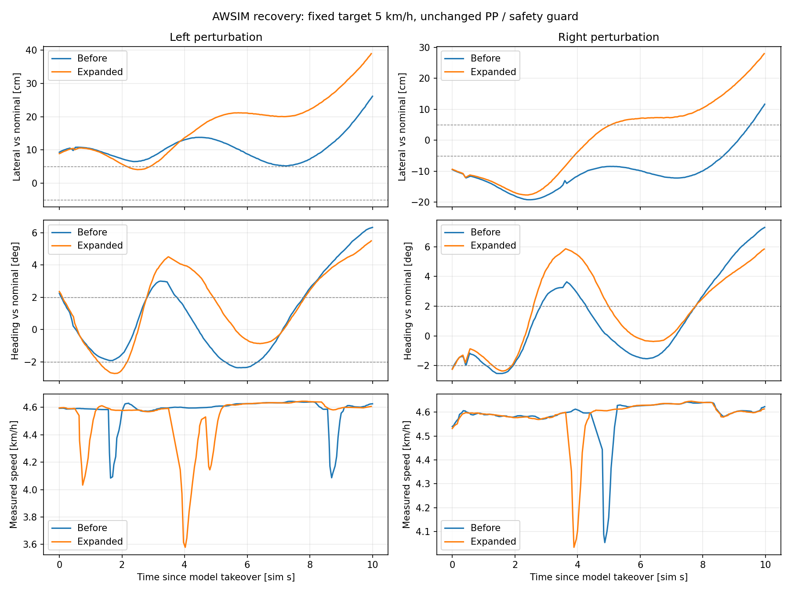

# 復帰データ統合モデルのAWSIM比較

ユーザー依頼により、`graneple@192.168.3.10`で追加学習前後の復帰性能を確認する。
Windowsを編集正本とし、Linuxでの試験・保存記録の解析はnative WSLを使用する。
AWSIM実行は指定された`.10`で行い、既存のdirty checkoutと過去の実験を保全する。

## 固定する条件と実行順序

- 追加前checkpoint SHA256: `c2fdb6fd1daf525524fe44d3f793d84b482760aa1f9f1fa84d5315222ab9fbe0`。
- 追加後checkpoint SHA256: `7ec445b6ab955e76d0d71efbd8f2f1dd3066ebe365516df38df8cf18adb56f44`。
- 生の時間軌道30点、固定目標5km/h、`stopping_preview_segment_v1`、
  `awsim_understeer_v1`、既存の操舵応答補償・停止領域監視を共通にする。
- まず通常のE2E走行を各1回。1周、監視停止、進捗停止、既存600s上限のいずれかまで記録する。
- 次に左右各1回ずつ両モデルを比較する。教師PPで同じコーナーへ進み、既存の有限操舵パルスで
  小さな横ずれ・向きずれを作った後、E2Eへ一度だけ制御を渡す。引継ぎ後はE2Eが走行する。
  教師が準備した区間とモデル自身の走行区間は明示的に分け、教師区間をE2E完走と数えない。
- 初回は通常2回＋左右復帰4回を上限とし、走行失敗の無条件再試行や監視条件の緩和はしない。
  準備・接続失敗は原因を確認して修正し、走行成績に混ぜない。
- 走行経路は通常のAutoware RVizに`/visualization/time_path/raw_path`を表示する。
  参照経路・評価用自己位置はモデル入力へ加えない。

## 記録と判定

走行前にsource/install/checkpoint/sceneのhash、GPU、ROS publisherの所有権、RVizの購読、
空き容量を確認する。隔離ROSの実モデルPath・異常制動smokeを実行し、simulation起動前に閉じる。
閉じた走行記録をWSLへ移してhashを確認し、同じ制御計算の再生と復帰区間の横ずれ・向き・
復帰時間・停止理由を集計する。制御が成立したことだけで復帰成功とは判定しない。
新しい実行記録を学習splitへ自動追加せず、元のtestと評価予約は未使用のまま保持する。

実行前の環境はGPU正常、動作中containerなし、空き約22GB。
既存checkoutのHEADは`4af395eee10f928c7fc7225760adfa04c4c07ff4`で、既存の編集を保持する。
新しい専用deploymentを使い、今回のowned process/containerだけを終了する。

通常走行2回・左右復帰4回を完了した。今回の条件では追加前後とも復帰・完走は未達。
追加後の最大横ずれは左右とも大きく、オフライン改善を実走改善として採用できる結果ではなかった。
各条件1回であり、入力欠損による制動の時点も異なるため、一般的な成功率や学習変更だけの因果効果は示さない。

## 復帰試験の引継ぎ実装

`run_time_path_awsim_trial.py --recovery-side left|right`を追加する。
実行先の`references/{side}.json/.csv`は今回収集に用いた同じ有限パルス参照を使用する。
`recovery_assets.json`で教師PP install・launch・参照のhashを固定し、実際にロードした
PPの上限速度5km/h・速度ゲイン4を公式start前に検証する。

最終command publisherは常に`/time_path_controller`の1つ。
教師PP入力も既存0.5rad・0.8rad/s・停止領域監視を通す。公開したパルス0の境界から
150ms以降を観測した最初のモデル出力でE2Eへ切り替える。品質による選別をしない。
引継ぎをPP計算の前にラッチするため、モデル軌道が不適切でも教師へ戻さない。
0境界から1s以内に引き継げなければ停止し、パルスや教師運転を延長しない。
参照投影は引継ぎ後には診断専用で、範囲外などの診断失敗がE2E制御を止めることもない。
生のモデル軌道は準備中も通常RVizへ表示する。

```bash
# native WSL: Windowsでcommit/sync後
tools/with_wsl_training_lock.sh .venv/bin/python -m pytest -q

# .10: 検証済みの新規deploymentごとに、固有run IDで実行
timeout --signal=TERM --kill-after=10s 710s python3 \
  "$deployment/$source/tools/run_time_path_awsim_trial.py" \
  --deployment "$deployment" --run-id "$run_id" --display :1 \
  --config configs/control/time_path_expanded_5kmh_20260914.json --recovery-side left
```

## 通常走行の結果

`source_50d6b22`・それぞれのepoch3で各1回を実施。
旧モデル`codex-time-expanded-base-normal01`は最大0.107m/s、追加後
`codex-time-expanded-candidate-normal01`は正加速度commandなし。
どちらも発進時の`STEERING_FEASIBLE_LOOKAHEAD_MISSING`で進捗停止し、完走は0/2。
この条件ではコーナー復帰性能を測れていないため、予定した教師準備後の引継ぎ試験で切り分けた。
両方で通常`rviz2`のraw Path購読を確認した。無条件に再試行はしない。

## 保存記録の評価方法

Windows commit `39f3aa1`をnative WSLに同期し、`pytest -q --disable-warnings`は
2,349 passed / 4 skipped（87.94s）。同sourceを両方の復帰試験deploymentに配置し、
source/install一致と実モデルによる隔離ROS smokeが両方PASS。

復帰の判定は、教師PPの実測nominal guideに対する横ずれ5cm以内・向きずれ2度以内を
速度0.5m/s以上で1秒間維持すること。250ms超の観測欠損で連続性を切る。
さらに10秒区間を観測でき、区間末尾もこの条件内にある場合に`RECOVERED_10S`とする。
最初から許容内、停止して位置だけ戻った、途中で記録が切れた場合は成功に数えない。
これは道路端までの安全距離や一般的な成功率を表す指標ではない。

```bash
tools/with_wsl_training_lock.sh env PYTHONPATH=src .venv/bin/python \
  tools/evaluate_time_recovery_takeover.py \
  --run ../runs/time_recovery_expanded_awsim_20260914/raw/codex-time-expanded-base-left01 \
  --run ../runs/time_recovery_expanded_awsim_20260914/raw/codex-time-expanded-candidate-left01 \
  --run ../runs/time_recovery_expanded_awsim_20260914/raw/codex-time-expanded-base-right01 \
  --run ../runs/time_recovery_expanded_awsim_20260914/raw/codex-time-expanded-candidate-right01 \
  --reference-root ../runs/time_recovery_expanded_awsim_20260914/references \
  --output ../runs/time_recovery_expanded_awsim_20260914/evaluation
```

引継ぎ後の記録だけで既存PP・操舵応答・マッピングを再計算し、拒否を含めて照合する。
最初の停止領域拒否は実際のscan・発行操舵・実測運動を用いて再評価する。
rawモデル軌道・同じguideに対する初回予測の向きも診断し、教師区間をモデルの成績へ含めない。

## 左右復帰4試行の実測結果

同じsource `39f3aa1`・PP・操舵応答補償・停止領域監視を使用し、設定はcheckpoint hash以外同一。
同じ教師PPでs=88mまで進み、最大2秒・±0.1radの入力パルスで横ずれと向きずれを作った。
全試行で`STATE_GOAL`によりパルスを解除。公開された0境界から0.400〜0.455秒後に
E2Eへ1回だけ引き継ぎ、その後の全commandでE2Eの所有権を確認した。
固定目標は5km/h。E2E区間の実測走行速度中央値は4.57〜4.58km/hで、実速度5km/hの一定走行ではない。

以下の横ずれは、教師PPの実測nominal guideに対する値。左が正、右が負。
「約10秒後」は各記録の最後の有効sample（9.960〜10.000秒）で、停止時の値ではない。

| 試行 | 引継ぎ時の横ずれ / 向きずれ | 10秒内の最大横ずれ絶対値 | 約10秒後の横ずれ / 向きずれ | 最初の停止領域拒否まで |
|---|---:|---:|---:|---:|
| 追加前・左 | +9.30cm / +2.25度 | 26.15cm | +26.15cm / +6.33度 | 23.950s |
| 追加後・左 | +8.89cm / +2.35度 | 38.98cm | +38.98cm / +5.49度 | 23.255s |
| 追加前・右 | −9.47cm / −2.23度 | 19.22cm | +11.65cm / +7.30度 | 24.055s |
| 追加後・右 | −9.38cm / −2.25度 | 27.99cm | +27.99cm / +5.84度 | 23.255s |

復帰条件を1秒維持できた試行は0/4。右ずれでは元のラインへ戻る動きがあるが、
その後は左側へ行き過ぎている。左ずれも一時的に横位置が改善する場面があるが、安定して戻れない。
全4試行は`STOPPING_SWEEP_OCCUPIED`で終了し、judgeの完走確認は0/4。
停止指令後にowned simulatorをfreezeして終了しており、freeze前の静止確認は取っていない。
衝突ゼロ・道路逸脱ゼロの認定試験ではない。



## 再現確認と解釈の限界

- WSLで引継ぎ後のPP・応答補償・操舵マッピング・運動モデルを1,815指令照合し、
  最大数値差は`4.44e-16`。4回それぞれ最初のscan拒否も同じ理由で再現した。
  残りの記録は入力不足やfaultの再通知などで、計算が記録されていないものとして明示的に除外した。
  これらは計算の再現性の証拠であり、制御方式が最適であることの証拠ではない。
- 通常走行も追加前162・追加後103指令を照合し、発進時の先読み不成立を再現した。
  以前の同じ追加前checkpointによる発進成功記録も残っている。
  `d990fd6`から`50d6b22`の実行モデル・推論node・制御nodeは変更されていないため、
  今回の2試行だけで発進不能が毎回必ず起こるとは判断しない。
- 追加後・左と追加前・右は有効な復帰計測に最大375msの間隔があり、10秒全体の
  連続観測条件を満たさない。どちらも観測された状態自体が復帰条件を維持していない。
  `OBSERVATION_POSE_MISSING`や`STALE_*`などによる一時制動も残り、
  追加後・左の実測速度は一時3.58km/hまで下がった。モデル間の純粋な因果比較には反復と時間条件の整理が必要。
- 切替直後にPPが採用した点は観測から1.7〜1.8秒先（制御時点から残り1.45〜1.57秒）。
  例えば追加後・右の初回予測は3秒先の横ずれが+0.85cmだが、1.5秒先は−11.66cm。
  遠方点の誤差改善だけでは、実際に使う点と繰り返し予測で安定復帰することを保証しない。
  向きずれがあるため一時的に外側へ進むこと自体は不正とは限らず、これだけでモデルのみが原因とは断定しない。

次の優先課題は、(1)発進時の生軌道と先読み不成立、(2)実際のPP採用時刻における教師・予測の復帰挙動、
(3)入力欠損による制動を分けた比較。今回の候補を復帰改善版として昇格する根拠は得られていない。
既存の試験と評価予約データは保全し、新しい実行記録を学習データへ自動追加していない。

## 証跡・終了状態

評価source `4ac4dd2`でnative WSLの全pytestは **2,354 passed / 4 skipped**（83.33s）。
skipは既存環境のOSQP・JSON schema validator・任意公式パッケージの未提供によるもの。
追加の復帰指標・引継ぎ・制御再生テストは22件成功。
Linux/CUDA/ROS buildと隔離smoke、実AWSIMでの引継ぎ、保存記録のWSL再生まで実施した。

6走行312ファイル、約380MB（10進）はSHA-256とサイズを照合してnative WSLの
`/home/thistle/e2e_autonomous/runs/time_recovery_expanded_awsim_20260914`に保管。
モデル・大きな走行記録はGitへ入れず、以下の小さな結果・manifest・図だけを保存した。

- [4試行の評価結果](evidence/time_recovery_expanded_awsim_20260914/summary.json)
- [入力欠損・最初の採用点・計測間隔](evidence/time_recovery_expanded_awsim_20260914/comparison_diagnostics.json)
- [追加前の通常走行](evidence/time_recovery_expanded_awsim_20260914/normal_base/summary.json)、[追加後の通常走行](evidence/time_recovery_expanded_awsim_20260914/normal_candidate/summary.json)
- [転送照合](evidence/time_recovery_expanded_awsim_20260914/transfer_verification_final.json)、[終了時の環境確認](evidence/time_recovery_expanded_awsim_20260914/final_environment.json)
- [通常Autoware RVizの保存画面](evidence/time_recovery_expanded_awsim_20260914/base_left_rviz_080.png)。紫色が`Time model raw prediction`。
  全6試行で`rviz2`のraw Path購読と通常RViz windowを確認し、画面原本も保管した。
- `runtime_base/`・`runtime_candidate/`にsource/install/checkpoint/teacher assetsのhashと隔離ROS結果を保管。

終了時の稼働container・今回の実行processは0。実行先の既存Git HEAD・dirty差分・RViz設定は
開始前と一致し、空き容量は約21.4GB（10進）。過去の失敗した配布パックや走行結果も削除していない。
最初の配布パックで不足したschema・ROS fixtureは同じcommitから補い、隔離smokeを通してから走行した。
この準備失敗は上記6走行へ含めていない。
