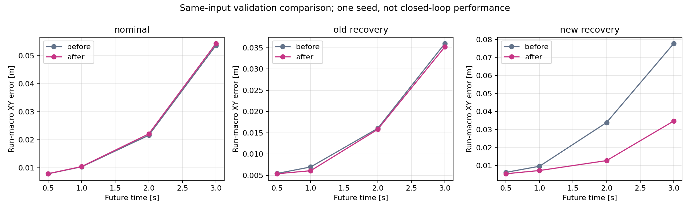
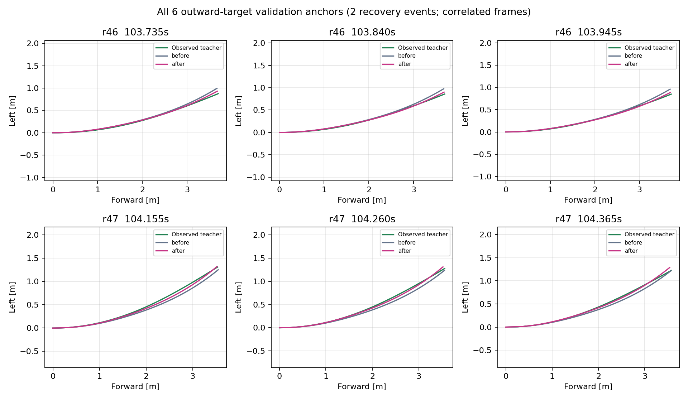

# 外向き復帰データ統合・同一更新予算の比較

追加した実測復帰データを既存の時間教師へ統合し、通常走行への影響と外向き復帰の予測を比較する。
編集・コミットはWindows正本、生成・学習・評価はnative WSLの共有worktree lock内で行う。
これは1seedのオフライン比較であり、新しいAWSIM走行の成功率ではない。

統合・3epochの再学習・同一入力比較を完了した。新復帰2runの3秒先XY誤差は
7.77cmから3.47cmへ55.3%減少し、教師経路をPPへ渡した操舵との一致も改善した。
通常4runは5.37cmから5.44cmへ微増。外向き初期3件の右側は3秒終端が悪化しており、
全条件で改善した結果ではない。次の固定5km/h AWSIM比較に使う候補として保存する。

## 学習前に固定する条件

- 起点は旧TimePath command OFF epoch10、SHA256
  `e857db4b67d3d9f6a77c2865cfc1fa53e9903e7a1d2d8a371407fbe009a1a44f`。
  既存の復帰学習済み重みからさらに更新する方式にはせず、前回の対照と同じ起点にする。
- 既存の通常train 36,726件と復帰train 223件を保持し、今回のtrain 729件を追加。
  unique trainは37,678件、うち復帰952件。元の20周splitと旧復帰6runの割当を保持する。
- 通常アンカーの提示数と提示位置を前回の1epochに一致させ、復帰の8,920提示枠だけを
  旧・新の復帰952件へ割り当てる。復帰の各uniqueアンカーは9回または10回提示する。
  通常36,726＋復帰8,920＝45,646提示/epoch、3epochで136,938提示・4,281更新。
  反復によって独立データ数が増えたとは扱わない。
- AdamW lr=3e-5、weight_decay=1e-4、batch32、seed42、float32、TF32無効、勾配norm上限1.0。
  optimizer・scheduler・RNGは前回と同じ条件で新規開始。最大2時間の学習実行予算。
- checkpoint選定は前回と同じ通常validation 4run＋旧復帰validation 2runの
  run等重み3秒XY誤差。新しいvalidation r46/r47の186件は選定後の比較だけに使用する。
- 校正r36/r37・評価予約r48/r49は統合しない。元20周のtest 4runも引き続き未使用。
  未割当pilot、未監査の旧V4距離教師や公開データをこの実験へ追加しない。

対照は前回の既存データだけの3epoch学習結果を再利用する。
対照checkpointは`c2fdb6fd1daf525524fe44d3f793d84b482760aa1f9f1fa84d5315222ab9fbe0`。
前回とモデル・学習・cache読込・評価のコード、PyTorch版、初期重み、学習条件を照合する。
旧cache全ファイルのbyte一致、通常アンカー提示位置、同じ初期重みのvalidation結果の完全一致を
学習前に確認する。不一致なら対照が同条件とは扱わず、学習を開始しない。

## データの準備と評価

元の正常cacheはhardlinkで再利用する。旧6本＋追加10本については原本のhashを再確認し、
既存の教師生成器で全候補を再教師化して収集時のcausal auditと採用IDを照合する。
旧cacheとの完全一致を確認するため、前回の入力・教師を黙って更新しない。
新規出力は`datasets/cache/time_recovery_expanded_20260914`と
`runs/time_recovery_expanded_training_20260914`に限定し、旧成果物は保全する。

選定後、同一入力に対する旧・新モデルを通常4run、旧復帰2run、新復帰2runで比較する。
0.5/1/2/3秒XY誤差・ADE・run等重み・支持分母を併記し、
前後方向と横方向の成分誤差も分けて、単に予測する移動距離が変わっただけか確認する。
新復帰では両正常基準に対する外向き目標アンカー6件も別集計する。
PPの点選択は現行segment方針・目標5km/h・同じ車両設定で確認する。
保存した教師状態での制御計算と、モデル自身が状態を変える閉ループ走行は区別する。
観測時点のPP成立率は全validationで集計するが、実測速度が固定5km/h試験の運用範囲を
外れるアンカーは非該当として分母を別記する。新復帰2runでは、原本Odometry・velocityを
使って0/100/200ms経過後の姿勢・速度を与え、同じ予測の経過時間に対する感度を調べる。
この経過時間は仮定した条件であり、推論遅延の実測値ではない。
未来の状態は評価器だけに渡し、モデルの入力は元のfreeze以前のまま保持する。
観測時点はcacheに記録されたsource IDから再現する。未来姿勢の補間端点に同一時刻の
複数poseがある場合は、片方を選ばず、そのPP評価の状態を非支持として分母と理由を残す。
これはモデルの経路棄却とは別に集計し、教師の重複時刻選択方針や学習済み重みを変更しない。
全群の誤差・左右差・PP成立率を報告し、平均誤差だけを根拠に走行用へ昇格させない。

## 再現コマンド

Windowsでコミット後、`tools/sync_to_wsl.ps1 -CheckOnly`、`tools/sync_to_wsl.ps1`。
native WSLの`/home/thistle/e2e_autonomous/e2e_lite_transfuser`で以下を実行する。
出力は新規作成専用。同じ結果へ再起動しない。中断時のみ同一planで`--resume`を使う。

```bash
tools/with_wsl_training_lock.sh env PYTHONPATH=src .venv/bin/python -m pytest -q
tools/with_wsl_training_lock.sh env PYTHONPATH=src OMP_NUM_THREADS=4 MKL_NUM_THREADS=4 \
  .venv/bin/python -u tools/train_time_recovery_expansion.py prepare \
  --plan configs/time_path_p1/recovery_expanded_20260914.json \
  --cache ../datasets/cache/time_recovery_expanded_20260914
tools/with_wsl_training_lock.sh timeout --signal=TERM --kill-after=20s 7200s \
  env PYTHONPATH=src OMP_NUM_THREADS=4 MKL_NUM_THREADS=4 \
  .venv/bin/python -u tools/train_time_recovery_expansion.py train \
  --plan configs/time_path_p1/recovery_expanded_20260914.json \
  --cache ../datasets/cache/time_recovery_expanded_20260914 \
  --output ../runs/time_recovery_expanded_training_20260914
tools/with_wsl_training_lock.sh env PYTHONPATH=src OMP_NUM_THREADS=4 MKL_NUM_THREADS=4 \
  .venv/bin/python -u tools/compare_time_recovery_expansion.py \
  --plan configs/time_path_p1/recovery_expanded_20260914.json \
  --cache ../datasets/cache/time_recovery_expanded_20260914 \
  --training ../runs/time_recovery_expanded_training_20260914 \
  --output ../runs/time_recovery_expanded_training_evidence_20260914/comparison_r2
```

## 統合・再学習の完了

学習sourceは`f7743b10f594170db2270f369e7911ee1a3b78fc`。
準備は524.02sで完了し、旧cacheで消費する110ファイルの全byte一致を確認した。
統合cacheのidentityは`198b05946c678c78d14692988797284d6d084122f3826f6be715993134b2b690`。
同じ初期重みを使った旧validationの結果も対照と完全一致した。

3epoch・136,938提示・4,281更新を完了し、epoch3が選定された。
各epochの提示45,646件のうち入力不成立158件、教師非支持1,208件、支持44,280件で、
対照と全epochの提示・支持件数・optimizer更新回数が一致する。
再読み込みしたbest checkpointの予測は保存済み予測と完全一致した。
学習処理本体は2,978.84s、事前照合を含むtrainコマンド全体は3,219.38sでexit 0。

| 選定用validation 6runの3秒XY誤差・run等重み | 追加前 [m] | 追加後 [m] |
|---|---:|---:|
| epoch1 | 0.05057221 | 0.05456406 |
| epoch2 | 0.04962126 | 0.05136352 |
| epoch3・両モデルの選定epoch | 0.04777034 | 0.04796020 |

この選定指標は約0.19mm増加（約0.4%）した。新しい復帰検証2runの成績ではない。
追加後のcheckpointはnative WSLの
`/home/thistle/e2e_autonomous/runs/time_recovery_expanded_training_20260914/best.pt`、SHA256は
`7ec445b6ab955e76d0d71efbd8f2f1dd3066ebe365516df38df8cf18adb56f44`。
旧checkpointとデータを保全し、大型の教師・予測配列・重みはGitへ追加していない。

学習準備source `f7743b1`のWSL全体テストは2,331 passed / 4 skipped（100.68s）。
比較source `79ee3b2274eff95bd85fd0209ee8a6b0014781bf`の追加4テストもWSLで通過し、
全体テストは2,335 passed / 4 skipped（84.32s）。4件のskipはOSQP・JSON Schema関連・
任意の公式packageが既存環境にないためで、この作業で依存環境を追加変更していない。

## 記録姿勢の曖昧性と評価器の修正

最初の比較では両モデルの推論・保存済み予測との一致・観測時点のPP計算を完了したが、
遅延状態を参照する際に`AMBIGUOUS_POSE_STAMP`で停止した。WSLの
`runs/time_recovery_expanded_training_evidence_20260914`内に`comparison.log`・
`comparison_exit.json`と`comparison/`の予測配列を保全した。
成功した比較先は同ディレクトリの`comparison_r2`で、失敗出力へ上書きしていない。

raw Odometryを調べると、r47の時刻105.024997652sに異なる姿勢が2件記録されていた。
評価器は同一時刻の複数姿勢を任意に選ばず、該当する未来状態を非支持として記録する。
age=0は、元のfreeze時点に利用可能だったanchorのsource IDから姿勢を再現する。
教師生成器が持つ未来ラベルの重複時刻選択方針、教師cache、モデル、制御器は変更していない。
したがって誤差指標は固定済み教師に対する予測誤差であり、別の高精度測位による物理誤差ではない。

新復帰186件の実データsmokeで、状態支持は0msで186件、100msで185件、200msで185件。
非支持はr47のanchor時刻104.784997657sの200ms後と104.889997655sの100ms後で、
各ageの全試行186件の分母に残す。支持された未来状態370件と教師座標の最大差は
`1.4661134032100123e-08 m`。全186件のモデル入力・未来教師30点は有効だった。
これは記録状態の整合性確認であり、AWSIM車両を再走行した結果ではない。

修正source `1feef2cf1055612c41cf85dd87541f2a39a510b9`の回帰テスト6件と実データsmokeが通過し、
WSL全体テストは2,337 passed / 4 skipped（82.09s）。

## 同一入力での比較結果

比較はsource `1feef2cf1055612c41cf85dd87541f2a39a510b9`で356.16s、exit 0。
両checkpointのSHA、既存6runの保存済み予測との完全一致、全epochの支持数・更新数一致を確認した。
選定後に新validationを評価し、評価結果を見てepochや学習条件を変更していない。

XY誤差は各run内の平均を取り、runを等重みで平均した3秒終端のEuclidean誤差。
「支持/全件」はこの誤差を計算できたアンカー数で、反復提示回数ではない。

| 検証群 | run数 | 支持/全件 | 追加前 [cm] | 追加後 [cm] | 誤差の増減 |
|---|---:|---:|---:|---:|---:|
| 通常走行 | 4 | 11,780/12,237 | 5.368 | 5.435 | +1.3% |
| 旧復帰 | 2 | 109/109 | 3.596 | 3.517 | -2.2% |
| 新復帰 | 2 | 186/186 | 7.773 | 3.475 | -55.3% |
| 新復帰の外向き目標だけ | 2 | 6/6 | 7.752 | 4.724 | -39.1% |
| 新復帰・左r46全体 | 1 | 93/93 | 8.079 | 3.493 | -56.8% |
| 新復帰・右r47全体 | 1 | 93/93 | 7.468 | 3.456 | -53.7% |

通常群の最大runは前後とも`8kmh_run06`で、3秒誤差は8.347cm→8.416cm。
通常群の平均悪化は約0.68mmだが、1seedのため統計的な同等性を証明したとは扱わない。
全有効点を等重みとするADEは、通常1.625→1.669cm、旧復帰1.399→1.367cm、
新復帰2.754→1.115cm、外向き目標3.790→1.726cmだった。

| 検証群・モデル | 0.5秒 [cm] | 1秒 [cm] | 2秒 [cm] | 3秒 [cm] |
|---|---:|---:|---:|---:|
| 通常・追加前 | 0.790 | 1.040 | 2.164 | 5.368 |
| 通常・追加後 | 0.792 | 1.047 | 2.215 | 5.435 |
| 旧復帰・追加前 | 0.544 | 0.696 | 1.603 | 3.596 |
| 旧復帰・追加後 | 0.537 | 0.608 | 1.579 | 3.517 |
| 新復帰・追加前 | 0.626 | 0.965 | 3.394 | 7.773 |
| 新復帰・追加後 | 0.549 | 0.727 | 1.279 | 3.475 |
| 外向き目標・追加前 | 0.797 | 1.771 | 5.079 | 7.752 |
| 外向き目標・追加後 | 0.730 | 1.212 | 2.402 | 4.724 |



新復帰の横方向MAEは1秒0.586→0.345cm、2秒2.763→0.870cm、3秒6.919→2.755cm。
3秒の前後方向MAEも2.420→1.748cmで、移動距離だけの修正による改善ではない。
外向き目標6件では3秒横方向MAEが7.581→3.995cmとなった一方、
前後方向MAEは1.579→2.336cmへ増え、追加後の横方向の符号付き平均誤差は左へ+3.995cm残った。

外向き目標は左3件と右3件で傾向が異なる。左の3秒XY誤差は11.846→4.828cmへ減少し、
右は3.657→4.620cmへ増加した。右の1秒は2.225→1.204cm、2秒は8.804→3.942cmへ減少している。
右側の3秒終端の悪化と、近い将来の改善を分けて記録する。



## 固定5km/hのPP計算との対応

軌道の平滑化を追加せず、両モデルの生の30点と観測教師30点を同じsegment方針へ入力した。
以下は保存済み教師状態での制御計算であり、scan監視・操舵アクチュエータ・車両運動の
閉ループ試験は含めない。0/100/200msは仮定した予測の経過時間で、推論遅延の測定値ではない。

| 予測の経過時間 | 新復帰の試行数 | 状態支持数 | PP成立・追加前 | PP成立・追加後 | 教師軌道のPP成立 |
|---|---:|---:|---:|---:|---:|
| 0ms | 186 | 186 | 186 | 186 | 186 |
| 100ms | 186 | 185 | 185 | 185 | 185 |
| 200ms | 186 | 185 | 185 | 185 | 185 |

外向き目標6件は全ageで全件支持・全件PP成立。旧復帰も観測時点で109/109成立。
通常群では両モデルとも8,780適用対象中8,256成立（94.03%）で、524件の棄却が残った。
入力不成立45件と固定5km/hの実測速度範囲外3,412件は別の非該当理由として保持する。
棄却内訳は、先読み候補の操舵実現性不足510→514件、未解決の経路の振れ12→8件、
初期進行方向の不成立2→2件。成立総数が同じでも全アンカーで同じ判定とは主張しない。
通常の教師側は未来全点支持も要求するため8,426適用対象中8,226成立で、モデルと分母が異なる。

成立率に加え、同じ状態で教師軌道をPPへ渡した操舵と、予測軌道の操舵との差を集計した。
旧・新・教師の3者が成立した共通アンカーだけで絶対差を計算し、runを等重みで平均する。

| 経過時間 | 共通支持 | 教師PPとの差・追加前 [rad] | 追加後 [rad] | 選択された観測時点からの先読み時間 |
|---|---:|---:|---:|---:|
| 0ms | 186 | 0.009103 | 0.002811 | 1.5s |
| 100ms | 185 | 0.010677 | 0.003590 | 1.6s |
| 200ms | 185 | 0.012345 | 0.004337 | 1.7s |

両モデルは全対象でこの先読み時間を選択した。外向き6件の操舵絶対差も0msで
0.018284→0.006463rad、200msで0.022846→0.009283radへ減少した。
右の外向き3件だけでも0msで0.029657→0.009789rad、200msで0.039719→0.015366radへ減少した。
したがって右側の3秒終端誤差の悪化は、この保存状態でPPが使う1.5〜1.7秒先の
操舵一致度の悪化とは一致しない。ただし、誤った終端を許容する一般的な根拠にはしない。

## 判断と残る確認

今回の同じコーナー・同程度の小ずれという検証条件では、追加データによって
復帰中の横方向予測と教師PPへの操舵一致度が改善したと判断する。
通常群の微増、右の外向き初期状態での3秒終端悪化、通常群のPP棄却は残る。
1seed・新検証2runで、6件の外向き目標はその2回の復帰に属する相関したフレームである。
収集時の横ずれピークは約10〜12cm。同じコーナー以外、大きな横ずれ、別速度域への
一般化や実車両の復帰成功率をこの比較だけで判断しない。

次の確認は`graneple@192.168.3.10`のAWSIMで、固定5km/h・同じPPと監視条件の下、
追加前後の通常走行と左右復帰を比較すること。E2E予測経路を通常のRVizへ表示し、
復帰時間・横ずれ・操舵・監視停止を記録する。この作業では新モデルによるAWSIM走行は実施していない。
元20周のtest 4runとr48/r49の評価予約は引き続き未使用で、今回の結果によるsplit変更もない。

## 保存した証拠

native WSLに重み、統合cache、元データ、全予測配列、PP詳細を保持する。
小型の結果・実行記録・図36ファイル計918,835 bytesをWindowsへ転送し、全件のSHA256を照合した。
追加の操舵一致度集計2ファイルも別途SHA256照合した。両図はローカルで表示して確認済み。

- [統合・初期値・更新予算の照合](evidence/time_recovery_expanded_training_20260914/training/matched_budget_verification.json)
- [学習完了記録](evidence/time_recovery_expanded_training_20260914/training/result.json)
- [同一入力比較の全指標](evidence/time_recovery_expanded_training_20260914/comparison/comparison.json)
- [PP操舵の教師一致度](evidence/time_recovery_expanded_training_20260914/comparison/pp_teacher_agreement.json)
- [記録姿勢の実データ確認](evidence/time_recovery_expanded_training_20260914/comparison/recorded_motion_smoke.json)
- [最終全体テスト](evidence/time_recovery_expanded_training_20260914/execution/comparison_r2_full_tests.log)
- [転送照合manifest](evidence/time_recovery_expanded_training_20260914/transfer_manifest.json)
- [追加集計の転送照合](evidence/time_recovery_expanded_training_20260914/supplementary_transfer_manifest.json)

PP一致度集計の完全な実行argv・Python式・source・終了コードは
[再現receipt](evidence/time_recovery_expanded_training_20260914/comparison/pp_teacher_agreement_recipe.json)の
`command`に保存した。native WSLのrepo rootでこのargvを実行する。既存出力は新規作成専用なので、
再集計時は出力名を変えて保全する。
