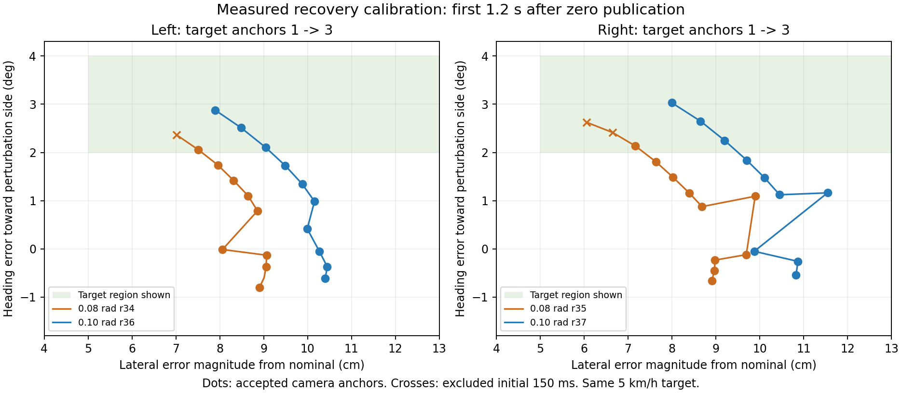

# 外向き復帰教師の追加収集（2026-09-14）

前回の±0.08 rad校正では、正常実走2本の双方を基準にして横ずれ5〜25cm・外向き2〜4度を
満たす有効cameraアンカーは左右各1件だった。ユーザーの追加収集依頼に従い、まず既存実装内の
±0.10 rad・最大2秒・一定値区間1.5秒を左右各1本で校正する。
固定目標5km/h、150msの解除後除外、状態・時間・操舵・停止領域監視を維持する。

校正IDは`codex-time-recovery-pulseleft-r36`、`codex-time-recovery-pulseright-r37`。
AWSIMは`graneple@192.168.3.10`の新しい`time_recovery_pulse_a010_20260914`内で実行し、
既存の校正キャンペーンは封印したまま保全する。今回の校正の上限は2回、同時実行は1回。
1周と将来軌道の末尾・停止を記録し、最大1800秒のシミュレータ時間制限を維持する。
通常のRVizに経路を表示する。

校正の採用条件は、各runで上記目標状態の有効アンカーが両正常基準に対して3件以上残り、
正常復帰・1周・停止を満たすこと。成立後に本収集のrun単位のtrain/validation/評価予約を
固定する。校正runを最終評価へ割り当てない。未成立の場合は無変更の大量反復へ進まない。

実行sourceは既に全体pytestが通過した`a1c9e5ad0a5c274826601338355b75d34b268186`を固定し、
554ファイルのSHA、速度整合性、参照経路、空き容量を各実行前に照合する。
新しい集計処理はWindowsでコミットしてからnative WSLに同期し、worktree lock下で検証する。

```bash
# AWSIM実行先、新しい専用root内（左右を一つずつ実行する）
python3 /home/graneple/e2e_autonomous/time_recovery_pulse_a010_20260914/start_a010_trial.py \
  --run-id codex-time-recovery-pulseleft-r36

# native WSLのrepo root
tools/with_wsl_training_lock.sh env PYTHONPATH=src .venv/bin/python \
  docs/evidence/time_recovery_expansion_20260914/summarize_expansion.py --smoke-only

# bag監査、causal replay、状態監査は前回の文書と同じCLIで、新しいraw/outputを指定する。
tools/with_wsl_training_lock.sh env PYTHONPATH=src .venv/bin/python \
  docs/evidence/time_recovery_expansion_20260914/summarize_expansion.py \
  --analysis /home/thistle/e2e_autonomous/runs/time_recovery_expansion_20260914 \
  --raw /home/thistle/e2e_autonomous/raw/time_recovery_expansion_20260914 \
  --alternate-guide /home/thistle/e2e_autonomous/runs/time_steering_pulse_20260914/alternate_nominal_guide_r31.json \
  --runs r36 r37 \
  --output /home/thistle/e2e_autonomous/runs/time_recovery_expansion_20260914/calibration_summary.json
```

原本は2本単位で梱包し、native WSLでSHA・サイズ・構造・SQLiteを照合した後に、AWSIM側の
対応原本だけを移動済み案内へ置換する。大きなデータをGitに含めない。

## 校正結果と本収集の固定計画

| 校正run | 1周 | 有効アンカー | 両正常基準で外向き目標を満たす数 | 復帰の1秒維持確認 |
|---|---:|---:|---:|---:|
| r36・左 | 278.97s | 94 | 3 | 解除後4.145s |
| r37・右 | 279.06s | 92 | 3 | 解除後4.550s |

両runで校正の採用条件を通過した。原本2,378,280,298 bytesと圧縮1,049,140,225 bytesを
native WSLで照合し、AWSIM側の原本を移動済み案内へ置換した。
校正の186件は本収集のtrain/validation/評価予約へ混ぜない。
[校正集計](evidence/time_recovery_expansion_20260914/calibration_summary.json)、
[保全確認](evidence/time_recovery_expansion_20260914/pair01_20260914_verified.json)。



緑は表示範囲内の目標状態、丸は採用cameraアンカー、×は最初の150msによる除外。
右側は横ずれと向きの符号を反転して比較しやすく表示した。

本収集は新しい`time_recovery_outward_20260914`内で最大12回、左右各6本とする。
`r38`〜`r45`の8本をtrain、`r46`〜`r47`をvalidation、`r48`〜`r49`を評価予約とし、
最初の本収集前に[固定計画](evidence/time_recovery_expansion_20260914/production_plan.json)を保存した。
計画ファイルのLFでのSHA256は`04d757dde75e6b42062a6966d5f9d05bdad1649c7e4d51980f47ded5f68bb462`。
校正summary・計画・source・参照経路のhashを各run前に検証する。
本収集で目標アンカーが0件となった場合や復帰・完走に失敗した場合は追加反復を止める。
収集後の件数に応じてsplitを付け替えない。

同じコースの同じコーナーにおける小ずれ復帰を反復収集するため、別コース・大きな横ずれへの
一般化を示すデータではない。独立runであっても状態の類似性と時間相関は残る。
モデルによる走行、学習、モデル性能評価はこの収集に含めない。

train/validationの採用runでは既存の`materialize_recovery_run`で全教師を再生成し、
`_prepare_run`で全参照画像・LiDARを読み出して入力を準備する。
アンカーID・全入力の有効性・未来30点のmaskを照合し、評価予約は学習用生成から除外する。
単独runの準備成果物であり、既存コーパスとの統合manifestと再学習は別途実施する。

追加した集計のsmokeと前回r34/r35の実データ回帰は通過した。
native WSLの全体pytestは`bb2a2da`で2321 passed / 4 skipped（85.89s）。
制御sourceは校正・本収集とも`a1c9e5a`を固定する。

## 本収集の転送・生成コマンド

各pairが正常停止し、`move_pair.pack`で閉じた2本を梱包してから実行する。
pair番号2〜7は固定計画の順序に対応する。既存出力を上書きする再実行は拒否する。

```powershell
# Windowsの正本repo。WSLの照合完了後、対応するAWSIM側の原本だけを移動済み案内へ置換する。
python -X utf8 docs/evidence/time_recovery_expansion_20260914/ship_closed_pair.py --pair 2
```

```bash
# native WSLのrepo root。全候補の監査とtrain/validationの教師・入力生成を行う。
tools/with_wsl_training_lock.sh env PYTHONPATH=src .venv/bin/python \
  docs/evidence/time_recovery_expansion_20260914/audit_new_pair.py --pair 2
```

生成先は`/home/thistle/e2e_autonomous/runs/time_recovery_expansion_20260914`内の
`materialized/<run_id>`と`prepared/<split>/<run_id>`。原本は同名の`raw`配下に保持する。
