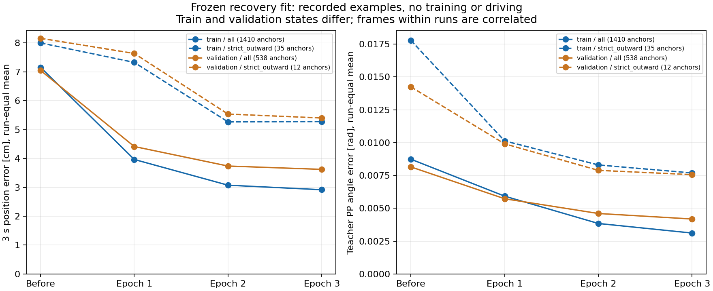
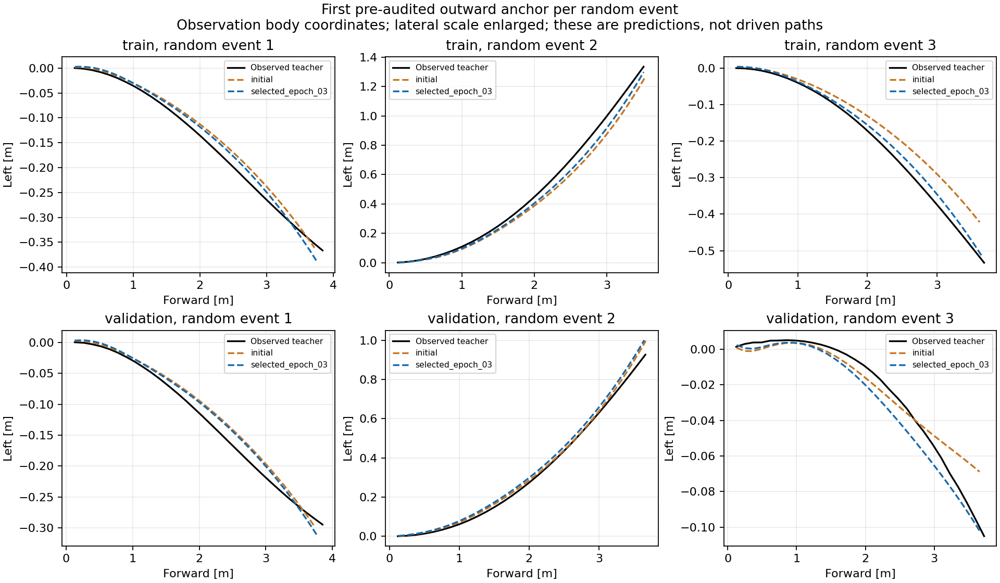

# 既存復帰データの学習到達度の確認（2026-09-15）

状態: **WSLで全対象・全4段階の評価を完了**。既存復帰の平均的な教師再現は改善しているが、学習済みの難しい外向き場面にも系統的な残差がある。
「既存復帰を全く学べていない」状態ではない。一方、「既存復帰は十分に再現でき、未学習場面のデータ量だけが問題」とも判定しない。

目的は、新モデルが学習に使用した復帰場面の教師を再現できるか確認し、未学習runの誤差と区別すること。
新たな学習、checkpoint選び直し、AWSIM走行は行わず、保存済みの学習前・epoch1・epoch2・採用済みepoch3を同じ入力で比較する。

## 固定条件

- native WSL、RTX 4080、float32、batch32、workers4。Windows確定sourceを同期し、共有worktree lock下で実行する。
- `recovery_random_update_20260915.json` の確定cache。学習に使用した復帰1,410 unique anchors、未学習の復帰538 anchors。連続frameは独立した走行ではない。
- 収集時に分類した厳格な外向き状態は学習35、検証12 anchors。モデルの誤差から都合のよいsubsetを選ばない。
- trainはtrainのまま評価し、manifestを書き換えてholdoutと称さない。検証r22/r23は従来のcheckpoint選択に使用済み、r46/r47/r65は選択後診断用。封印testのraw/cacheは読まない。
- 全対象で実入力と3 s・30点の教師支持を要求する。欠損・不正出力・順序不一致は明示的に失敗し、難しいサンプルを黙って分母から除外しない。
- 教師と予測のXY誤差（0.5/1/2/3 s）、横方向誤差、runごとの誤差、教師PPとの物理タイヤ角の差を比較する。
- PPは固定目標5 km/h、`stopping_preview_extended_v1`、観測時age0 s、同じ実測速度・車両モデル。教師がPPを成立させる母数を固定し、予測拒否は既存0.6 radペナルティで残す。scan監視や実走成功は評価しない。
- 位置・角度誤差を完走の合否閾値に転用しない。trainとvalidationは状態分布が異なるため、全体の比だけで過学習・データ不足を断定しない。

## 実行

Windowsで本解析とテストをcommit後、`tools/sync_to_wsl.ps1 -CheckOnly` と通常同期を行う。

```bash
cd /home/thistle/e2e_autonomous/e2e_lite_transfuser
tools/with_wsl_training_lock.sh env PYTHONPATH=src .venv/bin/python -m pytest -q
tools/with_wsl_training_lock.sh env PYTHONPATH=src OMP_NUM_THREADS=4 OPENBLAS_NUM_THREADS=4 \
  timeout 1200 .venv/bin/python tools/analyze_time_recovery_fit.py \
  --plan configs/time_path_p1/recovery_random_update_20260915.json --root .. \
  --output ../runs/time_recovery_fit_20260915
```

既存出力への再実行は拒否する。raw/cache/checkpointはWSLに保持する。結果はここへ追記し、少量のJSONと図だけをWindowsへ返す。

## 実データと検証の照合

- 解析source `175d9da17042ea8a11139a1208b375478e6072c6`。WindowsとWSLの同一commitへの同期を確認した。
- native WSL全pytest: **2,497 passed / 4 skipped / 65 warnings、106.59 s、exit0**。追加9ケースでtrain/validationの境界、test封印、教師をforwardへ渡さないこと、重み不変、順序、重複、入力欠損、教師未支持、異常出力を確認した。
- cache内容SHA256 `cb52a01fae1a492b5d06f1473c6ed773410934fe39a019e91c33097db340c895`。cache内の全ファイルをサイズ・SHA256で照合し、既存学習の初期重み・依存コード・条件一致の証明も再確認した。
- 全1,948対象で入力と3 s・30点教師の支持を確認。学習用15runと検証用5runは重複なし。観測した回数と提示を繰り返した回数は区別した。

| 系列 | 学習anchors | 学習run | 検証anchors | 検証run | 外向きsubset（学習 / 検証） |
| --- | ---: | ---: | ---: | ---: | ---: |
| 初期の復帰 | 223 | 4 | 109 | 2 | 今回の厳格分類なし |
| コーナー中央の操舵外乱 | 729 | 8 | 186 | 2 | 23 / 6 |
| コーナー進入の操舵外乱 | 185 | 2 | 0 | 0 | 5 / 0 |
| ランダム外乱 | 273 | 1 | 243 | 1 | 7 / 6 |
| 全体 | 1,410 | 15 | 538 | 5 | 35 / 12 |

ランダム外乱は各1run内に3イベントがあり、互いに相関する。外向きsubsetは対応する上位行に含まれる。

## 学習前から採用モデルまでの変化

「学習前」は今回の再学習の共通初期重み（通常走行で学習済みのcommand-off epoch10）。ランダム初期化モデルではない。
位置誤差は、観測時点から3 s後の予測XYと実測教師XYの距離を各run内で平均し、run間を等重みにした値。
PP誤差は同じ観測に対して教師軌道と予測軌道から計算した物理タイヤ角の差を、同様にrun等重みで平均した値。

| 対象 | 母数（anchors / runs） | 学習前の3 s誤差 | epoch1 | epoch2 | 採用epoch3 | PP誤差・学習前→採用 |
| --- | ---: | ---: | ---: | ---: | ---: | ---: |
| 学習用・復帰全体 | 1,410 / 15 | 7.159 cm | 3.966 cm | 3.075 cm | **2.917 cm** | 0.008738→0.003114 rad |
| 検証用・復帰全体 | 538 / 5 | 7.051 cm | 4.414 cm | 3.738 cm | **3.623 cm** | 0.008151→0.004183 rad |
| 学習用・外向きsubset | 35 / 11 | 8.004 cm | 7.328 cm | 5.268 cm | **5.279 cm** | 0.017787→0.007689 rad |
| 検証用・外向きsubset | 12 / 3 | 8.164 cm | 7.639 cm | 5.538 cm | **5.403 cm** | 0.014245→0.007561 rad |

学習用全体では、採用時の1 s誤差0.687 cm、2 s誤差1.181 cm、3 s横方向MAE2.261 cm。
検証用全体の対応値は0.682 cm、1.532 cm、2.740 cmだった。
全対象1,948件で教師PP・各段階の予測PPが成立し、予測拒否・NaNによる除外は0件。成立は幾何計算に限り、実走許可ではない。



## 残っている難しい場面

- 学習済み35件の外向きsubsetは全体より誤差が大きく、3 s誤差はepoch2→3で5.268→5.279 cmとほぼ横ばい。3epochのこの結果から、追加epochで必ず改善するとも、既に完全収束したとも言えない。
- コーナー中央の外向きは、学習23件の3 s横誤差が**全23件とも教師より左向き**（+0.782～+7.676 cm）。run等重みの横バイアスは+5.048 cm。検証6件も全6件が同じ向きで、横バイアス+4.418 cmだった。学習/検証双方に同方向の残差がある。
- 学習済み進入側r51の外向き1件では、教師PPの+0.15774 radに対し予測PPは+0.13047 rad、差は-0.02727 rad。3 s位置誤差は10.45 cm。この例は採用モデルの学習用外向きsubsetでPP誤差最大の事例として選んだもので、平均的な場面ではない。
- 初期の復帰は学習1.869 cmに対し検証3.582 cm。一方、コーナー中央全体は学習3.395 cm／検証3.441 cmと近い。系列によって傾向が異なるため、全体差だけで単一原因にしない。



上図は学習r64・検証r65それぞれの3イベントで、収集時に確定した外向きIDの先頭を表示したもの。見栄えによる選別ではない。前方・横方向の縮尺は異なり、実車の走行軌跡ではなく予測を示している。

## 実際の学習提示配分

既存の `RecoveryMixDataset` と `MatchedRecoveryMixDataset` を元のcache・seed42・反復設定で再構成した。
提示anchor列のSHA256が、実際の再学習の `matched_budget_verification.json` に保存された `train_anchor_order_sha256` と厳密一致することを確認した。
独立サンプルを増やした計算ではなく、同じ学習提示列の集計である。

- 1epochの全提示: **45,646**。うち復帰: **8,920**。
- 外向き35 unique anchorsの提示: **223 / epoch**。
- 外向きsubsetは復帰提示の**2.5%**、全提示の**0.489%**。

したがって、復帰全体の提示を約20%に増やしていても、今回分類した難しい初期状態には全体の約0.5%しか割り当てられていない。
これは配分を検討する根拠になるが、重みを増やせば必ず改善するという因果証明ではない。以前の配分比較でも近傍PPと遠方XYで効果が分かれているため、両指標の同時確認が必要。

## 判断と次に確認すること

既存復帰に対する学習効果は確認できた。しかし、学習に含めた難しい外向き場面にも残差があり、データ総量だけに原因を限定しない。
次は既存の難場面の配分・損失の扱いを小さく比較し、1～2 sの操舵に関わる精度と3 sの横方向誤差を併せて見ることを優先する。
失敗走行の大きな横ずれ等を覆う追加収集の必要性は別に残る。本評価は、その大きなずれへの汎化や通常完走を確認したものではない。

## 実行・保存の証跡

- 全4段階・各1,948 anchorsの推論、PP計算、描画を実行し、終了コード0、336.35 s。追加optimizer更新0、checkpoint選び直し0、新規AWSIM試験0。
- 保存済み採用モデルの検証予測との最大差は `1.1921e-6 m`。バッチ境界の異なる再計算で、事前設定した `rtol=1e-5, atol=2e-6 m` 内に一致した。
- 4つの入力checkpointのSHA256は処理前後で不変。採用モデルは実走と同じ `53e1962b97cfaa47acae3e2ad4687fac96c80672905406fdbe1514abd9563da2`。
- 原本の完全なsummary、全anchor予測・PP行は `/home/thistle/e2e_autonomous/runs/time_recovery_fit_20260915` に保存。重み・データは移動していない。
- [全グループの集計](evidence/time_recovery_fit_20260915/report_summary.json)、[提示配分](evidence/time_recovery_fit_20260915/sampling_audit.json)、[実行receipt](evidence/time_recovery_fit_20260915/time_recovery_fit_20260915_execution.receipt.json)、[pytestログ](evidence/time_recovery_fit_20260915/time_recovery_fit_20260915_pytest.log)。
- 図2点を目視確認し、軸・凡例・数値と学習/検証の区別を確認した。Windowsへ返した11ファイル・1,717,165 bytesのSHA256とサイズを[再照合](evidence/time_recovery_fit_20260915/transfer_verification.json)し、全件一致した。
