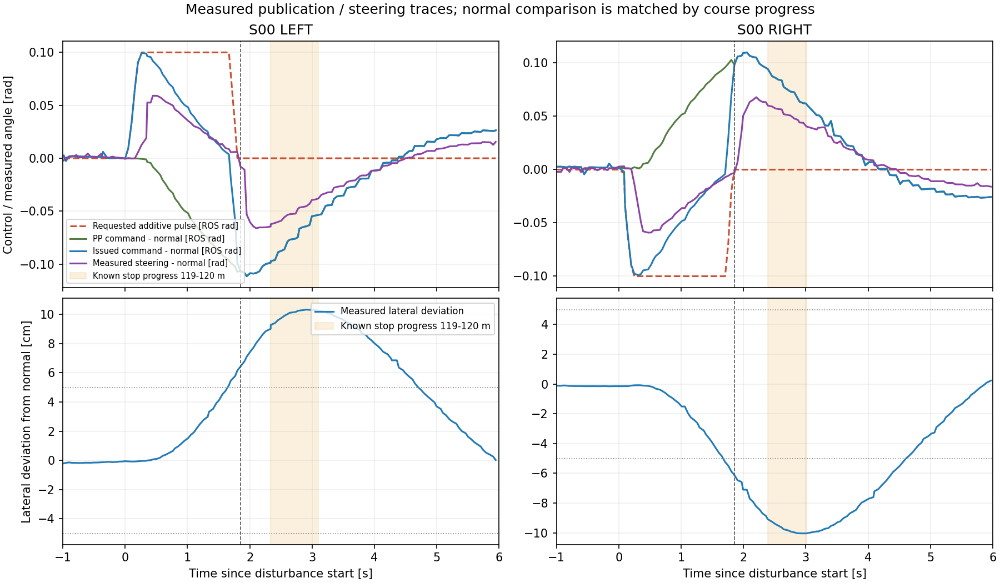

# 停止地点と外乱継続時間の実測確認

停止地点で外乱が見えないこと、低速なので約1秒は継続すべきという指摘を受け、
S00の左右走行をnative WSLで解析した。現在の追加指令は約1.85秒続いていた。
外乱の途中からPPの追従補正が反対向きに増え、最終操舵の正常走行との差が小さくなっていた。

## 停止区間と投入区間

| 観測項目 | 左外乱 | 右外乱 |
|---|---:|---:|
| 外乱開始の教師進捗 | 116.062 m | 116.017 m |
| 外乱ゼロ指令の教師進捗 | 118.393 m | 118.364 m |
| 開始指令からゼロ指令まで | 1.850 s | 1.855 s |
| 外乱解除の理由 | STATE_GOAL | STATE_GOAL |
| 最大の正常guideとの差 | 10.32 cm | 10.04 cm |
| 最大の向き差 | 3.17 deg | 3.16 deg |

既知の停止位置は教師進捗119.04〜119.86 m。停止区間119〜120 mにある記録では、
外乱の加算は左右とも0だった。現行のS00は116 mで投入し、**停止区間に最大の横ずれと復帰動作を重ねる配置**である。
「停止区間で外乱を開始する」動作にはなっていなかった。

S00を含むのはgroup 1の左右だけ。直前に走行していたgroup 2左はR02・R05・R09が対象で、S00は割り当てていなかった。
地点は8runに分けており、毎周すべての地点で外乱を入れる計画ではなかった。

停止区間から投入を開始すると、同じ応答であれば最大ずれと復帰区間も数m先へ移る。
開始位置と、ずれた観測を集めたい位置は区別して設計する必要がある。
ここでいう停止区間は正常教師へ対応付けた進捗で、逸脱したE2E車両の停止XYへ直接車体を移す意味ではない。

## 継続時間だけでは説明できない理由

設定は全体2 s、一定加算部1.5 s、release ramp 0.15 s。
今回は左右とも、横差5 cm・向き差2 degの到達条件により設定の終端より先に解除した。
1秒未満の単発発行ではない。

左側の波形を、同じ進捗の正常教師走行と比較すると次のようになった。

| 外乱開始から | 加算する外乱指令 | PP指令の正常走行との差 | 最終指令の正常走行との差 | 横ずれ |
|---|---:|---:|---:|---:|
| 約0.5 s | +0.100 rad | -0.012 rad | +0.088 rad | 0.11 cm |
| 約1.0 s | +0.100 rad | -0.052 rad | +0.048 rad | 1.53 cm |
| 約1.5 s | +0.100 rad | -0.088 rad | +0.012 rad | 4.14 cm |
| 約3.0 s | 0 rad | -0.055 rad | -0.055 rad | 10.31 cm |

PPは乱れを見て復帰方向の操舵を出している。加算指令を一定にしても、車両へ送る最終指令は一定ではない。
右側でも対称に近い挙動を確認した。低速時の応答遅れに加え、この補正が外乱の見かけの強さを下げている。
1秒へ短くするだけでは、今より横ずれが小さくなる可能性がある。



図の薄い黄帯が停止区間119〜120 m、縦破線が外乱ゼロ指令。
入力指令のradと車輪の実測radは同じ値になるとは限らず、図では別の系列として表示している。
正常教師との比較は進捗対応であり、完全に同じ状態を再走行した反実仮想試験ではない。

`pulse.effective_rad` は、その瞬間の既発行角を起点にした上限処理前後の局所的な差である。
正常走行との差や、外乱全体の残存割合を表す値ではない。この値だけで「実操舵を1秒維持した」と判定しない。

## 次の修正案

これは方針案であり、下記の制御変更や新条件での走行はまだ実施していない。

1. S00の「投入開始区間」と「復帰観測を集めたい区間」を明示する。投入そのものを停止区間へ合わせる場合は119〜120 mの窓を候補にする。最大ずれを停止区間へ合わせる目的なら、手前からの投入を維持する。
2. 約1秒の外乱生成と、その後のPPによる復帰を明確に分ける方式を比較する。候補は、外乱中だけ正常教師の基準操舵を使い、実際のずれに反応したPP補正が直ちに相殺しないようにする方式。曲率が変わる場所で単に直前の角度を固定する方式は使わず、基準操舵の支持範囲を確認する。
3. 外乱の開始・一定加算・解除・復帰の各時刻、最終指令、実測車輪角、横差・向き差を保存し、1秒の目標保持を満たしたかで分類する。5 cm到達時の解除条件も目的のずれ量に合わせて見直す候補にする。
4. 既存の停止監視、操舵上限、横差25 cm・向き差4 deg等による解除は維持する。制限で早期解除した試行を「1秒保持成功」や大きな逸脱の教師として数えない。

まずS00専用の左右比較を用意する案が、位置と外乱方式の影響を分けて確認しやすい。
毎周S00を入れる希望の場合は、残りのランダム地点との組合せと有限試行数を組み直す。
既存の22予定イベントを、成功するまで無制限に増やす運用にはしない。

## 収集の現状

ユーザーの指摘を受け、Windows側の所有する継続・収集管理プロセスだけを停止し、
実行中だったremote側の1周は既存の監視の下で完走・正常停止・bag閉鎖まで終えた。
後続runの開始には `collection_pause.json` の検査を加えた。

- 完了: 正常教師2run、復帰3run。投入・オンライン復帰確認は計7イベント。
- WSLで教師生成・入力検証まで完了: 最初の復帰2run・4イベント・351 anchor。
- 直前のgroup 2左: 3イベント、正常停止・bag閉鎖を確認。原本と転送用manifestはremote専用rootに保全。WSLでの教師生成は未実施。
- 現在の走行コンテナ: 0。後続の5予定runは未開始。
- 制御本体・モデル・学習条件は変更していない。再学習も実施していない。

## 証拠と実行方法

[区間と継続時間](evidence/time_recovery_location_duration_20260915/duration_and_location.json)、
[操舵の実測比較](evidence/time_recovery_location_duration_20260915/s00_control_samples.json)、
[正常停止確認](evidence/time_recovery_location_duration_20260915/location_duration_pause_confirmation.json)。
解析対象のcontrol/reference/resultは転送manifestのSHA-256で再照合した。小さい出力のWindows側コピーもhash照合済み。

Windowsで用意したスクリプトを、下記のnative WSLコマンドへstdinで渡して実行した。
出力先は `runs/time_recovery_sites_20260915/location_duration_review`。同じ出力先へ再実行しない。

```bash
cd /home/thistle/e2e_autonomous/e2e_lite_transfuser
tools/with_wsl_training_lock.sh env PYTHONPATH=src .venv/bin/python - < docs/evidence/time_recovery_location_duration_20260915/analyze_location_duration.py
tools/with_wsl_training_lock.sh env PYTHONPATH=src .venv/bin/python - < docs/evidence/time_recovery_location_duration_20260915/analyze_control_waveforms.py
```

両解析は正常終了し、図の表示を確認した。今回は解析と運用停止の変更で、既存の制御・モデルに対するpytestの再実行はしていない。
