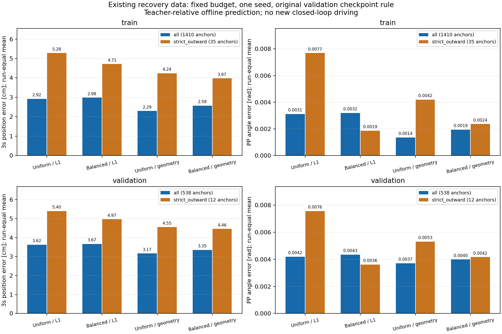

# 既存復帰データの提示配分・学習指標の比較

2026-09-15。**WSLで新規3条件の学習と、現行方式を含む4条件の比較を完了した。**
同じデータ・同じ更新予算でも、難しい復帰場面の位置誤差とPP操舵角誤差を減らせた。
既存復帰データの提示配分・学習指標には改善余地があり、データ量だけを原因とする見方は支持しない。
ただし、最良の条件は指標によって異なり、全走行での遠方誤差の改善やAWSIM完走は確認していない。

## 結果

全条件の採用epochは、事前に固定した従来6 runの検証基準で**epoch3**だった。
位置誤差は教師とのXY距離、PP誤差は教師との物理タイヤ角の差。いずれもrun間を等重みにし、小さいほどよい。
比較は同一コース・単一seedのオフライン評価。外向きsubsetの検証12地点は3 runに限られ、相関したframeを独立試行とは数えない。

|対象・指標|現行 `uniform_l1`|提示配分 `balanced_l1`|追加損失 `uniform_geometry`|両方 `balanced_geometry`|
|---|---:|---:|---:|---:|
|学習・復帰全体1,410地点 / 15 run、3 s XY [cm]|2.917|2.980|**2.294**|2.575|
|検証・復帰全体538地点 / 5 run、3 s XY [cm]|3.623|3.665|**3.167**|3.352|
|学習・外向き35地点 / 11 run、3 s XY [cm]|5.279|4.715|4.236|**3.974**|
|検証・外向き12地点 / 3 run、3 s XY [cm]|5.403|4.967|4.554|**4.456**|
|学習・外向き、PP角度 [rad]|0.007689|**0.001864**|0.004196|0.002366|
|検証・外向き、PP角度 [rad]|0.007561|**0.003616**|0.005306|0.004157|
|検証・復帰全体、PP角度 [rad]|0.004183|0.004337|**0.003707**|0.003987|
|検証・復帰全体、1 s XY [cm]|0.682|**0.678**|0.882|0.876|
|通常検証4 run、3 s XY [cm]|5.428|**5.392**|5.625|5.519|
|採用基準の従来6 run、3 s XY [cm]|**4.813**|4.846|4.932|4.866|



`balanced_geometry`は現行方式に対して、学習用外向きの3 s位置誤差が24.7%、検証用外向きが17.5%、
検証用外向きのPP誤差が45.0%減った。検証用外向きの3 s横方向MAEも3.979→2.979 cmに減った。
学習用外向き11 runのうち、位置誤差は9 run、PP誤差は10 runで改善した。
一方、通常検証4 runの3 s誤差は5.428→5.519 cm（+1.7%）、復帰検証全体の1 s誤差は0.682→0.876 cm（約1.94 mm増）となった。

`balanced_l1`は外向き検証のPP誤差を52.2%減らし、この指標では最良だった。
ただし復帰全体の3 s誤差・PP誤差は現行方式より少し大きい。
`uniform_geometry`は復帰全体の3 s誤差・PP誤差で最良だが、通常走行の3 s誤差は+3.6%だった。
今回の4条件に、すべての指標で他条件を上回る方式はない。

## 残っている場面別の課題

以下は外向き検証12地点をrun別に分けた値。各セルは`3 s XY [cm] / PP角度 [rad]`。

|検証run|地点数|現行|提示配分|追加損失|両方|
|---|---:|---:|---:|---:|---:|
|左向き外乱 r46|3|5.270 / 0.003529|4.171 / 0.001102|2.754 / 0.003443|3.552 / 0.002319|
|右向き外乱 r47|3|4.896 / 0.010768|6.288 / 0.002838|5.156 / 0.004349|5.426 / 0.002802|
|ランダム外乱 r65|6|6.044 / 0.008387|4.443 / 0.006909|5.751 / 0.008126|4.389 / 0.007349|

全3 runでPP誤差は改善したが、r47の3 s位置誤差は新規3条件すべてで悪化した。
`balanced_geometry`でもr47は4.896→5.426 cm、左バイアスは+3.851→+4.458 cmである。
平均改善を、各コーナーで遠方の復帰軌道が改善したことと同一視しない。

コーナー中央の外向きについては、全4条件で学習23地点・検証6地点すべてが3 s時点で教師より左寄りだった。
`balanced_geometry`のこの系列のrun等重み左バイアスは、学習+5.048→+3.830 cm、検証+4.418→+3.715 cm。
残差は減ったが、方向の偏りは残っている。

前回の学習用外向きでPP誤差が最大だったr51の同一地点
`codex-time-recovery-earlyright-r51:epoch0000:94389997890`では、教師PPは+0.157735 rad。
現行予測+0.130468 radに対し、提示配分変更は+0.155999 rad、両方変更は+0.159092 radになった。
3 s位置誤差も10.450→0.977 / 1.148 cmに減った。この地点は学習に使用済みの例であり、未知の進入状態への復帰保証ではない。

## 判断と次の比較候補

既存データをさらに繰り返す配分と、操舵・遠方横位置を含める学習指標の両方に効果があった。
したがって、今回の残差には**既存データの学び方で減らせる部分がある**。
この結果から、データが十分、モデルが完全に収束、実走時の失敗原因がすべて解消、とまでは判断しない。
補助損失の2項は同時に追加したため、操舵項と遠方Y項それぞれの寄与も今回単独では切り分けていない。

次のAWSIM比較候補は、外向きの遠方XYとPPの両方が改善した`balanced_geometry`を第一候補、
外向きPPで最良の`balanced_l1`を対照候補とする。現行checkpointを保全し、実行モデルの自動切替は行っていない。
通常走行への影響とr47の残差があるため、候補の優劣は固定5 km/h・同じ初期条件のAWSIM走行で確認する必要がある。
合格基準はユーザー指定の完走を維持し、今回のcm・radの改善を完走合格に読み替えない。
新しい収集は、走行比較で残る失敗状態を特定してから、その状態を含む観測と復帰教師を増やす方針が妥当。

## 事前に固定した比較計画

既存復帰データの学習不足を、データ追加なしで切り分ける4条件の2×2比較。

|条件|復帰データの提示配分|学習指標|
|---|---|---|
|uniform_l1|現行の均等提示|現行XY L1。完了済みモデルを条件照合後に再利用|
|balanced_l1|外向き35地点を復帰提示の25%にする|現行XY L1|
|uniform_geometry|現行の均等提示|XY L1 + 復帰用操舵・遠方横位置誤差|
|balanced_geometry|外向き35地点を復帰提示の25%にする|XY L1 + 復帰用操舵・遠方横位置誤差|

既存cache SHA `cb52a01fae1a492b5d06f1473c6ed773410934fe39a019e91c33097db340c895` を使用する。
train 38,136地点（復帰1,410地点）、復帰15 run。各epoch 45,646提示、うち通常36,726・復帰8,920。
均等提示の外向き状態は223提示/epoch、比較条件は2,230提示/epoch。同じ35地点を繰り返すため、独立した観測が増えるわけではない。
外向き対象の11 runへ均等配分し、残りの復帰地点も全地点残す。通常走行の提示位置とデータの内容は不変。

初期重みは共通の通常走行学習済み `time_p1_20laps_20260913/command_off/best.pt`。
seed 42、float32、batch 32、AdamW lr 3e-5・weight decay 1e-4、gradient clip 1、cosine schedule。
3 epoch・4,281更新・136,938提示/条件。新規3条件は各7,200秒の外側上限を置き、逐次実行する。
単一seedであり、多seedでの改善の再現性までは検証しない。

追加損失は次の固定式。重みは比較結果を見る前に固定し、比較専用validationで調整しない。

`L = mean_supported_anchor( XY_L1 + recovery * (1.0 [m/rad] * abs(delta_PP_rad) + 0.5 * mean_abs_y_error_2_to_3s_m) )`

教師経路に実際のPure Pursuit選点を適用して、時刻と速度依存の応答長を固定する。
同じ時刻で予測経路・教師経路を線形補間し、rear axleへ約1 mm変換した後、
`atan(2 * response_length_m * y / (x*x + y*y))` の物理タイヤ角誤差を求める。
1 radの誤差を1 m相当として加え、遠方Yの0.5倍を追加する。これは初回の比較用設定で、最適値との主張はしない。
遠方は2.0〜3.0秒の11点。通常走行には追加損失を適用しない。
全支持anchor数で正規化し、未支持教師で薄めない。復帰用教師の欠損は明示エラー。
追加情報はモデルforward後のloss専用で、画像・LiDAR・ego入力には追加しない。

操舵損失は教師が選んだ時刻を固定する微分可能な近似であり、予測ごとのruntime選点そのものではない。
学習・診断ともfixed 5 km/h、`stopping_preview_extended_v1`、観測時点age=0。
停止領域監視・遅延・実操舵追従はこの追加損失に含まない。診断では実際のPP選点も別に通して比較する。

epoch選択は従来の6 validation runのrun等重み3秒XY誤差の最小を維持する。
復帰r46/r47/r65は選択後の診断専用。train全復帰1,410地点・外向き35地点、validation全復帰538地点・外向き12地点を比較する。
通常validation4 runの誤差も確認する。各runの結果を残し、相関したframeを独立試行とは数えない。
封印testのraw/cacheは読まない。AWSIM完走は別の検証であり、オフライン改善だけで合格とはしない。

既存runnerへ既定OFFの追加loss引数だけを設ける。default経路のASTが基準commitと等しいことを検査する。
過去の厳密なsource proofは緩めず、今回専用の差分検証を用いる。旧実験toolを再現する場合は旧commitを使用する。

Windowsでcommitし、`tools/sync_to_wsl.ps1 -CheckOnly`、`tools/sync_to_wsl.ps1`の`SYNC_OK`を確認してから実行する。
WSL native repo `/home/thistle/e2e_autonomous/e2e_lite_transfuser` で以下を実施する。

```bash
tools/with_wsl_training_lock.sh env PYTHONPATH=src OMP_NUM_THREADS=4 OPENBLAS_NUM_THREADS=4 .venv/bin/python -m pytest -q
tools/with_wsl_training_lock.sh env PYTHONPATH=src OMP_NUM_THREADS=4 OPENBLAS_NUM_THREADS=4 .venv/bin/python tools/compare_time_recovery_objectives.py prepare --plan configs/time_path_p1/recovery_objective_comparison_20260915.json
# ARMを balanced_l1 / uniform_geometry / balanced_geometry として各1回実行
tools/with_wsl_training_lock.sh timeout --signal=TERM --kill-after=20s 7200s env PYTHONPATH=src OMP_NUM_THREADS=4 OPENBLAS_NUM_THREADS=4 .venv/bin/python tools/compare_time_recovery_objectives.py train --plan configs/time_path_p1/recovery_objective_comparison_20260915.json --arm "$ARM"
tools/with_wsl_training_lock.sh env PYTHONPATH=src OMP_NUM_THREADS=4 OPENBLAS_NUM_THREADS=4 .venv/bin/python tools/compare_time_recovery_objectives.py compare --plan configs/time_path_p1/recovery_objective_comparison_20260915.json
```

重み・全予測・実行logはWSLの`runs/time_recovery_objective_comparison_20260915`へ保存し、Gitには含めない。

## 実行条件の照合

- 学習・評価source: `d8ed290ebb47d3336161614c25a0aac7c243c66c`。Windowsから同一commitをnative WSLへ同期し、worktree lock下で実行した。
- 同一sourceの全pytest: **2,517 passed / 4 skipped / 66 warnings、119.34 s、exit0**。追加損失のshape・単位・勾配、教師のdetach、通常走行への非適用、未支持復帰教師の明示エラー、再開時の条件不一致、既定runnerのAST一致を含む。
- データ・更新予算の事前照合SHA256: `213fd49dc4cf420c86ead674818cfe5e906f6e3aa4417b0dc11e5459bfb6657e`。
- 初期checkpoint SHA256: `e857db4b67d3d9f6a77c2865cfc1fa53e9903e7a1d2d8a371407fbe009a1a44f`。通常走行で学習済みの重みであり、ランダム初期化ではない。
- 初期6 run平均3 s誤差は`0.05945738963782787 m`。保存済みの初期検証を厳密に再現した。
- 復帰教師1,410地点すべてで実際のPPが成立。教師固定時刻の微分可能な式と実PPの角度差は最大`7.350016567597706e-09 rad`。
- 新規学習の各epochでは45,646提示中、入力無効158・教師未支持1,208・支持44,280。復帰の比較対象は入力と30点すべての教師支持を要求し、欠損による対象の選別を行わない。

全実行stageはexit0。新規3条件の`comparison_verification.json`はすべてPASSで、
初期重み・初期検証の一致、4,281更新・136,938提示、保存重みを再読込した予測の厳密一致を確認した。
共通評価でもcheckpoint SHA256を読込前後に確認し、重みを更新していない。
教師1,948地点と全4モデルの予測でPPが成立し、予測拒否によるペナルティ・除外は0件だった。
保存済み選択用予測と、共通評価で再推論した重複する復帰109地点との差は最大`9.5367431640625e-07 m`。
バッチ構成を変えた再推論については`rtol=1e-5, atol=2e-6`で照合し、厳密一致の再読込検査とは区別する。

|条件|採用epoch|checkpoint SHA256|
|---|---:|---|
|uniform_l1|3|`53e1962b97cfaa47acae3e2ad4687fac96c80672905406fdbe1514abd9563da2`|
|balanced_l1|3|`b790087969a4309dcf1fa61e9ad5f6fbe0e5f9faf0b41c3b251111c9143f6514`|
|uniform_geometry|3|`81fbc926343a119b2d5a8f6036a790dad84204a7621a5cfb82c4b2e2be3141c1`|
|balanced_geometry|3|`bfa2cd54bed61491928a409167a02a8014fd46f22f689729d93498859936da3e`|

事前照合288.03 s、新規学習stageは順に3,868.18 / 3,686.01 / 3,027.99 s、最終比較316.05 s。
stage時間は設定照合・初期検証・各epochの検証・再読込を含む運用時間であり、バッチサイズの速度比較ではない。
各条件の外側上限7,200 s、比較の上限1,800 s内で完了した。

比較の位置誤差は、観測から3 s後の予測XYと実測教師XYの距離をrun内で平均し、run間を等重みにする。
操舵誤差は、予測経路・教師経路をそれぞれ実際のPP計算に通した物理タイヤ角の絶対差を同じ方法で集計する。
教師PPが成立する母数を固定し、予測拒否は0.6 radのペナルティとして分母に残す。
横方向の符号は観測時車体座標の左が正。横バイアスと横方向MAEを分けて記録する。

完了後のJSON集計・小規模な根拠ファイルの出力も、Windowsで確定したスクリプトを同期してWSLで行う。
この集計はモデルやdatasetを読み直さず、上記比較で保存した指標・地点別JSONを使用する。
地点別結果から再計算した外向きsubsetのrun等重み位置誤差・PP誤差が元の集計と一致することを要求する。

```bash
tools/with_wsl_training_lock.sh .venv/bin/python docs/evidence/time_recovery_objective_comparison_20260915/summarize_results.py ../runs/time_recovery_objective_comparison_20260915 ../runs/time_recovery_objective_comparison_20260915_execution/post_analysis_final
tools/with_wsl_training_lock.sh .venv/bin/python docs/evidence/time_recovery_objective_comparison_20260915/export_evidence.py ..
```

元の詳細`comparison/summary.json`と全予測配列はWSLに保持する。Windowsには各群の指標・外向き47地点の対応結果をまとめた
`comparison/paired_analysis.json`、学習の結果・検証記録・図をコピーし、転送元と転送先のサイズ・SHA256を照合する。

最終集計・転送準備のsourceは`1f39bcb985a08f76274c6d63ba04205747e3f27a`。
全47地点・全4モデルの対応と、元の集計への再集計一致検査をWSLで通過した。
根拠33ファイル・1,261,996 bytesのサイズ/SHA256を照合してWindowsへ転送した。
[転送検証](evidence/time_recovery_objective_comparison_20260915/transfer_verification.json)、
[学習・比較の実行記録](evidence/time_recovery_objective_comparison_20260915/execution/experiment_receipt.json)、
[地点別比較と各群の指標](evidence/time_recovery_objective_comparison_20260915/comparison/paired_analysis.json)を保存した。
図は出力ファイルを表示して、ラベル・単位・数値・母数の表示を確認済み。
追加集計は保存JSONを扱う処理で、学習実装は全pytest後に変更していない。

封印testとAWSIM走行はこの比較の対象外。検証用の復帰538地点のうち、r22/r23の109地点は従来のepoch選択にも使い、
r46/r47/r65の429地点は選択後の比較だけに使う。外向き検証12地点は3 runに限られるため、多様な逸脱への復帰保証とはしない。

## バッチ拡大による速度の質問への観測

実行中にユーザーからGPU使用率とバッチ拡大の質問があったため、学習設定を変えずに読み取りのみの観測を行った。
`balanced_l1`のepoch3で、4 s間隔・24 s・7点のGPU全体使用率は18〜94%、使用VRAMは約10,220 / 16,376 MiBだった。
Windows側プロセスと予約領域を含むGPU全体の値であり、当該学習だけの割当量ではない。
直近の50更新の所要時間は31.54〜33.41 s、1更新あたり約0.65 sだった。
後続条件では同じbatch32でも約0.53〜0.54 sの区間があり、実行中の所要時間には変動がある。

[以前の計算部分だけの測定](time_path_p1_training_20260913.md)では、合成入力・FP32・batch32のforward/backwardが約0.25 sだった。
この異なる測定の値を仮に組み合わせ、計算部分の0.25 sだけが半減して他の時間が一定と置くと、
`0.65 / (0.65 - 0.25 + 0.25 / 2) = 1.238`倍、60分が約48分になる。
これは条件付きの概算であり、batch48/64を実測した高速化率ではない。使用率だけから2倍などの高速化は推定できない。

現行のCPUでのtensor結合・GPU転送・入力待ちも調査候補になる。
固定メモリと非同期転送は[PyTorch公式の性能改善ガイド](https://docs.pytorch.org/tutorials/recipes/recipes/tuning_guide.html)に記載されるが、
今回の実装での効果は未測定。バッチ変更は同じ提示数でのoptimizer更新回数と学習挙動も変えるため、
この4条件比較ではbatch32・FP32を維持した。大きいバッチや混合精度の速度・精度比較は本実験には含めない。
