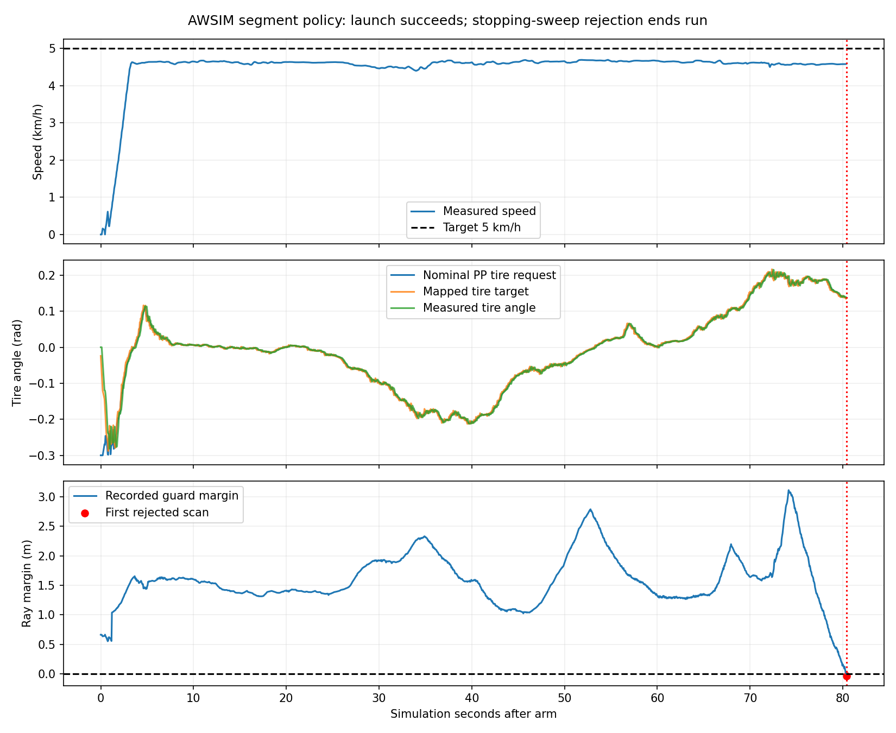

# 線分内の先読み位置選択と固定5km/h追従評価

ユーザー承認済みの[整合性調査の方針](time_lookahead_alignment_audit_20260914.md)を実施する。
Windows正本で実装し、native WSLでテスト・記録評価、AWSIMはgraneple@192.168.3.10で実施する。

## 実装と固定条件

- 新ポリシー`stopping_preview_segment_v1`を追加。旧ポリシーは過去記録の再現用として保持する。
- 最初に現行と同じ元の点を検索する。成立する点があれば位置・操舵・加速指令を保持する。
- 全点不成立のときだけ、元の隣接線分内の成立区間を求め、中点をfloat32で再検査する。
- raw予測・時刻順・後輪座標変換を保持。距離帯と0.3rad上限、速度目標5km/h、安全監視は維持。
- 選択方法、元の参照点番号、補間比率、残り時刻、観測からの時刻、距離・操舵余裕を指令詳細へ記録する。
- 診断で検証済みの線分境界計算をROS非依存の共通control moduleへ抽出する。
- checkpointは復帰学習epoch3、SHA `c2fdb6fd1daf525524fe44d3f793d84b482760aa1f9f1fa84d5315222ab9fbe0`。
- 新configは旧候補configからlookahead_policyのみ変更する。

## 検証手順と有限予算

1. WSLで全pytest、保存済み新旧試験の比較。既存成立指令は完全一致、無関係な拒否は維持すること。
2. 専用deploymentへ転送・ハッシュ確認、Humble build、ROS_DOMAIN_ID=93・network noneでsmoke。
   記録経路と停止した合成センサによる線分選択を、PP・応答補償・入力制限・clear scan監視まで通す。
3. 実行先の既存環境・資産・通常RVizを確認し、固定5km/h目標で1周を目標に試験。
   1試行600秒走行・720秒outer、最大2試行。同じ物理的失敗の繰り返しで設定は緩和しない。
4. 実記録をnative WSLへ戻し、選択点・操舵応答・先読み距離不足・停止理由を評価する。

```powershell
./tools/sync_to_wsl.ps1 -CheckOnly
./tools/sync_to_wsl.ps1
```

```bash
bash tools/with_wsl_training_lock.sh env PYTHONPATH=src OMP_NUM_THREADS=4 OPENBLAS_NUM_THREADS=4 \
  .venv/bin/python -m pytest -q
bash tools/with_wsl_training_lock.sh env PYTHONPATH=src OMP_NUM_THREADS=4 OPENBLAS_NUM_THREADS=4 \
  .venv/bin/python tools/evaluate_time_segment_policy.py \
  --records ../runs/time_recovery_finetune_evidence_20260914 \
  --output ../runs/time_segment_policy_20260914
```

保存状態でのPP成立・仮の操舵指令列は、動いた後の予測や実scanの通過を保証しない。
ROS smokeの合成センサ試験と、AWSIMでモデルが出した予測による走行結果を区別する。

## 実行結果

実装sourceは`d990fd6e893841167d7974f8d5058b35185ffab5`。
native WSLで2,264 passed / 4 skipped / 64 warnings、記録比較もexit 0。
旧記録の成立1,956指令は位置・操舵・加速が完全一致し、応答補償・操舵マッピングのreplayも一致。
候補の103指令はすべて線分内選択でPP成立。元のraw予測は保持した。

証跡原本: `/home/thistle/e2e_autonomous/runs/time_segment_policy_evidence_20260914`と
`/home/thistle/e2e_autonomous/runs/time_segment_policy_20260914`。
AWSIM専用deployment `/home/graneple/e2e_autonomous/time_segment_following_20260914`で
source 737ファイル・install 216ファイルの一致、Humble build、isolated ROS smokeの成功を確認。
ROS smokeでは線分選択25指令が応答補償・操舵マッピング・clear scan監視まで到達した。

AWSIM `codex-time-segment01`を1試行実施。固定5km/h目標で発進し、約100.44m・80.62秒走行。
実測最高4.692km/h、区間0→1→2まで進み、`STOPPING_SWEEP_OCCUPIED`で終了。完走は未達。
最初の拒否時は先読み1.933m、PP要求タイヤ角0.132636radであり、PPは成立していた。
最初のscan拒否は走行許可から80.400秒。80.620秒はfreezeまでの記録区間である。
最初の拒否後に同じfaultを出し続けた指令は、原因解析の母集団から除外した。

simulatorは監視faultでfreezeして終了。freeze前の物理的な停止確認は取れていない。
終了後のAWSIM/RViz/process/稼働containerは0、既存停止container114件と既存Git差分を保全。
RViz設定は事前のbytesへ復元し、scene/vehicle/DLL hashの一致を確認した。
74件の記録をSHA-256照合しnative WSLの
`/home/thistle/e2e_autonomous/runs/time_segment_awsim_evidence_20260914`へ保存した。
WSLで実指令replayは1,608件一致（うち操舵マッピング1,603件）、評価はexit 0。

### 発進で改善したことと残った不成立

| 最初の安全拒否までの実指令 | 件数 |
|---|---:|
| TIME_PATH_TRACKING | 1,602 |
| STEERING_FEASIBLE_LOOKAHEAD_MISSING | 5 |
| STALE_scan | 1 |
| 最初のSTOPPING_SWEEP_OCCUPIED | 1 |

実試験の発進直後0.000〜0.210秒の5指令で線分内選択を使用した。
その同じ状態で旧ポリシーを再計算すると、5指令すべて先読み不成立になる。
その他の成立点は元の点であり、旧ポリシーの位置・操舵・加速と一致した。
1,603指令の選択方法、元の参照点、補間係数、残り時刻のメタデータも再現した。

一方、発進0.265、0.315、0.355、0.655、0.705秒には、線分内でも採用点がなく5回ブレーキ指令となった。
発進不能は解消したが、初期の先読み不成立が完全になくなったわけではない。
以前の停止した保存記録103/103件の成立は、その保存状態に対する結果であり、この新しい走行の全指令の成立率ではない。

目標速度は5km/hを保持した。実測最高は4.692km/h、最後の3秒の実測中央値は4.578km/h。
実測速度が常に5km/hへ一致したという結果ではない。速度制御の設定は今回変更していない。

### 最後に停止した原因の切り分け

| 最初の停止監視の拒否時 | 値 |
|---|---:|
| 実測速度 | 4.5805km/h |
| 許容先読み距離帯 | 1.84563〜2.34563m |
| 選択距離 / 元の参照点番号 | 1.93326m / 16 |
| 変換後の予測最遠距離 | 3.57545m |
| PP要求タイヤ角 | 0.132636rad |
| 実測タイヤ角 | 0.138490rad |
| 応答補償後のタイヤ角目標 | 0.128459rad |
| PPの0.3rad上限までの余裕 | 0.167364rad |
| 停止監視の光線余裕 | −0.040305m |

最終停止時は元の点が距離・角度条件を満たし、予測距離も足りていた。
最後の5秒・100指令では、実舵角−PP要求角は−0.008286〜+0.008411rad、
平均+0.000642rad。操舵入力の速度制限に当たった指令は0件だった。
この区間に大きな操舵飽和があったという証拠はない。

同じscan・姿勢・実測速度・yaw rate・実舵角・前指令を保持した、単独指令の感度比較:

| 操舵計算の条件 | 最小光線余裕 | 監視結果 |
|---|---:|---|
| 実際の応答補償・入力制限 | −0.040305m | 不成立 |
| 応答補償を省いた計算 | −0.024803m | 不成立 |
| 前の操舵入力を保持する計算 | −0.022552m | 不成立 |
| 距離帯内の他の元の点3個 | −0.054335〜−0.070400m | すべて不成立 |

光線余裕はLiDARの観測距離と停止領域監視の要求距離との差である。
物理的な衝突、車体と壁の最短距離の測定は今回未確認。
感度比較は実測状態を固定した1ステップの計算で、変更した指令による以後の車両状態は再現していない。

**今回の発進改善は点選択の変更に対応するが、最後の停止は点選択だけの問題ではない。**
現在の速度・姿勢と停止監視領域では、応答補償を省いても前指令を保持しても成立しない。
通常RVizの画像では、車両が表示された参照経路の外側へ膨らんでいる様子が見える。
定量的な横偏差や教師誤差は未算出のため、学習側だけが原因だとは断定していない。

次は、停止直前より手前からの車両位置・向きと予測経路を、同じコーナーの教師走行と比較するのが妥当。
今回の結果を理由に距離帯・操舵上限・停止監視を緩和したり、再学習を追加実行したりはしていない。
同じ条件の2回目の走行も行っていない。



### 検証・再現・証跡

- runtime source `d990fd6e893841167d7974f8d5058b35185ffab5`。
  source archive SHA-256 `1ffbff63df8b3e1b00c57722774ee5d60b41389a2bf57f15a2404fdd63facfdc`。
- WSLの全体テスト2,264件成功、4件skip。ROS smokeとAWSIMは上記runtime sourceを使用。
- 後処理の補間係数配列に約1.13e-14の環境間丸め差があったため、
  配列にも既存スカラーと同じ1e-9の照合許容を適用した。
  実行制御は変更していない。追加のreplay・車両モデル・線分テスト61件成功。
- 詳細解析source `8fba131826c001f7854eea42f8f5005e28a73092`、CLI smoke exit 0。
  初回の照合失敗ログはnative WSLに保全し、成功した解析は`attribution_v2`に保存。
- AWSIM archive SHA-256 `c8d4c1b1a29a8f99a6038716522d3e74a713fb7a3d48956bea43edcbcda72340`。
  74件のmanifest項目を照合。選んだ小規模証跡30ファイルをWindowsへコピーし再照合した。

```bash
bash tools/with_wsl_training_lock.sh env PYTHONPATH=src OMP_NUM_THREADS=4 OPENBLAS_NUM_THREADS=4 \
  .venv/bin/python tools/evaluate_time_awsim_trial.py \
  --run ../runs/time_segment_awsim_evidence_20260914/codex-time-segment01 \
  --output ../runs/time_segment_awsim_evidence_20260914/evaluation
bash tools/with_wsl_training_lock.sh env PYTHONPATH=src OMP_NUM_THREADS=4 OPENBLAS_NUM_THREADS=4 \
  .venv/bin/python tools/analyze_time_segment_tracking.py \
  --run ../runs/time_segment_awsim_evidence_20260914/codex-time-segment01 \
  --output ../runs/time_segment_awsim_evidence_20260914/attribution_v2
```

再実行では未使用の出力先を指定する。
AWSIM実行コマンドとタイムアウトは
[実行記録](evidence/time_segment_following_20260914/awsim/trial_exit.json)、
[起動wrapper](evidence/time_segment_following_20260914/awsim/run_trial.py)に保存。

主要な証跡:
[WSL記録比較](evidence/time_segment_following_20260914/wsl/summary.json)、
[ROS smoke](evidence/time_segment_following_20260914/awsim/smoke/summary.json)、
[AWSIM評価](evidence/time_segment_following_20260914/awsim/evaluation/summary.json)、
[停止原因の解析](evidence/time_segment_following_20260914/awsim/attribution_v2/summary.json)、
[通常RVizの終了時画像](evidence/time_segment_following_20260914/awsim/normal_rviz_after_freeze.png)、
[終了後の環境確認](evidence/time_segment_following_20260914/awsim/post_environment.json)。
