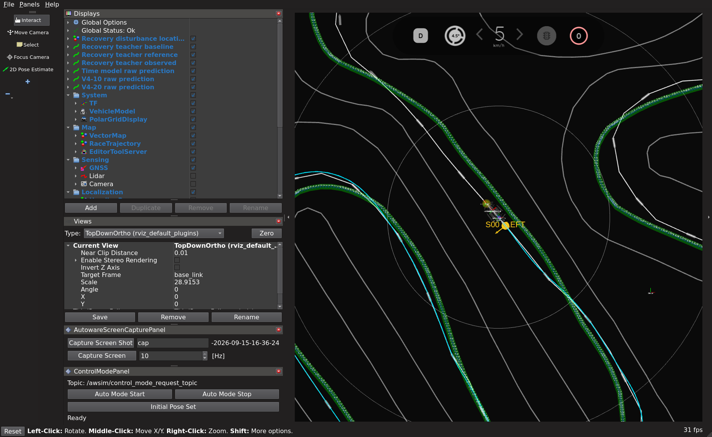
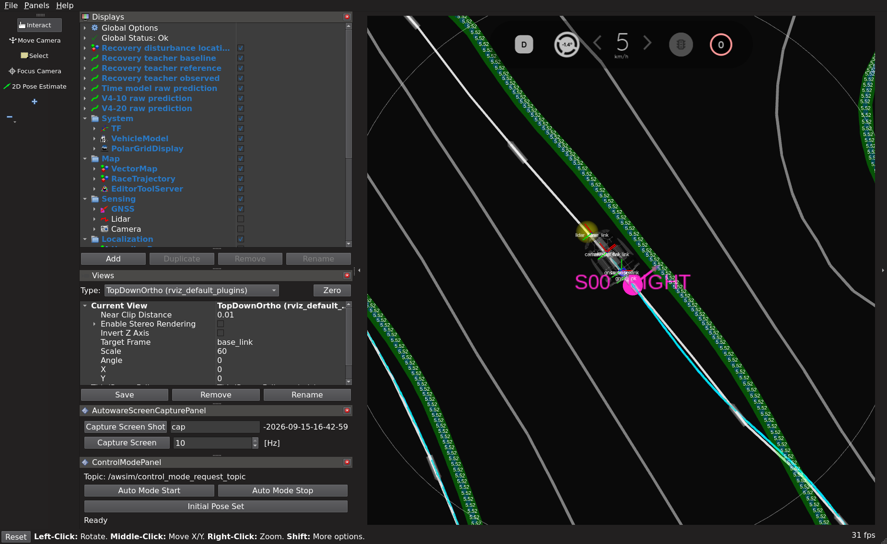

# 停止地点＋ランダム10地点の実測復帰データ収集

2026-09-15、`graneple@192.168.3.10` の AWSIM で収集を実施中。以下はgroup 1の検証完了時点。
正常教師2周は公式 Judge の1周完走・正常停止・bag閉鎖を確認した。
停止地点 S00 と追加ランダム10地点を確定し、左右各1回、8独立run・22予定イベントの有限計画を実行する。
再学習やモデル性能の改善を示す結果ではない。

## 条件と実装

- 目標速度 5 km/h、既存 Pure Pursuit、`aligned_gain4_v1`、標準監視。
- 各runは1周＋未来教師末尾＋正常停止。上限30分、成功まで自動反復しない。
- 外乱は既存の ±0.10 rad・最長2 s・plateau 1.5 s・release 0.15 s。
  これは ROS 操舵入力への加算値で、タイヤ実測角ではない。状態上限による早期解除を維持する。
- 開始2 m窓、正常guideとの横差5 cm以内・向き差1度以内などの安定1 s、監視余裕を確認する。
  窓を過ぎた地点には遅れて投入しない。復帰未確認なら同じ周の残り外乱を中止する。
- 復帰確認は横差5 cm以内・向き差2度以内・速度範囲の安定1 s。
  解除後10 sを収録し、次の外乱まで未来教師3 sの余白を確保する。
- 観測は実際の Camera / LiDAR / ego と対応する未来0.1〜3 sの実測30×2 XY。
  外乱中を正解軌道区間にせず、解除発行150 ms後以降から因果的な入力と未来全体を検証する。
- split は run 単位。S00を含む group 1〜3 を train、group 4 を validation に事前割当て。
  既存sealed testは読み込まない。

全周の名前付き投入窓は `1c95ed0` で追加した。旧単発処理へは外乱開始位置を原点にした
ローカル進捗を渡し、旧300 m上限の契約を変更しない。全周guideの支持範囲・末尾は別途検証する。
現行Xwaylandの DISPLAY / XAUTHORITY を用いる修正は `945f241`。
外乱地点の標準RViz表示は `30da4c7`。元ホストのcheckout・RViz設定は保全し、専用sourceで実行する。

## 選定した地点

現行正常走行 n03 / n02 の両方で開始条件が成立する候補から選定した。
地点選択seedは **915110**、最初の抽選で成立。追加10地点は候補を10範囲へ分けて各範囲から抽選した。
S00の対象は既知の停止判定進捗119〜120 mで、外乱開始予定は手前の116 m。
下表の進捗は予定開始位置で、実際の投入位置は2 m窓内の制御発行ログに記録する。

| group | split | 地点IDと予定進捗 m | 左右の予定イベント数 |
|---|---|---|---:|
| 1 | train | S00:116、R07:233 | 4 |
| 2 | train | R02:58、R05:166、R09:282 | 6 |
| 3 | train | R03:80、R06:209、R10:308 | 6 |
| 4 | validation | R01:23、R04:146、R08:261 | 6 |

候補選定時の余裕は外乱後の車体接触を保証するものではない。実走行の監視・見送り条件を維持する。

## 外乱地点のRViz表示

[表示仕様と確認コマンド](time_recovery_disturbance_markers.md)。
黄色が LEFT、ピンクが RIGHT。円、左右矢印、地点ラベルを、最初の非ゼロ外乱指令を発行した
実測map位置に固定する。指令発行位置であり、車輪の応答開始位置や復帰成功の印ではない。

S00 LEFT の実走行では進捗116.1125 mにマーカーが生成され、標準RViz画面に表示された。
`path_heartbeat.json` で `rviz2` と `rosbag2_recorder` の購読も確認した。
S00 / R07 の左右4イベントすべて、最初の非ゼロ外乱指令位置と保存マーカーが完全一致した。
bag末尾の MarkerArray の座標・地点ラベル・個数も一致した。
終了処理ではRVizがpathsノードより先に閉じるため、最終heartbeatの購読者数は0になり得る。
最初のオフライン確認にあった「終了後も購読が必要」という誤ったassertを修正し、全照合を再実行して通過した。
初回の解析出力は `failed_shutdown_subscriber_assumption` に保全している。
公式Docker環境での合成ROSテストでは、途中接続・座標・3種類のMarker・無期限表示を確認した。





WSL全体テスト: **2,572 passed / 4 skipped / 74 warnings**、137.37 s。
実行commit: `30da4c708f52ffbe4abf9c4fa8ca38a76339b410`。
ログSHA-256: `7ddd443cbc53e089660f0aa4d43109345d5ad37a189821007c4d12384efb727e`。
4 skip は既存環境の任意依存不足で、追加依存を導入していない。

## 保存と検証

2runずつnative WSLへ転送し、全ファイルhash・ディレクトリ構造・SQLiteを照合してから、
その2runのリモート原本だけを既存の限定cleanupで回収する。
WSL VHDXは `F:\WSL\Ubuntu-22.04-Recovered`。Windowsソースドライブへ大きなrawを置かない。

- raw: `/home/thistle/e2e_autonomous/raw/time_recovery_sites_20260915`
- 解析・materialized・prepared: `/home/thistle/e2e_autonomous/runs/time_recovery_sites_20260915`
- 実行先専用root: `/home/graneple/e2e_autonomous/time_recovery_sites_20260915`

正常2周の展開サイズは2,361,621,618 bytes、転送圧縮1,040,061,365 bytes。
全ファイルと構造一致・SQLite正常を確認して移動済み。
古い DISPLAY 認証ファイルによる最初の起動失敗は、ROS起動・走行・bag生成前の独立記録として保全。
表示環境を修正した1回だけの置換でn03を収集し、走行・外乱の有限予算を増やしていない。

## group 1 の確定結果と残作業

左右2runとも `COMPLETE_LAP`、正常停止、bag閉鎖、監視faultなし、cleanupエラーなし。
WSLで全ファイル・構造・SQLiteを確認して移動済み。カメラ/LiDARの不正値と逆行headerは0。
因果的な入力履歴、未来全体の有効性、教師配列30×2、全mask有効、prepared入力全件有効を確認した。

| 地点 | 左・採用anchor | 右・採用anchor | 外乱と復帰 |
|---|---:|---:|---|
| S00 | 93 | 77 | 左右とも確認 |
| R07 | 91 | 90 | 左右とも確認 |
| 計 | 184 | 167 | 4イベント、計351 anchor |

4イベントとも採用60 anchor以上。351は連続観測の組数で、独立した復帰は4回。
正常guideを2種類用いた厳しい外向き条件を両方で満たすanchorは計7で、大きな逸脱からの復帰能力を保証しない。
モデルの再学習、既存sealed testの読込み、学習モデルの走行評価は実施していない。

予定22イベント中4イベントの収集・教師生成・検証を完了。
group 2〜4の6run・18予定イベントは、既定の2run単位の転送・検証を挟んで継続する。
失敗時には後続を自動開始せず、記録を保全して停止する。試行を成功するまで増やさない。
完了時にはnative WSLの `collection_index.json` と `figures/` に全体集計・図を出力する。

確定済みの小さい証拠は [pair 1 audit](evidence/time_site_recovery_collection_20260915/pair01_audit.json)、
[地点選定](evidence/time_site_recovery_collection_20260915/selected_site_plan.json)、
[ファイルhash](evidence/time_site_recovery_collection_20260915/artifact_manifest.json) を参照。

## 実行コマンド

Windowsのignored `tmp/time_site_recovery_collection_20260915` で用いた管理スクリプトを
`docs/evidence/time_site_recovery_collection_20260915` に保存した。
同じroot・run ID・出力先へ再実行しない。以下は今回の実行記録である。

```powershell
python tmp/time_ten_site_recovery_plan_20260915/sync_native_transport.py check
python tmp/time_ten_site_recovery_plan_20260915/sync_native_transport.py sync
python -u tmp/time_site_recovery_collection_20260915/manage.py collect --pair 0
python -u tmp/time_site_recovery_collection_20260915/deploy_markers.py
python -u tmp/time_site_recovery_collection_20260915/finish_marker_deployment.py
python -u tmp/time_site_recovery_collection_20260915/manage.py collect --pair 1
python -u tmp/time_site_recovery_collection_20260915/watch_marker.py codex-time-recovery-sites-g01-left
python -u tmp/time_site_recovery_collection_20260915/watch_marker.py codex-time-recovery-sites-g01-right
python tmp/time_site_recovery_collection_20260915/fetch_marker_proofs.py
python -u tmp/time_site_recovery_collection_20260915/resume_pair01_audit.py
python -u tmp/time_site_recovery_collection_20260915/continue_pairs.py
```

隔離ROS表示テストの初回起動にはROS Python検索パスとDDS設定の不足があり、実走行前に修正して通過した。
この途中状態とログも専用rootの `marker_update_30da4c7` に保全した。
通常の `codex-wsl` SSH接続が利用できなかったため、同期は既存 `sync_to_wsl.ps1` 内のBash処理を
変更せずnative `wsl.exe` 経由で実行した。lock、dirty状態、実行中プロセス、保護資産の確認を維持している。
