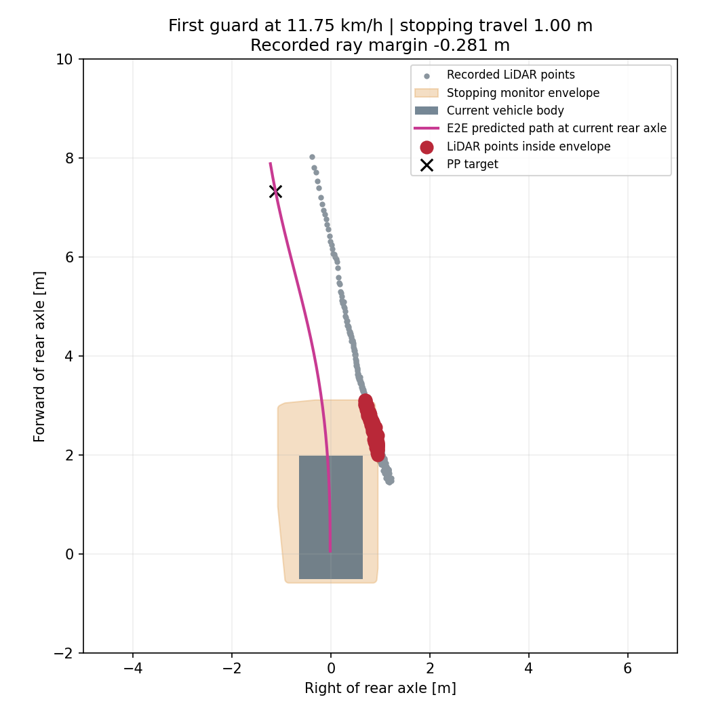

# 停止監視1mでの速度段階試験

**今回の5km/h刻みの試験で完走確認済みなのは目標10km/hまで。目標15km/hでは315.20m、section 6で1m停止領域監視が発動し、未完走だった。** 初回未完走で段階試験を終了し、20km/h以上は実施していない。

ユーザーの「15km/hから5km/hずつ増やしてどこまで行けるか」に基づくAWSIM比較。直前の目標10km/hでは1周134.74秒、追従中の実測速度中央値9.57km/hで完走している。各速度1回の試験であり、10〜15km/hの中間値や反復成功率、車両の物理的な最高速度を確定したものではない。

## 固定する条件と進め方

- 実行先は`graneple@192.168.3.10`、学習・評価環境はnative WSL。
- 同一checkpoint `launch_balanced/epoch_03.pt`、SHA256 `1fe12ca066791d3eb8907c6921120e2cfbb38925c422d5be54940f4acbdd120a`。
- 停止監視は直前の移動距離最大1m。PP先読み・操舵応答・車体幅余裕・生予測軌道・各種データ鮮度監視は同じ。
- 15km/hから実施し、合格したときだけ20km/h、25km/h…と5km/hずつ増やす。各設定1周・sim/wall各600秒の有限試験とする。
- 速度超過監視は各目標+1km/h。車両応答式の速度域だけを明示的な試験policyで拡張し、5km/h・10km/h用の従来の速度域を保持する。
- 合格はこれまでのユーザー指定どおりJudgeの1周完了。初回未完走以降の速度は走らせない。
- 実測速度の中央値・最大値も別に記録する。中央値が目標の90%以上かは速度到達の補助指標であり、完走の合否条件には加えない。制動を含むactive期間の速度サンプルを使い、0.1m/s以下のみ除外する。
- 1m監視は実速度での制動距離を保証しない。低速で得た車両応答式の外挿であり、高速域で校正済みとは扱わない。モデルや通常監視設定の正式採用は変更しない。
- AWSIM本体を変更せず、通常RVizにE2E経路を表示し、AWSIM動画を記録する。

15km/h用に変更するconfig項目はspeed policy、目標速度、超過監視、車両モデルpolicyの4つ。停止領域が1mでも、PP最低先読みは実速度で計算するため、15km/hで11.1639mとなる。予測経路が届かなければ既存条件どおり制動し、経路を延長・補正して試験を通さない。

## 実行コマンド

Windowsでcommit後にWSLへ同期する。operatorは同名出力を上書きしない。後続速度へ進む場合は、それぞれ専用configとrun IDを作る。

```powershell
python tmp/time_ten_site_recovery_plan_20260915/sync_native_transport.py sync
Get-Content -Raw tmp/time_launch_15kmh_stop1m_20260917/prepare_native.py | wsl -d Ubuntu-22.04-Recovered -u thistle --exec bash -c 'cd /home/thistle/e2e_autonomous/e2e_lite_transfuser && tools/with_wsl_training_lock.sh env PYTHONPATH=src OMP_NUM_THREADS=4 OPENBLAS_NUM_THREADS=4 .venv/bin/python -'
python tmp/time_launch_15kmh_stop1m_20260917/manage.py package
python tmp/time_launch_15kmh_stop1m_20260917/manage.py prepare
python tmp/time_launch_15kmh_stop1m_20260917/manage.py start
python tmp/time_launch_15kmh_stop1m_20260917/monitor.py
python tmp/time_launch_15kmh_stop1m_20260917/finish_and_evaluate.py
```

## 実測結果

| 目標速度 | 1周判定 | 発進許可からの記録距離 | 結果 |
|---|---|---:|---|
| 10km/h（前回） | 完走・134.74秒 | 370.11m | 周回後の停止も確認 |
| 15km/h（今回） | 未完走 | 315.20m | section 6で停止領域監視 |
| 20km/h以上 | 未実施 | — | 初回未完走で段階上昇を終了 |

今回の実測速度は、制動を含むactive期間の移動中サンプルで中央値**11.2996km/h**、最大**13.5779km/h**。15km/hを維持した試験ではない。終了時は11.7493km/h、監視の初回発動は発進許可から105.90秒だった。

停止領域は記録上も最大1.0m。発動時の前方右側の点群130点が監視領域に入り、同じLiDAR・姿勢・操舵の入力から`STOPPING_SWEEP_OCCUPIED`を再現した。ray margin−0.2807mは点群の距離と監視境界の差であり、車体と壁の実距離ではない。監視発動でシミュレーションを凍結して終了しており、速度ゼロへの制動完了・物理接触は確認していない。



## 分かった制約

1. **必要な先読み点を取れない場面で制動している。** `STEERING_FEASIBLE_LOOKAHEAD_MISSING`は327指令。独立した327イベントという意味ではない。PPの条件は実速度に応じて伸びるため、停止監視を1mにしても、この制約は残る。
2. **最終終了は1m領域の点群検出。** この瞬間は最低先読み7.3576m、選択先読み7.4102m、経路終端7.9808mで、先読み点を選べていた。PP要求操舵+0.06378rad、実測+0.04500rad、発行+0.06378radであり、±0.3radの操舵上限への飽和ではない。
3. 一時的な横速度条件の拒否89指令、yaw条件1指令、経路初期方向38指令も記録された。速度上昇時の予測・先読み・車両応答の整合は追加解析の対象で、学習データ不足だけを原因とは断定しない。

つまり、この段階試験は現行モデル・PP・監視設定の組合せで15km/h設定が完走できなかったことを示す。次の速度へ進める前に、先読み不足での速度低下と、section 6で右側の余裕を失う過程を分けて調べる必要がある。

## 動画・検証

- [AWSIM走行動画・124.8秒](../tmp/time_launch_15kmh_stop1m_20260917/videos/awsim.mp4)
- [通常RViz動画・125.4秒](../tmp/time_launch_15kmh_stop1m_20260917/videos/rviz.mp4)
- [記録した走行軌跡](evidence/time_launch_15kmh_stop1m_20260917/evaluation/route_progress.png)
- [速度段階の判定](evidence/time_launch_15kmh_stop1m_20260917/evaluation/speed_step.json)、[停止再現](evidence/time_launch_15kmh_stop1m_20260917/stop_location/diagnosis.json)、[実走評価](evidence/time_launch_15kmh_stop1m_20260917/evaluation/summary.json)、[manifest](evidence/time_launch_15kmh_stop1m_20260917/manifest.json)。

今回はAWSIM・RVizとも録画中断なし。全フレームのデコードと転送ハッシュをWSLで確認した。生ログ・動画はGit対象外。

実走sourceは`1c288e012a11a7175f98a22edca04973f8cb1957`。制御実装に対する全pytestはsource `1d58470e1d8552e6e51f6af41e13c6368af728bb`で**2855 passed / 4 skipped**。その後の評価上の合否表現・テスト・本資料の調整は14件の回帰テストを通し、制御・ROS・モデル・config・toolsが変わっていないことを検証した。47入力の学習／runtime予測一致、前回10km/hログの制御再生、241ファイルのROSインストール一致、隔離ROSでの15km/h・1m領域・速度超過監視を確認してから実走した。

今回の制御再生は2119件一致、最大誤差1.78e-15。記録のないラッチ後の指令86件は再生対象外として明示される。AWSIM本体1089ファイルは前後ハッシュ一致し、既存Git差分・RViz設定・過去コンテナを保全した。試験用プロセスは終了済み。

remote deploymentは`/home/graneple/e2e_autonomous/time_launch_15kmh_stop1m_20260917`、run IDは`codex-time-launch15-stop1m-lap01`。生ログは`/home/thistle/e2e_autonomous/runs/time_launch_15kmh_stop1m_20260917/raw/codex-time-launch15-stop1m-lap01`に転送・検証済み。

追加検証は同じWSL lock内で`verify_acceptance_native.py`、実走後に`inspect_native.py`、`route_native.py`、`verify_video_native.py`、`diagnose_stop_native.py`、`assess_step_native.py`を実行し、Windowsで`pack_evidence.py`を実行した。operatorの実体は[証跡内](evidence/time_launch_15kmh_stop1m_20260917/operators/)に保存した。
