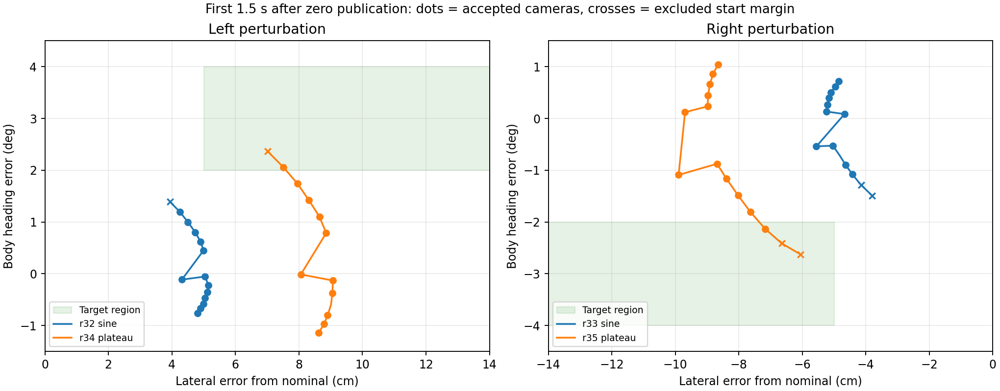

# 外向き復帰を採る操舵パルスの実装・方式確認

2026-09-14。[収集計画](time_recovery_collection_method_20260914.md)の第2段階。
実行は`.10`のAWSIM、データ監査と学習はnative WSL。角度拡張は今回の変更に混ぜない。

**通常2本＋外乱4本の方式確認を完了し、6本とも完走・正常停止・WSLでの保全を確認した。**
外乱4本で入力と未来3秒の教師を使える候補は370件。そのうち当初目標の
横ずれ5〜25cm・外向き2〜4度は、波形調整後の左右各1件だけだった。
実測の復帰教師を得る手段は確認できたが、本学習に十分な状態分布とは判定しない。
今回は計画した校正6本で終了し、本収集・再学習・E2E比較にはまだ移っていない。

## 実装

`time_steering_pulse_v1.py`はROS非依存の、1回だけの滑らかな操舵入力パルスを提案する。
提案状態は不変で、collectorが監視を通して実際に指令を発行した場合だけ確定する。
再試行や未発行の提案によって、開始・解除済み状態が進まない。

通常参照を常時追う教師PPの入力へ加算し、その後に既存の操舵角±0.5rad、操舵速度0.8rad/s、
加速度±1m/s^2と停止領域監視を通す。100ms判断期限、センサ期限、唯一のpublisherを維持する。
開始前後のカメラ/LiDAR/ego/指令は連続記録する。

| 状態 | 発行する外乱 | 教師phase |
|---|---|---|
| waiting | 0 | baseline。速度・位置・向きの開始条件を満たすまで待つ |
| active | 既定は指定振幅×sin²(πt/T)。`plateau_s>0`はcosineの両端と一定値区間 | hold。未来教師にしない |
| releasing | 解除要求時の値から短時間で0へ | hold。解除途中も未来教師にしない |
| recovery | 0 | recovery。実測未来を監査する |
| complete / skipped | 0 | baseline。同じ走行で再投入しない |

外向きの目標状態への到達、横ずれ・向き・速度・進捗の上限のいずれかで解除を要求する。
sim時間上限またはその2倍のwall時間上限では外乱を0にする。未達による延長・増幅は行わない。
走行開始時に周回境界直前へ投影される場合があるため、開始区間の手前を一度観測してから有効化する。

通常走行との差は、先に取得した実測基準走行の進捗・横位置・車体yaw `[N,3]`から計算する。
固定CSVとの差だけで外向きを分類しない。基準のrun ID・原controlのhashを参照へ記録する。
基準データはteacher/debug専用で、学習モデルの入力へ追加しない。

## 教師境界と互換性

新しい記録は`annotation_schema=measured_steering_pulse_v1`を付け、最終指令の発行sim時刻・
monotonic時刻・連番をphase境界へ使う。外乱要求時刻や計算開始時刻を解除完了時刻に流用しない。
指令連番の欠落、逆行、非0外乱が残った教師phase、不明な形式の混在はエラーとする。
同一sim時刻でphaseが競合する区間、150msを超える記録の空白は教師にしない。

旧記録のdecision時刻に基づく処理は維持する。新旧ともphase開始後150msの除外を初回は維持し、
新方式の先頭0.5秒で外向き状態を落としていないかを監査する。
この150msを通信の物理遅延が証明された値とは扱わない。
過去の外乱に由来する実測操舵やyawの応答は初期状態として残す。
単一の`intervention_ns`へ解除時刻を代入せず、期間の集合で未来0.1〜3秒を検査する。

`collection_phase_windows()`をmaterializer、閉じたbag監査、因果replayの3か所で共有した。
パルスのない通常参照（空intervals）も監査できるようにした。
CSVを教師へ置換せず、形状 `[30,2]`、0.1秒間隔、m、観測時点base_linkという契約を維持する。

## 有限試行と採否

[速度整合](time_recovery_speed_alignment_20260914.md)の通常2走行が通った後、
左右各2回までを校正と方式確認に使う。各1周＋未来4秒、停止3秒、bag 2GiB上限。
初期計画の0.03〜0.05rad・0.5〜1秒は仮値であり、発行前の応答見積もりで実行値を固定する。
実装が許す校正範囲は振幅最大0.1rad、期間最大2秒、横ずれ上限最大0.3m、向き上限最大6度。
これはその最大値の試行を自動で繰り返す指定ではない。
各試行の値と変更理由を結果欄へ残す。同じ未達・失敗を無変更で反復しない。

開始は目標角付近の通常走行状態からとする。取得データは左右の実測横ずれ5〜25cm、
外向き2〜4度を当初目標に分類するが、未達を成功へ数えない。
初期校正runは最終評価へ使わない。採用アンカー数、外向きの状態、先頭0.5秒の除外、
復帰のピークずれ・時間・監視拒否を報告してから、本収集や再学習へ進む。

## 確認コマンド

Windowsでcommitし、通常のsync後、WSLで以下を実行する。

```bash
tools/with_wsl_training_lock.sh env PYTHONPATH=src .venv/bin/python -m pytest -q \
  tests/test_time_steering_pulse_v1.py tests/test_time_recovery_collection_v1.py \
  tests/test_time_recovery_training_v1.py
tools/with_wsl_training_lock.sh env PYTHONPATH=src .venv/bin/python -m pytest -q
```

参照JSONに`steering_pulse`を指定した場合のみ有効。通常の収集launcherと同じ引数で起動し、
`--speed-policy aligned_gain4_v1 --separate-cpus`を付ける。
校正1のrootは`/home/graneple/e2e_autonomous/time_recovery_pulse_20260914`、
校正2は`/home/graneple/e2e_autonomous/time_recovery_pulse_plateau_20260914`。
[校正1の起動wrapper](evidence/time_steering_pulse_20260914/start_pulse_trial.py)と
[校正2の起動wrapper](evidence/time_steering_pulse_20260914/start_plateau_trial.py)は、
個別起動、最大本数、既存run、source/reference hash、空き容量、先行runの完了を検査する。
使用済みIDを再利用しない。両campaignは終了後にsealし、追加の自動反復は行わない。

## 校正1の結果と校正2の変更理由

`r32`左、`r33`右を振幅±0.08rad、全長2秒、開始進捗88mで実施。
両方が279.00 / 279.02秒で完走し、停止3秒とbag closeを確認した。
解除時のcontrol観測は左+3.69cm / +1.52度、右-3.60cm / -1.60度。
両方とも解除後に5cm以上・外向き2度以上を同時に満たすcontrol行は0。
これはcameraアンカーの正式採用数ではないため、別途全候補の因果replayを実施する。

左の外乱40行で`issued_angle - nominal_angle - requested_pulse`の最大絶対値は
2.78e-17rad。合成要求は制限で削られていない。`effective_rad`は「同じ直前の実発行値から
制限を適用した2指令の1周期差」であり、実際の投入振幅や累積効果を表す量ではない。

校正2は残り左右各1回を実施した。振幅±0.08rad、全長2秒、開始88m、既存の全監視を維持し、
`plateau_s=1.5`を明示する。最初と最後の0.25秒はcosineで接続し、途中は一定値とする。
期限まで解除しない単独波形の面積は0.08rad*sから0.14rad*sになる。実測到達量は以下に示す。
左右各1回の試行値を事前固定し、目標状態に到達した場合は従来どおり0.15秒で解除する。
時間上限、状態上限、停止監視の優先順位は変更しない。

校正1の閉じたbagをnative WSLで全ファイル照合後、camera候補93 / 93件を全件監査。
入力履歴と未来30点を使える候補は左93、右92件。右の1件は`CURRENT_SENSOR_MISSING`で除外した。
各runの代表3件は元画像・LiDARからtensorと教師XYを組み立て、監査結果と完全一致した。
ただし、採用候補のうち横ずれ5cm以上・外向き1度以上は左右とも0件だった。
最初の150msで除外した左1件・右2件を戻しても、当初の2度以上の目標には届かない。
したがって、この結果を理由に150ms規則を緩和しない。

左の解除提案sim時刻は103559997685ns、最初の0外乱の発行時刻は103579997684nsだった。
教師境界は後者を使用する。実際に約20msの差があることを記録から確認した。
これはAWSIM内で操舵が適用された時刻や、センサ前処理の完了時刻を測定した結果ではない。

校正1の結果: [左の候補と状態](evidence/time_steering_pulse_20260914/r32_state_audit_summary.json)、
[右の候補と状態](evidence/time_steering_pulse_20260914/r33_state_audit_summary.json)。
2本の原本は`/home/thistle/e2e_autonomous/raw/time_steering_pulse_20260914/`へ保存済み。
SHA/サイズ/構造/SQLiteを照合後、`.10`の対応する2本だけを移動済み案内へ置き換えた。

## テストの実行結果

外乱・発行境界の実装`2d345f9`は対象55 passed、全体2314 passed / 4 skipped。
一定値区間の追加`a1c9e5a`は対象62 passed、全体2321 passed / 4 skipped。
波形面積、最大角度、立ち上がり速度、時間内の解除、既定波形の互換性を含む。
全てnative WSLでworktree lockを保持して実施した。
結果: [対象テスト](evidence/time_steering_pulse_20260914/plateau_pytest_focused.log)、
[全体テスト](evidence/time_steering_pulse_20260914/plateau_pytest_full.log)。

通常2本は`fc271e2`、校正1の2本は`2d345f9`、校正2は`a1c9e5a`で走行する。
監査・文書だけの後続commitはAWSIM側の固定sourceへ混ぜない。
制御で使う指令・速度・操舵角の監視を、データ量のために緩めていない。

## 全4校正runの結果

「有効候補」は150msの開始除外後に入力履歴・未来30点の監査を通ったcameraアンカー数。
目標状態は正常基準から横ずれ5〜25cm、向き差2〜4度が同じ符号であることとした。

| run | 波形・方向 | 1周 | 有効候補 | 5cm以上・外向き1度以上 | 当初目標2〜4度 | ピーク横ずれ | 復帰の1秒維持確認 |
|---|---|---:|---:|---:|---:|---:|---:|
| r32 | sin²・左 | 279.00s | 93 | 0 | 0 | 5.16cm | 解除後3.65s |
| r33 | sin²・右 | 279.02s | 92 | 0 | 0 | 6.32cm | 解除後3.46s |
| r34 | 一定値区間あり・左 | 278.96s | 91 | 4 | 1 | 9.08cm | 解除後3.71s |
| r35 | 一定値区間あり・右 | 279.06s | 94 | 5 | 1 | 9.89cm | 解除後3.77s |

正式IDは`codex-time-recovery-pulseleft-r32/r34`、`codex-time-recovery-pulseright-r33/r35`。
上記は教師PP走行の結果であり、モデルによる復帰率やE2Eの完走ではない。
有効370件のうち、2度以上で外向きの目標は2件（約0.54%）。
別の正常実走r31を基準にしても、同じ左右各1件が目標を満たした。
校正に使用した全runを最終評価用へ割り当てない。

調整後の解除時control観測は左+6.06cm / +2.56度、右-5.66cm / -2.67度。
解除後10秒の停止領域監視の最小ray余裕は左0.726m、右0.936mだった。
これは監視内の指標であり、全周囲の地図上の車体余裕とは異なる。
両方ともピーク横ずれの半分以下・向き2度以内を約3.7秒後に1秒維持できた。

全camera候補の監査に加え、各runの代表3件（4runで12件）を元画像・LiDARから再現した。
調整後の候補92 / 94件のうち、左1件だけ`CURRENT_SENSOR_MISSING`で除外。
監査後の先頭0.5秒は左右各3件で、その中に目標状態が各1件残る。
150msの規則では、他条件を通る目標状態を左1件・右2件追加で除外している。
仮にこの3件を戻しても目標状態は計5件にとどまり、本収集の十分性は満たさない。
発行時刻と物理適用時刻の違いを解決せずに境界を緩めない。

[集計JSON](evidence/time_steering_pulse_20260914/pilot_summary.json)と
[状態の比較図](evidence/time_steering_pulse_20260914/pilot_summary.png)に全数・基準間比較を記録した。
図の丸は採用候補、×は150msの開始除外。先頭1.5秒を描き、緑が目標状態である。



## 保全と次の優先順位

6本の原本7,156,133,928 bytesと圧縮3,156,196,032 bytesをnative WSLへ保存した。
全ファイルのSHA・サイズ・ディレクトリ/リンク構造と6個のSQLiteを照合済み。
確認後に`.10`の対応原本だけを移動済み案内へ置き換え、最後の空きは約21.2GiB。
今回のAWSIM/ROSコンテナは全て終了した。元checkoutのHEADと取得可能なgit statusのhashは
開始時と同じで、従来から権限のない一部の旧ログディレクトリはこの検査に含まれない。
[保全記録](evidence/time_steering_pulse_20260914/storage_and_scope.json)、
[実行先の終了確認](evidence/time_steering_pulse_20260914/final_host_inspection.json)。

次は、**150msの除外後も目標状態を十分な時間保つ校正**を優先する。
今回の6本を無変更で追加反復したり、370件すべてを狙った外向き教師として学習へ投入しない。
次の有限校正候補は、既存の実装範囲内の±0.10rad・最大2秒・一定値1.5秒を左右各1本。
0.08radからの調整であり、効果は未測定。状態・時間・停止領域・操舵制限は維持する。
採否は2つの正常基準の双方で目標を満たす有効cameraアンカーが各runで3件以上残ること、
正常復帰・1周・停止を満たすことで判定する。この追加校正は今回未実施。

成立した小ずれ条件から独立runを集め、run単位でtrain/validation/評価予約を先に固定する。
15〜25cmの横ずれや4度以上の外向きは今回未確認で、小ずれの成立を流用しない。
十分な条件別データを得てから実測復帰追加の学習比較に進み、角度拡張はその後に分離して評価する。

## 監査の再実行

以下はnative WSLのrepo rootで実行する。既存成果物を上書きせず、`--output`には新規の名前を使う。
元のIDLは収集コンテナから保存したsnapshotであり、別版のROS型へ置換しない。

```bash
tools/with_wsl_training_lock.sh env PYTHONPATH=src .venv/bin/python \
  tools/audit_time_recovery_collection.py \
  --run /home/thistle/e2e_autonomous/raw/time_steering_pulse_20260914/codex-time-recovery-pulseleft-r34 \
  --types /home/thistle/e2e_autonomous/runs/time_recovery_collection_20260913/types \
  --output /home/thistle/e2e_autonomous/runs/time_steering_pulse_20260914/r34_bag_audit_repeat.json

tools/with_wsl_training_lock.sh env PYTHONPATH=src .venv/bin/python \
  docs/evidence/time_recovery_collection_20260913/causal_replay_probe.py \
  --run /home/thistle/e2e_autonomous/raw/time_steering_pulse_20260914/codex-time-recovery-pulseleft-r34 \
  --types /home/thistle/e2e_autonomous/runs/time_recovery_collection_20260913/types \
  --output /home/thistle/e2e_autonomous/runs/time_steering_pulse_20260914/r34_causal_probe_repeat.json

tools/with_wsl_training_lock.sh env PYTHONPATH=src .venv/bin/python \
  docs/evidence/time_steering_pulse_20260914/analyze_pulse.py \
  --run /home/thistle/e2e_autonomous/raw/time_steering_pulse_20260914/codex-time-recovery-pulseleft-r34 \
  --probe /home/thistle/e2e_autonomous/runs/time_steering_pulse_20260914/r34_causal_probe_repeat.json \
  --output /home/thistle/e2e_autonomous/runs/time_steering_pulse_20260914/r34_state_audit_repeat.json
```

`analyze_pulse.py`は全復帰camera（150ms除外前も含む）を監査し、採用IDを独立した
causal probeと照合する。正常基準r30はcamera観測時刻のposeからの進捗・横位置・yawで比較する。
`summarize_pilot.py`は別の正常基準r31でも分類し、両基準に対して目標を満たす数を示す。
復帰時間は解除後のピーク横ずれ以降、半分以下（最大10cm）と向き2度以内を1秒維持した観測時刻。
150msを超える観測間隔を維持の証拠にしない。連続時間での保証やE2E性能の指標ではない。
