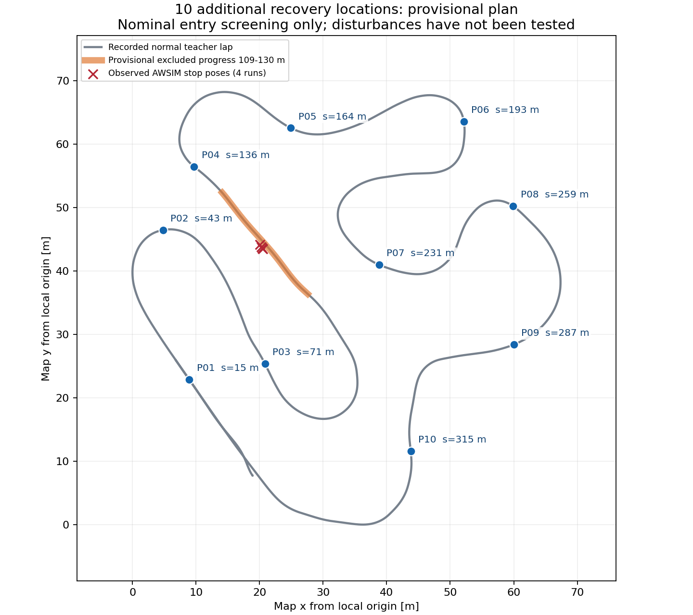

# 停止地点＋それ以外のランダム10地点で復帰教師を集める計画（2026-09-15）

ユーザーの意図は、**停止判定になった地点を収集対象に含め、そのほかにランダムな10地点を追加する**ことである。
前版は停止地点を新規収集から外し、残りの10地点も進捗順に固定してしまっていた。この2点を訂正する。
停止地点が1か所なら **固定1地点＋ランダム10地点＝計11地点**で、各地点における外乱と教師による復帰を収録する。
既知の失敗地点を改善するための教師と、異なる道路の見え方・曲がり方に対応する教師の両方を増やす。
地点数と1周で実際に投入できる回数は分け、復帰が終わってから次の外乱を入れる。

前版で行ったのは、保存済み正常走行のWSL解析と収集計画の作成。本訂正は計画のみの変更である。
新しいAWSIM走行、外乱投入、教師収集、再学習はまだ実施していない。
以前の3区間×左右×4回＝24イベント案や、停止地点を除外した20試行案は、訂正後の試行数には使わない。

## 固定の停止地点と追加のランダム10地点

- **S00: 停止判定地点。** 通常比較で停止判定になった教師進捗約119〜120mの区間を固定の収集対象にする。その地点を通過する復帰軌道を記録できるよう、外乱開始位置は手前も含めて決める。停止区間は追加教師収集と再学習後の比較の両方に使う。
- **R01〜R10: その他の10地点。** 停止地点の対象区間と重複しない候補から、seed付きでランダム抽選する。追加10地点については全周に偏りなく分散するよう候補範囲を分け、範囲内の位置を抽選する。実行計画に採用地点とseedを保存する。

追加地点は次の収集セットでseedを変えて選び直せるようにする。左右比較や反復収集では同じ抽選結果を再利用し、地点選択のseedと外乱方向等のseedを分けて保存する。
停止地点はセットが変わっても固定対象として残す。
各投入では開始条件、前イベントの復帰、教師未来3秒の余白を確認する。追加地点の都合で固定の停止地点が投入不能にならないよう、その前後のイベント間隔を優先して組む。
すべてを同一周で実施できない場合は複数周へ分け、見送りと追加試行の上限を記録する。

## 前版の保存データ解析（ランダム抽選前の参考資料）

以下のP01〜P10と図は、前版で進捗順に選んだ候補の記録であり、**ランダム抽選結果でも今回の最終11地点でもない**。
解析証拠はそのまま保全し、新計画のランダム地点選択とは区別する。ランダム抽選の実装・実行はまだ行っていない。

正常教師r30/r31はともに1周完了。各runのcontrol/reference/resultを転送記録のSHA-256で照合し、同じreferenceを使用したことを確認した。
収録された教師進捗は約0〜353m。通常比較A/Bの停止判定4回は教師進捗119.04〜119.86mに対応する。
前版の候補抽出では、その前後約10mの **109〜130mを暫定除外区間**とした。
訂正後は追加のランダム10地点を停止対象から分けるための参考範囲とし、**固定のS00を除外する条件にはしない**。
これは採取場所を分けるための計画上の範囲であり、車体・障害物の安全距離を示すものではない。



|地点ID|外乱開始候補の教師進捗 s_m|
|---|---:|
|P01|15m|
|P02|43m|
|P03|71m|
|P04|136m|
|P05|164m|
|P06|193m|
|P07|231m|
|P08|259m|
|P09|287m|
|P10|315m|

`s_m`はreferenceに沿った進捗であり、AWSIMテストにおける累積移動距離126mとは異なる。
図の点は候補開始窓内で条件を満たした正常教師の代表位置。正確な投入位置は開始窓と実行時条件で決まる。
候補同士は進捗で28m以上離れ、代表位置の平面距離は最小11.13m、停止判定4位置との平面距離は最小15.40m。
これらも車体の通過余裕を表す値ではない。

候補抽出では、両正常runにおいて速度1.15〜1.4m/s、`abs(nominal_angle_rad) + 0.10 <= 0.50 rad`、記録された監視ray余裕0.5m以上が1秒連続することを確認した。
制御記録の間隔が150msを超えれば連続性をリセットし、開始2m窓の中に条件成立時刻がある地点を対象とした。
さらに、開始前5mと、pulse2秒・復帰10秒・教師未来3秒・追加1秒に相当する22.4mの計画余白が、除外区間に重ならないようにした。
235個の開始候補から、進捗順に28m以上離した結果が上記10地点である。候補数は独立した教師イベント数ではない。

この判定には、正常guideに対する横位置・向きの一致、外乱を加えた後の障害物余裕、現在のAWSIMシーンの一致をまだ含めていない。
特にP07は窓内の成立記録がr30で3回、r31で2回だけで、投入タイミングの余裕が小さい。正常走行の再確認で窓位置を調整する候補とする。
直線・左右コーナー・進入・脱出の構成も確認し、距離だけで最終地点を固定しない。

## 収集方法と試行数の提案

実行先は `graneple@192.168.3.10`、目標速度5km/h、標準の停止領域監視と既存のその他の監視を使用する。
最初に現行シーンで正常教師2周を確認し、全周のguideとセンサ記録が使える状態にする。

1. 初期確認は **（停止1地点＋ランダム10地点）×左右各1回＝22試行**を提案する。この確認セットでは抽選した10地点を左右で共有する。これは上限付きの試行案で、22成功や開始済みの実験を表さない。
2. 新地点では1周2〜3対象に分ける。条件不成立は未投入として記録し、窓を通り過ぎてから遅れて投入しない。成功するまで自動で周回数を増やさない。
3. 外乱解除後に教師が正常線へ戻り、安定1秒と教師未来3秒以上の末尾を確保してから、次の地点を対象にする。次の窓までに準備できなければその地点を見送り、制限時間内に復帰できなければその周の追加外乱を中止する。
4. 地点ごとの挙動を確認後、1周の投入数を増やす。停止地点＋追加10地点を同一周で予定する場合も、前イベントの復帰判定を優先し、見送った地点を後続の有限計画へ回す。
5. 各runは1周・末尾記録・正常停止までを対象とし、上限30分。左右の割当てとseedは収集前に記録する。

外乱は検証済み範囲の操舵入力pulse（最大±0.10rad、2秒、plateau1.5秒、release0.15秒）から始める。
実際の投入時には、正常guideに対する横位置5cm以内・向き1度以内、速度1.15〜1.4m/sの安定1秒、直近の監視余裕0.5m以上など、既存の開始条件をすべて満たすことを確認する。
これはROS操舵入力への加算値であり、実タイヤ角やCARLAの正規化操舵値ではない。
教師の操舵へ短時間加算し、ゼロ化後は教師の復帰走行を記録する。横ずれ25cm・向き4度等の既存上限を維持し、状態上限や監視条件に達した場合は早く解除する。
回復が短く終わっても、同じ場所で外乱を重ねて指定量まで無理にずらさない。

左右各1回では、地点×方向ごとの独立したtrain/validation比較には不足する。
同じ抽選地点を比較用に固定して各組を4独立run/seedに増やすなら **11×2×4＝88イベント候補**となり、各組train3/validation1をrun単位で事前割当てする。
88回は後続規模の例であり、初期22試行の結果を見る前に実行数として固定しない。別の場所の経験を増やす場合は追加10地点を新しいseedで抽選し、同一地点の反復とは分けて集計する。
22/88という数だけで学習データが十分だとは判断しない。

## 実装で必要な変更

既存の複数外乱機能は開始66〜111m・最大2〜3イベントに限定され、収集runnerも過去のrun IDと有限計画を固定している。
単発pulseにも開始進捗300m上限があるため、P10=315mは現行設定のままでは使用できない。
**今回の候補表は現行ツールへそのまま渡して実行できる設定ファイルではない。**

- 全周の正常guideを用意し、固定の停止地点S00と追加のランダム10地点R01〜R10を含む有限計画を追加する。地点ID・開始窓・方向・地点選択seed・外乱seed・周回/試行上限を明示し、既存の確定済み収集計画は改変しない。
- 候補範囲ごとのランダム抽選とその再現性、重複排除、停止対象の必須指定を実装する。抽選できなければ地点数不足を報告し、条件を自動で緩めない。
- 進捗に応じた投入、見送り、復帰失敗時の残り中止、周回境界を実装する。P10を含む場合は固定300m上限を、guideの支持範囲と必要末尾を検証する条件へ拡張する。
- 地点の取り違え、隣接イベントの重複、欠測、窓通過後の遅延投入、上限到達、停止時の外乱ゼロ化を回帰テストで確認する。
- 保存データによる再生確認後、現行AWSIMで正常教師と各地点の実際の復帰を段階的に確認する。

正常記録の余裕だけでは、外乱後の停止領域や車体全周の非接触を保証できない。監視を緩めて候補を成立させる運用にはしない。

## 採用する教師と検証

ずれた状態の実Camera・2D LiDAR・ego履歴と、教師が復帰する未来0.1〜3秒の実測XY（30×2）を対応させる。
外乱解除の発行から150ms後以降で、未来3秒全体が教師制御・連続時刻であり、次の外乱や停止をまたがないanchorを採用する。
外乱を加えている期間は復帰教師の正解区間から外し、因果的な入力履歴とイベント診断用には保存する。
観測を元位置に置いたまま教師XYだけを横移動するラベルは作らない。

地点・左右・横ずれ量・向き差・外向き/内向き・成功/未投入/失敗・独立run数を分けて集計する。
frameランダムsplitは使わず、同じrunのイベントはすべて同じsplitに置く。既存のsealed testとAWSIM比較走行は教師へ混ぜない。
左右差や復帰強度が不足した組だけを後続の収集対象にする。

保存済み実績による目安は1周約1.2GB展開/0.53GB圧縮。
22試行を1周2〜3対象に収めれば約8〜11周、正常確認2周を加えて約10〜13周、約12.0〜15.6GB展開/5.3〜6.9GB圧縮が概算となる。
未投入分の再試行はこの見積りに含めない。実行ホストで2 runずつ保管し、native WSLへ移してhash・archive・SQLiteを検証する既存運用を使う。

データ検証・学習・オフライン評価はWSLで行う。発進・正常走行・復帰の各評価を維持し、最終評価は同じPP・目標5km/h・標準監視でのAWSIM走行とする。
合格条件は引き続き **公式Judgeの1周完走と停止確認**。

## 今回の解析証拠と実行方法

- [候補抽出結果](evidence/time_ten_site_recovery_plan_20260915/candidate_window_audit.json)
- [位置関係の確認](evidence/time_ten_site_recovery_plan_20260915/layout_audit.json)
- [実行した解析スクリプト](evidence/time_ten_site_recovery_plan_20260915/audit_candidate_windows.py)
- [実行した描画スクリプト](evidence/time_ten_site_recovery_plan_20260915/plot_candidate_layout.py)
- [コピー検証・SHA-256](evidence/time_ten_site_recovery_plan_20260915/artifact_manifest.json)

解析時のWindows/WSLソースは `d26566914aa3f6991f361ef5f0804f2b9b196b90`。
Windowsで準備したスクリプトをstdinでWSLの下記コマンドへ渡して実行した。大きいrawデータはWSLに保持し、小さい解析結果だけをSHA-256照合後に戻した。

```bash
cd /home/thistle/e2e_autonomous/e2e_lite_transfuser
tools/with_wsl_training_lock.sh env PYTHONPATH=src .venv/bin/python - < docs/evidence/time_ten_site_recovery_plan_20260915/audit_candidate_windows.py
tools/with_wsl_training_lock.sh env PYTHONPATH=src .venv/bin/python - < docs/evidence/time_ten_site_recovery_plan_20260915/plot_candidate_layout.py
```

上記は保存したスクリプトを利用する等価な実行方法。出力先はnative WSLの `runs/time_ten_site_recovery_plan_20260915` に固定され、既存出力があれば上書きせず停止する。
再解析する場合はWindows側でスクリプトの出力先を新しい実験ディレクトリに変更し、以前の結果を保全する。
今回の確認は保存データ解析2本の正常終了・入力hash照合・図の表示確認まで。runtime実装は変更しておらず、この資料更新に対するpytest再実行や新規AWSIM実行は行っていない。
