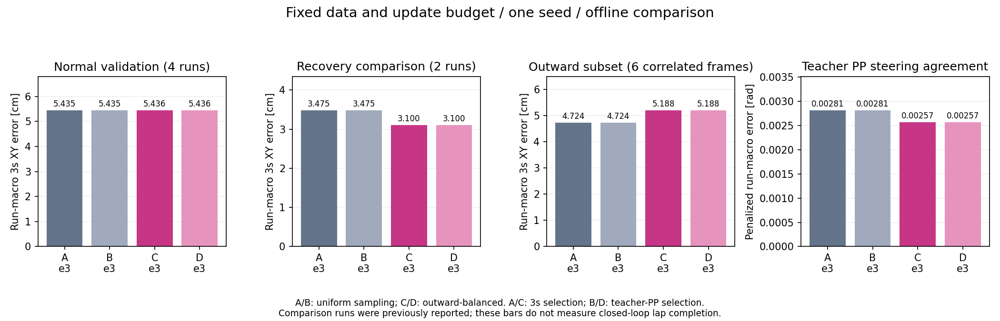

# 既存データ固定：復帰状態の提示とモデル選定の比較

## 実測結果と判断

**同じデータでも、復帰状態の提示配分を変えると一部の予測は改善した。ただし、全体を一様に改善する結果ではない。** 追加復帰2runの3秒先XY誤差は10.77%減少した一方、狙った外向き6アンカーの3秒先誤差は9.82%増加した。PP操舵との一致はこの6件で改善しており、近い先の制御計算と遠い先の位置精度で効果が分かれた。

学習・評価はnative WSLで完了した。提示方法の比較は同じ起点から3epoch・4,281更新、seed42の1条件である。3秒XY基準と教師PP基準は、従来・変更後ともepoch3を選んだ。したがって **A=B、C=Dで、今回の3epoch候補内ではモデル選定基準を変える効果は0**。実際に異なる重みは2つであり、4回の独立実験ではない。

下表はrunごとの平均を等重みにした3秒先XY誤差。件数は教師と入力が有効な件数 / 対象件数。外向き6件は追加2runに含まれる相関したフレームである。

| 評価群 | run数 | 有効 / 対象 | 従来A/B | 配分変更C/D | 変化 |
|---|---:|---:|---:|---:|---:|
| 通常走行 | 4 | 11,780 / 12,237 | 5.43537 cm | 5.43570 cm | +0.006% |
| 旧復帰 | 2 | 109 / 109 | 3.517 cm | 3.606 cm | +2.51% |
| 追加復帰・選定には未使用 | 2 | 186 / 186 | 3.475 cm | 3.100 cm | **−10.77%** |
| 追加復帰の外向き部分 | 2 | 6 / 6 | 4.724 cm | 5.188 cm | **+9.82%** |
| 追加・左側r46全体 | 1 | 93 / 93 | 3.493 cm | 3.109 cm | −11.01% |
| 追加・右側r47全体 | 1 | 93 / 93 | 3.456 cm | 3.092 cm | −10.53% |



「学習データ不足か、学習方法か」への今回の回答は、**データの使い方にも改善余地があることを確認できたが、データ不足との二者択一はまだ決着していない**、となる。23アンカーを繰り返しても独立した復帰経験は8runのままであり、この比較はデータ量の十分性やモデル構造・lossの最適性を証明しない。

変更後の重みは比較候補として保存した。AWSIMへの配備・走行は今回実施しておらず、完走改善は未確認。採用の次の判定は、通常どおり `.10` の同一環境・固定目標5km/h・普通のRVizに元のE2E予測経路を表示する条件で、A/Cの通常完走を比較すること。外向き6件の指標を新しい走行合格条件にはしない。

## 比較前に固定する条件

データ不足と学習方法を区別するため、既存の入力・教師・splitを固定して、提示バランスとモデル選定だけを比較する。新規教師生成、追加収集、loss変更、速度・安全監視の変更は行わない。モデル外の教師・評価情報を推論入力へ追加しない。

| 条件 | 復帰データの提示 | epoch の選定 |
|---|---|---|
| A | 従来の均等反復 | 従来の3秒XY誤差 |
| B | 従来の均等反復 | 教師軌道によるPP操舵との一致 |
| C | 外向き状態を多く提示 | 従来の3秒XY誤差 |
| D | 外向き状態を多く提示 | 教師軌道によるPP操舵との一致 |

同じ学習済みepoch群からA/BまたはC/Dを選ぶため、選定基準の効果を追加のoptimizer更新と混同しない。同じepochが選ばれれば、その組の差は0として報告する。

- unique train 37,678、うち復帰952を全て保持。通常36,726提示＋復帰8,920提示/epoch、3epochで136,938提示・4,281更新を固定。
- 外向き23アンカーは監査済みのtrain 8runだけから指定する。復帰8,920枠の25%（2,230提示）をこの状態へ割り当て、その中はrun等重みとする。残る6,690枠は他の復帰929アンカーへ均等に割り当てる。通常アンカーの提示位置・順序を変更しない。23アンカーは8回の復帰中の相関したフレームであり、反復で独立データは増えない。
- 起点・モデル・XY全30点のL1 loss・AdamW・cosine scheduler・seed42・batch32・lr3e-5・float32を前回と一致させる。3epochの有限比較で、学習回数や容量が十分かを証明する実験ではない。
- 選定は従来の通常4run＋旧復帰2runだけ。新復帰r46/r47は選定後の比較に使用する。これら2runは既に前回報告した検証データで、未見の最終testとは呼ばない。元のtest 4runとr48/r49の評価予約は未使用のまま保つ。
- 新選定は、同じ観測状態で教師30点と予測30点を現行PPへ通した物理タイヤ角の絶対差をrun等重みで平均する。教師が成立する固定母集団を使い、モデルの拒否は0.6 rad（タイヤ角の全範囲）として分母に残す。候補の拒否で平均を改善させない。同値なら3秒誤差、さらに同値なら早いepochを選ぶ。
- PPは固定目標5km/h・`stopping_preview_extended_v1`・既存車両モデル。選定のageは0 s。これは観測状態での幾何計算であり、遅延・操舵応答・scan監視・反復走行の成功を含めない。
- 従来学習の全epochの保存予測からA/Bを選定する。選ばれた重みが既存bestにあれば再利用し、異なるepochの重みが残っていなければ同一条件で3epochだけ再現する。最大で新規2arm、各学習コマンド7200秒。モデルやlossは変えず、全epochのcheckpointを保持する任意引数だけをrunnerに加える。default動作と保持ありの予測同一性を回帰テストする。

通常走行、旧復帰、新復帰、外向き6アンカー、左右別について、0.5/1/2/3秒のXY誤差、前後・横成分、PP成立数、教師操舵との差を同じ入力で比較する。オフラインの改善をAWSIM完走改善とは扱わない。今回の比較だけで実行モデルへ自動昇格しない。

## 実行

Windows正本でcommit後、`tools/sync_to_wsl.ps1`で同期する。下記はnative WSLのrepo rootで実行する。出力は新規ディレクトリ専用で、再開時のみ同じplanと`--resume`を使う。

```bash
tools/with_wsl_training_lock.sh env PYTHONPATH=src OMP_NUM_THREADS=4 OPENBLAS_NUM_THREADS=4 \
  .venv/bin/python -m pytest -q

tools/with_wsl_training_lock.sh env PYTHONPATH=src OMP_NUM_THREADS=4 OPENBLAS_NUM_THREADS=4 \
  .venv/bin/python -u tools/compare_time_training_methods.py prepare \
  --plan configs/time_path_p1/method_comparison_20260914.json \
  --output ../runs/time_training_method_comparison_20260914

tools/with_wsl_training_lock.sh timeout --signal=TERM --kill-after=20s 7200s \
  env PYTHONPATH=src OMP_NUM_THREADS=4 OPENBLAS_NUM_THREADS=4 \
  .venv/bin/python -u tools/compare_time_training_methods.py train --arm balanced \
  --plan configs/time_path_p1/method_comparison_20260914.json \
  --output ../runs/time_training_method_comparison_20260914

# prepare_result.json が uniform_retraining_needed=true の場合に限る。
# 上のtrainコマンドの --arm を uniform にして同一予算で再現する。

tools/with_wsl_training_lock.sh env PYTHONPATH=src OMP_NUM_THREADS=4 OPENBLAS_NUM_THREADS=4 \
  .venv/bin/python -u tools/compare_time_training_methods.py compare \
  --plan configs/time_path_p1/method_comparison_20260914.json \
  --output ../runs/time_training_method_comparison_20260914
```

保存済み集計の図は、比較終了後に次で再現する。これもnative WSLで実行する。

```bash
tools/with_wsl_training_lock.sh .venv/bin/python tools/render_time_method_comparison.py \
  --comparison ../runs/time_training_method_comparison_20260914/comparison/summary.json \
  --output ../runs/time_training_method_comparison_20260914/figures
```

重み・cache・全予測配列はWSLに保持し、小さい指標・証跡・図だけをWindowsへ戻した。

## 時間ごとの誤差と操舵計算

XY誤差は全てcm、run等重み。外向きの定義と対象IDは[既存収集index](evidence/time_recovery_expansion_20260914/collection_index.json)の`target_anchor_ids`を固定して使い、今回の予測結果に合わせて対象を選び直していない。

| 群・条件 | 0.5秒 | 1秒 | 2秒 | 3秒 |
|---|---:|---:|---:|---:|
| 追加復帰・従来 | 0.549 | 0.727 | 1.279 | 3.475 |
| 追加復帰・配分変更 | 0.519 | 0.687 | 1.173 | 3.100 |
| 外向き6件・従来 | 0.730 | 1.212 | 2.402 | 4.724 |
| 外向き6件・配分変更 | 0.477 | 0.850 | 1.421 | 5.188 |

外向き6件の横方向MAEは、1秒で0.902→0.455cm、2秒で2.310→1.187cmへ減少した。一方、3秒では3.995→4.727cmへ増加し、両条件ともその6件の横方向誤差は全て左向きだった。3秒の前後方向MAEは2.336→2.058cmへ減少しており、同部分の3秒XY悪化は横方向の成分増加と対応する。

追加復帰186件全体では3秒横方向MAEが2.755→2.568cm、前後方向MAEが1.748→1.345cmへ減少した。全体の改善が、外向き初期6件の3秒改善まで意味するわけではない。

以下は観測時点age0の教師PP操舵との絶対差。単位は物理タイヤ角rad。教師が成立する固定母集団からモデルが拒否した場合は0.6radとして集計した値であり、走行誤差や安全監視の成功率ではない。

| 群 | 教師PP支持 | モデル拒否 A / C | 従来A/B | 配分変更C/D | 変化 |
|---|---:|---:|---:|---:|---:|
| 通常走行 | 8,226 / 12,237 | 53 / 53 | 0.016909 | 0.017119 | +1.24% |
| 旧復帰 | 109 / 109 | 0 / 0 | 0.005353 | 0.005547 | +3.61% |
| 追加復帰 | 186 / 186 | 0 / 0 | 0.002811 | 0.002567 | −8.67% |
| 外向き6件 | 6 / 6 | 0 / 0 | 0.006463 | 0.000953 | −85.26% |

通常群では、8km/h収集runに含まれる5km/h実行契約の速度範囲外3,354件などを教師側で除外する。従って上表の通常PP値は通常全フレームや8km/h実行性能を示さない。支持母集団・runごとの分母は両モデルで一致し、拒否53件も両者同数。全除外理由と、両者が成立した場合だけの操舵誤差は[全指標](evidence/time_training_method_comparison_20260914/comparison/summary.json)に保持した。

近い先と3秒末端の結果が分かれたため、PP操舵一致だけを全軌道品質の代用にしない。今後lossを検討する場合も、近い先・遠い先、左右、通常・旧復帰の退行を同時に見る必要がある。これは次の検討方針であり、今回lossを変更して改善したという結果ではない。

## 選定と学習条件の照合

選定用6runの3秒XY誤差と教師PP指標。どちらも小さい方を選ぶ。

| epoch | 従来3秒XY cm | 変更後3秒XY cm | 従来PP rad | 変更後PP rad |
|---|---:|---:|---:|---:|
| 1 | 5.45641 | 5.45189 | 0.0136893 | 0.0137424 |
| 2 | 5.13635 | 5.04989 | 0.0147097 | 0.0143420 |
| **3・両基準の選定** | **4.79602** | **4.82564** | **0.0130572** | **0.0132615** |

- 従来bestの保存予測を同じバッチ構成で再現し、全選定予測と指標が厳密一致した。A/Bが既存epoch3を選んだため、従来学習を追加実行する必要はなかった。
- 外向き23アンカーの提示は217→2,230回/epoch。総復帰8,920回、通常36,726回、全45,646回を維持し、その他の復帰929アンカーも全て保持した。左右は各1,115提示、8run内で278または279提示ずつ。
- 初期検証結果は従来と厳密一致。各epochの実測は45,646提示、有効入力かつ教師支持44,280、入力無効158、教師支持なし1,208で一致。合計136,938提示・4,281更新、3epoch完了。学習runner内の所要時間は3,355.17秒で、コマンド全体の準備・追加PP集計時間は含まない。
- epoch保持を除いた学習runnerの構文木と、モデル・教師・cache読込・学習関連コードを従来commitと照合した。変更後もbest重みの再読込で予測が厳密一致し、比較時にも両モデルの選定用予測が各学習時の保存予測と厳密一致した。
- 追加復帰r46/r47は以前に報告済みの検証runであり、今回初めて開封した最終testではない。元のtest4runと予約r48/r49は評価していない。

## 保存物・検証・未確認事項

学習sourceは`8a9b4df630e94bea413051fd5449610bcc8a6088`、比較・描画sourceは`9b3c8ded1bccda56800b34270bf4b1a0a1f5aa3d`。比較時に追加した変更は、役割ごとに推論バッチを分けて過去の丸め条件を維持する処理と、保存済み指標の描画であり、学習中のコードは同期・変更していない。

| 重み | native WSL内の場所 | SHA-256 |
|---|---|---|
| 従来A/B | `../runs/time_recovery_expanded_training_20260914/best.pt` | `7ec445b6ab955e76d0d71efbd8f2f1dd3066ebe365516df38df8cf18adb56f44` |
| 配分変更C/D | `../runs/time_training_method_comparison_20260914/balanced_training/epoch_03.pt` | `0716c3606c8566cbfa114f99fa68e0f7edd89b786c2599f0e56134fa2e4c8373` |

変更後のepoch1/2とbest/lastもnative WSLに残した。cache・重み・全予測NPY・rosbagはGitへ追加していない。小さい証跡28ファイル（786,184 bytes）とそのmanifestを転送し、各ファイルのサイズ・SHA-256がWSL原本と一致した。

- [全比較値・重みとsourceの対応](evidence/time_training_method_comparison_20260914/comparison/summary.json)
- [差分と比率の集計](evidence/time_training_method_comparison_20260914/comparison/effect_summary.json)
- [提示配分・データhash・学習コード照合](evidence/time_training_method_comparison_20260914/data_and_budget_verification.json)
- [従来のepoch選定](evidence/time_training_method_comparison_20260914/uniform_selection.json)、[配分変更のepoch選定](evidence/time_training_method_comparison_20260914/balanced_selection.json)
- [学習条件の一致確認](evidence/time_training_method_comparison_20260914/balanced_verification.json)、[学習履歴](evidence/time_training_method_comparison_20260914/balanced_training/history.json)
- [実行確認](evidence/time_training_method_comparison_20260914/execution_receipt.json)、[原本と保存物のmanifest](evidence/time_training_method_comparison_20260914/evidence_manifest.json)、[描画receipt](evidence/time_training_method_comparison_20260914/figures/render_receipt.json)

native WSLの全pytestは、学習前 **2,399 passed / 4 skipped**、比較処理の修正後 **2,403 passed / 4 skipped / 65 warnings、91.24秒、exit0**。追加19テストは提示配分・予算・対象保持、epoch保持の予測同一性とresume条件、PP固定分母と拒否penalty、選定・比較のバッチ分割を検証する。skipは既存のOSQP、JSON schema検証器、任意の公式パッケージ不足で、[ログ](evidence/time_training_method_comparison_20260914/logs/compare_pytest.log)に理由を残した。保存済み実データからの描画smokeはexit0、図の文字・軸・値の表示を目視確認した。

今回の根拠は1seed・比較2runのオフライン結果に限られる。操舵応答、推論遅延、scan監視、反復再計画を含むAWSIM完走は未評価。独立した復帰runを増やす方針は維持し、今後は失敗走行に近い横位置・向き・コーナー位置を記録した観測と復帰教師の組を優先する。同じ23件の反復回数を増やしたことを、経験した状態の種類が増えたこととは扱わない。
